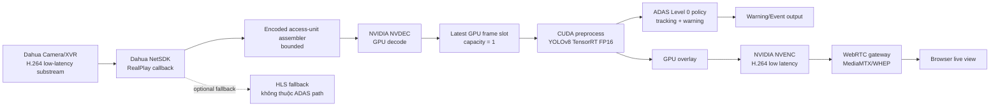
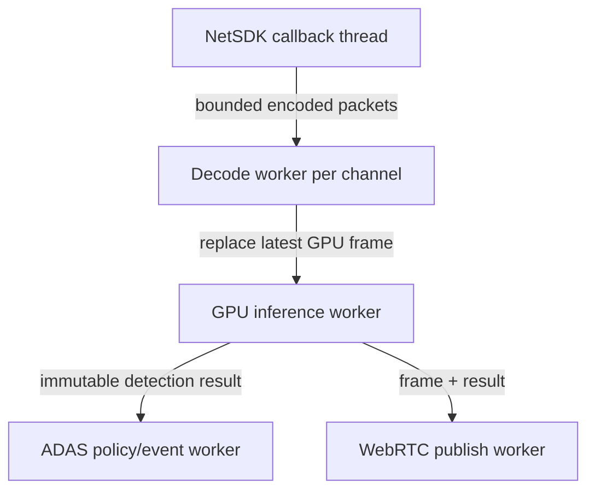

# Kiến trúc ADAS Level 0 độ trễ thấp với Dahua và YOLOv8

## 1. Mục tiêu và phạm vi

Tài liệu này định nghĩa kiến trúc local proof-of-concept trên máy Windows có NVIDIA RTX 3050.
Mục tiêu là phát hiện đối tượng và tạo cảnh báo ADAS Level 0 từ video Dahua với độ trễ thấp,
đồng thời cung cấp live view trên trình duyệt.

ADAS Level 0 trong phạm vi này **chỉ cảnh báo**. Hệ thống không điều khiển lái, phanh, ga hay
bất kỳ cơ cấu chấp hành nào của xe.

Các mục tiêu bắt buộc:

| Chỉ tiêu | Ngưỡng |
|---|---:|
| Camera capture → kết quả ADAS, P95 | `≤ 300 ms` |
| Camera capture → hiển thị browser, P95 | `≤ 500 ms` |
| SDK receive → kết quả ADAS, P95 | `≤ 200 ms` |
| Batch inference | `1` |
| Decoded-frame backlog | Tối đa `1` frame mới nhất |
| Tăng latency theo thời gian | Không chấp nhận |

FPS cao không thay thế cho yêu cầu latency. Khi quá tải, hệ thống phải bỏ frame cũ thay vì xử
lý đủ mọi frame rồi tạo backlog.

## 2. Quyết định kiến trúc

Pipeline ADAS không sử dụng HLS, file trung gian hoặc browser làm nguồn inference. Dahua NetSDK
là nguồn video chính thức trên Windows; NVIDIA hardware decoder và TensorRT xử lý trực tiếp
trên RTX 3050.



Hai nhánh có failure domain độc lập:

- **Decision path:** NetSDK → decode → inference → ADAS policy → cảnh báo.
- **Display path:** detection result → overlay → encode → WebRTC → browser.

Browser, WebRTC gateway hoặc HLS lỗi không được dừng inference hay trì hoãn cảnh báo.

## 3. Trách nhiệm thành phần

| Thành phần | Trách nhiệm | Không chịu trách nhiệm |
|---|---|---|
| Dahua XVR/camera | Capture và phát H.264 substream | ADAS inference, browser delivery |
| NetSDK source | Login, live handle, reconnect, callback encoded data | Decode, YOLO, WebRTC |
| Access-unit assembler | Ghép callback chunk thành access unit, giữ codec config | Queue frame dài hạn |
| NVDEC backend | Decode H.264 sang GPU surface | CPU image conversion |
| Latest-frame slot | Công bố frame mới nhất, thay thế frame cũ | FIFO hoặc đảm bảo xử lý mọi frame |
| TensorRT engine | Preprocess, inference batch 1, postprocess | ADAS policy nghiệp vụ |
| ADAS policy | Tracking, ROI, khoảng cách/TTC, debounce, warning | Render UI |
| WebRTC publisher | Live view độ trễ thấp và viewer lifecycle | Quyết định cảnh báo |
| HLS fallback | Quan sát tương thích khi WebRTC không dùng được | Nguồn inference |

## 4. Video source và codec contract

### 4.1 NetSDK API

Hai API phải được benchmark trên thiết bị thật:

1. `RealPlayByDataType(..., emDataType=H264)` để nhận elementary video stream.
2. `RealPlayEx(...)` + `SetRealDataCallBackEx2(..., RAW_DATA)` nếu H264 conversion của SDK
   không ổn định hoặc thêm latency đáng kể.

Không giả định một callback tương ứng một frame. Callback có thể chứa một phần NAL unit, nhiều
NAL unit, codec configuration hoặc private-container data. Source adapter phải xác nhận:

- H.264 Annex-B hay định dạng khác.
- Ranh giới access unit.
- SPS/PPS và IDR sau start/reconnect.
- Timestamp và time base.
- Main/substream mapping; channel UI là 1-based nhưng NetSDK là 0-based.

NetSDK callback chỉ copy bounded bytes và trả về ngay. Không decode, ghi file, chờ lock dài hoặc
gọi inference trong callback thread.

### 4.2 Cấu hình Dahua đề xuất

Sử dụng substream riêng cho ADAS:

| Thuộc tính | Giá trị khởi đầu |
|---|---|
| Codec | H.264 |
| Resolution | `1280×720` |
| FPS | `25` hoặc `30` |
| GOP | `10–15` frame |
| B-frame | Tắt |
| Smart codec | Tắt |
| Audio | Tắt |
| Rate control | CBR hoặc low-latency VBR |
| Bitrate | `2–4 Mbps`, điều chỉnh theo cảnh thật |

H.265 không phải codec mặc định của flow WebRTC/browser vì mức hỗ trợ không đồng nhất. Nếu
camera chỉ cung cấp H.265, decision path vẫn có thể decode bằng NVDEC nhưng display path phải
encode lại thành H.264.

## 5. Buffer và concurrency model

### 5.1 Nguyên tắc latest-state

Decision path dùng latest-state delivery:

```text
NetSDK callback → bounded encoded buffer → NVDEC → atomic latest-frame slot → inference worker
```

- Encoded buffer chỉ đủ hấp thụ jitter ngắn và hoàn thiện access unit.
- Decoded-frame slot có capacity `1`.
- Frame mới thay thế frame chưa được inference.
- Inference worker không được kéo frame cũ theo FIFO.
- Frame quá tuổi bị loại trước preprocess.

Ngưỡng khởi đầu:

```text
max_decoded_frame_age_ms = 150
max_encoded_jitter_ms    = 100
inference_batch_size     = 1
```

Nếu pipeline quá tải, `dropped_stale_frames` tăng nhưng `frame_age_ms` phải vẫn bị chặn. Đây là
hành vi đúng cho ADAS realtime.

### 5.2 Thread/process ownership



NetSDK lifecycle được quản lý một lần cho process. Mỗi channel có play handle riêng; callback
object phải được giữ tham chiếu đến khi `StopRealPlayEx` hoàn tất.

## 6. GPU pipeline trên RTX 3050

Đường ưu tiên không round-trip frame qua CPU:

```text
H.264 → NVDEC surface → CUDA resize/colorspace/normalize → TensorRT → CUDA overlay → NVENC
```

Backend có thể dùng PyNvVideoCodec, GStreamer NVIDIA hoặc native C++/CUDA. Việc lựa chọn chỉ
được chốt sau probe xác nhận:

- NVDEC/NVENC thực sự được sử dụng.
- GPU surface có thể chuyển sang TensorRT mà không copy qua NumPy/CPU.
- Backend hỗ trợ reconnect và thay đổi SPS/PPS.
- P95/P99 latency đạt ngân sách dưới tải mục tiêu.

YOLO baseline:

| Thuộc tính | Giá trị khởi đầu |
|---|---|
| Model | YOLOv8n |
| Runtime | TensorRT |
| Precision | FP16 |
| Batch | `1` |
| Input | `640×384` hoặc `640×640` |
| Warm-up | Bắt buộc trước khi nhận traffic |

Chỉ nâng lên YOLOv8s hoặc INT8 sau khi baseline đạt latency và có đánh giá accuracy/calibration
trên dữ liệu camera thực tế.

## 7. ADAS Level 0 policy

Raw object detection không phải cảnh báo ADAS hoàn chỉnh. Policy layer tối thiểu gồm:

- Camera calibration và vùng quan tâm theo làn đường.
- Tracking ID ổn định giữa các frame.
- Ước lượng khoảng cách hoặc đại lượng thay thế đã hiệu chuẩn.
- Relative motion/TTC nếu use case yêu cầu.
- Debounce và hysteresis để chống nhấp nháy cảnh báo.
- Confidence threshold theo class và điều kiện sáng.
- Cooldown/rate limit cho output cảnh báo.

Event phải chứa đủ bằng chứng để audit:

```json
{
  "event_id": "uuid",
  "channel": 2,
  "level": 0,
  "type": "forward_collision_warning",
  "capture_timestamp_ns": 0,
  "decision_timestamp_ns": 0,
  "frame_age_ms": 0.0,
  "track_id": 0,
  "class_id": 0,
  "confidence": 0.0,
  "distance_m": null,
  "ttc_s": null,
  "model_version": "yolov8n-tensorrt-fp16"
}
```

Không phát cảnh báo điều khiển xe từ event này.

## 8. WebRTC display path

MediaMTX/WHEP là gateway đề xuất cho browser. Publisher dùng H.264 low-latency từ NVENC.

```text
annotated GPU frame → NVENC H.264 → RTP/RTSP publisher → MediaMTX → WHEP/WebRTC → browser
```

Các yêu cầu:

- Không encode lại trong MediaMTX nếu không cần.
- Tắt B-frame và dùng GOP ngắn.
- Viewer dùng chung một publisher theo channel; không mở thêm NetSDK handle cho mỗi viewer.
- Viewer reference count/idle timeout chỉ điều khiển display publisher, không được tự ý dừng
  decision path khi ADAS được cấu hình always-on.
- HLS hiện tại giữ làm fallback và diagnostic, không nằm trong latency SLO của ADAS.

## 9. Latency budget và telemetry

Budget thiết kế ban đầu:

| Stage | Mục tiêu P95 |
|---|---:|
| Camera exposure + encode | `≤ 80 ms` |
| LAN + NetSDK receive | `≤ 40 ms` |
| Access-unit assembly + NVDEC | `≤ 25 ms` |
| CUDA preprocess | `≤ 10 ms` |
| TensorRT inference + postprocess | `≤ 50 ms` |
| ADAS policy | `≤ 15 ms` |
| NVENC + WebRTC/browser | `≤ 200 ms` |
| Tổng capture → decision | `≤ 300 ms` |
| Tổng capture → display | `≤ 500 ms` |

Mỗi frame/result phải có monotonic timestamp tại các mốc:

```text
sdk_received_at
access_unit_ready_at
decoded_at
inference_started_at
inference_finished_at
policy_finished_at
encoded_at
published_at
```

Metrics bắt buộc theo channel:

- `sdk_bytes_total`, `sdk_callbacks_total`
- `access_units_total`, `decode_errors_total`
- `frames_decoded_total`, `frames_inferred_total`
- `frames_dropped_stale_total`, `encoded_packets_dropped_total`
- `frame_age_ms` histogram
- stage latency histogram và end-to-end latency histogram
- GPU utilization, decoder/encoder utilization, VRAM, temperature
- reconnect count và time-to-first-frame

Không dùng uptime hoặc FPS làm bằng chứng duy nhất cho latency.

## 10. Phương pháp đo end-to-end

Timestamp nội bộ chỉ đo được `SDK receive → result`; nó không phát hiện buffer trước callback.
Kiểm định capture-to-result phải dùng nguồn thời gian nhìn thấy trong ảnh:

1. Camera quay màn hình đồng hồ có mili-giây hoặc LED được điều khiển và timestamp độc lập.
2. Result/display ghi lại cùng thời gian bằng camera/reference recorder thứ hai.
3. So sánh timestamp xuất hiện trong frame với thời điểm warning/display.
4. Báo cáo P50, P95, P99 và maximum trong ít nhất 30–60 phút.

Gate đạt:

- Capture → decision P95 `≤ 300 ms`.
- Capture → browser P95 `≤ 500 ms`.
- Không có xu hướng latency tăng theo thời gian.
- Khi GPU quá tải, frame drop tăng nhưng frame age vẫn bị chặn.

## 11. Failure model

| Lỗi | Hành vi bắt buộc |
|---|---|
| XVR/network mất kết nối | Đánh dấu source unavailable, reconnect bounded backoff |
| Thiếu SPS/PPS sau reconnect | Chờ codec config/IDR; không đưa garbage vào decoder |
| Decoder lỗi | Reset decoder theo channel, không restart toàn service nếu tránh được |
| Inference quá tải | Replace/drop stale frame, không tạo backlog |
| TensorRT engine lỗi | ADAS degraded/unavailable rõ ràng; không phát warning giả |
| WebRTC/MediaMTX lỗi | Decision path tiếp tục hoạt động |
| Browser đóng | Release viewer; không ảnh hưởng ADAS always-on |
| Clock/timestamp không hợp lệ | Đánh dấu latency unknown; không báo số đo giả |

Health state tối thiểu:

```text
STARTING → HEALTHY → DEGRADED → UNAVAILABLE → RECOVERING
```

`HEALTHY` chỉ được công bố khi source đang nhận frame mới, decoder hoạt động, inference engine đã
warm-up và frame age dưới ngưỡng.

## 12. Security và dữ liệu

- Credential Dahua chỉ nằm trong source service secret/config; không gửi tới browser.
- Không public NetSDK port `37777`, RTSP hoặc inference control API ra Internet.
- WebRTC signaling phải có authentication/authorization theo vehicle/channel.
- Event và snapshot có retention policy; không log raw credential hay toàn bộ video mặc định.
- Model/engine phải có version và checksum để audit kết quả.
- ADAS Level 0 phải hiển thị trạng thái unavailable/degraded rõ ràng; không im lặng giả vờ khỏe.

## 13. Khả năng chuyển sang Jetson Orin Nano

Các interface ổn định:

```text
VideoSource → EncodedAccessUnit
Decoder → GpuFrame
InferenceEngine → DetectionResult
AdasPolicy → WarningEvent
LivePublisher → ViewerStream
```

Backend RTX 3050 ban đầu:

```text
DahuaNetSdkWindowsSource + NVDEC/CUDA + TensorRTWindows + NVENC/MediaMTX
```

Backend Jetson tương lai:

```text
DahuaArm64NetSdkSource hoặc DahuaRtspSource
+ nvv4l2decoder/NVMM
+ TensorRT/DeepStream
+ nvv4l2h264enc/WebRTC
```

Gói `General_NetSDK_Eng_Python_linux64_V3.052` phải được kiểm tra kiến trúc binary. Tên
`linux64` không chứng minh hỗ trợ Jetson ARM64/aarch64.

## 14. Kế hoạch triển khai theo gate

### Gate 1 — NetSDK encoded probe

- Thu callback H264 và RAW_DATA trên channel thật.
- Phân tích codec, access unit, SPS/PPS, timestamp, GOP và reconnect.
- Đo callback jitter và time-to-first-frame.

### Gate 2 — Hardware decode/latest-frame

- Chứng minh NVDEC hoạt động.
- Chứng minh decoded slot capacity `1` và stale-frame drop.
- Stress 30–60 phút, không tăng frame age.

### Gate 3 — TensorRT baseline

- YOLOv8n FP16, batch 1.
- Đo preprocess/inference/postprocess P50/P95/P99.
- Xác nhận không có GPU↔CPU round-trip không cần thiết.

### Gate 4 — ADAS policy

- Calibration, tracking, ROI, warning debounce/hysteresis.
- Dataset và scenario test ban ngày, ban đêm, rung, che khuất và cắt ngang.
- Đánh giá false-positive/false-negative riêng, không suy ra từ FPS.

### Gate 5 — WebRTC

- NVENC → MediaMTX → WHEP browser.
- Đo capture-to-display, viewer reconnect và nhiều viewer.
- Chứng minh display failure không ảnh hưởng decision path.

### Gate 6 — Soak/fault test

- Chạy liên tục, ngắt mạng, restart XVR, restart gateway và tạo GPU overload.
- Chỉ chấp nhận flow khi latency SLO, recovery và health semantics đều đạt.

## 15. Trạng thái xác minh hiện tại

| Hạng mục | Trạng thái |
|---|---|
| Dahua NetSDK login và live TS callback trên Windows | Đã xác minh local |
| HLS từ NetSDK TS | Đã xác minh local, không thuộc ADAS decision path |
| Channel 2/3 nhận stream, không drop callback queue tại lần test gần nhất | Đã xác minh local |
| `RealPlayByDataType(H264)` contract thực tế | Chưa kiểm định |
| NVDEC zero-copy → TensorRT | Chưa triển khai |
| YOLOv8 TensorRT latency trên RTX 3050 | Chưa kiểm định |
| ADAS policy/calibration | Chưa triển khai |
| WebRTC capture-to-display `≤ 500 ms` | Chưa triển khai |
| NetSDK Linux ARM64 trên Jetson | Chưa xác minh |

Không được chuyển các mục “chưa kiểm định” thành cam kết production chỉ dựa trên benchmark lý
thuyết hoặc FPS của model.

## 16. Kế hoạch MVP test trên RTX 3050

### 16.1 Câu hỏi MVP phải trả lời

MVP chỉ được coi là thành công khi trả lời bằng số đo thực tế cho bốn câu hỏi:

1. NetSDK có cung cấp H.264 đủ thông tin để decode ổn định mà không qua HLS/file không?
2. RTX 3050 có chạy decode + YOLOv8n TensorRT mà không tích backlog không?
3. Cảnh báo Level 0 có được tạo trong `≤ 300 ms` P95 tính từ camera capture không?
4. Browser WebRTC có hiển thị trong `≤ 500 ms` P95 mà không ảnh hưởng decision path không?

### 16.2 Phạm vi cố định

MVP cố ý giới hạn để kết quả có thể kiểm chứng:

| Hạng mục | Phạm vi MVP |
|---|---|
| Máy chạy | Windows x64 + RTX 3050 |
| Nguồn | Một Dahua XVR, một channel |
| Stream | H.264 substream, `1280×720`, 25/30 FPS |
| Model | YOLOv8n TensorRT FP16, batch 1 |
| Class | Person, car, motorcycle, bus, truck |
| ADAS policy | ROI + tracking + cảnh báo proximity đơn giản |
| Output | Warning event + annotated WebRTC live view |
| Viewer | Một browser trong cùng LAN |
| HLS | Chỉ fallback/diagnostic, không tham gia đo MVP |
| Jetson, cloud, multi-channel | Ngoài phạm vi |

MVP chưa tuyên bố đạt chất lượng ADAS production, chưa điều khiển xe và chưa thay thế quá trình
calibration/validation an toàn chuyên dụng.

### 16.3 Work package 0 — Baseline và môi trường

Việc thực hiện:

- Ghi nhận chính xác GPU, driver, CUDA, TensorRT, Python và FFmpeg/GStreamer version.
- Chốt channel, resolution, FPS, codec, GOP, B-frame, smart-codec và bitrate thực tế trên XVR.
- Lưu một mẫu encoded stream ngắn chỉ để phân tích offline.
- Chuẩn bị cảnh đo có đồng hồ mili-giây/LED timestamp nhìn thấy trong hình.
- Định nghĩa một run ID duy nhất cho mỗi lần test.

Artifact:

```text
artifacts/<run-id>/environment.json
artifacts/<run-id>/camera-config.json
artifacts/<run-id>/notes.md
```

Gate pass:

- RTX 3050 được nhận diện và hardware codec khả dụng.
- Camera xuất đúng H.264 substream đã cấu hình.
- Có phương pháp đo capture timestamp độc lập với clock trong process.

### 16.4 Work package 1 — NetSDK H.264 probe

Việc thực hiện:

- Test riêng `RealPlayByDataType(H264)` và `RealPlayEx + RAW_DATA`.
- Dump bounded sample kèm callback timestamp và chunk size.
- Dùng parser/ffprobe xác nhận codec, Annex-B/container, SPS/PPS, IDR và GOP.
- Đo time-to-first-callback, time-to-first-decodable-frame và callback jitter.
- Stop/start 20 lần; rút/cắm mạng hoặc restart stream tối thiểu 5 lần.

Metrics:

```text
sdk_callbacks_total
sdk_bytes_total
callback_chunk_bytes
callback_interarrival_ms
time_to_first_callback_ms
time_to_first_decodable_frame_ms
reconnect_total
```

Gate pass:

- Chọn được đúng một NetSDK mode làm source contract.
- 20/20 lần start tạo được frame decode.
- 5/5 lần reconnect phục hồi mà không restart service.
- Không thiếu SPS/PPS/IDR sau recovery.
- Không có unbounded allocation hoặc callback blocking.

Gate fail/dừng:

- Không xác định được ranh giới/codec contract ổn định.
- Stream cần ghi file hoặc HLS mới decode được.
- Callback mất vĩnh viễn sau reconnect.

### 16.5 Work package 2 — NVDEC và latest-frame pipeline

Việc thực hiện:

- Đưa source contract vào NVIDIA hardware decoder.
- Xuất `GpuFrame` có timestamp nguồn và timestamp decode.
- Tạo latest-frame slot capacity `1`.
- Cố tình làm consumer chậm để chứng minh frame cũ bị thay thế.
- Chạy liên tục 60 phút trước khi ghép YOLO.

Metrics:

```text
frames_decoded_total
decode_errors_total
latest_frame_replaced_total
frame_age_at_decode_ms
decode_latency_ms
cpu_percent
gpu_decoder_percent
gpu_memory_bytes
```

Gate pass:

- Xác nhận NVDEC thay vì software decode.
- Decode latency P95 `≤ 25 ms` tính từ access-unit-ready.
- Latest-frame slot không vượt capacity `1`.
- Khi consumer bị chậm, frame drop tăng nhưng frame age không tăng dần.
- Chạy 60 phút không memory leak hoặc decoder stall.

### 16.6 Work package 3 — YOLOv8n TensorRT baseline

Việc thực hiện:

- Export/build engine YOLOv8n TensorRT FP16 cho đúng RTX 3050.
- Warm-up engine trước khi đánh dấu service healthy.
- Chạy CUDA preprocess → TensorRT → NMS/postprocess với batch 1.
- Không render hoặc publish video trong benchmark đầu tiên.
- Tạo GPU overload có kiểm soát để kiểm tra stale-frame drop.

Metrics:

```text
preprocess_ms
inference_ms
postprocess_ms
sdk_receive_to_detection_ms
frame_age_at_inference_start_ms
frames_inferred_total
frames_dropped_stale_total
gpu_utilization_percent
gpu_temperature_celsius
```

Gate pass:

- Preprocess + inference + postprocess P95 `≤ 50 ms`.
- SDK receive → detection result P95 `≤ 200 ms`.
- `frame_age_at_inference_start_ms ≤ 150 ms` P95.
- Batch luôn bằng 1; không có inference FIFO.
- GPU overload làm giảm processed FPS nhưng không tạo latency tăng vô hạn.

### 16.7 Work package 4 — MVP ADAS Level 0 policy

MVP policy chỉ chứng minh flow cảnh báo, không chứng minh an toàn production:

- Chọn ROI/lane polygon tĩnh cho camera test.
- Tracking đối tượng qua frame.
- Cảnh báo khi class mục tiêu đi vào vùng nguy cơ và thỏa confidence/debounce.
- Hysteresis/cooldown để tránh cảnh báo nhấp nháy.
- Event chứa capture/decision timestamp, track ID, class, confidence và model version.

Scenario tối thiểu:

| Scenario | Kỳ vọng |
|---|---|
| Không có đối tượng trong ROI | Không warning |
| Xe/người đi vào ROI | Một warning sau debounce |
| Đối tượng đứng tại biên ROI | Không spam warning |
| Đối tượng rời rồi quay lại | Warning mới đúng policy |
| Ánh sáng yếu/che khuất ngắn | Không crash; ghi nhận detection degradation |
| Camera rung ngắn | Không tạo warning storm |

Gate pass MVP:

- Event đúng schema và trace được về frame/run ID.
- Không warning storm trong scenario biên/rung.
- Capture → warning P95 `≤ 300 ms` qua phép đo timestamp trong ảnh.
- False positive/negative được báo cáo, không yêu cầu đạt chuẩn production ở gate này.

### 16.8 Work package 5 — WebRTC display

Việc thực hiện:

- Overlay detection trên GPU hoặc bằng đường không block inference.
- Encode H.264 bằng NVENC low-latency.
- Publish một stream/channel tới MediaMTX.
- Browser nhận qua WHEP/WebRTC.
- Mở/đóng viewer, restart MediaMTX và tạo mạng jitter ngắn.

Gate pass:

- Capture → browser P95 `≤ 500 ms` trên LAN.
- Decision-path latency không tăng quá `20 ms` P95 khi bật display.
- MediaMTX/browser lỗi không dừng NetSDK, decode, YOLO hoặc warning event.
- Mở lại browser không tạo thêm NetSDK play handle.

### 16.9 Work package 6 — E2E soak và fault injection

Ma trận bắt buộc:

| Test | Thời lượng/lần lặp | Kỳ vọng |
|---|---:|---|
| Normal E2E | 2 giờ | Đạt latency SLO, không tăng memory/frame age |
| NetSDK start/stop | 50 vòng | Không leak handle/process |
| XVR/network disconnect | 10 vòng | Tự recovery, health phản ánh đúng |
| Browser reconnect | 20 vòng | Decision path không bị ảnh hưởng |
| MediaMTX restart | 10 vòng | Warning tiếp tục, display hồi phục |
| GPU overload | 10 phút | Drop stale frame, không tích backlog |
| Model/service restart | 10 vòng | Warm-up trước HEALTHY, không warning giả |

Acceptance cuối MVP:

```text
capture_to_warning_ms P95 ≤ 300
capture_to_browser_ms P95 ≤ 500
sdk_to_detection_ms P95 ≤ 200
decoded_frame_slot_capacity = 1
unbounded_queue_count = 0
decision_path_survives_display_failure = true
false_healthy_state_count = 0
```

### 16.10 Test harness và báo cáo

Mỗi run phải sinh artifact machine-readable:

```text
artifacts/<run-id>/
├── environment.json
├── camera-config.json
├── metrics.jsonl
├── events.jsonl
├── latency-summary.json
├── fault-timeline.jsonl
├── representative-frames/
└── report.md
```

`latency-summary.json` tối thiểu chứa count, P50, P95, P99, max cho từng stage và end-to-end.
`report.md` phải tách rõ:

- Đã đo trên thiết bị thật.
- Chỉ đo nội bộ process.
- Suy luận/chưa xác minh.
- Gate pass/fail và bằng chứng artifact.

### 16.11 Thứ tự triển khai và điều kiện không mở rộng scope

```text
WP0 → WP1 → WP2 → WP3 → WP4 → WP5 → WP6
```

- Không triển khai WebRTC trước khi WP1–WP3 đạt.
- Không tối ưu nhiều channel trước khi một channel đạt soak test.
- Không chuyển YOLOv8s/INT8 trước khi YOLOv8n FP16 có baseline đầy đủ.
- Không chuyển Jetson trước khi interface `VideoSource`, `GpuFrame`, `DetectionResult` và
  `WarningEvent` ổn định.
- Gate fail phải được sửa hoặc ghi nhận quyết định kiến trúc mới; không bỏ qua bằng benchmark FPS.

## 17. Trạng thái triển khai MVP trên RTX 3050

Checkpoint ngày 2026-08-03 đã triển khai được vertical slice một channel:

```text
Dahua NetSDK TS callback
  → FFmpeg h264_cuvid (NVDEC)
  → latest-frame slot dung lượng 1
  → YOLOv8n TensorRT FP16
  → overlay
  → FFmpeg h264_nvenc (Main/yuv420p, không B-frame)
  → MediaMTX RTSP/WHEP
  → Chromium WebRTC
```

Đã xác minh trên máy RTX 3050 và XVR thật:

- NetSDK channel 2/subtype 1 nhận TS và pipeline đạt trạng thái `healthy`.
- TensorRT engine chạy được; benchmark inference độc lập sau warm-up khoảng 14,32 ms trung bình.
- Pipeline báo `decode_to_detection` P95 khoảng 16 ms trong smoke test.
- RTSP output là H.264 Main, `yuv420p`, 640×384, 25 FPS, không B-frame.
- Chromium nhận frame WebRTC thật: `readyState=4`, 640×384 và video đang phát.
- Unit test cho latest-frame replacement và percentile: 3/3 pass.

Chưa được xem là pass SLO cuối:

- `sdk_to_detection_ms` chưa có tương quan callback/PTS nên API chủ động trả
  `verified=false`; không dùng tuổi gói SDK thay cho latency frame.
- `capture_to_browser_ms` chưa có timestamp quang học hoặc watermark tại nguồn.
- Chưa chạy soak 2 giờ, fault injection và ma trận start/stop đầy đủ.
- Vertical slice hiện chỉ là detection overlay; warning FCW/TTC nằm ngoài scope checkpoint này.

## 18. Kết quả rà soát timestamp trong bộ Dahua NetSDK Python

Đã đối chiếu cả package Windows `V3.060...` và Linux `V3.052` cùng các demo đi kèm:

1. `NET_IN_REALPLAY_BY_DATA_TYPE` có trường `cbRealDataEx2` trỏ tới
   `NET_DATA_CALL_BACK_INFO`; cấu trúc này có `stuTime.dwPTS`, `dwDTS`, frame type và
   thông tin video. Tuy nhiên bộ SDK không có demo `RealPlayByDataType(TS)` dùng callback
   này, và trên XVR hiện tại callback không phát sinh sample.
2. `SetRealDataCallBackEx2` có cờ `DATA_WITH_FRAME_INFO`, nhưng callback Python vẫn chỉ
   khai báo `param` là `C_LLONG`; package không cung cấp cấu trúc frame-info tương ứng cho
   live TS. Các demo chính thức chỉ dùng `RAW_DATA` để ghi stream.
3. Nhánh decoder PLAYSDK (`GetFreePort` → `OpenStream` → `Play` → `SetDecCallBack`) có
   `PLAY_FRAME_INFO.nStamp` (ms). Nhánh decoder mở rộng có `NET_FRAME_INFO_EX.nStamp` và
   `nDataTime`. Đây là timestamp của frame sau SDK decode, không phải callback encoded TS;
   dùng được để đo SDK decode latency nhưng phải đổi source path và nhận frame YUV CPU.
4. `CapturePictureEx2` trả `NET_OUT_CAPTURE_PICTURE.stuTime` chính xác đến ms, nhưng chỉ là
   thời điểm ảnh chụp theo SDK, không tạo timestamp cho từng frame live inference.

Kết luận: với flow TS hiện tại, NetSDK không cung cấp timestamp camera/frame usable trên
thiết bị này; số đo chính xác hiện có là server pipeline. Muốn có capture-to-detection
thật phải chạy một probe PLAYSDK có `nStamp` để xác nhận thiết bị hỗ trợ, hoặc dùng OSD/
watermark timestamp nhìn thấy trong hình. Không được đánh dấu `sdk_to_detection_ms` verified
chỉ vì `dwPTS` tồn tại trong struct nhưng callback không phát dữ liệu.

### 17.1 Tiếp tục triển khai — policy cảnh báo Level 0 bounded

Đã bổ sung policy cảnh báo tối giản ngay sau YOLO postprocess trong
`media/adas_pipeline.py`:

- ROI chuẩn hóa mặc định `0.15,0.35,0.85,0.98`, có thể đổi bằng `ADAS_WARNING_ROI`.
- Chỉ xét các class mục tiêu COCO đã chốt; chọn candidate confidence cao nhất trong ROI.
- Debounce mặc định 3 frame và cooldown 1000 ms để tránh warning storm.
- Event có `event_id`, channel, class, confidence, bbox, ROI, monotonic capture/decision,
  decision latency và model version; event được giữ ở `warning_policy.latest` trong `/api/state`
  và ghi vào EventLog.
- Policy không tạo queue riêng và không chặn đường inference/publish; khi tắt bằng
  `ADAS_WARNING_ENABLED=false`, detection/WebRTC vẫn hoạt động.

Smoke test sau khi restart service trên XVR thật: NetSDK TS nhận dữ liệu, pipeline đạt
`healthy`, 110 frame inference trong khoảng 18 giây, không rớt chunk/decode error.
Số warning bằng 0 trong đoạn hình không có candidate nằm trong ROI; đây là kết quả đúng
policy, chưa phải phép đo false-negative của scenario ADAS.

### 18.1 Kết quả probe trên XVR thật

Đã thêm [probe_netsdk_decoder_timestamp.py](D:/BusinessAnalyze/Letron/letron-leos/services/tbox/firmware-mini/tbox_esp32_gateway/docs/dahua_test/server/media/probe_netsdk_decoder_timestamp.py)
và chạy bounded 5 giây trên channel 2/subtype 1. PLAYSDK nhận 124 callback/input thành
công, nhưng kết quả là:

```text
frames=0
decode_callbacks=0
input_failures=0
stamp_count=0
```

Đã thử cả thứ tự khởi tạo theo demo chính thức và đầu vào H.264 `RealPlayByDataType`;
không có decoded callback headless trên máy hiện tại. Vì vậy `PLAY_FRAME_INFO.nStamp`
được xác nhận là API tồn tại trong SDK nhưng chưa chứng minh được thiết bị/runtime này
phát timestamp usable. Luồng production vẫn healthy và không bị thay đổi bởi probe.

Probe lần hai dùng HWND thật từ cửa sổ ẩn Tkinter (thay cho `hwnd=0`) cũng cho
`input_calls=124`, `input_failures=0`, nhưng `decode_callbacks=0`. Do đó vấn đề không chỉ
do thiếu window handle; dữ liệu live hiện tại chưa đi vào PLAYSDK decode callback theo
đường này.

### 18.2 Kiểm tra OSD timestamp

SDK có `NET_EM_CFG_OPERATE_TYPE.CFG_TIMETITLE` và `NET_OSD_TIME_TITLE`. Probe
read-only xác nhận channel 2 có cấu hình time OSD nhưng đang tắt. Đã thử bật tạm
trên extra stream 1 bằng `SetConfig`; đọc lại thấy thiết bị nhận cấu hình, nhưng
frame TS thực tế không hiển thị OSD trên output ADAS. Cấu hình đã được trả về trạng
thái tắt sau phép thử. OSD này cũng chỉ có độ phân giải giây, nên ngay cả khi hiển
thị được cũng chỉ dùng để kiểm tra gần đúng, không đủ làm timestamp 400--500 ms.

## 19. Trạng thái trung thực cập nhật 2026-08-04

- Runtime hiện dùng NetSDK channel 2 **main stream/subtype 0**, callback TS (codec thực tế
  HEVC), sau đó `hevc_cuvid` → YOLOv8n TensorRT → NVENC/WebRTC. ADAS đã đạt `healthy`;
  smoke run mới nhất có 287 frame decode, 278 frame inference, không drop chunk và
  `decode_to_detection` P95 16 ms (P99 31 ms).
- Raw main stream đã được kiểm tra trực tiếp và có OSD từ XVR: `Kênh2` ở góc trái dưới
  và timestamp `04/08/2026 01:11:40`/giây ở góc phải. Đây là bằng chứng encoded source
  có OSD; extra stream/subtype 1 không có OSD.
- Ảnh RTSP sau YOLO/NVENC vẫn giữ `Kênh2` và timestamp; pipeline không tự chèn giả OSD.
- Latency 16--31 ms là server `decode_to_detection`/`decode_to_publish`, chưa phải
  camera-to-browser latency.
- NetSDK Python không có API push/seed video vào channel XVR; `PLAY_InputData` chỉ feed
  decoder local trên PC.
- TS callback hiện có `NET_DATA_CALL_BACK_INFO.stuTime.dwPTS` ở callback timestamp,
  nhưng chưa có correlation frame-level để tính camera-to-browser chính xác. OSD chỉ có
  độ phân giải giây, dùng để xác nhận nguồn/clock chứ không đủ đo 400--500 ms.
- Vì vậy `capture_to_browser_ms`, `sdk_to_detection_ms` và E2E `<=500 ms` vẫn **chưa
  đo/không verified**.
- Video giả hợp lệ phải seed vào MediaMTX/pipeline trước NVDEC; muốn chứng minh camera thật
  phải che/di chuyển trước ống kính; muốn đo E2E phải có timestamp ms trong cảnh quay.

### 19.1 Raw source check

Đã capture trực tiếp sau NetSDK bằng `probe_netsdk_stream.py`: channel 2/subtype 0 là
TS/HEVC `1280×720` và frame raw có OSD `Kênh2` + thời gian; subtype 1 là stream phụ
không có OSD. H264 elementary callback của thiết bị trả cả loại callback `1004` và `0`
nhưng không decode ổn định; vì vậy runtime chọn TS main và đúng decoder HEVC.

### 19.2 Đánh giá mẫu độ trễ hiện tại

Overlay final hiện hiển thị thêm `TS recv HH:MM:SS.mmm` ở góc phải, ngay dưới OSD
timestamp của camera. Trong mẫu kiểm tra, OSD camera là `13` và TS cuối là `13.450`,
do đó có thể xem là **maximum suy ra tại snapshot đó khoảng 450 ms** (giả định OSD
được truncate ở đầu giây và clock đã đồng bộ). Đây chưa phải maximum của cả phiên.

Kết luận hiện tại: mức này **đạt MVP ADAS Level 0 dạng cảnh báo**, nhưng chưa đủ để
chốt production. Gate production vẫn yêu cầu đo nhiều mẫu bằng timestamp mili-giây:

- E2E P95 `≤ 500 ms`;
- P99 mục tiêu `≤ 600 ms` và không có spike `> 1 s`;
- capture-to-warning P95 `≤ 300 ms`.

OSD theo giây chỉ dùng để đối chiếu gần đúng; `TS recv` là thời điểm server nhận packet,
không phải timestamp frame gốc đã được correlation chính xác.
