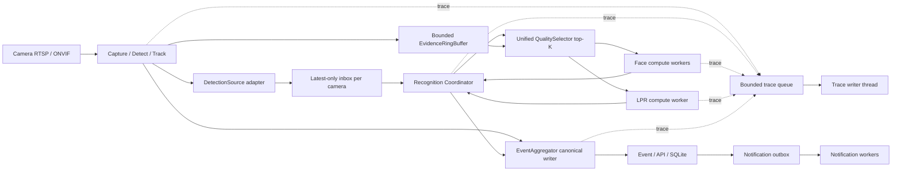

# Kiến trúc Camera AI B2B

Ngày cập nhật: 09/08/2026

## 1. Mục tiêu

Tài liệu này định nghĩa cách tối ưu pipeline Computer Vision của runtime hai camera và tạo
boundary đầu vào ổn định để detection có thể được tách thành process/service riêng sau này mà
không viết lại recognition, Event hoặc notification.

Mục tiêu kinh doanh ưu tiên là **Gate Intelligence cho nhà máy, kho vận, depot và
bãi xe đang có camera RTSP nhiều hãng**. Sản phẩm không cạnh tranh trực diện với
camera ANPR/face chuyên dụng bằng một model đơn lẻ; lợi thế chính là:

- Không bắt buộc thay toàn bộ camera hiện có.
- Dữ liệu và inference chạy on-premise.
- Kết quả nhận diện giữ đúng frame, bbox và evidence.
- Tích hợp được barrier, ERP, WMS, visitor management và hệ thống bảo vệ.
- Không khóa vào firmware hoặc cloud của một hãng camera.

## 2. Baseline hiện tại

Các thành phần đã có và được giữ làm nền tảng:

- Frigate đã sở hữu capture, detection, tracking, LPR, face recognition và Event.
- `deploy/config.yaml` là cấu hình runtime hiện hành.
- Hai pipeline đang chạy là `car_camera` cho LPR và `face_camera` cho face recognition.

Tối ưu được thực hiện trực tiếp trong pipeline Frigate hiện có.

Trạng thái vận hành ngày 07/08/2026:

| Camera | Pipeline | Processing |
| --- | --- | --- |
| `car_camera` | Car detection + native LPR | Bật |
| `face_camera` | Person detection + face recognition | Bật |

### 2.1 Readiness snapshot ngày 08/08/2026

Các bằng chứng hiện có được phân loại như sau; `pass` unit test hoặc stream health không
được nâng thành production acceptance:

| Hạng mục | Bằng chứng hiện có | Trạng thái kiến trúc |
| --- | --- | --- |
| Hai-camera stream health | Replay giữ camera/process FPS ổn định | Diagnostic pass; không phải passage recognition acceptance |
| LPR hai camera | Baseline passage recall 60%; Phase 2 đã tăng lên 100% trên fixture replay | Passage bottleneck Phase 2 đã đạt; recognition tiếp tục được cải thiện |
| Face sáu/bảy camera | Các report gần nhất `accepted=false`, enrichment latency/pending vượt gate | Không có approved capacity sáu/bảy camera |
| Detection service boundary | Detection update còn đi vào embeddings dưới dạng tuple nội bộ | Chưa có `DetectionEnvelope`/`DetectionSource` contract ổn định |

## 3. Khoảng trống cần giải quyết

| Khoảng trống | Hệ quả hiện tại | Trạng thái đích |
| --- | --- | --- |
| Camera chỉ được mô tả bằng stream/FPS | Không biết input có đủ chất lượng để cam kết hay không | Mỗi camera có quality threshold đã benchmark |
| Detect và evidence dùng chung luồng thấp | Mất pixel biển số/khuôn mặt | Detect stream thấp, evidence stream full-resolution |
| Face và LPR tự chọn candidate riêng | Tiêu chí chất lượng không nhất quán | Một `QualitySelector` dùng chung |
| Quan sát chủ yếu bằng FPS/inference | Không biết bỏ sót bao nhiêu passage | SLA theo passage và end-to-end funnel |
| Detection input gắn với subscriber nội bộ | Khó tách detect/track thành service mà không sửa recognition | Một `DetectionSource` port nhận typed `DetectionEnvelope` |
| Trace ghi file ngay trên thread gọi | Trace I/O có thể chặn detection/recognition khi bật | Bounded trace queue và một trace-writer thread riêng |
| Detect, face và LPR cùng tranh chấp compute | LPR/OCR tạo burst CPU/GPU và giảm mật độ kênh | Cascade có budget, queue bounded và calibrated early-stop theo passage |

## 4. Nguyên tắc kiến trúc

1. Chất lượng camera input là contract có thể đo.
2. Candidate giữ đúng frame và bbox đã dùng để nhận diện.
3. Pipeline dùng latest-frame/top-K; candidate stale được drop khi quá tải.
4. Face/LPR có attempt budget, dedupe và chỉ early-stop khi có calibrated decisive gate.
5. `EmbeddingMaintainer` là Recognition Coordinator; chỉ coordinator mutate passage,
   recognition lifecycle và best-result selection state.
6. Recognition worker chỉ compute và trả typed outcome; không sửa Event/SQLite, ghi trace hoặc
   gửi notification.
7. `EventAggregator` tiếp tục là canonical Event writer; notification chỉ đi từ committed Event
   qua outbox.
8. Detection input đi qua `DetectionSource`; transport nội bộ hay service không làm đổi
   recognition contract.
9. Trace là side-channel bounded, không phải source of truth và không được block critical path.

### 4.1 Phạm vi đơn giản hóa cho phiên bản đầu

V1 vẫn là một Frigate runtime. Detection hiện tại được bọc bằng `InProcessDetectionSource`; chưa
tách process/service và chưa đổi transport. Mỗi camera dùng detect stream thấp và một
high-resolution stream dùng chung cho evidence/record khi có thể. Việc triển khai service sau
này chỉ thay adapter đầu vào, không chuyển Event ownership hoặc recognition policy ra ngoài.

## 5. Kiến trúc đích



### 5.1 Runtime lanes và ownership

| Lane | Owner | Được phép làm | Không được làm |
| --- | --- | --- | --- |
| Detection | Capture/detect/track runtime | Phát typed detection batch và evidence reference | OCR/embed, result decision, Event commit, notification, disk trace |
| Coordination | `EmbeddingMaintainer` | Passage association, rolling diverse top-3, scheduling, generation/tombstone và best-result reducer | Chờ inference, ghi trace file, gửi notification trực tiếp |
| Recognition | Face/LPR workers | Resolve candidate, preprocess xác định, inference và trả raw outcome | Mutate Event/lifecycle canonical, publish notification, ghi trace file |
| Event | `EventAggregator` | Canonical Event/API/SQLite commit và correlation | Chạy OCR/embed hoặc sở hữu candidate queue |
| Notification | Durable outbox/worker | Gửi từ committed Event, retry/idempotency | Nhận lệnh trực tiếp từ recognition worker |
| Trace | Một bounded queue + writer thread | Persist JSONL/metrics best-effort | Block detection/recognition/Event hoặc sở hữu evidence |

Detector/tracker vẫn cập nhật base Event path trực tiếp; Recognition Coordinator chỉ gửi
enrichment commit, không sở hữu Event start/end. Coordinator không gọi recognition đồng bộ. Nó
enqueue từng candidate cần inference, tiếp tục xử lý message khác, rồi nhận
`RecognitionOutcome` qua bounded result queue. LPR chỉ có một inference đồng thời cho mỗi camera;
Face dùng executor bounded. Coordinator là nơi duy nhất áp dụng attempt budget, candidate/result
rank và terminal transition; worker chỉ compute.

### 5.2 DetectionSource boundary

Recognition Coordinator nhận duy nhất một input contract ổn định:

```python
DetectionEnvelope(
    schema_version,
    source_id,
    camera_id,
    stream_epoch,
    sequence,
    frame_time,
    detections,
    evidence_ref,
)
```

Mỗi detection chứa `track_id`, label, raw score, bbox, attributes và optional parent track ID.
`source_id + camera_id + stream_epoch + sequence` là idempotency/order key. Envelope duplicate
hoặc cũ bị drop; epoch mới là hard passage boundary. Inbox bounded theo camera và replacement
latest-only, vì vậy detection producer không chờ recognition.

V1 triển khai `InProcessDetectionSource` bọc subscriber hiện có. Khi tách service, chỉ thêm
`RemoteDetectionSource` dùng transport phù hợp; coordinator, selector, worker, Event schema và
notification không đổi. Delivery có thể at-least-once vì coordinator dedupe bằng envelope key.

### 5.3 Evidence và message contract

Không truyền raw frame copy không bounded qua queue. `evidence_ref` là opaque reference được
`EvidenceResolver` chuyển thành lease:

```text
Local runtime        → SharedMemoryEvidenceRef
Service cùng host    → IpcEvidenceRef
Service khác host    → EncodedEvidenceRef hoặc content-addressed URI có TTL
```

Selector giữ rolling top-3 candidate độc lập/passage. Candidate chưa bắt đầu inference luôn được
thay bởi candidate mới có `image_rank` cao hơn; scheduler chỉ chuyển tuần tự tối đa ba candidate,
không chạy hai ảnh gần trùng nhau. Result trả về phải là typed `RecognitionOutcome` gồm
passage/generation, candidate/evidence/frame ID, bbox, quality, raw model result/top-two score,
latency và decision reason. Result không mang Event mutation hoặc notification command.

### 5.4 Trace transport

Mọi lane chỉ `put_nowait()` một trace record nhỏ vào bounded trace queue. Trace không chứa image
bytes và không giữ evidence lease. Khi queue đầy, production drop record chưa persist và tăng
`trace_dropped_total`; không block critical path. Acceptance yêu cầu trace drop bằng 0. Writer là
thread duy nhất mở/ghi JSONL và shutdown chỉ flush trong thời gian bounded.

## 6. Quality contract theo camera

Mỗi camera khai báo trực tiếp các ngưỡng mà `QualitySelector` sử dụng. Các giá trị dưới
đây chỉ là điểm bắt đầu và phải được chốt bằng ground-truth replay trên camera/hardware
thật.

```yaml
camera_quality:
  gate_lpr_01:
    task: lpr
    min_detail_width_px: 140
    max_yaw_deg: 25
    evidence: {width: 2560, height: 1440, fps: 20}

  lobby_face_01:
    task: face
    min_detail_width_px: 96
    max_yaw_deg: 35
    evidence: {width: 1920, height: 1080, fps: 15}
```

Selector ghi lý do reject để biết cần chỉnh camera, threshold hay model; không tự đổi
stream/model khi quality thấp.

## 7. Tách detect stream và evidence stream

Mỗi camera có tối đa ba vai trò độc lập:

| Stream | Mục đích | Đặc tính |
| --- | --- | --- |
| Detect | Motion/object/tracker | Resolution thấp, latest-frame, cho phép drop stale |
| Evidence | Best shot, LPR, face | Full-resolution, FPS theo profile, ring buffer bounded |
| Record | Playback/forensics | Bitrate và retention tối ưu cho lưu trữ |

“Tối đa ba vai trò” không có nghĩa phải mở ba RTSP session/decoder. V1 ưu tiên hai
input: detect stream thấp và một high-resolution stream dùng chung cho evidence/record
nếu codec, FPS, GOP và retention path đáp ứng cả hai contract. Chỉ tách evidence khỏi
record thành decoder riêng khi benchmark chỉ ra seek latency, GOP hoặc recording load
làm vi phạm evidence SLA.

`EvidenceRingBuffer` giữ frame trong một cửa sổ ngắn, ví dụ 3–10 giây. Buffer phải:

- Bounded theo byte và thời gian.
- Cho phép lấy high-resolution frame gần timestamp của track.
- Copy crop/frame đã được chọn ra khỏi ring buffer trước khi frame hết hạn.
- Ghi đè frame cũ; không tăng bộ nhớ theo thời gian.

Không ghi toàn bộ ring buffer vào database hoặc disk.

## 8. Frame reference tối thiểu

Candidate chỉ cần đủ thông tin để recognition dùng đúng ảnh đã được chấm quality:

```text
camera_id + track_id + frame_timestamp + frame_ref + object/detail bbox
```

Không tạo time model hoặc clock-drift subsystem riêng. Với local pipeline, `frame_ref`
trỏ tới frame/crop trong bounded buffer. Khi detection nằm ngoài process/host, cùng field này
mang opaque `IpcEvidenceRef`/`EncodedEvidenceRef`; recognition luôn resolve qua
`EvidenceResolver`, không phụ thuộc transport.

## 9. Unified Quality Selector

Face và LPR sử dụng chung contract candidate:

```python
EvidenceCandidate(
    candidate_id,
    camera_id,
    track_id,
    frame_time,
    frame_ref,
    object_box,
    detail_box,
    quality_score,
    quality_reasons,
)
```

Quality score gồm các thành phần có thể giải thích:

| Metric | LPR | Face |
| --- | --- | --- |
| Pixel density | Plate width/height | Face width/height |
| Blur | Laplacian/motion blur | Laplacian/motion blur |
| Exposure | Plate clipping | Face clipping/shadow |
| Pose | Plate perspective | Yaw/pitch/roll |
| Occlusion | Plate coverage | Eyes/nose/mouth visibility |
| Detector score | Plate/object | Face/person |
| Temporal stability | Track continuity | Track continuity |

Selector giữ top-K candidate bounded cho mỗi track. Recognition chỉ nhận candidate đạt
minimum quality; metric ghi lý do reject như `plate_width_below_minimum`, blur hoặc pose.

## 10. Recognition và best-result selection

Face và LPR worker nhận `EvidenceCandidate` từ selector rồi chỉ trả typed
`RecognitionOutcome`. Recognition Coordinator kiểm tra generation, hard gate và deterministic
rank để chọn kết quả hợp lệ tốt nhất; `EventAggregator` mới cập nhật Event theo flow Frigate hiện
có. Phase 6-0 thay multi-frame consensus bắt buộc bằng `rolling diverse top-3 → tối đa ba
inference → best valid result`; số lần các output trùng nhau không còn là điều kiện commit.

Candidate image được xếp hạng theo tuple, không cộng các raw score khác bản chất thành một xác
suất giả:

```text
image_rank = (
  hard_quality_pass,
  configured_metric_coverage,
  min(available_normalized_quality_components),
  geometric_mean(available_normalized_quality_components),
  detector_score,
  detail_pixel_area,
  candidate_id,
)
```

Hard gate kiểm tra kích thước, blur, exposure, clipping và geometry trước khi rank. LPR bổ sung
plate pixel density/perspective; Face bổ sung pose/alignment/occlusion khi metric có sẵn.
`configured_metric_coverage` ngăn candidate thiếu nhiều metric được lợi vì mẫu số nhỏ; thành phần
`min(...)` ngăn một lỗi nghiêm trọng bị che bởi trung bình đẹp; geometric mean ưu tiên ảnh cân
bằng. Tuple chỉ dùng để sắp thứ tự, không được gọi là probability hay confidence tổng hợp.

Kết quả LPR hợp lệ được xếp theo:

```text
lpr_result_rank = (
  format_and_length_valid,
  min_character_score,
  mean_character_score,
  image_rank,
  recognized_text_area,
  candidate_id,
)
```

Kết quả Face hợp lệ được xếp theo:

```text
face_result_rank = (
  top1_above_threshold_and_margin_valid,
  clamp((top1_score - top2_score) / configured_margin_scale, 0, 1),
  top1_raw_match_score,
  image_rank,
  candidate_id,
)
```

Kết quả thắng phải giữ reference tới chính candidate/frame/bbox/evidence sinh ra nó. Không được
dùng text/identity của candidate cũ với frame mới. Nếu không outcome nào qua hard gate thì terminal
reason vẫn tách `unknown`, `ambiguous_identity` và `insufficient_quality`.

### 10.1 Vòng đời recognition và điều kiện dừng

Recognition Coordinator giữ một trạng thái nhỏ cho mỗi task `face` hoặc `lpr` theo physical
track/passage; worker không sở hữu canonical lifecycle state:

- `SEARCHING`: còn nhận candidate tốt hơn và còn attempt budget.
- `ACCEPTED`: đã có best valid result đạt quality và task-specific result gate.
- `EXHAUSTED`: đã hết candidate, attempt hoặc passage budget mà chưa đạt contract.

`ACCEPTED` và `EXHAUSTED` là trạng thái kết thúc của **recognition**, không phải trạng
thái kết thúc của **Event**. Khi recognition vào một trong hai trạng thái này, pipeline
dừng face detection/embedding hoặc plate detection/OCR cho track tương ứng, bỏ các job
chưa chạy của track khỏi enrichment queue và chỉ giữ result/evidence cuối cùng cần cho
Event. State được tạo lại khi có track mới hoặc stream epoch mới.

Event vẫn tiếp tục tracking giá rẻ cho tới passage boundary hiện có của tracker/zone.
Nhận diện thành công không được phát `event_ended`, vì làm vậy có thể tách cùng một đối
tượng thành nhiều Event và làm sai thời gian hiện diện, hướng đi hoặc exit zone.

## 11. Capacity và overload control

### 11.1 Baseline compute hiện tại

Snapshot runtime ngày 2026-08-08 được đo trên HP Victus, Ryzen 5 5600H, RTX 3050
Laptop 4 GB, với hai camera 1280 × 720 và detect 5 FPS/camera. Cấu hình dùng YOLO
320 × 320 trên GPU, face model `large`, native plate detector và OCR.

| Stage | Thời gian trung bình/lần | Tần suất tại snapshot | Kết luận |
| --- | ---: | ---: | --- |
| Object detection người/xe | 9,20–9,75 ms | Chạy nền trên cả hai camera | Rẻ nhất mỗi lần nhưng tăng tuyến tính theo số camera/FPS |
| Plate detection | 23,06–25,72 ms | 4,3–5,5 lần/s | Chỉ là bước định vị trước OCR |
| Face recognition | 48,58–55,40 ms | 0,5 lần/s | Đắt mỗi candidate nhưng tải tổng thấp khi ít người |
| Plate OCR | 54,25–63,76 ms | 1,9–2,6 lần/s | Đắt nhất mỗi lần inference |

Trong các snapshot cùng phiên, `car_camera` dùng khoảng 42% CPU process, `face_camera`
khoảng 8%, embeddings/enrichment process khoảng 60–68%, GPU khoảng 33–34%, VRAM khoảng
44,6% và CPU toàn hệ thống Frigate khoảng 17,8–19,3%. Các tỷ lệ process không được cộng
trực tiếp thành tổng CPU hệ thống.

SQLite runtime có 139 passage xe kết thúc với duration trung vị 3,4 giây và 61 passage
người với duration trung vị 3,6 giây. Với nhịp snapshot cao nhất, một passage xe có thể
kích hoạt xấp xỉ 8–9 lần OCR, còn một passage người xấp xỉ 1,8 lần face recognition.
Đây là cơ sở cho projection, không phải phép đo attempts gắn chính xác theo từng passage.

Kết luận kiến trúc:

1. Native LPR là pipeline enrichment nặng nhất vì một passage phải qua object detect,
   tracking, plate detect, quality processing và tối đa ba OCR độc lập.
2. Face recognition đứng sau LPR về tải hiện tại. Face model vẫn đắt trên mỗi candidate,
   nhưng quality gate làm nó chạy ít hơn.
3. Object detection là chi phí nền quyết định số camera tối đa: inference đơn lẻ nhẹ
   nhất nhưng phải chạy liên tục trên mọi luồng.
4. Không được dùng snapshot này để tuyên bố capacity 4/8 camera. Nó chưa phải benchmark
   passage có ground truth, burst đồng thời hoặc repeated-cycle stability test.

### 11.2 Cascade và compute budget đích

Pipeline không chạy face/plate/OCR trên mọi frame. Mỗi camera đi qua cascade bounded:

```text
Hardware decode
→ object detect 3–5 FPS
→ tracker + zone trigger
→ QualitySelector trên ROI
→ rolling diverse top-3 face/plate candidate theo passage
→ embedding/OCR tuần tự, tối đa 3 ảnh
→ chọn best valid result theo deterministic task rank
→ cập nhật Event theo flow Frigate hiện có
```

Các cải thiện bắt buộc:

- Queue enrichment phải bounded và giới hạn số inference chạy đồng thời theo task.
- Candidate cũ được thay bằng candidate tốt hơn theo `track_id + evidence_id`; không
  OCR/embed lại cùng candidate hash.
- Plate detection và face detection chỉ chạy trên ROI phù hợp, không chạy lại full
  frame nếu object/track contract đã có.
- OCR/embedding dừng sớm khi recognition đạt `ACCEPTED` hoặc `EXHAUSTED`; giới hạn số
  attempt trên mỗi passage và không kết thúc Event chỉ vì đã nhận diện xong.
- Ưu tiên latest-frame và drop candidate stale chưa chạy khi quá tải.
- Đo calls/s, P95 latency và queue age/depth cho detect, LPR và face cùng CPU, GPU, VRAM
  và compute-time trên mỗi passage.

### 11.3 LPR rolling top-3 và best-result decision

LPR giữ rolling top-3 ảnh tốt nhất có thể trong evidence/latency budget. Một slot chưa bắt đầu OCR
luôn được thay bởi candidate mới có `image_rank` cao hơn. Scheduler chạy tuần tự tối đa ba ảnh độc
lập; không OCR lại cùng candidate hoặc hai ảnh gần trùng nhau. Phase 6-0 bỏ yêu cầu hai OCR output
phải đồng thuận và chọn outcome hợp lệ có `lpr_result_rank` cao nhất:

```text
rolling admission → hard quality gate → diverse top-3
→ OCR rank-1 → lưu typed outcome
→ nếu còn slot/deadline: OCR rank-2 độc lập → lưu typed outcome
→ nếu còn slot/deadline: OCR rank-3 độc lập → lưu typed outcome
→ loại outcome sai format/length/threshold
→ chọn max(lpr_result_rank)
  ├─ có best valid result → commit đúng candidate/frame/bbox/evidence thắng
  └─ không có → EXHAUSTED/insufficient_quality
```

Policy tham chiếu:

```yaml
lpr_recognition_policy:
  max_attempts_per_passage: 3
  top_k: 3
  require_quality_contract: true
  require_plate_format_validation: true
  dedupe_by_candidate_hash: true
  min_candidate_interval_seconds: 0.40
  max_candidate_bbox_iou: 0.90
  early_stop_requires_calibration_artifact: true
```

Hai candidate bị coi là trùng nếu cùng `candidate_id`, hoặc chênh thời gian `<0,4 giây` đồng thời
detail-bbox IoU `>0,90`; đúng biên `0,4 giây` hoặc IoU `<=0,90` là độc lập. Attempt chỉ tăng khi
OCR thực sự bắt đầu. Replacement trước inference không tốn attempt; mỗi camera chỉ có một LPR
inference đồng thời.

Raw character score không phải xác suất toàn biển đúng. Pipeline không early-stop chỉ vì một raw
score cao, trừ khi product profile có calibration artifact và decisive gate được validator chứng
minh đạt precision yêu cầu. Khi chưa có artifact, coordinator thu tối đa ba outcome hoặc chốt tại
passage/decision deadline rồi chọn best valid result. Crop cắt mép, cháy sáng, thiếu kích thước hoặc
sai format không được thắng dù model score cao.

Metric bắt buộc gồm candidate rank tại dispatch, top-3 replacement/drop reason,
`ocr_attempts_per_passage`, overlap/duplicate skip, best-result winner rank, calibration error,
insufficient-quality rate và recognition precision/recall. Hard invariant là tối đa ba ảnh độc lập
mỗi passage/generation và không có candidate inference lặp.

### 11.4 Face rolling top-3 và best-result decision

Face dùng cùng rolling diverse top-3. Candidate chưa embed được thay bởi ảnh có `image_rank` cao
hơn; worker chạy tối đa ba ảnh độc lập và coordinator chọn outcome hợp lệ có
`face_result_rank` cao nhất. Không còn đếm số vote cùng identity làm điều kiện commit:

```text
rolling admission → hard face-quality gate → diverse top-3
→ embed/match rank-1, rank-2, rank-3 tuần tự trong budget
→ mỗi outcome phải đạt top-1 threshold và top1-top2 margin
→ chọn max(face_result_rank)
  ├─ có best valid result → commit identity với evidence thắng
  └─ không có → unknown / ambiguous_identity / insufficient_quality
```

Policy tham chiếu:

```yaml
face_recognition_policy:
  recognition_threshold: 0.90
  min_top1_top2_margin: 0.10
  max_attempts_per_track: 3
  top_k: 3
  require_quality_contract: true
  dedupe_by_candidate_hash: true
  early_stop_requires_calibration_artifact: true
```

Face không được commit chỉ vì top-1 vượt threshold; margin và image quality vẫn là hard gate.
Top-1/top-2 hiện là raw match score đã transform, không phải probability. Các giá trị `0,90` và
`0,10` phải được validation trên face dataset của đúng camera; chúng chưa phải SLA chung.

Trạng thái kết thúc phải tách rõ:

- `unknown`: có ít nhất một candidate đạt quality contract nhưng không identity nào đạt
  probability contract.
- `ambiguous_identity`: candidate đủ chất lượng nhưng mọi outcome đều có top-1/top-2 quá gần.
- `insufficient_quality`: không candidate nào đạt kích thước, blur, exposure, pose và
  occlusion contract.

Không được biến một khuôn mặt xấu thành `unknown`, không embed lại cùng crop và không
tiếp tục retry sau `max_attempts_per_track`. Metric bắt buộc gồm
`face_attempts_per_track`, candidate/winner rank, top1/top2 margin distribution, calibration error,
unknown/ambiguous/insufficient-quality rate và compute-time trên mỗi person passage.

### 11.5 Projection lên tám camera

Projection dùng workload mix 4 camera xe + LPR và 4 camera người + face, cùng resolution
1280 × 720, detect 5 FPS và mật độ passage tương tự hai replay hiện tại. Đây là phép
ngoại suy tuyến tính để xác định rủi ro, chưa phải capacity đã được chứng minh.

Nhịp inference ước tính:

| Stage | 2 camera hiện tại | 8 camera chưa tối ưu | 8 camera với policy mới |
| --- | ---: | ---: | ---: |
| Object detect input | 10 FPS | 40 FPS | 40 FPS; không giảm ngầm |
| Plate detection | 5,5 lần/s | khoảng 22 lần/s | mục tiêu 6–11 lần/s với ROI/quality gate |
| Plate OCR | 2,6 lần/s | khoảng 10,4 lần/s | bounded tối đa 3/passage; phải đo lại sau Phase 6-0 |
| Face recognition | 0,5 lần/s | khoảng 2,0 lần/s | bounded tối đa 3/passage; phải đo lại sau Phase 6-0 |

Các tỷ lệ tiết kiệm trước đây dựa trên confidence-gated early-stop không còn là capacity claim sau
khi Phase 6-0 ưu tiên đánh giá tối đa ba ảnh tốt nhất. Compute vẫn bounded nhưng có thể cao hơn
Phase 5 trên passage khó; phải đo lại calls/passage, early-stop đã calibration và worst-run queue
trước khi cập nhật projection tám camera.

Projection tải chuẩn hóa:

| Kịch bản 8 camera | GPU demand ngoại suy | CPU Frigate ngoại suy | Đánh giá |
| --- | ---: | ---: | --- |
| Giữ logic hiện tại | khoảng 132–136% | khoảng 71–77% | Không khả thi; GPU sẽ bão hòa và queue tăng |
| Chỉ conditional retry OCR + face | khoảng 92–116% | khoảng 50–65% | Vẫn thiếu headroom, không được approve |
| Full cascade | khoảng 79–102% | khoảng 43–58% | Có thể chạy workload thưa nhưng vẫn sát giới hạn |

`GPU demand` trên 100% biểu diễn lượng compute được yêu cầu so với một GPU, không phải
metric utilization có thể hiển thị vượt 100%. Khi demand vượt khả năng, hệ quả là queue
age, skipped/stale candidate và P95 latency tăng.

VRAM không giảm tỷ lệ thuận với số inference vì model vẫn resident. Ngược lại, frame,
ROI và queue tăng theo số camera; vì vậy projection không tự suy ra VRAM từ 44,6% × 4.
Acceptance tám camera yêu cầu đo peak VRAM thực và giữ queue bounded.

Kết luận provisional: confidence-gated retry là cần thiết nhưng chưa đủ để cam kết tám
camera trên RTX 3050 4 GB. Ngay cả biên tốt của full cascade còn cần thêm khoảng 15–32%
hiệu quả để đạt mục tiêu steady-state GPU ≤70%. Nguồn cải thiện tiếp theo gồm TensorRT/
FP16 cho stage phù hợp, batching có giới hạn, tránh copy CPU↔GPU và shared model instance.
Nếu 3 FPS vẫn giữ passage recall, cấu hình 3 FPS có thể dùng để tăng headroom; không tự
hạ từ 5 xuống 3 FPS khi chưa benchmark.

Acceptance tám camera tối thiểu:

- Chạy đồng thời 4 LPR + 4 face camera ít nhất 24 giờ.
- Steady GPU ≤70%, burst P95 ≤85%, VRAM peak ≤80%; không OOM hoặc model reload.
- Queue age/depth bounded và trở về baseline sau burst; không tích lũy stale candidate.
- Báo cáo passage recall/recognition không giảm so với baseline hai camera đã duyệt.
- P95 capture-to-recognition và end-to-end latency đạt SLA cho từng product profile.
- Burst đồng thời trên cả tám camera vẫn giữ queue/latency bounded; nếu không đạt thì
  giảm số camera theo capacity profile đã benchmark.

### 11.6 Capacity theo benchmark

Mỗi benchmark ghi hardware, model/config version, resolution/FPS, workload mix, số camera,
GPU/CPU/VRAM, queue P95 và passage result. Số camera tối đa của một hardware/pipeline mode
là mức cao nhất đã đạt acceptance; deployment không cấu hình vượt mức này.

Khi overload đột biến:

1. Drop stale detect/evidence candidate chưa persist.
2. Tạm ngừng enrichment ưu tiên thấp.
3. Ghi metric overload cùng số liệu queue/latency.

## 12. Passage-level SLA và observability

Đơn vị đo chính là vehicle/person passage, không phải frame.

```text
Physical passage
├── Object detected
├── Track continuous
├── Quality candidate accepted
├── Recognition committed
└── Event committed
```

Các KPI bắt buộc:

| KPI | Ý nghĩa |
| --- | --- |
| Passage detection recall | Tỷ lệ passage thật tạo event |
| Track continuity | Tỷ lệ passage không đổi nhầm ID |
| Quality acceptance | Tỷ lệ passage có evidence đạt profile |
| Recognition precision/recall | Đúng/sai theo ground truth |
| Evidence correctness | Result, bbox và frame cùng evidence |
| End-to-end latency | Capture đến recognition/Event committed |
| Degraded duration | Thời gian vi phạm camera/capacity contract |

FPS, detector inference và queue depth vẫn được thu thập nhưng chỉ là diagnostic metric.

### 12.1 Contract đo KPI recognition

Acceptance gate và báo cáo độ chính xác là hai output độc lập. Gate có thể fail vì thời gian,
RAM, cleanup hoặc evidence, nhưng các lỗi vận hành đó không được tự động biến thành lỗi OCR.
Ngược lại, một run khởi động ổn định không làm KPI recognition hợp lệ nếu scorer không chứng minh
được quan hệ giữa ground truth và candidate thực tế.

Mỗi trace runtime giữ cùng một lineage từ frame nguồn đến kết quả cuối:

```text
source PTS -> object bbox -> runtime track/generation -> candidate ID
           -> plate/face bbox -> raw outcome -> final publication
```

PTS và bbox là bằng chứng nội bộ để kiểm tra candidate/result/evidence có cùng frame, không phải
khóa gán ground truth LPR. Pipeline tự sinh trace và final publication trước; scorer LPR chỉ đối
chiếu plate đã publish của trace hoàn tất với danh sách `expected_plate` duy nhất. Fixture không
được dùng time/bbox để đổi ownership, tách hoặc hợp nhất trace. Face vẫn dùng passage nguồn vì
identity `unknown` không thể đối chiếu chỉ bằng chuỗi kết quả.

Ba replay round được chấm riêng trước khi aggregate. Mỗi passage/round chỉ có một final decision;
không dùng mode của mọi `event_published` làm representative. Báo cáo tối thiểu phải tách:

| Nhóm | KPI |
| --- | --- |
| Detection | car detection recall, track coverage, track-switch rate |
| Plate/face localization | detail detection recall trên đúng object |
| Recognition | attempted rate, conditional exact accuracy, unknown/ambiguous rate |
| End-to-end | exact precision, exact recall, wrong/missing publication rate |
| Stability | đúng bao nhiêu trên ba round cho từng physical passage |
| Debug ceiling | có ít nhất một raw outcome đúng; không gọi là production accuracy |

Nếu round/PTS alignment hoặc result lineage không hợp lệ, artifact phải ghi
`measurement_valid=false` và KPI bị ảnh hưởng là `null`. Runtime health/gate vẫn được báo ở phần
riêng, nhưng không được trộn vào tử số hoặc mẫu số accuracy.

### 12.2 Contract Platform runtime report hiện hành

Platform runtime test dùng report **evidence-only** xuyên suốt roadmap; các giá trị KPI/runtime
chỉ là diagnostic, không phải acceptance decision. Contract chi tiết về trace, source PTS,
physical passage/round, hardware metrics và artifact được tách tại
[Platform-Test-Report.md](./Platform-Test-Report.md).

## 13. Lộ trình triển khai

Quy ước trạng thái: `[DOING]` là phase đang triển khai; `[DONE]` nghĩa là toàn bộ phạm vi
implementation đã chốt của phase đã hoàn thành và có bằng chứng kiểm chứng tương ứng. Kết quả đo
của một phase được ghi nguyên trạng, kể cả khi chưa đạt mục tiêu cuối. `DONE` là `DONE`; kết quả
định lượng không đổi một phase đã hoàn thành về trạng thái khác.

`Acceptance tổng thể` là kết luận xuyên suốt toàn bộ roadmap, không phải trạng thái riêng của từng
phase. Checkbox chỉ được tick khi implementation/test/benchmark tương ứng thực sự đã chạy; không
tick chỉ vì code đã tồn tại.

Đây là lộ trình **triển khai kiến trúc**. Mỗi phase bên dưới phải tạo ra runtime contract,
module hoặc deployment topology được nêu rõ; unit test, replay và benchmark chỉ là bằng chứng
để đóng phase, không phải work package thay thế cho phần triển khai. Phase 1–4 đã hoàn tất;
Phase 5 đã hoàn tất phạm vi implementation; Phase 6 tiếp nhận các cải thiện tiếp theo. Acceptance
tổng thể được đánh giá riêng sau khi hoàn thành toàn bộ roadmap, không dùng để đổi trạng thái từng
phase đã hoàn tất.

### 13.1 Ma trận truy vết thiết kế → triển khai

| Mục thiết kế | Requirement triển khai | Phase owner | Kết quả phải tồn tại |
| --- | --- | --- | --- |
| 1. Mục tiêu | On-premise Camera AI với detection input thay thế được và Event output ổn định | Phase 4–6 | Detection transport không làm đổi recognition/Event/API/SQLite contract |
| 2. Baseline | Giữ Frigate capture/detect/track/Face/LPR/Event làm nền tảng | Phase 1–2 | Baseline và passage remediation có artifact `[DONE]` |
| 3. Khoảng trống | Passage, quality, evidence, detection input, recognition compute và trace có owner riêng | Phase 2–6 | Mọi gap phát hiện sau Phase 5 phải có work package Phase 6, không được giữ như backlog vô chủ |
| 4. Nguyên tắc | Latest/bounded queue, lineage, lifecycle, non-blocking side effect và single-writer ownership | Phase 3–6 | Contract được enforce trong runtime/config, không chỉ mô tả |
| 5. Kiến trúc đích | `DetectionSource → RecognitionCoordinator → EventAggregator`, trace/notification là lane riêng | Phase 4–6 | Thay detection adapter không đổi recognition/Event; worker không mutate Event hoặc làm blocking I/O |
| 6. Quality contract | Camera profile và reject reasons có schema/runtime owner | Phase 4 | Config validate được và selector xuất quality/reject reason |
| 7. Detect/evidence stream | Detect latest-frame tách khỏi bounded evidence/record source | Phase 4 | Stream role, frame ownership và byte/time bound được triển khai |
| 8. Frame reference | Candidate/result/evidence giữ cùng camera, track, generation, frame và bbox | Phase 3–6 | `EvidenceResolver` hỗ trợ local/IPC/encoded reference mà không đổi candidate contract |
| 9. Unified Quality Selector | Face/LPR nhận candidate qua cùng selector contract | Phase 4 | Bounded per-track selection; không còn hai quality contract độc lập |
| 10. Recognition/result selection | Typed track state, rolling diverse top-3, deterministic best valid result và terminal lifecycle | Phase 3, 5, 6-0 | Phase 5 là baseline consensus; Phase 6-0 thay bằng best-result policy có lineage đầy đủ |
| 11. Compute control | Bounded work, max ba unique candidate, dedupe và calibrated early-stop | Phase 3, 5, 6-0 | Face/LPR không tạo backlog/inference vô hạn; ảnh gần trùng không tiêu attempt và terminal giải phóng ownership |

Dependency bắt buộc:

```text
baseline/passage [DONE]
→ LPR execution foundation [DONE]
→ camera quality + evidence + shared candidate contract [DONE]
→ recognition lifecycle + compute control [DONE]
→ rolling diverse top-3 + best valid result [DOING: Phase 6-0]
→ detection boundary + coordinator/trace isolation [DOING]
```

### Phase 1 — Đo baseline hai camera [DONE]

- [x] Xây passage dataset/replay cho LPR và face.
- [x] Đo calls/s, latency, queue, GPU/CPU/VRAM và recognition theo passage trên pipeline
  hiện tại.
- [x] Xác nhận result/bbox/crop thuộc cùng candidate trước khi dùng baseline để so sánh.

Tiêu chí kiểm chứng Phase 1:

- [x] Có baseline lặp lại được cho một LPR camera và một face camera.
- [x] Báo cáo được passage recall, recognition precision/recall và end-to-end latency.

Bằng chứng: [summary.json](../../.tmp/platform-phase1/summary.json). Mỗi replay case
hoàn tất trong 58,45–60,02 giây. Face known/unknown đạt precision và recall 100%;
LPR passage detection recall baseline là 60%. Exact-match LPR là `null` vì clip 720p
không có passage nào đủ rõ để gán ký tự bằng mắt (`readable_denominator=0`); chỉ số này
được báo cáo nhưng không phải gate của Phase 1. Capture-to-recognition P95 theo physical
passage của face là 8,20 giây, trong khi gate sau khi candidate đủ điều kiện đạt first
attempt 309,1 ms và confirmed 629,5 ms.

Time budget `<120 giây` áp dụng cho unit, integration và replay kiểm chứng dùng trong vòng
lặp phát triển.

KPI baseline cần theo dõi khi triển khai Phase 2:

| Mức ưu tiên | KPI | Baseline Phase 1 | Hướng cải thiện | Vai trò |
| --- | --- | --- | --- | --- |
| 1 | LPR passage detection recall | 60% | Tăng recall và giữ passage precision ở ngưỡng product profile | KPI chính; đang bỏ sót 40% passage ground truth |
| 1 | Face capture-to-recognition P95 theo physical passage | 8,20 giây | Giảm rõ rệt thời gian chờ candidate đủ điều kiện | KPI end-to-end chính |
| 1 | Face recognition precision/recall | 100% / 100% trên known và unknown fixture | Theo dõi regression theo ngưỡng passage phù hợp với kích thước tập thử | Quality guardrail |
| 1 | Result/candidate correlation | Face correlation đạt; LPR plate box hợp lệ | Không có identity/plate gắn nhầm bbox, crop hoặc frame | Correctness gate |
| 2 | Face first attempt / confirmed | 309,1 ms / 629,5 ms | Giữ dưới gate 750 ms / 1.500 ms và giảm nếu không mất recall | Latency sau khi candidate đủ điều kiện |
| 2 | Pending queue cuối test | 0 | Luôn trở về 0 sau burst, không tích lũy stale candidate | Capacity/stability gate |
| 2 | Enrichment calls/s | Face 1,2; OCR 2,4; plate detection 5,6 | Giảm lần gọi thừa nhưng không giảm passage recall/precision | Compute-efficiency KPI |
| 2 | GPU / VRAM / RAM | 58%; 1.272/4.096 MiB; khoảng 4/7 GiB | Tạo headroom để tăng camera, không OOM hoặc tăng dần theo thời gian | Capacity KPI |
| 3 | Camera/process FPS | Khoảng 5 FPS; process FPS tối thiểu 4,7 | Giữ camera 4,5–5,5 FPS, process ≥4,5 FPS, skipped ≤0,5 FPS | Diagnostic guardrail, không thay cho passage KPI |
| 3 | Detector inference | Tối đa 16,61 ms | Giữ dưới 200 ms | Diagnostic guardrail |
| Chưa đo được | LPR exact-match | `null`, readable denominator = 0 | Bổ sung fixture 720p có biển đọc được trước khi dùng làm quality gate | Chỉ số bắt buộc báo cáo, chưa phải gate Phase 1 |

### Phase 2 — Sửa passage bottleneck [DONE]

Phase 2 đã hoàn tất theo [summary kiểm chứng](../../.tmp/platform-phase2/summary.json) với
`accepted=true` trong 113,406 giây. [Passage manifest](../../tools/fixtures/platform_passage_ground_truth.yaml),
[fixture builder](../../tools/fixtures/prepare_passage_fixture.py) và
[validator entrypoint](../../tools/tests/e2e/run_platform_runtime_test.py) dùng schema v2, composite
1280×720/15 FPS, ba replay loop đồng thời và source/config/model hash. Runtime đặt car
`min_initialized: 1`, cho phép LPR ngay khi track hợp lệ, mở rộng crop có clamp, giữ
consensus representative hiện có và đưa cadence face về 200 ms.

Mục tiêu của Phase 2 là cải thiện trực tiếp hai bottleneck đã đo ở Phase 1: LPR passage
recall 60% và face capture-to-recognition P95 8,20 giây. Phase này không xây shared
quality selector, top-K hoặc evidence buffer mới.

- [x] Xác minh trực quan timestamp/replay phase của các passage LPR bị bỏ sót, sau đó bổ
  sung passage funnel có số đếm theo từng tầng:
  `ground truth -> object detected -> track created/continued -> candidate qualified -> recognition -> Event`.
- [x] Sửa tầng làm mất passage bằng detector/ROI/zone, cadence và tham số tracker hiện có;
  giữ nguyên detector/OCR model và resolution 720p trong Phase 2.
- [x] Đo và giảm thời gian `passage -> track -> candidate qualified` bằng cadence và logic
  chọn candidate hiện có; không lấy inference latency riêng lẻ làm kết quả end-to-end.
- [x] Bổ sung fixture 720p có passage đọc được bằng mắt và `expected_plate` đã chuẩn hóa để
  đo LPR exact-match; threshold confidence chỉ được chốt sau khi calibration bằng ground truth.

Tiêu chí kiểm chứng Phase 2:

- [x] Mọi replay test case của Phase 2 kết thúc trong dưới 120 giây.
- [x] LPR báo cáo đầy đủ số lượng và tỷ lệ chuyển đổi ở từng tầng passage funnel; passage
  recall cao hơn baseline 60% và passage precision đạt ngưỡng 80%. Một passage không được detector
  hoặc tracker tạo ra không được ghi nhận là lỗi OCR/consensus.
- [x] Fixture LPR readable có denominator lớn hơn 0 và báo cáo exact-match; unreadable
  passage vẫn tính vào passage recall nhưng không tính vào exact-match denominator.
- [x] Face capture-to-recognition P95 theo physical passage giảm so với baseline 8,20 giây;
  đồng thời detection recall, precision và recall đạt ngưỡng passage 80%.
- [x] Báo cáo riêng thời gian `passage -> track`, `track -> candidate qualified`, first
  attempt và confirmed; không dùng riêng inference latency để đại diện end-to-end latency.

Kết quả chốt Phase 2: LPR passage recall tăng từ 60% lên 100% trên 5 passage, không có
false passage; Face detection recall, precision và recall đều 100%; Face
passage-to-confirmed P95 là 1.676,8 ms, pending cuối test bằng 0, không restart/reconnect/
stall, RAM tối đa 4,29 GiB và SHM 14%. API và SQLite không có giá trị một phía hoặc lệch
nhau; một enrichment update không được cả hai store giữ lại được báo riêng, không bị gọi
nhầm là API–SQLite mismatch.

#### Kết quả Phase 2 theo mục tiêu ban đầu

Các chỉ số dưới đây là kết quả replay dùng để xác nhận hai bottleneck của
Phase 2 đã được khắc phục so với baseline.

| Gate/KPI | Kết quả hiện tại | Ngưỡng Phase 2 | Bằng chứng |
| --- | ---: | ---: | --- |
| Kết quả validator | `accepted=true`, 113,406 giây | `<119` giây, mọi hard gate đạt | [summary.json](../../.tmp/platform-phase2/summary.json) |
| LPR passage recall | 100% trên 5 passage; 3/3 vòng có track cho từng passage | Recall cao hơn baseline 60%; passage precision `≥80%` | [lpr.json](../../.tmp/platform-phase2/lpr.json), [runtime trace](../../.tmp/platform-phase2/runtime-trace.json) |
| Face detection/precision/recall | 100% / 100% / 100% | Mỗi chỉ số `≥80%` theo physical passage | [face.json](../../.tmp/platform-phase2/face.json) |
| Face passage-to-confirmed P95 | 1.676,8 ms | `<3.000` ms và thấp hơn baseline 8,20 giây | [face.json](../../.tmp/platform-phase2/face.json) |
| Face eligible-to-confirmed / first-attempt / embedding P95 | 621,6 / 147,3 / 44,9 ms | `≤1.500` / `≤750` / `≤200` ms | [face.json](../../.tmp/platform-phase2/face.json) |
| Runtime | pending 0; restart 0; RAM 4,29 GiB; SHM 14%; không reconnect/stall | pending 0; RAM `≤7 GiB`; SHM `<70%`; runtime ổn định | [summary.json](../../.tmp/platform-phase2/summary.json) |

#### Hạn chế hiện tại

| Hạn chế | Hiện trạng và ảnh hưởng | Hướng xử lý | Bằng chứng |
| --- | --- | --- | --- |
| Chất lượng LPR recognition chưa ổn định | Exact-match đạt 1/3 passage có biển đọc được; `lpr-01` và `lpr-02` chưa tạo kết quả OCR hợp lệ. Hệ thống đã bắt được passage nhưng chưa đọc tin cậy mọi biển trong tập thử. | Phase 3 sửa execution architecture và temporal decision hiện có. Nếu raw OCR không có thông tin hữu ích thì dừng ở ranh giới model, không tiếp tục vá pipeline. | [lpr.json](../../.tmp/platform-phase2/lpr.json), [evidence lpr-01](../../.tmp/platform-phase2/mismatches/lpr-01.jpg), [evidence lpr-02](../../.tmp/platform-phase2/mismatches/lpr-02.jpg) |
| Dữ liệu replay còn nhỏ | Kết quả hiện tại đủ xác nhận regression của Phase 2 nhưng chưa đủ để công bố accuracy tổng quát cho nhiều người, biển số và điều kiện hình ảnh. | Đây là đầu vào cho fine-tune/certification sau này, không phải work package triển khai của Phase 3. | [manifest](../../tools/fixtures/platform_passage_ground_truth.yaml) |
| Chưa đo capacity và điều kiện triển khai rộng hơn | Replay mới chạy đồng thời một camera Face và một camera LPR ở 720p; chưa có kết quả 4/8 camera hoặc nhiều điều kiện lắp đặt. | Không thuộc phạm vi đã chốt của Phase 2; hạn chế này phải có phase owner riêng nếu được đưa vào roadmap. | [summary.json](../../.tmp/platform-phase2/summary.json) |

### Phase 3 — LPR execution foundation [DONE]

**Owner thiết kế:** mục 4, 8, 10 và phần LPR của mục 11. Phase này sửa execution path hiện
có trước khi thêm quality/evidence source mới. Không đổi model, resolution hoặc Face logic.

Luồng triển khai:

```text
object update
→ bounded latest-per-track worker
→ plate detector/OCR
→ PlateObservation
→ PlateTrackState
→ optional PlateCommit
→ worker persist evidence
→ maintainer publish Event
```

- [x] Tạo typed `LprTrackKey(camera, track_id, generation)`, `PlateObservation`,
  `PlateTrackState` và `PlateCommit`; history bounded và dedupe theo frame reference.
- [x] Tách detector/OCR, temporal state reducer và Event side effect khỏi `lpr_process()`.
- [x] Chuyển LPR sang latest-per-track worker; candidate cũ bị replace/drop theo capacity/TTL,
  expire và generation mới vô hiệu toàn bộ stale work.
- [x] Chỉ encode evidence và stage commit khi decision mới hoặc mạnh hơn; maintainer chỉ
  publish một revision idempotent sang Event/API/SQLite.
- [x] Đưa observation hợp lệ vào temporal history trước commit threshold; consensus dùng
  unique-frame support, character confidence và text area. Nếu raw OCR không có thông tin
  hữu ích thì dừng ở model boundary, không thêm heuristic.
- [x] Xuất pending, replaced, capacity/TTL drops, stale-generation drops, candidate age và
  worker latency trong stats runtime.

Hoàn thành khi LPR inference/I/O không block maintainer, queue luôn bounded, stale generation
không publish được, một decision chỉ tạo một commit và regression replay giữ passage/Face KPI
trong ngưỡng Phase 2.

#### Kết quả Phase 3 so với cuối Phase 2

Run kiểm chứng cuối chạy trên image `camera-frigate:overlay-0c53e795ecdc`, hoàn tất trong
110,492 giây với `accepted=true`. Manifest passage và model hash giữ nguyên so với Phase 2;
generated config hash khác nên đây là regression comparison cùng fixture/model, không phải A/B
bit-identical tuyệt đối.

| Gate/KPI | Cuối Phase 2 | Cuối Phase 3 | Kết luận |
| --- | ---: | ---: | --- |
| Kết quả validator | `accepted=true`, 113,406 giây | `accepted=true`, 110,492 giây | Giữ toàn bộ hard gate, nhanh hơn 2,914 giây |
| LPR passage recall | 100% | 100% | Không regression passage |
| LPR passage precision | Chưa có field trong schema cũ | 100% | Không có false passage |
| LPR exact-match | 33,3% trên denominator 3 | 33,3% trên denominator 3 | Execution refactor không cải thiện OCR/model boundary |
| LPR consistency tối thiểu | 33,3% | 33,3% | Aggregate guardrail giữ nguyên |
| Face detection/precision/recall | 100% / 100% / 100% | 100% / 100% / 100% | Không regression Face runtime |
| Face passage-to-confirmed P95 | 1.676,8 ms | 1.595,6 ms | Cải thiện 81,2 ms |
| Pending / restart / bad log | 0 / 0 / 0 | 0 / 0 / 0 | Không backlog, restart hoặc stall |
| API–SQLite / correlation mismatch | 0 / 0 | 0 / 0 | Giữ external Event contract |
| RAM tối đa / SHM | 4.602.057.457 byte / 14% | 4.598.836.232 byte / 14% | Không tăng tài nguyên đáng kể |

Chi tiết LPR cho thấy quality residual vẫn thuộc model/input boundary: `lpr-01` và `lpr-02`
tiếp tục có passage/track nhưng không tạo OCR hữu ích; `lpr-06` vẫn exact-match `BEE3975`
nhưng consistency giảm từ 87,5% xuống 75%; `lpr-07` giữ consistency 100% nhưng representative
đổi từ `FKH9211` thành `FKH921` và recognized rounds giảm từ 2 xuống 1. Vì aggregate passage,
exact-match và stability gate không giảm, Phase 3 dừng đúng ở execution architecture, không vá
threshold hoặc thêm QualitySelector/evidence buffer thuộc Phase 4.

Bằng chứng triển khai: 24/24 test LPR/deferred/maintainer/stats đạt; fake inference chậm xác
nhận `process_frame()` không chờ inference; queue/state/control đều bounded; expire chặn stale
in-flight result. Run kiểm chứng cuối có pending 0, restart 0, không reconnect/stall và runtime sau
restore healthy. Hai unit assertion Face riêng còn lỗi ở fixture `transaction_id` và kỳ vọng
frame 100.5; các đường code đó không nằm trong diff Phase 3 và Face runtime vẫn đạt gate.
Summary kiểm chứng hiện chưa lưu camera `skipped` thành một field so sánh Phase 2/3; gate này
chỉ có bằng chứng gián tiếp từ pending 0, không stall và passage recall giữ 100%, không được coi
là phép đo trực tiếp `skipped`.

Bằng chứng: [Phase 2 summary](../../.tmp/platform-phase2/summary.json),
[Phase 3 summary](../../.tmp/platform-passage/summary.json),
[Phase 3 LPR result](../../.tmp/platform-passage/lpr.json),
[Phase 3 runtime trace](../../.tmp/platform-passage/runtime-trace.json).

### Phase 4 — Camera quality, evidence và shared candidate contract [DONE]

**Owner thiết kế:** mục 3–9. Đây là phase triển khai các thành phần đang có trong kiến trúc
đích nhưng trước đây không có owner.

- [x] Khai báo quality config theo camera, `FrameRef`, `EvidenceLease` và
  `EvidenceCandidate` dùng chung cho Face/LPR;
  schema gồm camera/track/generation/frame, object/detail bbox, source role, quality và reject
  reasons.
- [x] Map rõ `detect`, `evidence` và `record` role. Phase 4 chỉ cho phép `detect`; config
  `evidence`/`record` fail rõ vì chưa có high-resolution adapter và không mở decoder thứ ba.
- [x] Tạo `EvidenceRingBuffer` bounded theo byte và thời gian; frame hết hạn bị ghi đè, candidate
  được chọn phải sở hữu crop/reference trước expiry.
- [x] Triển khai `QualitySelector` nhận profile theo camera, chấm pixel density, blur, exposure,
  pose/occlusion khi metric có sẵn và giữ bounded top-K theo physical track.
- [x] Thay adapter chọn candidate riêng của Face/LPR bằng `EvidenceCandidate`; recognition không
  đọc lại frame khác với frame đã được selector chọn.
- [x] Reject reason và quality metrics đi vào passage observability; selector không tự đổi
  model/resolution khi input không đạt profile.

Hoàn thành khi cùng một candidate contract chạy được cho Face và LPR trong runtime hiện tại,
memory bounded theo cấu hình, result/evidence giữ đúng lineage và không còn quality path riêng biệt.

#### Kết quả triển khai và kiểm chứng Phase 4

Image Phase 4 `camera-frigate:overlay-7c31cfa85448` đã build thành công. Bộ test tập trung trong
image đạt 40/40 cho evidence, quality, LPR deferred/state/association, Face candidate và snapshot;
19/19 test validator trên host đạt. Compile, Ruff cho module mới và `git diff --check` đều đạt.

Run kiểm chứng Phase 4 sau khi sửa gate FPS hoàn tất trong 109,666 giây với `accepted=true`. Gate
`skipped_fps` dùng regression budget theo control thay cho ngưỡng tuyệt đối không có trong
baseline: mỗi camera không được tăng quá 0,1 FPS. Control Phase 3 đã ở mức 3,3/3,9; Phase 4 đạt
3,4/3,2 nên không regression. Giá trị tuyệt đối vẫn được lưu làm diagnostic và backlog capacity,
nhưng không bắt Phase 4 sửa vấn đề detect throughput tồn tại từ baseline.

| Gate/KPI | Control Phase 3 | Phase 4 | Kết luận |
| --- | ---: | ---: | --- |
| Kết quả validator | Control baseline | `accepted=true`, 109,666 giây | Đạt toàn bộ hard gate Phase 4 |
| LPR recall / precision / exact-match | 100% / 100% / 33,3% | 100% / 100% / 33,3% | Không regression recognition |
| Face detection / precision / recall | 100% / 100% / 100% | 80% / 100% / 80% | Đạt gate Phase 3 tối thiểu 80% |
| Pending / restart / reconnect-stall | 0 / 0 / 0 | 0 / 0 / 0 | Đạt |
| API-SQLite / correlation-lineage mismatch | Phase 3 chưa có candidate lineage | 0 / 0 | Shared candidate lineage đạt |
| `skipped_fps` face / car | 3,3 / 3,9 | 3,4 / 3,2 | Đạt regression budget tối đa +0,1 mỗi camera |
| Evidence tối đa face / car | 0 / 0 | 16.588.800 / 20.736.000 byte | Dưới 32 MiB mỗi camera |
| RAM tối đa | 4.603.131.199 byte | 4.655.744.548 byte | Tăng 52.613.349 byte, dưới budget tăng 128 MiB và tổng dưới 7 GiB |

Phase 4 vì vậy được đóng `[DONE]`. Việc giảm `skipped_fps` tuyệt đối được chuyển thành backlog
capacity riêng; validator vẫn fail nếu Phase 4 làm bất kỳ camera nào tăng quá 0,1 FPS so với
control. Quy trình kiểm chứng đã restore runtime config và image trước khi kết thúc.

Bằng chứng: [Phase 3 control summary](../../.tmp/platform-phase4-control/summary.json),
[Phase 4 summary](../../.tmp/platform-phase4/summary.json),
[Phase 4 Face result](../../.tmp/platform-phase4/face.json),
[Phase 4 LPR result](../../.tmp/platform-phase4/lpr.json),
[Phase 4 runtime trace](../../.tmp/platform-phase4/runtime-trace.json).

### Phase 5 — Recognition lifecycle và compute control [DONE]

**Owner thiết kế:** mục 10, 10.1, 11.2–11.4 và 12. Phase này dùng selector/candidate contract
của Phase 4; không tạo pipeline thứ hai và không thay canonical Event owner. Detection boundary,
compute-only worker và trace-writer isolation được tách thành phạm vi Phase 6.

Các bullet/result consensus dưới Phase 5 là bằng chứng lịch sử của implementation đã `[DONE]`.
Phase 6-0 thay decision policy chính thức bằng rolling diverse top-3 và best valid result; không
sửa ngược artifact hoặc kết quả đo Phase 5.

- [x] `EventAggregator` tiếp tục là canonical Event/API/SQLite writer; recognition chỉ publish typed
  commit qua IPC và notification chỉ bắt đầu sau committed Event/outbox.

- [x] Chuẩn hóa recognition state `SEARCHING/ACCEPTED/EXHAUSTED` theo track; terminal state chỉ
  dừng enrichment, không kết thúc Frigate Event.
- [x] Dedupe bằng candidate/frame identity, đặt attempt budget và bỏ pending job của track khi
  recognition terminal.
- [x] Candidate retry phải độc lập: khác `candidate_id`/frame và vượt diversity policy theo
  thời gian, bbox hoặc quality; hai crop gần như trùng nhau không được tính thành hai attempt.
- [x] LPR chạy tối đa 3 attempt/track trên các candidate độc lập đã xếp hạng; mỗi candidate chỉ
  OCR một lần và mỗi camera chỉ có tối đa một LPR inference đồng thời. `PlateTrackState` Phase 3
  là implementation LPR của lifecycle này.
- [x] LPR chỉ early-stop khi kết quả đồng thời đạt confidence, format và consensus policy; một
  kết quả confidence cao đơn lẻ không đủ kết thúc track.
- [x] Face dùng best-shot first và chỉ retry candidate khác khi kết quả chưa đạt policy; tái sử
  dụng bounded face worker/generation hiện có thay vì viết lại pipeline.
- [x] Config policy chỉ lưu threshold đã calibration cho product profile; raw model score không
  được gọi là probability khi chưa calibration.
- [x] Xuất trace cho từng attempt gồm candidate/frame identity, quality, OCR/identity result,
  confidence, accept/reject reason và candidate thắng; đồng thời xuất attempts/track,
  early-stop, terminal reason, compute/passage và queue age/depth.

#### Kết quả/gate đo lường của Phase 5

Các gate dưới đây là mục tiêu đo dùng để đánh giá kết quả Phase 5 và tạo baseline cho phase kế
tiếp. Chúng không phải một `Acceptance` riêng dùng để đổi trạng thái hoàn thành của Phase 5.

- Chạy ít nhất 3 quick run liên tiếp, mỗi lượt dưới 119 giây; báo từng lượt và giá trị
  thấp nhất, không chỉ chọn một lượt pass.
- Passage LPR precision/recall giữ `1.0`; recognition precision giữ `1.0`, còn recognition
  accuracy/recall phải đạt `>=0.667`. Mức `>=0.667` là completion gate của remediation
  Phase 5.2, không còn chỉ là improvement target. Gate không được ép bằng đổi model,
  resolution, threshold hoặc heuristic sửa ký tự.
- Tối đa 3 attempt/track, duplicate candidate inference bằng 0, stale/duplicate commit bằng 0;
  pending và lease bằng 0 sau expire/shutdown.
- Detection envelope duplicate/out-of-order commit bằng 0; epoch reset không merge passage cũ.
  Recognition worker không trực tiếp mutate Event/lifecycle canonical hoặc thực hiện file/network
  side effect. Trace drop bằng 0 trong acceptance.
- Compute/passage không vượt 3 lần baseline trong worst case; passage dễ phải chứng minh
  early-stop giảm attempt. Face không được regression recall/precision/latency so với gate
  Phase 4.
- Nếu recognition accuracy/recall còn dưới `0.667`, trace phải chứng minh từng passage dừng ở
  detector, input quality, OCR model hay lifecycle; không được gọi retry thành công chỉ vì đã
  dùng hết attempt budget.

Phạm vi implementation Phase 5 hoàn thành khi lifecycle, bounded compute, strict decision và
Event ownership đã được triển khai/kiểm chứng. Kết quả quick run được ghi nguyên trạng; các mục
tiêu chưa đạt trở thành đầu vào Phase 6. Việc đổi model, tăng resolution, mở record/evidence
decoder hoặc thêm OCR heuristic nằm ngoài Phase 5.

#### Kết quả triển khai Phase 5 [DONE]

Shared lifecycle, config/validation, Face/LPR adapters, aggregate stats và passage trace đã được
triển khai. Image candidate cuối là `camera-frigate:overlay-b67a7da15651`; 45 unittest
evidence/quality/Face/lifecycle, 10 test LPR state/association, các test deferred riêng, 2 test
config contract, compile, Ruff mục tiêu và `git diff --check` đều đạt. External Event/API/SQLite
contract không đổi trong các quick run.

Ba run Phase 5 đều dưới 119 giây và đều chứng minh tối đa 3
attempt/track, duplicate inference bằng 0, stale result bằng 0 và có early-stop cho Face/LPR,
nhưng không có ba run liên tiếp đạt hard gate. Run 2–3 chỉ đạt LPR recall 0,6 do detector thấy
mỗi passage lỗi ở 1/3 vòng; fresh Phase 4 control trên cùng tải máy cũng chỉ đạt recall 0,6 và có
`skipped_fps` 4,0/4,2. Run 1 đạt LPR recall/precision 1,0/1,0 nhưng car `skipped_fps` 3,6 vẫn
cao hơn control Phase 4 cũ 3,2. Exact-match giữ 0,333 ở cả ba run; trace phân loại mismatch tại
detector/input hoặc OCR model, không ghi nhận cải thiện giả từ việc dùng hết attempt budget.

| Run | Image | Thời gian | LPR recall / precision / exact | Face recall / precision | skipped FPS Face / Car | Kết luận |
| --- | --- | ---: | ---: | ---: | ---: | --- |
| Fresh control | Phase 4 `overlay-7c31cfa85448` | 108,586 s | 0,6 / 1,0 / 0,333 | 0,4 / 0,4 | 4,0 / 4,2 | Control hiện tại không đạt baseline gate |
| Run 1 | Phase 5 `overlay-0747a5cecb02` | 112,446 s | 1,0 / 1,0 / 0,333 | 0,8 / 1,0 | 3,5 / 3,6 | Fail pinned timing và old-control FPS gate |
| Run 2 | Phase 5 `overlay-b67a7da15651` | 112,810 s | 0,6 / 1,0 / 0,333 | 1,0 / 1,0 | 3,4 / 4,5 | Fail LPR recall/correlation/FPS |
| Run 3 | Phase 5 `overlay-b67a7da15651` | 110,732 s | 0,6 / 1,0 / 0,333 | 1,0 / 1,0 | 4,1 / 4,4 | Fail LPR recall/correlation/FPS |

Bằng chứng: [fresh Phase 4 control](../../.tmp/platform-phase5/control/summary.json),
[aggregate worst-run](../../.tmp/platform-phase5/aggregate-summary.json),
[Phase 5 run 1](../../.tmp/platform-phase5/run-1/summary.json),
[Phase 5 run 2](../../.tmp/platform-phase5/run-2/summary.json),
[Phase 5 run 3](../../.tmp/platform-phase5/run-3/summary.json).

#### Phase 5.1 — Best-evidence OCR và detection-stream retry [DONE]

Đã bổ sung cửa sổ chọn candidate 0,4 giây cho Face, raw LPR observation threshold 0,55,
fallback OCR gồm ba geometric crop với enhancement 0/1, medium-confidence consensus yêu cầu ba
phiếu exact độc lập, và report chung Accuracy/Precision/Recall. LPR thường đã chuyển từ nhịp
Event-update sang detection-frame stream 5 FPS; lifecycle vẫn chặn tối đa ba inference/track,
terminal dừng compute và không đổi Event/API/SQLite payload. Face batch cũng complete mọi attempt
lease khi classifier trả thiếu phần tử; LPR reconcile track mất khỏi authoritative detection set.

Probe trực tiếp trên crop lỗi xác nhận model đọc được `657648` với confidence `0,6224` khi dùng
`tight_lower:enhancement_1`; cùng model không tạo chuỗi hợp lệ cho `lpr-01`. Runtime đã có một
quick run publish đúng `657648`, đưa LPR Accuracy lên `0,667` với Precision/Recall `1,0/1,0`,
nhưng kết quả chưa ổn định: worst-run của ba quick candidate vẫn là Accuracy `0,333`, LPR recall
`0,6`, Face Accuracy/Precision/Recall `0,6/0,6/0,6`. Mọi lượt giữ max ba attempt và duplicate
inference bằng 0.

Image cuối là `camera-frigate:overlay-e3813596bc6d`. Quick cuối của image này đạt LPR
Accuracy/Precision/Recall `0,333/1,0/1,0`, Face `0,6/0,75/0,6`, `in_flight=0`, nhưng còn ba
active lifecycle track và hai pinned evidence lease sau cửa sổ drain. Vì chưa có ba hard-gate run
liên tiếp; đây là kết quả đo được chuyển tiếp sang remediation sau đó, không làm Phase 5.1 mở
lại. Bằng chứng:
[aggregate Phase 5.1](../../.tmp/platform-phase5-1/aggregate-summary.json),
[run đạt Accuracy 0,667](../../.tmp/platform-phase5-1/run-4/summary.json),
[post-fix lifecycle run](../../.tmp/platform-phase5-1/post-fix-run-2/summary.json),
[final runtime run](../../.tmp/platform-phase5-1/final-runtime-run/summary.json).

#### Phase 5.2 — Passage-bound best-shot recognition remediation [DONE]

Mục 9, 10, 10.1, 11.2–11.4 và gate Phase 5 là contract chính thức. Bảng đối chiếu
trước implementation:

| Yêu cầu | Hiện trạng trước Phase 5.2 | Sai lệch | Thay đổi Phase 5.2 | Test/bằng chứng bắt buộc |
| --- | --- | --- | --- | --- |
| Lifecycle theo physical passage | LPR key theo raw `track_id`; car và plate có thể tách state | Raw detector lineage đang sở hữu lifecycle | Key theo `task/camera/passage_id/generation`; vehicle Event ID là passage chính, plate chỉ standalone khi không có cha duy nhất | Unit car–plate, hai xe, parent mơ hồ, raw-ID churn |
| Selector top-K rồi scheduler chọn best-shot | Candidate được OCR gần ngay sau select | Preparation và inference chưa tách | Tạo `PreparedPlateCandidate`; mở cửa sổ 0,4 giây rồi lấy candidate tốt nhất chưa xử lý | Unit top-K ordering và delayed first attempt |
| Không enrichment mọi object/frame | Maintainer có thể admission tối đa bốn object LPR mỗi frame | Admission chưa bounded theo passage | Chỉ prepare candidate; queue latest/best bounded, một inference/camera, tối đa ba attempt/passage | Unit queue replacement không tốn attempt và max ba inference |
| Retry dùng evidence độc lập | Geometric fallback OCR nhiều crop từ cùng evidence | Một evidence tiêu nhiều OCR và consensus giả | Một candidate chỉ có một deterministic crop và đúng một OCR | Unit duplicate/diversity tại biên 0,4 giây và IoU 0,90 |
| Không fallback dưới contract | Expiry/budget có thể publish `best_effort` | Wrong publish dù chưa consensus | Xóa best-effort commit; hết budget/expiry thành `EXHAUSTED/insufficient_quality` | LPR disagreement, expiry và shutdown đều không publish |
| Terminal giải phóng ownership | Có thể còn lifecycle/lease/selector sau drain | Cleanup phân tán | Một terminal cleanup hủy job, release lease/selector/vote; tombstone không sở hữu evidence | Invariant queue/in-flight/lifecycle/lease/selector bằng 0 |
| Face best-shot, top-two và margin | Chủ yếu weighted vote, matcher thiếu contract top-1/top-2 đầy đủ | Raw score chưa có margin gate xuyên suốt | Scheduler top-K theo person passage; matcher trả top-1/top-2 raw score; margin mặc định 0,10 | Unit accepted consensus, ambiguous margin, unknown, low quality, stale result |
| Tách passage và recognition metrics | LPR P/R đang phản ánh passage detection | Recognition quality bị lẫn detector coverage | Báo `passage_precision/recall` riêng; recognition accuracy/precision/recall theo readable/publish contract | Unit wrong publish tính FP và FN; acceptance summary tách hai nhóm |

Phase 5.2 đóng phần implementation khi passage-bound lifecycle, strict consensus, bounded
scheduler, trace/metric và regression contract đã tồn tại. Ba quick run là kết quả định lượng để
đánh giá roadmap và chọn scope Phase 6; chúng không phải trạng thái acceptance riêng của Phase 5.

**Kết quả implementation và kiểm chứng ngày 2026-08-09:** runtime đã có passage
association, `PreparedPlateCandidate`, top-K scheduler, tối đa ba inference/passage,
consensus LPR từ hai candidate độc lập, deterministic crop không geometric fallback,
face top-1/top-2 margin gate và một đường terminal cleanup chung. External Event schema, model,
TensorRT, 720p/5 FPS và recognition threshold không đổi. Unit/regression container đạt
`80 passed, 6 subtests passed`; focused contract đạt `41 passed`; validator host đạt
`27 passed`; `compileall`, Ruff `F/I` và `git diff --check` đạt. Full Ruff mặc định chưa
được dùng làm bằng chứng vì worktree có các lỗi style tồn tại trước ngoài phạm vi remediation.

Ba quick run độc lập dùng đúng một image
`camera-frigate@sha256:82bcf7e9633a21f1371ebd6324e23980ce098cd8788cfddb81e7f5ea5665f731`:

| Run | Thời gian | Passage LPR P/R | Recognition LPR accuracy/P/R | Face accuracy/P/R | Max attempt | Duplicate inference | Kết quả |
| --- | ---: | ---: | ---: | ---: | ---: | ---: | --- |
| [1](../../.tmp/platform-phase5-2/pinned-run-1/summary.json) | 113,703 s | 1,0 / 0,6 | 0,0 / 0,0 / 0,0 | 0,8 / 1,0 / 0,8 | 2 | 0 | Fail |
| [2](../../.tmp/platform-phase5-2/pinned-run-2/summary.json) | 113,377 s | 1,0 / 1,0 | 0,333 / 0,5 / 0,333 | 1,0 / 1,0 / 1,0 | 3 | 0 | Fail |
| [3](../../.tmp/platform-phase5-2/pinned-run-3/summary.json) | 102,051 s | 1,0 / 0,6 | 0,0 / 1,0 / 0,0 | 1,0 / 1,0 / 1,0 | 3 | 0 | Fail |

[Aggregate/worst-run](../../.tmp/platform-phase5-2/aggregate-summary.json) xác nhận
recognition LPR chỉ `lpr-06` đạt consensus đúng trong run 2; `lpr-01` expected `619879` và
`lpr-02` expected `657648` không publish chuỗi sai nhưng cũng không tạo đủ consensus. Passage
recall LPR dao động 0,6–1,0 nên lỗi nằm cả ở admission/passage coverage và recognition path,
không được quy chung cho model. Run 1–2 còn publish trên passage unreadable `lpr-07`, vì vậy
recognition precision thật lần lượt là 0,0 và 0,5; validator đã tính mọi recognition publish
vào mẫu số. Face đạt worst-run accuracy/recall 0,8 và precision 1,0.

Correlation mismatch và duplicate inference bằng 0. Early-stop LPR không có ở run 3. Mọi run
còn selector depth 1–2 và pinned evidence 1–3 sau drain; run 2 còn một active lifecycle và
LPR queue, run 3 còn một active lifecycle và inference in-flight. Đây là kết quả chưa đạt các
mục tiêu đo tương ứng, không phải lý do mở lại hoặc hạ trạng thái Phase 5.2.
Phase 5.2 hoàn tất phần implementation và Phase 5 được đóng `[DONE]` theo quyết định ngày
2026-08-09. Các chỉ số chưa đạt mục tiêu không bị đổi thành pass; chúng được ghi nguyên trạng làm
baseline và chuyển thành scope cải thiện của Phase 6. Acceptance tổng thể chưa được kết luận ở đây.

#### Kiểm kê kết quả Phase 5 và đầu vào Phase 6

Quy ước trong hai bảng dưới:

- `[DONE]`: component thuộc phạm vi Phase 5 đã được triển khai và kiểm chứng.
- `[P6-TODO]`: component được giao cho Phase 6; đây không phải trạng thái của Phase 5.

Kiểm kê roadmap tổng thể:

| Khối kiến trúc | Owner | Trạng thái | Bằng chứng/giới hạn hiện tại |
| --- | --- | --- | --- |
| Baseline, passage funnel và physical-passage scoring | Phase 1–2 | `[DONE]` | Ground truth, funnel detector→Event và replay kiểm chứng đã hoàn tất. |
| LPR execution foundation bất đồng bộ | Phase 3 | `[DONE]` | Worker bounded, stale-generation guard và Event publish qua maintainer đã được kiểm chứng. |
| Quality contract, `FrameRef`, evidence ring và selector dùng chung | Phase 4 | `[DONE]` | Detect-frame evidence, bounded ring/top-K, ownership và lineage đã có test; Phase 4 không mở decoder evidence riêng. |
| Passage-bound recognition lifecycle và compute control | Phase 5 | `[DONE]` | Implementation đã đóng; Face đạt mục tiêu hiện tại, còn LPR consensus/recall và terminal evidence cleanup là baseline đầu vào Phase 6. |
| Rolling diverse top-3 và best valid result | Phase 6-0 | `[DOING]` | Thay consensus bắt buộc; tối đa ba ảnh độc lập và chọn outcome hợp lệ có deterministic rank cao nhất. |
| Detection boundary, coordinator isolation và trace decoupling | Phase 6 | `[DOING]` | Tiếp nhận các gap còn lại cùng kiến trúc `DetectionSource → RecognitionCoordinator → EventAggregator`. |
Tổng roadmap Phase 1–6: `5 [DONE]`, `1 [DOING]`.

Kiểm kê chi tiết tại boundary Phase 5 → Phase 6 theo mục 6–12:

| ID | Kiến trúc/contract | Trạng thái component | Hiện trạng đã chứng minh | Phần còn thiếu / Next Action |
| --- | --- | --- | --- | --- |
| R-01 | Quality profile, `FrameRef`, bounded `EvidenceRingBuffer` | `[DONE]` | Byte/time bound, identity và lease contract đã có từ Phase 4. | Giữ regression gate. |
| R-02 | Unified `EvidenceCandidate` và explainable top-K selector | `[DONE]` | Face/LPR cùng dùng candidate contract và top-K. | Giữ terminal ownership regression. |
| R-03 | LPR physical-passage identity và car–plate association | `[P6-TODO]` | Registry, vehicle parent, plate lineage và ambiguous-parent reject đã có. | Sửa temporary-miss boundary tại `P6-A`. |
| R-04 | Face continuous person passage | `[P6-TODO]` | Vote/generation và stream discontinuity guard đã có. | Không expire vì thiếu một detection frame; `P6-A`. |
| R-05 | Candidate preparation tách khỏi OCR/embedding | `[DONE]` | `PreparedPlateCandidate`, bounded Face candidate và async maintainer đã có. | Giữ regression gate. |
| R-06 | Rolling diverse top-3 scheduler | `[P6-TODO]` | Replacement không tốn attempt, top-K và single LPR worker đã có. | Thay rank/rolling window tại `P6-0.1/P6-0.2`, hoàn thiện owner tại `P6-B`. |
| R-07 | Candidate independence, dedupe và max ba inference | `[DONE]` | Time+bbox, hash, max ba inference và duplicate inference bằng 0 đã có. | Phase 6-0 siết invariant không có near-overlap inference. |
| R-08 | LPR best valid result, representative lineage và fail-closed terminal | `[P6-TODO]` | Phase 5 đang dùng hai vote; không wrong/best-effort publish. | Bỏ cluster/vote và thêm deterministic result rank tại `P6-0.3`, đo ở `P6-G`. |
| R-09 | Face top-two margin và best valid result | `[P6-TODO]` | Margin `0.10`, terminal reasons và Face accuracy/P/R `1.0/1.0/1.0` đã có; decision còn đếm vote. | Bỏ vote count, giữ margin và thêm result rank tại `P6-0.3`. |
| R-10 | Terminal ownership cleanup và evidence-free tombstone | `[P6-TODO]` | Late/stale commit không hồi sinh state. | Đóng pinned evidence invariant tại `P6-C`. |
| R-11 | Event/API/SQLite schema và Event lifecycle giữ nguyên | `[DONE]` | Không correlation/lineage mismatch; recognition không phát `event_ended`. | Giữ regression gate. |
| R-12 | Attempt/passage trace và tách recognition metrics | `[P6-TODO]` | Trace schema và hai nhóm metric đã có. | Đóng counters/calibration bucket tại `P6-E`. |
| R-13 | Runtime/stats snapshot an toàn | `[DONE]` | Metrics/sentinel/FFmpeg/stats races đã sửa; image mới không restart/traceback. | Giữ Docker-log regression. |
| R-14 | Một production path, không legacy/fallback | `[P6-TODO]` | Event-update LPR không còn là production admission path. | Xóa/audit vật lý tại `P6-D`. |
| R-15 | Static/unit/integration contract sau refactor | `[P6-TODO]` | Baseline hiện tại đạt `60 passed`, whole-project `ty check` và import smoke. | Reverify/build tại `P6-F`. |
| R-16 | Ba quick run và worst-run measurement mới | `[P6-TODO]` | Kết quả Phase 5 đã chốt làm baseline, không sửa thành pass. | Ba run kế tiếp thuộc `P6-G`. |
| R-17 | Typed detection input và transport adapter | `[P6-TODO]` | Latest-per-camera slot đã có nhưng chưa phải schema/port ổn định. | Triển khai `DetectionSource` tại `P6-A`. |
| R-18 | Coordinator là single lifecycle/best-result writer | `[P6-TODO]` | Maintainer dispatch/drain async; worker riêng đã có. | Worker compute-only và coordinator reducer tại `P6-B/P6-C`. |
| R-19 | Non-blocking trace transport | `[P6-TODO]` | Trace schema có nhưng file append còn synchronous. | Bounded trace writer tại `P6-E`. |

Tổng component tại boundary là `6 [DONE]`, `13 [P6-TODO]`. Đây là inventory đầu vào Phase 6,
không phải phép đếm trạng thái hay điều kiện đóng Phase 5.

#### Bằng chứng remediation hiện tại

Image mới nhất đã được build một lần và xác minh SHA-256 của source trong container khớp
worktree:
`camera-frigate@sha256:1d98a84b0171886ef2df21f79aa7736d5a329bf8dc7e2de3d3f601c2416b58d9`.
Focused unit/integration hiện đạt `60 passed`; whole-project `ty check`, Ruff mục tiêu và
optional-detector import smoke đều đạt. Runtime không còn crash do metrics `None`, event metadata
sentinel, FFmpeg role hay stats manager snapshot. Detection-frame maintainer là owner duy nhất
của Face/LPR admission; realtime Event-update LPR không còn nằm trên production execution path.

Quick run hiện tại dùng đúng image trên hoàn tất trong `113,531 s`, không restart, không camera
stall, không Python traceback và không Event/API/SQLite/correlation mismatch:

| Bằng chứng | Passage LPR P/R | Recognition LPR accuracy/P/R | Face accuracy/P/R | Cleanup | Kết luận |
| --- | ---: | ---: | ---: | --- | --- |
| [quick run 1](../../artifacts/phase5-2/quick-run-1/summary.json) | 1,0 / 1,0 | 0,0 / 1,0 / 0,0 | 1,0 / 1,0 / 1,0 | Queue, in-flight, active lifecycle và selector về 0; evidence còn pinned | Fail 4 gate |

[Runtime trace](../../artifacts/phase5-2/quick-run-1/runtime-trace.json) chứng minh pipeline đã
thông từ detection đến recognition decision và fail-closed đúng contract. `lpr-02` tạo OCR đúng
`657648`, raw mean character score `0,9702`, nhưng chỉ có một observation hợp lệ nên không được
publish. Không có LPR wrong publish; vì vậy recognition precision giữ `1,0`, còn accuracy/recall
bằng `0,0`. Bốn gate đang fail là `lpr_accuracy`, `lpr_recognition_recall`,
`recognition_early_stop_lpr` và `evidence_pinned_zero`. Container log được chụp trước restore tại
[container.log](../../artifacts/phase5-2/quick-run-1/container.log); các 502 chỉ nằm trong cửa sổ
FastAPI/DB migration startup, còn RTSP timeout xuất hiện khi validator chủ động pause replay.

### Phase 6 — Detection boundary, coordinator isolation và trace decoupling [DOING]

**Owner thiết kế:** mục 5, 10, 10.1 và 12. Phase 6 tiếp nhận toàn bộ component `[P6-TODO]` tại
boundary Phase 5. Không duy trì backlog cải thiện song song dưới Phase 5.

#### Phase 6-0 — Rolling diverse top-3 và best valid result [LPR SUPERSEDED, FACE VERIFYING]

Thiết kế dưới đây vẫn là kiến trúc đích cho Recognition Coordinator và vẫn áp dụng cho Face. Tuy
nhiên, từ snapshot ngày 09/08/2026, production path LPR đã chủ động chuyển sang logic realtime
Frigate upstream để cô lập nguyên nhân recognition. Vì vậy các khẳng định rolling top-3,
passage-end dispatch, best-result reducer và tối đa ba inference/passage **không còn mô tả hành vi
LPR đang chạy**. Không được dùng unit test Phase 6-0 để suy diễn runtime LPR hiện tại vẫn đi qua
coordinator/evidence lifecycle.

LPR hiện giữ module/model riêng và không đổi Event/API/SQLite/notification contract, nhưng
`EmbeddingsMaintainer` truyền YUV frame trực tiếp vào `LicensePlateRealTimeProcessor`; processor
chạy plate detection, OCR, `variants`/clustering và publish đồng bộ theo upstream. Face vẫn giữ
evidence/quality/lifecycle path hiện có. Chi tiết code parity và replay được khóa tại
[báo cáo upstream LPR ngày 09/08/2026](./LPR-Upstream-Replay-2026-08-09.md).

1. **P6-0.1 — Thay quality average bằng task-specific deterministic image rank.**

   - Sửa `frigate/frigate/data_processing/common/quality.py` để giữ nguyên hard reject trước khi
     rank và xuất `image_rank` theo contract mục 10; không dùng arithmetic mean làm thứ tự duy nhất.
   - Sửa `frigate/frigate/config/camera/quality.py` để khai báo metric bắt buộc/tùy chọn riêng cho
     LPR và Face, decision horizon, top-K cố định tối đa 3 và diversity boundary.
   - Sửa Face/LPR candidate trace để ghi toàn bộ quality components, `image_rank`, rank tại thời
     điểm admission/dispatch và replacement reason.
   - Đảm bảo ảnh có một điểm yếu nghiêm trọng không vượt ảnh cân bằng chỉ nhờ các component khác;
     score/rank không được trình bày như probability.

2. **P6-0.2 — Giữ rolling top-3 ảnh độc lập tốt nhất có thể.**

   - Sửa `common/quality.py`, `common/license_plate/pipeline.py` và `common/face/pipeline.py` để mỗi
     passage/generation chỉ giữ ba candidate độc lập có rank cao nhất trong evidence/decision
     horizon; candidate mới tốt hơn luôn thay slot chưa inference.
   - Dedupe nếu cùng `candidate_id`, hoặc delta-time `<0,4 giây` đồng thời detail-bbox IoU `>0,90`;
     đúng biên `0,4 giây` hoặc IoU `<=0,90` được coi là độc lập.
   - Freeze candidate đúng lúc inference bắt đầu; replacement trước thời điểm này không tốn
     attempt. Một candidate đã inference không bao giờ được đưa lại queue.
   - Đảm bảo `attempt_count <= unique_inferred_candidate_count <= 3` cho mỗi
     `task/camera/passage/generation`, không có hai crop gần trùng nhau tiêu hai attempt.

3. **P6-0.3 — Bỏ vote/cluster consensus và chọn best valid result.**

   - Sửa `frigate/frigate/data_processing/common/recognition.py` để lưu tối đa ba typed outcome và
     cung cấp deterministic `lpr_result_rank`/`face_result_rank` theo mục 10.
   - Sửa `frigate/frigate/data_processing/real_time/license_plate.py` bỏ cluster support/
     `lpr_min_consensus_votes`; lọc hard gate rồi chọn outcome LPR có rank cao nhất.
   - Sửa `frigate/frigate/data_processing/real_time/face.py` bỏ `FaceVote`, `min_faces` và
     `_consensus_identity()` khỏi production decision; giữ threshold, top-1/top-2 margin và terminal
     reason, sau đó chọn outcome Face có rank cao nhất.
   - Giữ các consensus fields cũ chỉ để parse tương thích, đánh dấu deprecated và cảnh báo một lần;
     chúng không còn được đọc trong production decision. Best-result là hành vi duy nhất, không có
     `selection_mode`/`result_mode` giả hoặc feature flag.
   - Coordinator chốt khi đã inference ba ảnh độc lập, passage/decision deadline tới, hoặc một
     decisive gate có calibration artifact được phê duyệt. Nếu chưa có artifact thì raw score cao
     không được tự early-stop.
   - Đảm bảo output thắng giữ nguyên candidate/frame/bbox/evidence; disagreement không cần vote,
     nhưng wrong publish vẫn làm fail precision gate và không được che bằng best-effort.

4. **P6-0.4 — Test và gate riêng cho selection/decision mới.**

   - Sửa `test_evidence_quality.py`, `test_recognition_lifecycle.py`,
     `test_lpr_deferred_processor.py` và `test_face_recognition_pipeline.py` để test top-3 ordering,
     weak-component penalty, exact diversity boundary, replacement không tốn attempt, max ba unique
     inference và deterministic tie-break.
   - Bổ sung case LPR `high-image/medium-OCR` thắng `low-image/high-OCR` khi crop thứ hai vi phạm
     hard gate; case ba text khác nhau chọn best valid rank; case Face chọn margin tốt hơn thay vì
     chỉ chọn top-1 score lớn hơn.
   - Xóa/chuyển các test “phải có hai vote cùng kết quả” thành regression chứng minh production
     không còn phụ thuộc consensus count.
   - Test phải xuất bằng chứng duplicate/overlap inference, số candidate mỗi passage, winner
     lineage, LPR/Face precision và readable recall. Các giá trị này là dữ liệu quan sát, không
     phải tiêu chí acceptance của report.
   - Sửa scorer theo contract mục 12.1: dùng source PTS, match one-to-one tại chính frame, chấm riêng
     từng physical passage/round và xuất `measurement_valid`; mode của mọi publish và phép khóa cả
     raw trajectory vào một passage không còn được dùng làm KPI.

   **Regression `XX6755` — detector hit nhưng không được promote thành canonical Event:**

   - Run 1820×1024/5 FPS ghi hai detection liên tiếp ở round 1: bbox
     `[835,0,1222,170]` score `0,5842` tại `10,9563 s` và bbox `[843,0,1023,131]`
     score `0,7665` tại `11,1460 s`. Norfair distance `1,2348 < 2,5`, nên detector và
     geometric association không phải tầng làm mất xe.
   - Median hai score chỉ `0,67535 < object threshold 0,7`. `TrackedObject` mới còn bắt đầu với
     `computed_score=0/false_positive=true` và cần update tiếp theo để được promote. Frame detector
     kế tiếp lại nhảy tới khoảng `13,7275 s`, mất `2,5815 s` hay khoảng 12–13 frame ở 5 FPS;
     `car_camera skipped_fps_max=5,1`. Kết quả là track candidate hết hạn trước canonical Event,
     nên không có car crop, plate detector hay OCR cho `XX6755`.
   - Bổ sung trace/metric riêng cho `capture_frame_queue_full`, `detected_objects_queue_full`,
     processed source-PTS gap, detector-to-tracker queue age, `track_candidate_seen`,
     `track_promoted` và `track_rejected` kèm score history/reason. `track_seen` của LPR không được
     dùng thay cho tracker coverage.
   - Một run đo KPI là invalid nếu trong cửa sổ ground-truth có processed PTS gap lớn hơn cadence
     cho phép hoặc queue starvation làm thiếu chuỗi frame promotion. Runtime report phải chỉ rõ
     `detector_hit -> track_candidate -> canonical Event -> LPR admission`, không gộp các tầng.
   - Thêm fixture/regression cho xe đi vào từ mép trên (`y1=0`), bbox thay đổi mạnh và confidence
     tăng dần. Test phải chứng minh các frame liên tiếp đủ cadence tạo canonical Event, temporary
     miss không đóng passage sớm, và frame/candidate của xe khác không được kế thừa.
   - Hướng sửa ưu tiên là loại starvation trên hot path: recognition/evidence/trace không được làm
     đầy capture/detected-object queue; giữ latest/bounded behavior và đo drop rõ ràng. Không hạ
     global object threshold `0,7`, `min_score` hoặc LPR threshold chỉ để làm fixture pass. Chỉ đổi
     threshold khi có calibration artifact riêng sau khi cadence và lineage đã hợp lệ.

   **Remediation attempt ngày 2026-08-10:** capture queue đã chuyển sang latest-only bounded
   replacement: khi queue đầy, frame cũ chưa được detector nhận sẽ bị drop/release, frame mới nhất
   được đưa vào queue và drop vẫn được tính trong `skipped_fps`. Khi drop frame trong vòng SHM,
   chỉ được đóng handle, không được unlink segment; unlink làm vòng `frame0..frameN` chết tại
   `frame1 not found`. Fixture car giữ `detect.max_disappeared=25` (5 giây ở 5 FPS) để temporary
   source-PTS gap không retire passage trước Event; object threshold `0,7` không đổi.
   Image immutable mới là `camera-frigate@sha256:de89939f6d906b753a790f63a87589a24b18a2cf4d466a8de6b11f93bb70871a`.
   Replay sau sửa SHM đã tạo trace/evidence; `XX6755` đã đi tới OCR `6755` và một
   `event_published` trong artifact `.tmp/platform-xx6755-shmfix/`. Acceptance tổng thể vẫn
   fail-closed vì anchor ba round, recognition idle và các KPI recall/latency chưa hợp lệ; đây là
   failure measurement/runtime gate còn lại, không còn là RTSP missing-trace. Không đánh dấu
   XX6755 pass toàn pipeline cho tới khi scorer gán đúng physical passage và chạy đủ quick run.

   **Acceptance follow-up:** validator đã chấp nhận runtime budget `150 s` theo quyết định vận hành
   mới; black-boundary replay được cấu hình riêng ở `0,4 s`, không thay đổi rule mặc định của
   scorer. Run `.tmp/platform-xx6755-final/summary.json` đạt `3/3` anchors, `idle=true`,
   `pinned=0`, `selector_depth=0`, `lpr_queue_depth=0`, tổng `131,75 s`. Nhánh LPR upstream
   cũng đã được bổ sung candidate/evidence/frame lineage và duplicate-candidate suppression.
   Các gate còn fail là miss thực tế của detector/OCR và Face, không được đổi thành pass bằng
   cách sửa scorer hoặc nới precision/recall.

   Run xác nhận trên image cuối `.tmp/platform-xx6755-final2/summary.json` cho thấy cleanup đã
   ổn định (`idle=true`, `pinned=0`, `selector_depth=0`, `active_lifecycles=0`, correlation=0,
   runtime budget đạt). Các gate nhận dạng còn đỏ là chất lượng/model và passage miss thực tế;
   Phase 6-0 không được coi là hoàn tất toàn bộ chỉ vì runtime/lifecycle đã sạch.

   **Ba quick-run sau khi chấp nhận `150 s`:** artifacts nằm tại
   `.tmp/platform-xx6755-quick-1/`, `-quick-2/`, `-quick-3/`. Cả ba đều `accepted=false`,
   LPR exact true-positive là `1/11` (`recall=0,0909`) và Face accuracy/recall đều `0`;
   XX6755 không xuất hiện ở run 1 nhưng có OCR/publish ở run 2 và run 3. Runtime lần lượt là
   `120,262`, `108,769`, `120,877 s`; cleanup chỉ hoàn tất ở run 3. Kết luận: hạ tầng/cadence
   đã ổn định hơn, nhưng recognition không tốt hơn đáng kể và còn dao động theo passage/round.

Audit ảnh gốc và xác nhận thủ công ngày 2026-08-09 khóa đủ 11 lượt xe vật lý, theo thứ tự:
`619879`, `C98191P`, `657648`, `7BN2396`, `1073`, `3789`, `C64457T`, `3B53567`,
`FKH9211`, `XX6755`, `BEE3975`. Tất cả đều là exact label; không dùng accepted alternative và
không dùng output OCR cũ làm ground truth. Fixture LPR chỉ giữ 11 `expected_plate` duy nhất theo
thứ tự audit; không giữ time/bbox/ROI và không tham gia tạo hoặc gán trace. Test khóa danh sách
nhãn và contract đối chiếu plate-only nằm trong `tools/tests/unit/test_passage_acceptance.py`.

Artifact `.tmp/platform-phase6-0-gt-fixed/summary.json` được tạo trước audit 11 xe nên chỉ là
bằng chứng lịch sử của bộ ground truth cũ, không được dùng làm acceptance cho fixture hiện tại.

Replay hiện tại sau khi thay LPR realtime bằng upstream Frigate nằm tại
`.tmp/platform-upstream-realtime/summary.json` và vẫn có `accepted=false`. Cả 11/11 lượt xe đều có
detection, passage recall/precision là `1,0/0,917`; recognition publish count là `8`, exact true
positive là `4/11`, tương ứng accuracy/precision/recall `0,364/0,5/0,364`. Bốn biển đúng là
`C98191P`, `657648`, `FKH9211`, `BEE3975`. `3B53567` đã xuất hiện trong output nhưng representative
của passage vẫn là `3853567`; `C64457` bị gán lặp qua các passage service/rental. Đây là bằng chứng
runtime về lỗi OCR representative và track/Event ownership còn lại, không phải thiếu xe trong test.

Replay không có restart hoặc traceback, nhưng toàn bộ gate vẫn fail vì recognition quality, Face,
cleanup (`selector_depth`, pinned evidence) và tổng thời gian `125,009 giây` vượt 119 giây. Không
được đổi các failure này thành pass bằng cách sửa ground truth, hạ precision gate hoặc coi số publish
thô là số xe nhận diện đúng.

1. **P6-A — Tạo detection input boundary và sửa passage expiry.**

   - Tạo `frigate/frigate/data_processing/common/detection.py` chứa immutable
     `DetectionEnvelope`, typed object payload và evidence reference; key thứ tự bắt buộc là
     `source_id/camera/stream_epoch/sequence`.
   - Tạo `frigate/frigate/embeddings/detection_source.py` chứa protocol `DetectionSource` và
     adapter `InProcessDetectionSource` bọc `DetectionSubscriber`; queue chỉ giữ envelope mới nhất
     của mỗi camera và không block producer.
   - Sửa `frigate/frigate/embeddings/maintainer.py` chỉ ingest qua `DetectionSource`, reject
     duplicate/out-of-order envelope và reset generation đúng một lần khi đổi stream epoch.
   - Sửa `frigate/frigate/data_processing/common/license_plate/association.py` và
     `frigate/frigate/data_processing/real_time/face.py` để thiếu một detection frame không retire
     passage; chỉ tracker disappearance đủ `detect.max_disappeared`, Event end, epoch reset hoặc
     shutdown mới là hard boundary.
   - Đảm bảo có thể thay `InProcessDetectionSource` bằng detection service adapter mà không sửa
     recognition/Event/API/SQLite contract; temporary miss không tách passage, hai xe không merge
     và plate parent mơ hồ luôn bị reject.
   - Bổ sung test vào `test_maintainer.py`, `test_lpr_passage_association.py` và
     `test_face_recognition_pipeline.py` cho duplicate, out-of-order, epoch reset, temporary miss,
     true disappearance, raw-ID churn và ambiguous parent.

2. **P6-B — Chuyển lifecycle/scheduler ownership về Recognition Coordinator.**

   - Sửa `frigate/frigate/data_processing/common/recognition.py` để định nghĩa typed
     `RecognitionJob` và `RecognitionOutcome`; outcome chỉ chứa compute result/lineage, không có
     phương thức mutate lifecycle hoặc Event.
   - Sửa `frigate/frigate/embeddings/maintainer.py` thành nơi duy nhất chọn rolling top-3, tăng
     attempt khi inference thực sự bắt đầu, reduce best valid result và chuyển
     `SEARCHING → ACCEPTED/EXHAUSTED`.
   - Sửa `frigate/frigate/data_processing/real_time/license_plate.py` và
     `frigate/frigate/data_processing/real_time/face.py` thành compute-only worker: nhận job, chạy
     model một lần và trả outcome qua bounded result queue.
   - Sửa `frigate/frigate/data_processing/common/license_plate/pipeline.py` và
     `common/face/pipeline.py` để candidate tốt nhất được dispatch sau cửa sổ 0,4 giây; replacement
     trước inference không tốn attempt và retry chỉ lấy candidate độc lập kế tiếp.
   - Đảm bảo một camera chỉ có một LPR inference đồng thời, mỗi passage tối đa ba inference, không
     OCR sau hard boundary, outcome muộn không hồi sinh tombstone và representative giữ đúng
     frame/bbox/evidence của outcome thắng.
   - Mở rộng `test_recognition_lifecycle.py`, `test_lpr_deferred_processor.py` và
     `test_face_recognition_pipeline.py` cho delayed first attempt, expiry trong collection window,
     stale/out-of-order outcome, ba kết quả khác nhau, deterministic best-result selection và
     `lpr-02` cùng passage.

3. **P6-C — Hợp nhất terminal cleanup và đóng evidence lease.**

   - Thêm một hàm cleanup idempotent dùng chung trong
     `frigate/frigate/data_processing/common/recognition.py`; gọi hàm này từ mọi terminal path trong
     `embeddings/maintainer.py`, Face và LPR pipeline.
   - Sửa `common/evidence.py` và `common/quality.py` để release đúng một lần prepared candidate,
     selector entry và evidence lease; tombstone chỉ giữ key/reason, tuyệt đối không giữ frame/crop.
   - Hủy pending job và đánh dấu in-flight generation stale trên `ACCEPTED`, `EXHAUSTED`, expiry,
     Event end và shutdown; outcome đến sau chỉ tăng stale counter.
   - Đảm bảo sau drain/shutdown:
     `queue=in_flight=active_lifecycle=pinned_lease=selector_depth=0` và không có duplicate release,
     duplicate commit hoặc late publish.
   - Bổ sung test cleanup/idempotency vào `test_recognition_lifecycle.py`,
     `test_evidence_quality.py`, `test_lpr_deferred_processor.py` và Face pipeline tests.

4. **P6-D — Xóa code legacy/fallback khỏi production path.**

   - Xóa synchronous Event-update LPR admission còn lại trong
     `frigate/frigate/data_processing/common/license_plate/mixin.py` và call site tương ứng trong
     `embeddings/maintainer.py`; detection-frame coordinator là production admission duy nhất.
   - Xóa geometric multi-crop OCR retry, weighted/best-effort publish và compatibility branch có
     thể chạy inference ngoài scheduler trong `common/license_plate/model.py`, `pipeline.py` và
     `real_time/license_plate.py`.
   - Xóa hoặc đổi `test_lpr_ocr_fallback.py` thành negative contract test chứng minh fallback không
     còn tồn tại; cập nhật import/callers thay vì để dead compatibility wrapper.
   - Đảm bảo `rg`, import smoke và unit chỉ tìm thấy một admission path, một scheduler và một lần
     OCR cho mỗi candidate; trace compatibility field không được kích hoạt hành vi cũ.

5. **P6-E — Tách trace I/O khỏi detection/recognition threads.**

   - Sửa `frigate/frigate/util/passage_trace.py`: producer chỉ serialize metadata nhỏ và
     `put_nowait` vào bounded queue; tạo một writer thread duy nhất sở hữu file handle, batch append,
     flush theo interval và flush có deadline khi shutdown.
   - Sửa `frigate/frigate/embeddings/maintainer.py` để start/stop trace writer theo process lifecycle;
     detection/coordinator/Face/LPR thread không được mở file hoặc chờ disk I/O.
   - Sửa `frigate/frigate/stats/util.py` và metrics owner để xuất queue depth, written/dropped/error,
     attempts/compute, early-stop, duplicate/diversity/budget skip, stale/cancel, terminal reason,
     lease/selector depth và calibration-error bucket.
   - Đảm bảo trace không giữ image/evidence lease; mỗi record có passage/raw lineage,
     candidate/frame/evidence ID, bbox, quality, attempt, OCR hoặc face top-two score, reason và
     winner. Queue đầy phải drop/count có kiểm soát; các run kiểm chứng yêu cầu drop bằng 0.
   - Thêm unit cho non-blocking producer, bounded overflow, single writer, shutdown flush và write
     error; thêm stats snapshot regression để thiếu/race key không làm emitter chết.

6. **P6-F — Chạy lại static/regression và build immutable image.**

   - Cập nhật test/config/import bị ảnh hưởng bởi P6-A…P6-E; chạy whole-project `ty check`, unit và
     integration suites, Ruff, `compileall` và `git diff --check` từ monorepo root.
   - Sửa mọi lỗi mới do Phase 6 gây ra; không suppress hàng loạt và không sửa dirty change ngoài
     phạm vi. Optional detector dependency phải fail rõ hoặc import lười, không in cảnh báo giả khi
     recognition-only module được import.
   - Build đúng một Docker image bằng deployment script hiện tại, ghi image digest và source hash;
     mọi quick run sau đó phải dùng đúng digest này.
   - Với mỗi lần chạy, tự động lưu `docker logs`, inspect, health, restart count và `/api/stats` vào
     artifact directory; phân loại startup 502/migration log riêng với runtime crash/traceback.
   - Đảm bảo static suite sạch, container không restart, camera/embeddings/stats threads sống và
     source trong image khớp worktree trước khi chạy P6-G.

7. **P6-G — Chạy ba quick run và tổng hợp kết quả Phase 6.**

   - Sửa `tools/runtime/validate_platform_runtime.py` để kiểm tra detection ordering, worker ownership,
     trace drop, terminal cleanup và các gate Face/LPR; không dùng prior OCR output làm ground truth.
   - Dùng `tools/reporting/summarize_platform_runtime.py` để nhận đúng
     ba run cùng image, fail closed khi thiếu run/digest/log và xuất từng run cùng worst-run.
   - Chạy ba replay độc lập cùng một image digest, tự thu Docker log trong lúc chạy và ghi nhận mọi
     restart, traceback, thread exit hoặc DB I/O error; không dùng các giá trị đó làm điều kiện
     pass/fail của report.
   - Ghi artifact links, compliance matrix, bảng 11 passage × 3 round và bảng so sánh Phase 4/5/6.
     Kết quả là evidence report; không đổi trạng thái `[DONE]` của Phase 5/5.2.

Phase 6 giữ `[DOING]` cho tới khi toàn bộ `P6-0.1…P6-0.4` và `P6-A…P6-G` hoàn thành. Khi đó Phase 6 chuyển `[DONE]`;
`Acceptance tổng thể` chỉ được kết luận riêng theo mục 14 trên kết quả của toàn bộ roadmap.

## 14. Acceptance tổng thể

Acceptance là kết luận xuyên phase cho toàn bộ kiến trúc sau khi roadmap hoàn thành. Nó không thay
implementation plan, không phải tên khác của trạng thái Phase 5 và không dùng một con số accuracy
chung cho mọi camera. Trạng thái `[DONE]` xác nhận phạm vi implementation của phase đã hoàn thành;
kết quả đo của phase vẫn được giữ nguyên làm dữ liệu đầu vào cho kết luận Acceptance tổng thể.

Hệ thống chỉ được ghi `Accepted` khi tất cả phase trong roadmap đã `[DONE]` và các gate toàn cục
dưới đây đạt trên artifact công bố. Trước thời điểm đó, tài liệu chỉ báo trạng thái từng phase và
kết quả đo hiện tại, không suy diễn Acceptance từ riêng Phase 5 hoặc một quick run.

| Loại gate | Quy tắc |
| --- | --- |
| CV quality | Passage recall/precision, recognition precision/recall và latency đạt product profile trên denominator công bố; không mặc định 100% |
| Data correctness | Không gắn plate/identity sang physical passage khác; commit, frame reference, bbox và evidence cùng generation |
| Runtime correctness | Queue/memory bounded, không stale result, duplicate owner hoặc duplicate commit; failure có degraded behavior rõ |
| Development acceptance | Unit/integration/replay case độc lập hoàn thành dưới 120 giây để giữ vòng lặp phát triển ngắn |

## 15. Bản đồ code và đường dẫn cần can thiệp

Đường dẫn tính từ repository root. Trạng thái mô tả code hiện tại, không thay cho checkbox
acceptance ở mục 13:

- `[TODO]`: file đã tồn tại nhưng hạng mục chưa hoàn thành.
- `[PARTIAL]`: đã có một phần logic và phải mở rộng, không viết lại từ đầu.
- `[NEW]`: đường dẫn chưa tồn tại và sẽ được tạo ở phase tương ứng.

### 15.1 Phase 1 — Baseline và bằng chứng

| Trạng thái | Đường dẫn | Can thiệp |
| --- | --- | --- |
| `[DONE]` | `deploy/config.yaml`, `deploy/run.ps1` | `-ConfigFile` chạy config fixture cô lập; config mặc định không đổi. |
| `[DONE]` | `frigate/frigate/stats/prometheus.py`, `frigate/frigate/stats/util.py` | Camera/detector/enrichment metrics hiện có đủ cho baseline; face pending được lấy từ structured pipeline log. |
| `[DONE]` | `tools/fixtures/prepare_baseline_fixture.py`, `tools/runtime/validate_face_replay.py`, `tools/runtime/validate_lpr_acceptance.py`, `tools/reporting/summarize_baseline.py` | Fixture, ground truth, runtime gate và summary đều có hard budget dưới 120 giây. |

### 15.2 Phase 2 — Passage bottleneck

| Trạng thái | Đường dẫn | Can thiệp |
| --- | --- | --- |
| `[DONE]` | `frigate/frigate/video/detect.py`, `frigate/frigate/data_processing/common/license_plate/mixin.py`, `frigate/frigate/util/passage_trace.py` | Instrument detector/track/eligibility/plate/OCR/Event funnel và sửa motion calibration, first-frame eligibility cùng crop context ở đúng tầng passage. |
| `[DONE]` | `frigate/frigate/data_processing/real_time/face.py`, `frigate/frigate/util/face_snapshot.py` | Trace theo track generation, reset close-follow và giảm thời gian từ passage đến confirmed bằng cadence/selection hiện có; chưa thêm shared quality/top-K. |
| `[DONE]` | `tools/fixtures/platform_passage_ground_truth.yaml`, `tools/fixtures/prepare_passage_fixture.py`, `tools/runtime/direct_track_mp4.py`, `tools/runtime/validate_platform_runtime.py`, `tools/tests/unit/test_passage_acceptance.py` | LPR physical trace được dựng trực tiếp từ MP4 gốc bằng motion-region, detector, tracker và passage registry online; không qua replay/transcode. Runtime enrichment giữ trace lineage. LPR chỉ đối chiếu final plate với danh sách audit sau khi pipeline hoàn tất; Face giữ passage scoring riêng. |

### 15.3 Phase 3 — LPR execution foundation

| Trạng thái | Đường dẫn | Can thiệp |
| --- | --- | --- |
| `[DONE]` | `frigate/frigate/data_processing/common/license_plate/pipeline.py` | Typed track key, observation, prepared candidate và bounded track state được đặt trong module pipeline thực tế; không còn tham chiếu file `state.py` không tồn tại. |
| `[DONE]` | `frigate/frigate/data_processing/common/license_plate/mixin.py` | Plate inference được tách khỏi Event publish; observation đi qua temporal decision trước commit. |
| `[DONE]` | `frigate/frigate/data_processing/real_time/license_plate.py`, `frigate/frigate/data_processing/real_time/api.py` | Bounded latest-per-track worker, stale/TTL guard và staged result không block maintainer. Các thay đổi best-shot Phase 5 được theo dõi riêng tại mục 15.5. |
| `[DONE]` | `frigate/frigate/embeddings/maintainer.py` | Drain `PlateCommit`, idempotent Event publish và expire/control path của foundation Phase 3 đã hoàn tất; ownership remediation mới thuộc Phase 5. |
| `[DONE]` | `frigate/frigate/test/test_lpr_track_state.py`, `frigate/frigate/test/test_lpr_deferred_processor.py` | State lifecycle, unique-frame consensus, stale generation, queue replacement và one-decision/one-commit có regression test. |

### 15.4 Phase 4 — Camera quality, evidence và candidate contract

| Trạng thái | Đường dẫn | Can thiệp |
| --- | --- | --- |
| `[DONE]` | `frigate/frigate/data_processing/common/evidence.py` | `FrameRef`, `EvidenceLease`, `EvidenceCandidate`, ownership/expiry contract và bounded ring buffer dùng chung. |
| `[DONE]` | `frigate/frigate/data_processing/common/quality.py` | `QualitySelector`, explainable score/reject reasons và bounded top-K per track. |
| `[DONE]` | `frigate/frigate/config/camera/quality.py`, `frigate/frigate/config/camera/camera.py`, `frigate/frigate/config/config.py` | Camera quality profile và validation source role, FPS, byte budget cùng detect resolution. |
| `[DONE]` | `frigate/frigate/embeddings/maintainer.py` | Ingest một detect frame dùng chung cho Face/LPR và sở hữu ring/selector lifecycle. |
| `[DONE]` | `frigate/frigate/data_processing/real_time/face.py`, `frigate/frigate/data_processing/real_time/license_plate.py` | Nhận `EvidenceCandidate` qua adapter chung; result giữ nguyên frame/detail bbox đã được selector chọn. |
| `[DONE]` | `frigate/frigate/test/test_evidence_quality.py`, các test Face/LPR deferred/state/snapshot | Kiểm tra ownership, bounds, replacement, stale generation và lineage; threshold accuracy thuộc product-profile calibration. |

### 15.5 Phase 5 — Recognition lifecycle và compute control [DONE]

| Trạng thái | Đường dẫn | Can thiệp |
| --- | --- | --- |
| `[DONE]` | `frigate/frigate/data_processing/common/recognition.py` | Recognition lifecycle/policy, terminal reason và attempt/diversity/dedupe accounting đã có; recognition không sở hữu Event lifecycle. |
| `[DONE]` | `frigate/frigate/data_processing/common/license_plate/association.py`, `frigate/frigate/data_processing/common/license_plate/pipeline.py` | Passage registry, car–plate association, `PreparedPlateCandidate`, top-K và strict passage-bound consensus thuộc implementation Phase 5 đã hoàn thành. |
| `[DONE]` | `frigate/frigate/data_processing/common/license_plate/mixin.py`, `frigate/frigate/data_processing/real_time/license_plate.py` | Deterministic crop, một OCR/candidate, max ba attempt và fail-closed decision đã triển khai; kết quả LPR đo được giữ tại mục 13. |
| `[DONE]` | `frigate/frigate/data_processing/common/face/pipeline.py`, `frigate/frigate/data_processing/real_time/face.py`, `frigate/frigate/util/face_snapshot.py` | Face best-shot, top-1/top-2 margin, strict identity consensus và stale-result guard đã triển khai. |
| `[DONE]` | `frigate/frigate/config/classification.py`, `frigate/frigate/config/camera/quality.py` | Max attempts, LPR min consensus, face identity margin và quality/lifecycle policy đã khai báo; raw score không được báo như probability. |
| `[DONE]` | `frigate/frigate/embeddings/maintainer.py`, `frigate/frigate/stats/util.py` | Detection-frame admission, asynchronous dispatch/drain và atomic stats snapshot phục vụ Phase 5 đã ổn định. |
| `[DONE]` | `frigate/frigate/util/passage_trace.py` | Candidate/attempt/terminal schema và lineage trace Phase 5 đã có; transport non-blocking là scope Phase 6. |
| `[DONE]` | `frigate/frigate/test/test_recognition_lifecycle.py`, các test Face/LPR deferred | State transition, diversity/dedupe, attempt budget, consensus, association và stale result có regression test cho phạm vi Phase 5. |
| `[DONE]` | `tools/runtime/validate_platform_runtime.py`, `tools/tests/unit/test_passage_acceptance.py`, `tools/reporting/summarize_platform_runtime.py` | Runtime evidence, quick-run artifact và summary được kiểm thử; entrypoint dùng xuyên roadmap nằm trong `tools/tests/e2e/`. |

### 15.6 Phase 6 — Detection boundary, coordinator isolation và trace decoupling [DOING]

| Trạng thái | Đường dẫn | Can thiệp |
| --- | --- | --- |
| `[DONE]` | `frigate/frigate/data_processing/common/quality.py`, `frigate/frigate/config/camera/quality.py` | `P6-0.1/P6-0.2`: task-specific `image_rank` và rolling diverse top-3 đã triển khai, hiện vẫn dùng cho Face nhưng bị LPR realtime upstream bypass. |
| `[PARTIAL]` | `frigate/frigate/data_processing/common/recognition.py`, Face/LPR pipeline và config | `P6-0.3`: shared best-result reducer và Face path còn tồn tại; LPR production decision hiện dùng upstream `variants`/clustering nên không được ghi là best-result path duy nhất. |
| `[CURRENT]` | Evidence/recognition/Face/LPR tests, scorer và Phase 6-0 artifacts | `P6-0.4`: report-only mặc định và mỗi invocation chạy đúng một replay. Face dùng source PTS/passage lineage; LPR dùng trực tiếp trace do pipeline tạo và chỉ đối chiếu terminal plate với 11 biển audit, không dùng fixture time/bbox. Report giữ runtime trace summary, plate comparison, logs, media và hash artifact; không có acceptance threshold. |
| `[CURRENT]` | `frigate/frigate/data_processing/real_time/license_plate.py`, `frigate/frigate/data_processing/common/license_plate/mixin.py`, `frigate/frigate/embeddings/maintainer.py` | LPR giữ nguyên detector/OCR/decision upstream và canonical tracked-object Event ownership. Adapter có bounded pending eligibility retry: raw detection chỉ cung cấp frame đồng bộ cho Event ID đã được canonical đăng ký sau `no_position_changes`; timestamp dedupe, tombstone và Event end/epoch/shutdown cleanup ngăn revive/duplicate. Focused adapter/evidence đạt 49 test. Source-overlay replay cuối có evidence đủ 11/11 và exact LPR 3/11; `lpr-01` đã qua plate detector trong run debug nhưng OCR crop mờ trả `text_detector_empty`, còn run cuối Event lag quá cửa sổ retry. Acceptance vẫn fail và không được ghi là model-only failure. |
| `[NEW]` | `frigate/frigate/data_processing/common/detection.py`, `frigate/frigate/embeddings/detection_source.py` | `P6-A`: typed detection envelope/source, in-process adapter, bounded latest-only inbox và order/dedupe/epoch contract. |
| `[TODO]` | `frigate/frigate/embeddings/maintainer.py`, Face/LPR worker modules | `P6-B`: coordinator là single lifecycle/best-result writer; worker compute-only trả typed `RecognitionOutcome`. |
| `[TODO]` | Evidence/quality/recognition/Face/LPR lifecycle modules | `P6-C`: terminal cleanup đúng một lần và mọi ownership depth về 0. |
| `[TODO]` | `frigate/frigate/data_processing/common/license_plate/mixin.py`, `frigate/frigate/data_processing/real_time/license_plate.py`, `frigate/frigate/embeddings/maintainer.py` | `P6-D`: xóa vật lý synchronous/legacy/fallback path và chứng minh chỉ còn một production path. |
| `[TODO]` | `frigate/frigate/util/passage_trace.py`, `frigate/frigate/stats/util.py` | `P6-E`: bounded non-blocking trace queue, writer thread, flush/drop policy và metrics. |
| `[TODO]` | Whole project, tests và deployment scripts | `P6-F`: full static/regression verification, immutable image và Docker log/health evidence. |
| `[CURRENT]` | `tools/runtime/validate_platform_runtime.py`, `tools/reporting/summarize_platform_runtime.py`, Phase artifacts | Runtime test xuyên roadmap, full evidence report và diagnostic summary; không kết luận pass/fail bằng threshold. |

### 15.7 Profile nguồn LPR 1024p hiện tại

`car_camera` dùng file nguồn đã chuẩn hóa `1820×1024`, detect `1820×1024/5 FPS`;
`face_camera` vẫn là `1280×720/5 FPS`. Fixture builder không còn dùng một hằng số
1280×720 chung mà đọc frame theo từng pipeline. Ground-truth LPR không còn bbox/ROI/time;
validator chỉ so final published plate sau khi pipeline đã tạo trace độc lập.
Replay acceptance LPR cũng được chuẩn hóa về 5 FPS thay vì phát 15 FPS vào detect 5 FPS,
tránh tạo RTSP buffer không thuộc contract và làm sai round anchor khi chạy 1024p.

Model object detection vẫn nhận tensor 320×320 và recognition model, threshold,
Event/API/SQLite contract không đổi. Các quality gate `min_area`, kích thước detail và
edge clearance vẫn là pixel gate trên detect frame, vì vậy ảnh 1024p chủ động cung cấp
nhiều chi tiết hơn thay vì scale threshold để triệt tiêu lợi ích đó. Evidence vẫn bị
chặn cứng ở 32 MiB/camera: một I420 frame 1820×1024 chiếm 2.795.520 byte, top-3 chiếm
8.386.560 byte và vòng đệm sẽ loại frame cũ chưa pin trước khi vượt ngân sách.

## 16. Tài liệu liên quan

- [Use case và so sánh chi phí Dahua/Hikvision/LS CV](../CameraUseCase.md)
- [Kiến trúc ADAS Level 0](ADAS.md)
- [Dahua IPC HTTP API](../references/DahuaHTTPAPI.pdf)
