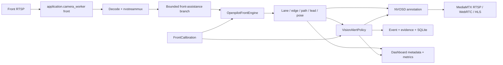

# Kiến trúc Camera AI B2B

> Legacy reference: the active Camera runtime is the standalone DeepStream
> stack documented in `docs/architecture/DeepStream.md`. The Frigate ownership
> model below is not an active startup path or event/evidence owner.

Ngày cập nhật: 25/08/2026

## 1. Mục tiêu

Tài liệu này định nghĩa kiến trúc pipeline Computer Vision nhiều camera với các boundary rõ ràng:
`tracker` xử lý object tracking tại edge, `camera-safety` xử lý fire/smoke/smoking tại edge,
`camera-recognition` xử lý Face/LPR và `frigate` main là system of record. Tracker/recognition dùng
typed contract riêng; safety V1 gọi manual Event API hiện có. Các extension không gọi trực tiếp
lẫn nhau và không ghi SQLite của Frigate.

Mục tiêu kinh doanh ưu tiên là **Gate Intelligence cho nhà máy, kho vận, depot và
bãi xe đang có camera RTSP nhiều hãng**. Sản phẩm không cạnh tranh trực diện với
camera ANPR/face chuyên dụng bằng một model đơn lẻ; lợi thế chính là:

- Không bắt buộc thay toàn bộ camera hiện có.
- Dữ liệu và inference chạy on-premise.
- Kết quả nhận diện giữ đúng frame, bbox và evidence.
- Tích hợp được barrier, ERP, WMS, visitor management và hệ thống bảo vệ.
- Không khóa vào firmware hoặc cloud của một hãng camera.

## 2. Baseline hiện tại

Các thành phần đã có và được giữ làm nền tảng:

- Frigate hiện vẫn chạy toàn bộ pipeline trong một container; kiến trúc đích tách lane
  capture/detection/tracking thành `tracker` edge và giữ Event/publication trong Frigate main.
- `app/config/production.yaml` là cấu hình runtime DeepStream hiện hành; `server/` vẫn là boundary ADAS/FTP/archive độc lập.
- Hai pipeline đang chạy là `car_camera` cho LPR và `face_camera` cho face recognition.

Tối ưu được thực hiện trực tiếp trong pipeline Frigate hiện có; chi tiết vận hành nằm ở tài liệu
riêng.

## 3. Khoảng trống cần giải quyết

| Khoảng trống | Hệ quả hiện tại | Trạng thái đích |
| --- | --- | --- |
| Camera chỉ được mô tả bằng stream/FPS | Không biết input có đủ chất lượng để cam kết hay không | Mỗi camera có quality threshold đã benchmark |
| Detect và evidence dùng chung luồng thấp | Mất pixel biển số/khuôn mặt | Detect stream thấp, evidence stream full-resolution |
| Face và LPR cần evidence đúng lineage | Sai frame/bbox làm report không đáng tin | Evidence/quality chỉ là side-channel, không thay recognition decision của master |
| Quan sát chủ yếu bằng FPS/inference | Không biết bỏ sót bao nhiêu passage | SLA theo passage và end-to-end funnel |
| Detection input gắn với subscriber nội bộ | Khó thay detector/tracker mà không sửa recognition | Một `RecognitionInput` port nhận `TrackedObservation` có lifecycle rõ |
| Fire/smoke phụ thuộc object track | Có thể bỏ sót hazard khi không tạo được `track_id` | Safety scene sampler chạy độc lập với motion/object lifecycle |
| Safety dùng chung model hoặc runtime với tracker | Camera không cần safety vẫn chịu tải; lỗi safety ảnh hưởng tracking | `camera-safety` là service và model lane riêng, gán theo camera |
| Trace ghi file ngay trên thread gọi | Trace I/O có thể chặn detection/recognition khi bật | Bounded trace queue và một trace-writer thread riêng |
| Detect, face và LPR cùng tranh chấp compute | LPR/OCR tạo burst CPU/GPU và giảm mật độ kênh | Queue/transport bounded nhưng giữ nguyên cadence và voting của master |

## 4. Nguyên tắc kiến trúc

1. Chất lượng camera input là contract có thể đo.
2. Candidate giữ đúng frame và bbox đã dùng để nhận diện.
3. Live/network input dùng latest-frame khi quá tải; finite local MP4 dùng FIFO/backpressure để
   không bỏ frame.
4. Face/LPR giữ nguyên admission, history, attempt limit và publish timing của Frigate `master`.
5. Recognition decision phải giữ đúng Frigate `master`; instrumentation/coordinator không được
   thay weighted voting, clustering, threshold hoặc thời điểm publish.
6. Refactor worker/coordinator chỉ được thực hiện sau khi master-parity đã có differential test và
   phải chứng minh không đổi decision output hoặc raw track/Event ownership.
7. `EventAggregator` tiếp tục là canonical Event writer; notification chỉ đi từ committed Event
   qua outbox.
8. Recognition chỉ phụ thuộc typed tracked-observation/evidence contract; detection, Event và
   transport cụ thể nằm trong adapter.
9. Trace là side-channel bounded, không phải source of truth và không được block critical path.
10. `tracker` chỉ gửi tracked-object result stream cho Frigate main. Frigate main là integration
    boundary duy nhất giữa tracker và recognition; tracker không gọi trực tiếp recognition.
11. `tracker` và `camera-safety` là peer extensions nhưng không gọi trực tiếp nhau. Safety V1 không
    giả định tracker cung cấp restream và chưa nhận profile external tracker + safety vào acceptance.
12. Fire/smoke dùng scene-level temporal state theo camera/zone, không phụ thuộc object `track_id`.
    Smoking dùng cùng boundary nhưng mặc định tắt đến khi model/dataset đạt gate; không nhận lineage
    từ tracker.

## 5. Kiến trúc đích

Sơ đồ dưới đây là kiến trúc service chuẩn cho distributed edge topology. Camera có thể
được chuyển owner giữa Frigate-contained và edge tracker, nhưng việc chuyển producer của
tracked-object stream không thay Event SOT.

```mermaid
flowchart LR
    subgraph Edge[edge node]
        Camera[Camera RTSP]
        Video[Upstream RTSP / verified restream]
        subgraph TrackerService[tracker service - optional]
            Detect[Object detection]
            Track[Association / track lifecycle]
        end
        subgraph SafetyService[camera-safety service - optional]
            SafetyScene[Safety inference]
            SafetyCore[Temporal safety state]
            SafetyEventClient[FrigateEventClient]
        end
        EdgeMedia[Evidence ring / recording / live / clip]
    end

    subgraph Frigate[frigate main]
        TrackerClient[TrackedObject input + validation]
        SafetyApi[Manual Event API hiện có]
        SafetyFrame[Current frame cho Safety V1]
        Candidate[Candidate / crop / bbox / evidence]
        Guard[Epoch / sequence / idempotency guard]
        EventAdapter[FrigateEventAdapter]
        Event[EventAggregator]
        Media[Authenticated media proxy / trace writer]
        Database[API / SQLite / notification outbox]
    end

    subgraph Service[Recognition container]
        Grpc[gRPC mTLS server]
        Queue[Bounded executor]
        Models[Face / LPR model adapters]
        Core[RecognitionCore + session state]
        Control[Config + Face library control]
        Health[Health / capabilities / service_epoch]
    end

    Camera --> Video
    Video --> Detect --> Track --> TrackerClient
    Video --> SafetyScene --> SafetyCore --> SafetyEventClient
    Video --> SafetyFrame
    Track --> EdgeMedia
    EdgeMedia -->|Evidence / MediaManifest / byte range| TrackerClient
    SafetyEventClient -->|HTTP create / end| SafetyApi
    SafetyFrame -. manual snapshot .-> SafetyApi
    TrackerClient --> Candidate --> Guard
    TrackerClient -->|RecognitionJob + raw I420 evidence| Grpc
    Grpc -->|JobReceipt / RecognitionOutcome| TrackerClient
    Grpc --> Queue --> Models --> Core
    Core -->|RecognitionOutcome| Grpc
    SafetyApi --> Event
    Guard --> EventAdapter --> Event --> Database
    Guard --> Media
    TrackerClient -. configure / Face operations .-> Control
    Health -. readiness .-> TrackerClient
```



### 5.1 Runtime lanes và ownership

Ranh giới deployment được cố định như sau:

| Container/service | Ownership chính | Không được sở hữu |
| --- | --- | --- |
| `frigate` | Embedded camera chạy pipeline hiện hành; edge camera dùng host adapter. Luôn giữ EventAggregator, API/SQLite, notification/publication và authenticated media proxy | Không chạy lại camera logic hoặc giữ media bytes cho camera edge; không bypass Event SOT |
| `tracker` | Với camera được gán: ingest, node-local restream, FFmpeg, detection, Norfair/`TrackedObject`, zone/speed/path, PTZ, evidence, recording/live/clip và durable spool | Face/LPR hoặc safety decision, Event/API/canonical SQLite, notification/publication hoặc gọi trực tiếp service nghiệp vụ khác |
| `camera-safety` | Fire/smoke scene inference, smoking activity inference, bounded temporal state và manual Event API client | General object tracking, PTZ, canonical Event/API/SQLite, notification/publication hoặc tự nhận ownership media của camera đã thuộc tracker |
| `camera-recognition` | Face/LPR candidate processing, crop/bbox/evidence artifact, model, `RecognitionCore`, history/session và outcome | Tracker, Event/API/SQLite, media, notification hoặc tự publish |
| `camera-mediamtx` | Replay/RTSP gateway | Recognition decision và Event commit |
| `camera-ngrok` | HTTP tunnel vào Frigate | Camera inference, recognition và database |

`camera-recognition` là **tập con recognition của Frigate về chức năng và code** (candidate,
crop/bbox/evidence processing, model, `RecognitionCore`, history/session), được đóng gói thành
deployment service riêng. Nó không phải một hệ thống nghiệp vụ độc lập và không bao gồm toàn bộ
Frigate. `tracker` là boundary edge riêng cho detection/tracking, nhưng chỉ giao tiếp với Frigate
main. `camera-safety` là peer edge boundary độc lập với tracker và recognition; service này chỉ
chạy cho camera được gán safety capability. Safety V1 không nhận video/result từ tracker và không
giả định tracker có restream. Profile external tracker + safety được giữ ở trạng thái deferred cho
đến khi snapshot/evidence contract được giải quyết.
`camera-mediamtx` và `camera-ngrok` mới là infrastructure services bên ngoài Frigate core.

| Lane | Owner | Được phép làm | Không được làm |
| --- | --- | --- | --- |
| Detection | Capture/detect/track runtime | Phát tracked-object update, frame/evidence reference và lifecycle end | OCR/embed, recognition decision, notification hoặc disk trace |
| Safety inference | `camera-safety` | Phân tích scene/activity, giữ bounded temporal state và gọi create/end qua API hiện có | Ghi SQLite, gọi trực tiếp tracker/recognition hoặc làm fire/smoke phụ thuộc object track |
| Frigate safety integration | Manual Event API hiện có | Tạo/kết thúc Event theo label `fire`, `smoke`, `smoking` | Chạy safety model hoặc yêu cầu sửa Frigate main trong V1 |
| Frigate external client | `ExternalRecognitionClient` | Map canonical update sang ordered job; sở hữu evidence TTL; kiểm tra epoch/sequence/idempotency | Chạy model, vote, tự retry sang runtime khác hoặc publish result chưa hợp lệ |
| Recognition service | Executor + model adapters + `RecognitionCore` | Inference, Face/LPR history/voting, explicit end, Face library control; tạo producer-owned evidence artifacts trong outcome khi capture được yêu cầu | Import Event/SQLite/notification, ghi filesystem media hoặc tự tải URL/path evidence |
| Frigate output adapter | `FrigateEventAdapter` | Map outcome đã qua guard sang Event metadata và media contract hiện hành | Chọn lại winner, đổi score hoặc nối history qua service epoch |
| Event | `EventAggregator` | Canonical Event/API/SQLite commit và correlation | Chạy OCR/embed hoặc sở hữu recognition history |
| Notification | Durable outbox/worker | Gửi từ committed Event, retry/idempotency | Nhận lệnh trực tiếp từ recognition worker |
| Trace | Một bounded queue + writer thread | Persist JSONL/metrics best-effort | Block detection/recognition/Event hoặc sở hữu evidence |

Trong deployment hiện tại, detector/tracker trong `frigate` cập nhật base Event path. Trong kiến
trúc đích, `tracker` phát `track_start/update/end` cho Frigate main; Frigate là owner duy nhất của
Event, API/SQLite, media và publication, còn recognition service là owner của model, Face/LPR
history và decision state. `camera-safety` gọi create/end qua manual Event API hiện có. Recognition
và safety không bao giờ nhận lệnh trực tiếp từ tracker.

### 5.2 Recognition input/output boundary

Frigate gửi một ordered job contract ổn định:

```python
RecognitionJob(
    job_id,
    client_id,
    expected_service_epoch,
    track_key,
    sequence,
    operation,          # observe | end_track | cancel
    observation,
    deadline_budget_ms,
    evidence,
)
```

`track_key = camera_id + stream_epoch + track_id` do Frigate cung cấp. `sequence` tăng đơn điệu
trong từng track; `end_track` đứng sau mọi observation đã được accept của track đó và idempotent.
Service không tự tracker, tạo passage identity hoặc suy diễn end từ observation bị thiếu.
Wire contract dùng budget tương đối; client giữ gRPC deadline bằng monotonic clock của chính nó,
service đổi budget còn lại thành monotonic deadline cục bộ khi nhận job. Không truyền giá trị
monotonic tuyệt đối giữa hai máy.

Service trả `JobReceipt` ngay khi admission và `RecognitionOutcome` sau xử lý. Receipt chỉ có
`accepted=true` hoặc typed reject như `queue_full`, `invalid_evidence`, `epoch_mismatch` và
`unavailable`. Outcome giữ job/key/sequence/epoch, frame/evidence lineage, `RecognitionUpdate`
hoặc typed failure. Client chỉ chuyển update sang `FrigateEventAdapter` một lần sau khi guard đạt.

### 5.3 Evidence và message contract

External V1 gửi raw contiguous I420 bytes cùng `shape`, `dtype`, `layout`, byte length, evidence ID
và expiry. Giới hạn hard là 8 MiB/job; length phải khớp shape/dtype trước khi model attach. Không JPEG
evidence trên inference path vì encode có thể đổi model input. Không chia sẻ `/dev/shm` hoặc IPC
namespace giữa hai container, không gửi URL/path và không để service đọc filesystem tùy ý.

Frigate giữ evidence đến khi nhận outcome/ack hoặc TTL hết. Service chỉ giữ input buffer trong phạm
vi job và không tự ghi filesystem media. Khi cần lưu artifact, code producer dùng
chung tạo `recognition_attempt`, `recognition_attempt_bbox` và exact `face_crop`; service trả bytes,
hash và bbox metadata trong outcome để Frigate writer persist. Validator chỉ kiểm tra/copy artifact,
không vẽ lại bbox hay dựng record. Evidence contract không được lọc observation, xếp hạng candidate,
vote hoặc trì hoãn publication.

### 5.4 Deployment, control plane và no-fallback contract

```yaml
recognition:
  runtime: external
  endpoint: recognition:50051
  deadline: 5       # seconds; connect/RPC
  job_deadline: 30  # seconds; accepted observation: queue + inference
  tls:
    ca: /run/recognition-tls/ca.crt
    certificate: /run/recognition-tls/client.crt
    key: /run/recognition-tls/client.key
    server_name: recognition
```

Recognition image chạy thành service riêng trên private Docker network và không publish port ra
host mặc định. Model assets mount read-only; Face library là volume service sở hữu. Frigate gửi
validated recognition config qua control RPC và forward các operation `register`, `clear`,
`recognize` và `reprocess` Face hiện hành. Config change hoặc service restart tạo `service_epoch`
mới, đóng toàn bộ session/pending cũ và không nối history.

Chọn `external` thì Frigate không khởi tạo local Face/LPR inference model. Thiếu endpoint/TLS hoặc
config bị service từ chối làm startup validation fail. Sau startup, mất kết nối hoặc service
unhealthy chỉ làm recognition fail closed bằng typed outcome; capture/detect/base Event vẫn chạy,
không fallback sang local runtime, CPU hoặc model khác và không tự resubmit job.

Local và external không có hai implementation recognition khác nhau. Cả hai gọi chung
`RecognitionCore`, Face/LPR engine, Face detector/crop/bbox/evidence helpers và LPR processing
mixin. External chỉ thêm copy evidence, bounded admission, gRPC/mTLS và epoch/sequence guard.
Khi Frigate gửi `end_track`, track chuyển sang trạng thái `ending`; mọi observation đã accept và
xếp trước end vẫn được apply. Chỉ outcome `ENDED` mới đóng lineage và dọn sequence/media state.

### 5.5 Trace transport

Mọi lane chỉ `put_nowait()` một trace record nhỏ vào bounded trace queue. Trace không chứa image
bytes và không giữ evidence lease. Khi queue đầy, production drop record chưa persist và tăng
`trace_dropped_total`; không block critical path. Report phải ghi nguyên drop count để biết evidence
quan sát có đầy đủ hay không. Writer là thread duy nhất mở/ghi JSONL và shutdown chỉ flush trong
thời gian bounded.

### 5.6 Thiết kế boundary `tracker` edge

`tracker` là boundary edge được suy ra từ pipeline hiện tại của Frigate, không phải một tracker
mới với thuật toán mới. Mục tiêu là chuyển phần xử lý liên tục theo camera sang node edge để
scale số camera bằng compute tại chỗ. Frigate giữ Event/persistence/publication và proxy media;
tracker giữ media bytes/retention cho camera edge. Code tham chiếu hiện tại là `frigate/src/frigate/domain/video/detect.py`,
`frigate/src/frigate/domain/video/ffmpeg.py`, `frigate/src/frigate/domain/track/norfair_tracker.py`,
`frigate/src/frigate/domain/track/tracked_object.py` và `frigate/src/frigate/domain/track/object_processing.py`.

| Lane của tracker | Capability phải cung cấp | Output bắt buộc |
| --- | --- | --- |
| Capture | Camera stream, FFmpeg/decode, source PTS và bounded latest-frame queue | `camera_id`, `stream_epoch`, `frame_seq`, `source_pts`, frame contract |
| Detection | Detector hiện hành theo camera config, label/score/box và detect timestamp | Detection list gắn đúng frame lineage |
| Association | Norfair/centroid-compatible association, track ID, matched detection và track state | Ordered `TrackedObjectUpdate` |
| Lifecycle | Tạo, update, mất, kết thúc track; end-of-stream và epoch change | `track_start`, `track_update`, `track_end` typed events |
| Quality/evidence reference | Frame reference và bbox hợp lệ cho downstream recognition | Evidence ID/reference có TTL, không gửi path tùy ý |
| Transport | Bounded result queue, backpressure, stale-drop và reconnect state | Result stream có sequence/epoch và typed failure |

#### 5.6.1 Input/output contract

Input của tracker là camera source và cấu hình detector/tracking theo camera. Output không được
là raw track ID đơn lẻ. Mỗi update phải chứa tối thiểu:

```text
camera_id
stream_epoch
frame_seq
source_pts
track_id
label
score
object_bbox
frame_time
observed_in_frame
lineage/schema/config hash
```

`track_id` chỉ có ý nghĩa trong một cặp `(camera_id, stream_epoch)`; không được nối history qua
epoch mới. `source_pts` và `frame_seq` là căn cứ chọn evidence và đối chiếu passage. `track_end`
phải được phát khi object timeout, stream disconnect, shutdown hoặc epoch đổi; không chờ recognition
service trả kết quả.

#### 5.6.2 Ownership và giới hạn

Tracker sở hữu capture, detection, association, track lifecycle và result stream. Tracker không
được sở hữu:

- Face/LPR history, voting hoặc `RecognitionCore`;
- canonical Event, API, SQLite, media index/proxy hoặc notification;
- recognition retry, winner selection hoặc publication;
- đọc/ghi evidence bằng filesystem path không có TTL và lineage.

Frigate nhận `TrackedObjectUpdate`, kiểm tra `(camera_id, stream_epoch, frame_seq, track_id)`,
sau đó cập nhật base Event path và chuyển candidate/evidence sang recognition boundary. Khi edge
chưa được triển khai, chính các lane này vẫn chạy trong Frigate main với cùng contract.

### 5.7 Thiết kế boundary Safety-Camera (`camera-safety`) edge

`camera-safety` là extension chạy bằng process/container riêng trên cùng Docker host/network với
Frigate và chỉ chạy cho camera được bật capability. Smoking mock là scope POC đầu tiên bằng model
đã có và `bucket11.mp4`; fire/smoke dùng cùng boundary nhưng chờ model riêng. Không fine-tune
detector general-purpose của tracker.

V1 không sửa Frigate core và không thêm ingest service, schema hoặc wire protocol mới. Safety đọc
Frigate restream, giữ temporal state tối thiểu và gọi Manual Event create/end. Frigate vẫn sở hữu
Event, SQLite, recording, Review và notification.

| Camera profile | `tracker` | `camera-safety` | Trạng thái V1 |
| --- | :---: | :---: | --- |
| Frigate-contained + safety | — | ✅ | Hỗ trợ; Frigate còn current frame cho snapshot/recording |
| Safety-only inference, Frigate record/live | — | ✅ | Hỗ trợ; không phụ thuộc motion/object track |
| Tracker-only | ✅ | — | Không bị ảnh hưởng |
| External tracker + safety | ✅ | ✅ | Deferred; Manual Event snapshot có thể rỗng/stale |
| Remote safety node | — | ✅ | Deferred; authentication/TLS lifecycle chưa thuộc V1 |

Các constraint chính: Safety config tách khỏi Frigate config; port 5000 chỉ dùng trong private
network; readiness yêu cầu current frame có `X-Frame-Time > 0`; Manual Event snapshot dùng current
frame chứ không phải exact inference frame. Safety không gọi tracker/recognition và không tự nhận
diện người hút thuốc.

Thiết kế, risk register và acceptance: [Camera Safety](Camera_Safety.md).

## 6. Quality contract theo camera

Mỗi camera khai báo trực tiếp các ngưỡng mà `QualitySelector` sử dụng. Các giá trị dưới
đây chỉ là điểm bắt đầu và phải được chốt bằng ground-truth replay trên camera/hardware
thật.

```yaml
camera_quality:
  gate_lpr_01:
    task: lpr
    min_detail_width_px: 140
    max_yaw_deg: 25
    evidence: {width: 2560, height: 1440, fps: 20}

  lobby_face_01:
    task: face
    min_detail_width_px: 96
    max_yaw_deg: 35
    evidence: {width: 1920, height: 1080, fps: 15}
```

Selector ghi lý do reject để biết cần chỉnh camera, threshold hay model; không tự đổi
stream/model khi quality thấp.

Safety profile riêng của extension khai báo các capability `fire`, `smoke`, `smoking`, scene
cadence, zone, threshold và temporal window. Fire/smoke profile không kế thừa Face/LPR quality gate
và không bị vô hiệu khi camera không có object track.
Mock threshold chỉ phục vụ kiểm tra pipeline; production threshold chỉ cần chốt khi bật fire/smoke
hoặc claim accuracy theo camera domain.

## 7. Tách detect stream và evidence stream

Mỗi camera có tối đa bốn vai trò logic độc lập:

| Stream | Mục đích | Đặc tính |
| --- | --- | --- |
| Detect | Motion/object/tracker | Resolution thấp, latest-frame, cho phép drop stale |
| Safety scene | Smoking mock; fire/smoke deferred theo model gate | Live dùng latest-frame; finite replay đọc tuần tự đến EOF |
| Evidence | Best shot, LPR, face và safety context | Full-resolution, FPS theo profile, ring buffer bounded |
| Record | Playback/forensics | Bitrate và retention tối ưu cho lưu trữ |

Các vai trò logic không đồng nghĩa phải mở cùng số RTSP session. Node-local restream là nguồn dùng
chung; tracker và safety có decoder/inference cadence riêng nhưng không tranh camera ownership.
Safety scene có thể dùng detect stream hoặc high-resolution stream tùy kích thước hazard và
benchmark. Chỉ tách input vật lý khi resolution, FPS, GOP hoặc recording load làm vi phạm safety/
evidence SLA.

`EvidenceRingBuffer` giữ frame trong một cửa sổ ngắn, ví dụ 3–10 giây. Buffer phải:

- Bounded theo byte và thời gian.
- Cho phép lấy high-resolution frame gần timestamp của track.
- Copy crop/frame đã được chọn ra khỏi ring buffer trước khi frame hết hạn.
- Ghi đè frame cũ; không tăng bộ nhớ theo thời gian.

Không ghi toàn bộ ring buffer vào database hoặc disk.

## 8. Frame reference tối thiểu

Candidate chỉ cần đủ thông tin để recognition dùng đúng ảnh đã được chấm quality:

```text
camera_id + track_id + frame_timestamp + frame_ref + object/detail bbox
```

Không tạo time model hoặc clock-drift subsystem riêng. Với local pipeline, `frame_ref` trỏ tới
frame/crop trong bounded buffer. Với external runtime, client copy đúng I420 frame thành bounded
gRPC evidence kèm shape/layout/byte length, evidence ID và expiry; service không dereference
filesystem path hoặc URL do caller cung cấp.

## 9. Unified Quality Selector

Face và LPR sử dụng chung contract candidate:

```python
EvidenceCandidate(
    candidate_id,
    camera_id,
    track_id,
    frame_time,
    frame_ref,
    object_box,
    detail_box,
    quality_score,
    quality_reasons,
)
```

Quality score gồm các thành phần có thể giải thích:

| Metric | LPR | Face |
| --- | --- | --- |
| Pixel density | Plate width/height | Face width/height |
| Blur | Laplacian/motion blur | Laplacian/motion blur |
| Exposure | Plate clipping | Face clipping/shadow |
| Pose | Plate perspective | Yaw/pitch/roll |
| Occlusion | Plate coverage | Eyes/nose/mouth visibility |
| Detector score | Plate/object | Face/person |
| Temporal stability | Track continuity | Track continuity |

Quality metric có thể ghi lý do như `plate_width_below_minimum`, blur hoặc pose để chẩn đoán và
chọn evidence hiển thị. Nó không được gate observation hay thay admission/voting của recognition
master.

## 10. Recognition decision policy

Face/LPR recognition phải giữ đúng decision policy của Frigate `master`:

- LPR giữ rolling variant window, Jaro-Winkler clustering, cluster support và representative của
  master.
- Face giữ `person_face_history`, weighted-average voting, `min_faces`, count-tie rejection và
  attempt limits của master.
- Camera-specific trace/evidence/report được phép quan sát nhưng không được tham gia admission,
  history, winner, threshold hoặc publish timing.

## 11. Capacity và overload control

### 11.1 Compute control không đổi recognition

Compute control chỉ được giới hạn transport, queue và concurrency ở nơi không làm mất hoặc đổi thứ
tự observation mà Frigate `master` sử dụng. Không còn cascade top-3, custom dedupe, calibrated
early-stop, best-result winner hoặc terminal recognition state trong kiến trúc.

Metric bắt buộc gồm calls/s, P95 latency, queue age/depth, CPU, GPU, VRAM và compute-time theo raw
track. Khi quá tải, runtime phải báo degraded state; không được âm thầm thay cadence/voting để đạt
capacity.

### 11.2 Safety capacity control

V1 dùng một inference worker theo camera, live chỉ giữ frame mới nhất và replay đọc tuần tự. Đo
sample FPS, inference latency, Event API error, CPU/GPU và VRAM; benchmark trước khi bật thêm camera.
Chỉ tách worker/cadence sau khi có bottleneck đo được, không đổi model hoặc threshold để che tải.

## 12. Passage/hazard-level SLA và observability

Đơn vị đo chính là vehicle/person passage hoặc safety hazard episode, không phải frame.

```text
Physical passage
├── Object detected
├── Track continuous
├── Quality candidate accepted
├── Recognition committed
└── Event committed
```

Các KPI bắt buộc:

| KPI | Ý nghĩa |
| --- | --- |
| Passage detection recall | Tỷ lệ passage thật tạo event |
| Track continuity | Tỷ lệ passage không đổi nhầm ID |
| Quality acceptance | Tỷ lệ passage có evidence đạt profile |
| Recognition precision/recall | Đúng/sai theo ground truth |
| Evidence correctness | Result, bbox và frame cùng evidence |
| End-to-end latency | Capture đến recognition/Event committed |
| Degraded duration | Thời gian vi phạm camera/capacity contract |
| Fire/smoke episode recall | Tỷ lệ hazard episode thật được xác nhận |
| Safety false alarm rate | Số cảnh báo sai theo camera-hour |
| Safety detection latency | Thời gian từ hazard onset đến `confirmed` Event |

FPS, detector inference và queue depth vẫn được thu thập nhưng chỉ là diagnostic metric.

### 12.1 Lineage contract

Runtime health và recognition accuracy là hai phép đo độc lập; lỗi vận hành không được biến thành
lỗi OCR và một run khởi động ổn định không tự chứng minh accuracy.

Mỗi trace runtime giữ cùng một lineage từ frame nguồn đến kết quả cuối:

```text
source PTS -> object bbox -> runtime track/generation -> candidate ID
           -> plate/face bbox -> raw outcome -> final publication

source PTS -> scene/person ROI -> safety candidate -> temporal ACTIVE
           -> existing manual Event API create/end -> Frigate Event
```

V1 chưa truyền exact inference frame vào Frigate; snapshot Manual Event lấy current frame của
Frigate và có thể lệch nhẹ. Với external tracker camera, frame này có thể rỗng/stale nên profile
tracker + safety chưa thuộc acceptance V1.

## 13. LS-Vision Front Camera với openpilot

Section này là kiến trúc và phase plan canonical cho front camera trong runtime LS-Vision hiện
hành. Các section Frigate legacy phía trên không phải startup path, media owner, event store hoặc
test gate của chức năng này.

Nguồn nghiên cứu được khóa tại `commaai/openpilot` commit
`084747c75d2cbd23af65ab7a9e770bbd7b98bac9`. Commit này chỉ là reference/provenance; không được
clone openpilot vào image production hoặc chạy nguyên process graph của openpilot.

### 13.1 Phạm vi và boundary cố định

- Source of truth vẫn là `app/`; `runner` tạo một `application.camera_worker` riêng cho camera
  `front`.
- Front worker sở hữu RTSP ingest, frame number/epoch, inference state, annotation, MediaMTX output,
  metadata và evidence của chính camera đó.
- Chỉ port có giới hạn `driving_supercombo.onnx` bản nhỏ, preprocessing temporal, output parser,
  calibration và policy advisory cần thiết. Không import hoặc chạy `camerad`, `manager`, `msgq`,
  `controlsd`, panda, logger/uploader, openpilot UI hoặc cloud service.
- `server/` giữ nguyên boundary ADAS/FTP/archive độc lập. `frigate/` và kiến trúc Frigate cũ không
  tham gia front-camera runtime.
- DMS tiếp tục là worker riêng. Front camera không dùng DMS model, face model, fire/smoke model hoặc
  person detector nếu topology không yêu cầu.
- Riêng worker DMS luôn bật shared person detector/tracker. Model behavior chỉ được publish sau khi
  ghép với driver track hiện tại và qua confirmation policy; thiếu person/face phải báo `PARTIAL`
  hoặc `NO_DRIVER`, không được báo `OK`. Soham là object model DMS duy nhất; live overlay vẫn chỉ
  vẽ bbox có score cao nhất cho mỗi behavior/driver.
- Scope ban đầu chỉ quan sát và cảnh báo. Không phát lệnh ga, phanh, vô-lăng hoặc CAN actuation.
- MVP là `vision_only` và `shadow`: không đọc T-Box/CAN/telemetry, không phát âm thanh/notification.
  Khi calibration, model output hoặc frame freshness không hợp lệ, front stream có thể tiếp tục
  nhưng assistance phải `not_ready` và không phát alert.

#### Contract một timeline cho bộ camera 360 development

Bốn fixture `camera_front`, `camera_back`, `camera_left`, `camera_right` là bốn góc nhìn của cùng
một bộ camera, không phải bốn clip độc lập. Chúng phải khai báo cùng `sync_group`,
`sync_period_seconds` và `sync_epoch_seconds`; config validation fail closed nếu một camera lệch
contract. `sync_epoch_seconds=0` dùng Unix epoch làm mốc tuyệt đối ổn định qua restart.

Tại thời điểm server `t`, phase canonical là
`((t - sync_epoch_seconds) mod sync_period_seconds) / sync_period_seconds`. Mỗi fixture ánh xạ phase
chuẩn hóa này vào frame count/duration riêng để dung sai metadata container không làm trôi góc nhìn.
Front publisher trên Jetson chọn frame theo phase này trước khi đưa vào RTSP/DeepStream. Dashboard
dùng timestamp từ `/api/live-metadata` để map browser clock sang server clock và seek ba file
media-only theo cùng phase; khi WebRTC có capture latency, ba file lùi cùng độ trễ để khớp frame
front đang hiển thị. Không camera DOM nào được làm master và reload/restart không quay riêng một
camera về frame 0.

Acceptance development cho bộ 360 yêu cầu:

- API trả cùng group/period/epoch cho cả bốn camera;
- publisher front log đúng shared timeline và sau restart tiếp tục phase tuyệt đối;
- browser xác nhận cả bốn video có cùng `data-sync-phase`; drift của back/left/right so với target
  không quá 250 ms sau warmup;
- front vẫn đi qua worker Openpilot/DeepStream và output `camera_front`; ba góc media-only không trở
  thành owner của front inference;
- kiểm tra lại sau reload browser và restart `ls-vision-dev.service`, không chỉ ở lần chạy đầu.

Ownership đích:

| Thành phần | Owner | Contract |
| --- | --- | --- |
| Decode, frame epoch, output stream | `application.camera_worker(front)` | Một ordered live-frame lane, latest-frame/drop-stale |
| Temporal buffers và inference session | `OpenpilotFrontEngine`, một instance/front worker | Reset theo epoch/gap/model reload; không chia sẻ mutable state |
| Lane/path/lead output | `domain.front_assistance.FrontPerception` | Typed, có source timestamp, frame number, model/config hash |
| Intrinsics/extrinsics/calibration state | `FrontCalibration` | Persist theo camera/config hash; invalid thì fail closed |
| Vision LDW/FCW lifecycle | `VisionAlertPolicy` | Advisory state và `START/END` idempotent; không giả telemetry |
| Event/evidence/API/metrics | LS-Vision persistence/interfaces hiện tại | Exact triggering frame, bounded query, không glob evidence tree |
| Model và native release | LeOS `tbox_lab deploy-app` | Checksum/provenance, release-based deployment, rollback được |

Topology đích:



### 13.2 Trạng thái phase và acceptance artifact

Mỗi phase dùng đúng một trong các trạng thái:

| Trạng thái | Ý nghĩa |
| --- | --- |
| `[PLANNED]` | Chưa có implementation được nghiệm thu |
| `[IN PROGRESS]` | Đang triển khai, chưa qua toàn bộ gate |
| `[IMPLEMENTED — UNVERIFIED]` | Code đã có nhưng thiếu hardware/accuracy/E2E gate |
| `[ACCEPTED]` | Có report `accepted=true` và mọi gate bắt buộc đều true |
| `[BLOCKED]` | Có blocker cụ thể và bằng chứng, không thể tiếp tục an toàn |

Clone source, tạo scaffold, load được ONNX, test unit, build thành công hoặc service `active` không tự
động nâng phase thành `[ACCEPTED]`.

Mỗi phase tạo report riêng dưới `.tmp/front-camera/phase-<n>/summary.json` với tối thiểu:

```json
{
  "phase": "phase-<n>",
  "source_commit": "<camera commit>",
  "openpilot_commit": "084747c75d2cbd23af65ab7a9e770bbd7b98bac9",
  "model_sha256": "<sha256>",
  "config_hash": "<sha256>",
  "camera_id": "front",
  "device": "<device or offline>",
  "provider": "<TensorRT/CUDA/CPU/offline>",
  "started_at": "<UTC ISO-8601>",
  "duration_seconds": 0,
  "gates": {},
  "artifacts": {},
  "accepted": false
}
```

Không overwrite report fail khi chưa ghi nhận nguyên nhân. Report phải nêu rõ phase nào đã đạt và
gate nào còn thiếu.

### 13.3 Thứ tự phụ thuộc

| Phase | Trạng thái | Kết quả chính | Phụ thuộc |
| --- | --- | --- | --- |
| 0 | `[IN PROGRESS]` | Model/provenance, nuScenes fixture và fixed calibration | Không |
| 1 | `[IMPLEMENTED — UNVERIFIED]` | Offline model adapter; còn thiếu real-model parity artifact | Phase 0 |
| 2 | `[IMPLEMENTED — UNVERIFIED]` | Front worker topology, output và metadata; chưa hardware-run | Phase 1 |
| 3 | `[IN PROGRESS]` | Fixed nuScenes calibration; production/tamper chưa có | Phase 0, 1 |
| 4 | `[IMPLEMENTED — HARDWARE GATE FAILED]` | Jetson CUDA shadow chạy cùng DMS; còn thiếu throughput/GPU headroom | Phase 2, 3 |
| 5 | `[IMPLEMENTED — UNVERIFIED]` | Camera-only vision LDW advisory | Phase 4 |
| 6 | `[IMPLEMENTED — UNVERIFIED]` | Camera-only model FCW advisory | Phase 4 |
| 7 | `[IMPLEMENTED — UNVERIFIED]` | Dashboard, event/evidence và operator workflow | Phase 5, 6 |
| 8 | `[PLANNED]` | Production canary, rollback và release acceptance | Phase 7 |
| 9 | `[PLANNED]` | Radar/IMU/DMS ensemble và planner mở rộng | Phase 8; tùy chọn |

Phase sau không được dùng để che gate fail của phase trước. Ví dụ giảm model cadence, bỏ recurrent
context hoặc tắt DMS để đạt benchmark không phải closure nếu contract phase yêu cầu 20 Hz đồng thời.

### 13.4 Phase 0 — Khóa input và contract `[PLANNED]`

Mục tiêu là loại bỏ giả định về camera, lens, vehicle signal và model trước khi viết runtime code.

Deliverable:

- Chốt camera ID `front`, RTSP channel, codec, resolution, FPS, GOP và latency budget. Credential chỉ
  lấy từ environment/secret file.
- Đo lens/FOV, camera height và mount roll/pitch/yaw; lập kế hoạch intrinsic calibration bằng dữ liệu
  từ đúng camera production.
- Khóa model nhỏ `driving_supercombo.onnx`; ghi SHA-256, openpilot commit, license/provenance và
  third-party notice. Không đưa `big_driving_supercombo.onnx` vào scope.
- Tạo fixture builder từ nuScenes `sample_data` thay vì dùng MP4 không có lineage. Manifest phải giữ
  frame/PTS, scene/sample/sample-data token, calibrated-sensor token và đánh dấu frame lặp.
- Fixture mặc định dùng `scene-0061`; `scene-1077` là negative/night profile. Mỗi clip chỉ dùng một
  fixed calibration profile và đổi clip/calibration phải tạo epoch mới.
- Chốt accuracy metrics nhưng chưa chốt threshold theo cảm tính: lane alignment, lead presence,
  LDW episode precision/recall, FCW episode precision/recall và false alerts/vehicle-hour.

Gate:

- Camera stream đọc ổn định bằng client thật; không lộ credential trong log/report.
- Video fixture là media thật và có producer timestamp; không tạo synthetic frame/UUID/lifecycle để
  thay acceptance.
- Model SHA/provenance/license record đầy đủ.
- Report ghi riêng `source_unique_fps` và `model_tick_hz`; frame lặp không được tính là camera 20 FPS.
- Thiếu speed/brake/blinker là giới hạn công khai của `vision_*`, không được lấp bằng state giả.

### 13.5 Phase 1 — Offline adapter và parity `[IMPLEMENTED — UNVERIFIED]`

Mục tiêu là tái tạo chính xác road-model contract mà không kéo process graph openpilot vào app.

Planned source:

```text
app/src/domain/front_assistance.py                  # mới
app/src/adapters/models/openpilot_front_engine.py  # mới
app/src/adapters/models/openpilot_preprocess.py    # mới nếu cần tách
app/tests/unit/test_openpilot_front_engine.py       # mới
app/tests/unit/test_openpilot_front_policy.py       # mới
```

Implementation contract:

- Model input cố định gồm `img [1,12,128,256] uint8`, `big_img [1,12,128,256] uint8`,
  `features_buffer [1,24,512] float16`, `desire_pulse [1,25,8] float16`,
  `traffic_convention [1,2] float16` và `action_t [1,2] float16`.
- Giữ model frequency 20 Hz, context frequency 5 Hz, hai image contexts và hidden-state feedback.
- Warp phải giữ đúng thứ tự openpilot
  `camera_from_calib @ inverse(model_intrinsics @ view_from_device)`; unit test khóa ma trận này để
  không đảo operand hoặc nghịch đảo từng phần sai.
- Parser trả lane lines, road edges, path/velocity/acceleration/orientation, leads, pose, meta,
  confidence và raw timing diagnostics qua domain type của LS-Vision. Lane/road edge giữ đủ
  `(x,y,z)`, không hạ xuống `(x,y)` trước projection.
- Một engine chỉ xử lý một ordered camera epoch. Reset toàn bộ queue/hidden state khi epoch đổi,
  timestamp lùi, gap vượt ngưỡng, model/config hash đổi hoặc provider restart.
- Không phụ thuộc Cap'n Proto, `msgq`, tinygrad runtime, openpilot Params hoặc CarParams.

Gate:

- ONNX metadata/input/output slice test khớp model đã khóa; output là `[1,2576]` finite.
- Preprocess parity so sánh tensor của cùng frame/calibration với reference code.
- Parser parity so sánh lane/edge/path/lead/meta bằng tolerance được ghi trong report.
- Hai lần replay cùng input/epoch tạo cùng output trong tolerance; reset test chứng minh không nối
  hidden state giữa hai run.
- Test NaN, malformed model, missing provider, stale/gapped frames và shutdown; failure typed và
  không treo worker.
- Targeted pytest, Ruff, compileall và `git diff --check` pass. Đây là code-quality gate, không thay
  hardware/perception acceptance.

### 13.6 Phase 2 — Front worker và media path `[IMPLEMENTED — UNVERIFIED]`

Mục tiêu là thêm front camera như một worker chuẩn của LS-Vision mà không làm DMS hoặc các camera
khác đổi semantics.

Deliverable:

- Thêm `front_assistance` vào config validation và per-camera function dispatch.
- Thêm `app/config/cameras/front.yaml`; chỉ thêm topology production sau khi Phase 0 chốt source.
- Refactor `camera_worker` để primary person `nvinfer` là capability, không phải bước bắt buộc. Front
  worker đi từ decode/mux vào bounded front branch và output branch mà không chạy person detector.
- Front analysis dùng latest-frame/drop-stale; không tích lũy backlog lịch sử. Recurrent input vẫn
  phải nhận ordered frame và engine phải biết chính xác gap/drop.
- Publish metadata lane/edge/path/lead/calibration/model health; Phase này chưa phát LDW/FCW Event.
- Render overlay cơ bản: lane, road edge, ego path và lead chevron/distance. Không vẽ bounding box xe
  giả vì model không cung cấp object box kiểu YOLO.

Gate:

- Real recorded front video chạy qua worker/media pipeline; đúng một worker `front` và một worker
  `DMS` khi cấu hình cả hai.
- Front output RTSP/HLS/WebRTC fresh; frame input/output timestamp và frame age có metric.
- Process inspection xác nhận front worker không khởi tạo person detector/DMS/face/fire-smoke engine.
- Camera restart tạo epoch mới và reset recurrent state; output phục hồi mà không nối state cũ.
- Queue depth bounded và stale frames bị drop có counter; không biến live stream thành playback.
- DMS targeted tests và DMS worker readiness không regression.

### 13.7 Phase 3 — Camera geometry, calibration và tamper `[IN PROGRESS]`

Mục tiêu là bảo đảm model warp và cảnh báo lane dùng đúng camera geometry.

Deliverable:

- Intrinsic contract gồm `fx`, `fy`, `cx`, `cy`, distortion coefficients, source resolution và
  calibration artifact hash.
- Extrinsic contract gồm height, roll, pitch, yaw, mount version và calibration state
  `uncalibrated/calibrating/calibrated/invalid/recalibrating`.
- Provisioned calibration dùng giá trị đo thật; zero/default không được tự xem là calibrated.
- Projection overlay dùng cùng `intrinsics @ view_from_device @ rotation(rpy_calib)` với model warp.
  Lane dùng `z` do model trả; path cộng camera height giống openpilot. Không kéo dài longitudinal
  position của path để tạo geometry giả khi camera-only model trả quãng ngắn.
- Online calibration không nằm trong MVP camera-only; chỉ mở lại khi có motion/state đáng tin cậy.
- Tamper detector so sánh calibration với baseline, phát degraded state khi camera bị xoay/rung hoặc
  geometry spread vượt ngưỡng.

Gate:

- Checkerboard/target intrinsic calibration có reprojection report và artifact hash.
- Lane/path projection được kiểm tra trực quan và định lượng trên road fixture đã gán nhãn.
- Invalid/missing/stale calibration luôn làm assistance `not_ready`; không có LDW/FCW transition.
- Restart giữ đúng calibration cùng hash; đổi camera/lens/resolution/config bắt buộc invalidation.
- Tamper fixture chuyển state đúng và phục hồi chỉ sau calibration gate, không tự clear vì một frame.

### 13.8 Phase 4 — Jetson shadow inference `[IMPLEMENTED — HARDWARE GATE FAILED]`

Mục tiêu là chứng minh model nhỏ chạy đồng thời với DMS trên Jetson thật trước khi bật alert.

Deployment:

- Đưa model vào `assets/models/openpilot/driving_supercombo.onnx`, thêm checksum/provenance và cập
  nhật cả Camera model manifest lẫn danh sách model hard-code trong LeOS `deploy-lsvision.ps1`.
- Chỉ deploy bằng `npm run deploy`/LeOS `tbox_lab deploy-app`; không SCP model hoặc sửa runtime thủ
  công trên Jetson.
- Provider order là TensorRT rồi CUDA. CPU provider chỉ được dùng cho offline parity; production
  shadow phải fail startup/readiness nếu cả TensorRT và CUDA không dùng được.
- Engine cache nằm dưới writable state `/opt/ls-vision/data/state`, không nằm cạnh source/model.
- Giữ 25 W power mode và ghi thermal/throttling state trong report; không thay power mode để che
  benchmark mà không ghi nhận.

Hardware gate tối thiểu trong một run 10 phút sau warmup:

- DMS và front worker cùng `ready`; không restart và không dùng swap.
- Provider thực tế là TensorRT hoặc CUDA, được ghi từ session/runtime chứ không chỉ từ config.
- Effective model tick đạt ít nhất 19 Hz; report ghi riêng unique source FPS của mock và không coi
  frame lặp là camera 20 FPS. Inference P95 không quá 50 ms và P99 không quá 75 ms.
- Output frame age P95 không quá 150 ms; dropped-frame ratio dưới 1% sau warmup.
- GPU utilization P95 không quá 90%, không thermal throttle; RAM/CPU/GPU có headroom được ghi rõ.
- DMS latency/readiness không vượt baseline đã đo trước run.
- Cold-start engine build và warm-start engine cache là hai artifact riêng; timeout/readiness không
  được coi là engine-build success.

Nếu gate fail, phase giữ `[IMPLEMENTED — UNVERIFIED]`. Tối ưu được phép gồm zero-copy, hardware
decode, I/O binding, bounded queue và TensorRT engine/cache; không được bỏ temporal context, đổi
output semantics hoặc giảm model rate trước khi có parity/accuracy quyết định riêng.

Kết quả Jetson development ngày 2026-08-25:

- Deploy đi đúng `npm run deploy -- -Development -JetsonAlias jetson-nano`; checksum model trên
  Jetson khớp `659727c4d4839adc4992a254409a54259a8756a743f2d567bf5fdc6579f8009b`.
- TensorRT 10.3 không build được fused graph `node_conv2d_1 + node_gelu_1`; runtime fail closed khỏi
  TensorRT và dùng `CUDAExecutionProvider`, không dùng CPU provider.
- Artifact offline `.tmp/front-camera/phase-1/summary.json` có `accepted=true`; đây không thay thế
  hardware gate.
- Artifact ổn định `.tmp/front-camera/phase-4/stability-summary.json` đo 326 giây đồng thời với DMS:
  front/DMS không restart, HLS và readiness liên tục, không swap, source 19,564 FPS, output-age P95
  56,552 ms và inference P99 67,890 ms.
- Hardware gate chưa đạt: effective model tick 13,215 Hz, inference P95 50,992 ms, drop ratio
  1,2832% và GPU utilization P95 99%. Artifact giữ `accepted=false` và
  `production_accepted=false`; chưa được bật canary/production alert.
- Publisher dev dùng `appsrc` với PTS 20 Hz liên tục và tự quay lại frame đầu, vì EOS của MP4 từng
  làm MediaMTX ngắt raw RTSP và supervisor restart front worker. Raw mẫu được giữ ở
  `.tmp/front-camera/phase-4/stability-summary-samples.jsonl`.

Gate còn lại trước khi đổi trạng thái Phase 4: tối ưu CUDA/TensorRT hoặc I/O binding để đạt đủ bốn
ngưỡng model tick, inference P95, drop ratio và GPU P95; sau đó chạy lại đủ 10 phút sau warmup, đo
DMS baseline riêng và bổ sung cold-start/warm-start artifact.

### 13.9 Phase 5 — Camera-only vision LDW `[IMPLEMENTED — UNVERIFIED]`

`VisionAlertPolicy` dùng đúng các tín hiệu thị giác: lane probability `>0,5`, lane gần hơn `1,08 m`
với camera offset `0,04 m`, và lane-change desire `>0,1`. Episode cần 3 positive trong 5 model tick
và clear sau 5 negative liên tục. Classification công khai là `vision_ldw_left/right`.

Không áp dụng speed gate, blinker cooldown hoặc lateral-control suppression vì MVP không có các tín
hiệu đó. Dashboard/evidence phải luôn ghi `mode=vision_only`; không đổi tên thành LDW chuẩn.

Gate:

- Positive trái/phải, lane không visible, calibration invalid, model stale và epoch reset có unit và
  replay test.
- Một episode chỉ tạo một `START` và một `END`, exact triggering frame có evidence.
- Alert không phát notification/audio và không tồn tại qua source epoch mới.

### 13.10 Phase 6 — Camera-only vision FCW `[IMPLEMENTED — UNVERIFIED]`

Port model hard-brake rolling policy: 5 mẫu `brake5m/s²` với threshold
`[0,05;0,05;0,15;0,15;0,15]` và 2 mẫu `brake3m/s²` với threshold `0,7`. Classification là
`vision_fcw`; lead output chỉ dùng cho overlay/attribution, chưa tính headway hoặc TTC.

FCW start ngay khi rolling gate true và end sau một giây negative. Do không có brake state, hệ thống
không biết người lái đang phanh; giới hạn này phải xuất hiện trên dashboard/report. Không port
`LongitudinalPlanner`, CarParams, opendbc, radar hoặc MPC.

Gate:

- Rolling thresholds, invalid calibration/model/frame, epoch reset và event idempotency có test.
- Golden model-output sequence chỉ chứng minh policy; không được dùng thay perception accuracy.
- Phase kết thúc ở shadow advisory, không audio/notification/actuation.

### 13.11 Phase 7 — Dashboard, Event, evidence và vận hành `[IMPLEMENTED — UNVERIFIED]`

Mục tiêu là biến output đã nghiệm thu thành workflow quan sát được và điều tra được.

Deliverable:

- Camera card `camera_front` hiển thị stream với lane/path geometry; lead, calibration, provider,
  inference latency và frame lineage tiếp tục có trong metadata để chẩn đoán cho đến khi từng visual
  tương ứng được triển khai và nghiệm thu.
- Front video ưu tiên geometry có giá trị: hai lane biên và predicted path corridor. Không render
  `camera_front | LIVE`, timestamp, `FRONT SHADOW | NO ALERT`, inference time hoặc capability chip
  lên video/card khi trạng thái bình thường. Chỉ hazard LDW/FCW hoặc `ADAS NOT READY` được phép che
  lên hình. Runtime metadata phải ghi `visible_lane_count`, `path_point_count` và
  `rendered_segment_count`; code path tồn tại nhưng các count bằng 0 không được coi là overlay đạt.
- Lane confidence thấp không được vẽ thành đường màu rõ. Development dùng gate `0.5`, đồng nhất với
  openpilot LDW visibility; path ngắn giữ nguyên metric và có thể không xuất hiện trong frame.
- API/live metadata trả contract versioned, không đọc/glob toàn bộ evidence tree trên request path.
- LDW/FCW dùng event lifecycle `START/UPDATE/END`; exact triggering frame, source timestamp,
  calibration/model/config hash được giữ trong evidence metadata.
- Snapshot/evidence do front worker tạo từ frame đã dùng cho decision; không lấy live/current-frame
  fallback khác lineage.
- Notification/buzzer là policy riêng, mặc định tắt cho đến khi accuracy gate và operator UX được
  chấp nhận.

Gate:

- E2E real-video tạo đúng một episode cho một hazard, không duplicate sau worker/API restart.
- Evidence image, event record, SQLite state và dashboard metadata cùng camera/frame/epoch/event ID.
- Restart giữ event/idempotency state; stale cached result không render như alert mới.
- API/live/ready, front HLS và DMS HLS còn hoạt động sau restart.
- Report `accepted=true` chỉ khi toàn bộ postcondition trên đúng; HTTP 200 hoặc container active riêng
  lẻ không đủ.

### 13.12 Phase 8 — Production canary và release `[PLANNED]`

Mục tiêu là xác nhận một front camera/xe thật trước khi mở rộng fleet.

Canary sequence:

1. Lab soak tối thiểu 30 phút với DMS và front chạy đồng thời.
2. Road canary shadow, không phát âm thanh, trên nhiều điều kiện ánh sáng/thời tiết.
3. Operator-visible advisory trên một xe sau khi shadow metrics được review.
4. Chỉ mở rộng camera/xe theo từng batch; mỗi hardware/lens/profile mới có config/calibration hash và
   acceptance riêng.

Gate:

- Release được tạo qua `tbox_lab`, có model/config/source commit và rollback target xác định.
- Không restart loop, không unbounded queue/swap/thermal throttle và không regression DMS/T-Box.
- Mọi alert có evidence lineage; mọi period `not_ready` có blocking reason/metric.
- Accuracy được báo theo episode và vehicle-hour, tách ngày/đêm/mưa/cua/cut-in; không dùng vài clip
  demo để đại diện production.
- Rollback về last-known-good release khôi phục DMS/front media và state contract.
- Chỉ sau gate này phase mới được ghi `[ACCEPTED]`; việc deploy thành công chưa phải production
  acceptance.

### 13.13 Phase 9 — Mở rộng tùy chọn `[PLANNED]`

Mỗi mục dưới đây là một feature track riêng, không nằm trong MVP và không được ghép vào Phase 1-8
để tăng scope:

| Extension | Điều kiện vào | Contract bổ sung |
| --- | --- | --- |
| Vehicle-state LDW/FCW chuẩn | Có speed/brake/blinker local 10-20 Hz và time sync | Freshness/epoch, speed/blinker/brake suppression; bỏ prefix `vision_` chỉ sau accuracy gate |
| Camera-radar fusion | Có radar tracks thật, timestamp và coordinate calibration | Vision/radar association, uncertainty, track freshness |
| IMU/GPS localization | Có IMU/GPS local cadence cao và time sync | Pose/yaw-rate fusion, sensor health, epoch |
| Advisory lateral/longitudinal planner | Phase 8 accepted và vehicle profile đầy đủ | Wheelbase/steer ratio/delay, planner output chỉ advisory |
| Camera tamper nâng cao | Có long-term calibration baseline | Drift/spread policy, maintenance event |
| Driver risk analytics | LDW/FCW/headway đã accepted | Versioned aggregation, privacy/retention policy |

Radar fusion hoặc planner không tự cấp quyền actuation. Bất kỳ auto-steer/auto-brake/CAN write nào
cũng là project và safety case riêng, ngoài Camera LS-Vision front-assistance plan này.

## 14. DMS hiện tại

DMS vẫn là một worker LS-Vision độc lập và tiếp tục sở hữu person tracking, event/evidence, output
stream và API. Soham là nguồn cho `Smoking`, `Drinking`, `Eating`, `Seatbelt`; FaceMesh và Soham
cung cấp observation cho `DriverAttentionPolicy`.

- Policy awareness dùng source timestamp và các mốc 5/8/13 giây. Warning chỉ advisory; Critical tạo
  một event `Driver Inattention`; pose/eyes/phone/fatigue/no-face/uncertain là reason của cùng event.
- Cabin trống không tạo inattention. Person còn nhưng mất face hoặc model uncertainty vẫn làm giảm
  awareness. Production không được báo attentive từ observation unknown.
- Attention chạy cadence 100 ms từ FaceMesh/Soham, dùng neutral-pose calibration riêng của camera
  và không có cabin model thứ hai chạy song song.
- Openpilot cabin/DMS, shadow disagreement, model artifact và calibration provisional đã bị loại bỏ
  để giảm tải Jetson. Thay đổi này không ảnh hưởng Openpilot front assistance ở section 13.
- Trạng thái hiện tại: `[IMPLEMENTED — REAL-CAMERA ACCURACY GATE PENDING]`. Cần đánh giá false
  alert, miss rate và latency trên video cabin Dahua thật trước khi coi DMS là production-accepted.
