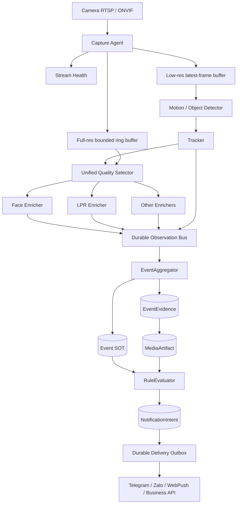
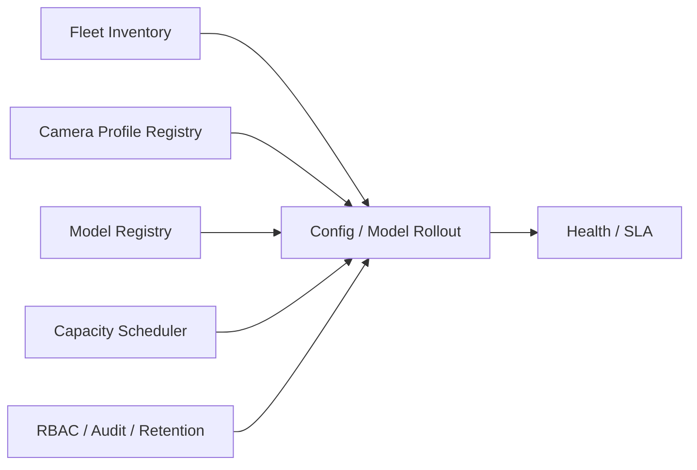
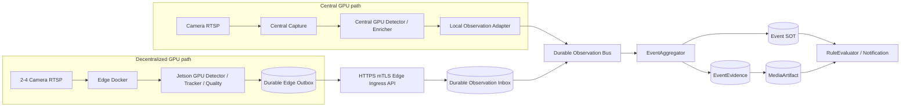

# Kiến trúc Camera AI B2B

Ngày cập nhật: 08/08/2026

## 1. Mục tiêu

Tài liệu này định nghĩa kiến trúc cải thiện nền tảng Camera AI từ runtime pilot hai
camera thành sản phẩm B2B on-premise có thể triển khai, đo lường và vận hành trên
nhiều site.

Mục tiêu kinh doanh ưu tiên là **Gate Intelligence cho nhà máy, kho vận, depot và
bãi xe đang có camera RTSP nhiều hãng**. Sản phẩm không cạnh tranh trực diện với
camera ANPR/face chuyên dụng bằng một model đơn lẻ; lợi thế chính là:

- Không bắt buộc thay toàn bộ camera hiện có.
- Dữ liệu và inference chạy on-premise.
- Event, evidence, media và delivery truy vết được.
- Tích hợp được barrier, ERP, WMS, visitor management và hệ thống bảo vệ.
- Không khóa vào firmware hoặc cloud của một hãng camera.

## 2. Baseline hiện tại

Các thành phần đã có và được giữ làm nền tảng:

- Bảng `Event` là aggregate root và system of record duy nhất.
- Tracking, LPR và face recognition phát `EventObservation`.
- `EventAggregator` quản lý state, revision và late enrichment.
- `EventEvidence` giữ full frame cùng object/plate/face box thuộc đúng frame.
- `MediaArtifact` là immutable output dùng chung cho Explore và notification.
- `NotificationIntent` và delivery ghim revision/artifact, retry không render lại.
- Telegram, Zalo và WebPush tách khỏi logic nhận diện.
- Runtime và Frigate dùng một SOT cấu hình tại `deploy/config.yaml`.

Trạng thái vận hành ngày 07/08/2026:

| Camera | Pipeline | Processing | Notification rule |
| --- | --- | --- | --- |
| `car_camera` | Car detection + native LPR | Bật | Tắt |
| `face_camera` | Person detection + face recognition | Bật | Tắt |

Trạng thái runtime chi tiết tiếp tục lấy trực tiếp từ `deploy/config.yaml`; tài liệu
kiến trúc này không thay thế SOT cấu hình vận hành.

## 3. Khoảng trống cần giải quyết

| Khoảng trống | Hệ quả hiện tại | Trạng thái đích |
| --- | --- | --- |
| Camera chỉ được mô tả bằng stream/FPS | Không biết input có đủ chất lượng để cam kết hay không | Mỗi camera có capability và quality contract |
| Detect và evidence dùng chung luồng thấp | Mất pixel biển số/khuôn mặt | Detect stream thấp, evidence stream full-resolution |
| Face và LPR tự chọn candidate riêng | Tiêu chí chất lượng không nhất quán | Một `QualitySelector` dùng chung |
| Quan sát chủ yếu bằng FPS/inference | Không biết bỏ sót bao nhiêu passage | SLA theo passage và end-to-end funnel |
| Deploy từng máy bằng Compose | Khó quản lý nhiều site | Fleet control plane có staged rollout/rollback |
| Central chỉ ingest camera trực tiếp | Không nhận được kết quả từ GPU edge phân tán | Hybrid ingress chuẩn hóa local và remote observation vào cùng Event SOT |
| Model/config thay thủ công | Khó tái dựng kết quả và rollback | Model/config registry có checksum và acceptance |
| Server mất mạng làm gián đoạn capture | Có thể mất bằng chứng | Edge capture agent có store-and-forward |
| Resource limit chỉ ở mức container | Có thể nhận quá nhiều camera | Admission control theo capacity đã benchmark |
| Detect, face và LPR cùng tranh chấp compute | LPR/OCR tạo burst CPU/GPU và giảm mật độ kênh | Cascade có budget, queue bounded và early-stop theo passage |

## 4. Nguyên tắc kiến trúc

1. `Event` tiếp tục là SOT; không tạo thêm bảng nghiệp vụ cạnh tranh quyền cập nhật.
2. Recognition không được tự gửi notification hoặc sửa media của Event.
3. Chất lượng input là contract có thể đo, không phải giả định cấu hình.
4. Evidence phải giữ frame gốc đã dùng để quyết định recognition.
5. Khi quá tải, bỏ candidate cũ; không bỏ event start/end hoặc delivery đã persist.
6. Mọi model, config, profile và artifact phải có version/checksum.
7. Không có fallback ngầm. Thành phần không đạt contract phải trả trạng thái
   `degraded` hoặc `insufficient_quality` rõ ràng.
8. Rollout thay đổi theo canary và có rollback; không cập nhật đồng loạt toàn fleet.
9. Security, retention và audit là thành phần kiến trúc, không phải bước bổ sung cuối.
10. Central GPU và decentralized GPU phải phát cùng một observation contract; vị trí
    thực thi không làm thay đổi semantics của Event.
11. Mỗi stage chỉ có một production owner. Shadow producer được phép đo so sánh nhưng
    observation shadow tuyệt đối không đi vào `EventAggregator` hoặc notification.
12. Không tự động fallback từ edge sang central hoặc ngược lại. Reassignment chỉ xảy
    ra bằng config transaction đã qua capacity admission và có audit.

## 5. Kiến trúc đích



Control plane bao quanh data plane:



### 5.1 Topology hybrid central GPU và decentralized GPU

Nền tảng hỗ trợ đồng thời hai đường xử lý, nhưng hội tụ trước `EventAggregator`:

- **Central path:** central kéo RTSP, decode và inference bằng GPU tại server.
- **Edge path:** Docker tại edge kéo camera gần nó, inference cục bộ, persist outbox và
  đẩy observation/evidence đã chọn tới Edge Ingress API của central.



Central local adapter và Edge Ingress Adapter phải tạo cùng một internal envelope.
`EventAggregator` không biết hoặc phân nhánh nghiệp vụ theo việc observation đến từ
GPU central hay GPU edge. `execution_location` chỉ là provenance và metric.

Một deployment có thể trộn camera theo assignment rõ ràng:

```yaml
camera_execution:
  gate_lpr_01:
    capture_owner: edge-gate-01
    detector_owner: edge-gate-01
    lpr_owner: central-gpu-01
  lobby_face_01:
    capture_owner: central-gpu-01
    detector_owner: central-gpu-01
    face_owner: central-gpu-01
  lobby_face_02:
    capture_owner: edge-lobby-01
    detector_owner: edge-lobby-01
    face_owner: edge-lobby-01
```

Assignment được version và validate như một transaction. Một stage không được vừa có
central owner vừa có edge owner trong production. Nếu cần A/B, producer thứ hai phải
gắn `processing_mode: shadow`; ingress lưu vào shadow projection riêng và không enqueue
provider.

### 5.2 Phân công compute cho cụm Jetson

Vai trò mặc định của edge GPU:

```text
Hardware decode
→ human/vehicle detection
→ tracking
→ quality scoring
→ top-K evidence
→ optional face embedding hoặc plate detection
→ durable observation/evidence outbox
```

Vai trò mặc định của central GPU:

```text
Camera được assign central: decode + toàn bộ cascade
Observation từ edge: identity matching / conditional OCR nếu chưa chạy tại edge
→ Event aggregation
→ canonical media
→ rule và notification delivery
```

Central không tải lại RTSP của camera đã assign cho edge chỉ để kiểm tra kết quả. Điều
đó vừa nhân đôi bandwidth vừa tạo hai producer cạnh tranh. Nếu edge mất health, camera
chuyển sang `edge_unavailable`; hệ thống không có automatic inference fallback. Operator
có thể reassign camera sang central khi capacity scheduler chấp nhận transaction.

Capacity planning ban đầu cho Orin Nano Super 8 GB dùng **2 camera/node làm baseline an
toàn** và **4 camera/node làm candidate cần benchmark**. Con số bốn camera không được
đưa vào catalog thương mại trước khi pipeline thật đạt passage SLA và soak test. Với
20 face + 2 LPR, topology candidate là năm node × bốn face và một node riêng cho hai
LPR; tổng sáu Jetson, nhưng vẫn là projection cho tới khi capacity profile được duyệt.

### 5.3 Edge Ingress API

API là data-plane nội bộ on-premise, chỉ nhận kết nối outbound từ edge qua HTTPS mTLS.
Không publish Docker daemon, database, broker hoặc debug port của edge. Tenant/site/
edge identity được lấy từ certificate mapping; giá trị cùng tên trong payload chỉ để
đối chiếu và bị reject nếu không khớp.

Các endpoint phiên bản đầu:

| Method | Endpoint | Mục đích |
| --- | --- | --- |
| `POST` | `/api/v1/edge/heartbeats` | Health, capacity, model/config version và queue pressure |
| `PUT` | `/api/v1/edge/evidence/{evidence_id}` | Upload immutable full-frame/crop binary trước observation tham chiếu nó |
| `POST` | `/api/v1/edge/observations:batch` | Nhận batch observation idempotent đã persist tại edge |
| `GET` | `/api/v1/edge/desired-state` | Lấy assignment/config manifest đã ký theo revision |
| `POST` | `/api/v1/edge/desired-state/{revision}:ack` | Báo applied/rejected cùng checksum và lỗi rõ ràng |

Evidence upload dùng binary body hoặc streaming multipart, không base64 trong JSON.
Header bắt buộc gồm `Content-Length`, `Content-Type`, `Digest: sha-256=...` và
`Idempotency-Key`. Central ghi binary dưới media directory, verify checksum/dimensions
và fsync/atomic rename trước khi trả success; SQLite chỉ lưu manifest/reference.

Thứ tự producer bắt buộc:

```text
Persist observation + evidence vào edge outbox
→ PUT evidence đến khi central xác nhận checksum
→ POST observation batch tham chiếu evidence đã commit
→ chỉ xóa local outbox item sau durable ACK
```

Event boundary không có media có thể gửi độc lập. Recognition observation tham chiếu
evidence chưa tồn tại bị trả dependency error và edge phải upload evidence; central
không tự dựng ảnh, không tải snapshot từ camera và không fallback sang media khác.

#### Observation envelope

```json
{
  "schema_version": "edge-observation-v1",
  "batch_id": "01J...",
  "items": [
    {
      "observation_id": "01J...",
      "source_event_id": "01J...",
      "camera_id": "lobby_face_02",
      "stream_epoch": "01J...",
      "sequence": 1842,
      "kind": "face_match",
      "occurred_at": "2026-08-08T10:20:31.421Z",
      "processing_mode": "production",
      "execution_location": "edge",
      "producer": {
        "edge_id": "edge-lobby-01",
        "container_release": "2026.08.08.1",
        "config_revision": 42
      },
      "model": {
        "id": "face-embed-v4",
        "sha256": "..."
      },
      "evidence": {
        "evidence_id": "01J...",
        "sha256": "...",
        "frame_time": "2026-08-08T10:20:31.400Z",
        "width": 1920,
        "height": 1080
      },
      "boxes": [
        {
          "type": "object",
          "normalized_xyxy": [0.21, 0.13, 0.48, 0.91]
        }
      ],
      "quality": {
        "score": 0.94,
        "reasons": []
      },
      "facts": {
        "identity_id": "employee-1042",
        "probability": 0.96
      }
    }
  ]
}
```

`source_event_id` là correlation ID bền vững do edge tạo cho physical track/passage;
nó không trao quyền sửa `Event` cho edge. Central ánh xạ khóa
`tenant + site + edge_id + source_event_id` sang canonical `event_id`. Chỉ
`EventAggregator` tạo revision và cập nhật Event.

Batch response trả trạng thái từng item:

```json
{
  "batch_id": "01J...",
  "accepted": ["01J..."],
  "duplicates": ["01J..."],
  "rejected": [
    {"observation_id": "01J...", "code": "evidence_not_committed"}
  ]
}
```

Central chỉ ACK `accepted` sau khi durable inbox transaction đã commit. Duplicate theo
`observation_id` trả success idempotent. Edge giữ và retry item tạm lỗi; item lỗi schema,
camera assignment, certificate scope hoặc checksum là permanent reject và đi vào local
dead-letter để quan sát, không retry vô hạn.

#### Backpressure và giới hạn

- Batch giới hạn theo số item và byte; giá trị ban đầu phải benchmark, ví dụ tối đa
  100 observation hoặc 1 MiB JSON.
- Evidence có size/dimension/content-type allowlist và quota theo site/edge.
- `429` kèm `Retry-After` yêu cầu edge exponential backoff có jitter.
- `413` là payload quá lớn; edge phải chia batch, không bỏ event boundary.
- `422` là lỗi schema/contract vĩnh viễn; đưa vào dead-letter và phát degraded health.
- `409 evidence_not_committed` yêu cầu hoàn tất evidence upload rồi retry observation.
- Khi central mất kết nối, edge store-and-forward trong quota; ưu tiên event boundary
  và committed evidence, drop candidate stale chưa pin trước.

#### Security và audit

- Mỗi edge có certificate riêng, có thể revoke độc lập; không dùng một API key chung.
- Certificate scope giới hạn tenant/site/camera assignment.
- Request log không chứa face embedding, ảnh, credential hoặc certificate private key.
- Audit lưu edge identity, observation ID, config/model checksum, decision và reject
  code; không nhân bản binary vào log.
- Payload bị giới hạn depth/field/size và validate JSON schema trước durable boundary.
- Desired-state manifest được ký; edge không chạy model/config sai checksum.
- API ingress không có quyền render notification hoặc gọi provider. Nó chỉ verify,
  persist và publish observation vào bus.

### 5.4 Health và semantics khi lỗi

Heartbeat không phải bằng chứng observation đã được giao. Health hybrid tách riêng:

- `edge_connected`: heartbeat còn trong TTL.
- `edge_outbox_depth/oldest_age`: backlog chưa upload/ACK.
- `ingress_accept_rate/reject_rate`: trạng thái contract.
- `evidence_upload_latency/checksum_failures`: sức khỏe media ingress.
- `observation_end_to_end_lag`: occurred_at đến durable inbox/aggregation.
- `config_revision/model_checksum`: drift giữa desired và applied state.

Các trạng thái lỗi công khai gồm `edge_unavailable`, `edge_backlogged`,
`contract_rejected`, `evidence_quota_exhausted`, `model_drift` và
`capacity_degraded`. Không trạng thái nào kích hoạt fallback ngầm. Event đã bắt đầu vẫn
được finalization theo observation bền vững nhận được; late observation hợp lệ tiếp tục
đi theo revision/late-enrichment policy hiện có.

## 6. Camera Profile và capability contract

Mỗi camera phải khai báo mục đích và điều kiện được phép đưa ra kết quả:

```yaml
camera_profiles:
  gate_lpr_v1:
    purpose: gate_lpr
    lanes: 1
    working_distance_m: [8, 16]
    max_vehicle_speed_kmh: 30
    min_plate_width_px: 140
    max_horizontal_angle_deg: 25
    max_vertical_angle_deg: 20
    evidence_fps: 20
    evidence_width: 2560
    evidence_height: 1440
    illumination: ir

  face_chokepoint_v1:
    purpose: face_recognition
    min_face_width_px: 96
    max_yaw_deg: 35
    max_pitch_deg: 25
    evidence_fps: 15
    evidence_width: 1920
    evidence_height: 1080
```

Profile được validate ở ba thời điểm:

- Khi thêm camera: capability có đáp ứng profile không.
- Khi runtime start: stream thực tế có đúng resolution/FPS/codec không.
- Trong vận hành: pixel density, blur, exposure và góc có còn đạt không.

Không đạt profile không được tự chuyển sang stream/model khác. Runtime phát health
state rõ ràng và gắn quality reason vào observation.

## 7. Tách detect stream và evidence stream

Mỗi camera có tối đa ba vai trò độc lập:

| Stream | Mục đích | Đặc tính |
| --- | --- | --- |
| Detect | Motion/object/tracker | Resolution thấp, latest-frame, cho phép drop stale |
| Evidence | Best shot, LPR, face | Full-resolution, FPS theo profile, ring buffer bounded |
| Record | Playback/forensics | Bitrate và retention tối ưu cho lưu trữ |

`EvidenceRingBuffer` giữ frame trong một cửa sổ ngắn, ví dụ 3–10 giây. Buffer phải:

- Bounded theo byte và thời gian.
- Định danh frame ổn định.
- Cho phép tìm frame gần timestamp nhưng không trộn stream epoch.
- Pin frame đang được recognition hoặc finalization sử dụng.
- Xóa frame hết hạn khi không còn pin.

Không ghi toàn bộ ring buffer vào SQLite. Binary nằm trong media directory hoặc shared
memory; database chỉ giữ reference/checksum sau khi evidence được chọn.

## 8. Frame identity và time model

Mỗi frame dùng định danh:

```text
camera_id + stream_epoch + frame_sequence
```

Timestamp tách thành:

- `camera_time`: timestamp từ camera nếu có.
- `received_at`: thời điểm Capture Agent nhận frame.
- `monotonic_offset`: thứ tự nội bộ không bị ảnh hưởng bởi chỉnh đồng hồ.
- `processed_at`: thời điểm inference hoàn tất.

`stream_epoch` thay đổi khi reconnect, codec reset hoặc frame sequence quay lại. Evidence
không được nối bbox từ epoch khác. Control plane theo dõi clock drift và cảnh báo khi
lệch vượt ngưỡng cấu hình.

## 9. Unified Quality Selector

Face và LPR sử dụng chung contract candidate:

```python
EvidenceCandidate(
    candidate_id,
    event_id,
    camera_id,
    stream_epoch,
    frame_sequence,
    frame_time,
    frame_ref,
    object_box,
    detail_box,
    quality_score,
    quality_reasons,
    profile_version,
)
```

Quality score gồm các thành phần có thể giải thích:

| Metric | LPR | Face |
| --- | --- | --- |
| Pixel density | Plate width/height | Face width/height |
| Blur | Laplacian/motion blur | Laplacian/motion blur |
| Exposure | Plate clipping | Face clipping/shadow |
| Pose | Plate perspective | Yaw/pitch/roll |
| Occlusion | Plate coverage | Eyes/nose/mouth visibility |
| Detector score | Plate/object | Face/person |
| Temporal stability | Track continuity | Track continuity |

Selector giữ top-K candidate bounded cho mỗi event. Recognition chỉ nhận candidate đạt
minimum quality. Nếu không có candidate đạt, aggregator nhận observation:

```json
{
  "kind": "quality_rejected",
  "reason": "plate_width_below_minimum",
  "measured": 62,
  "required": 140
}
```

Điều này phân biệt rõ “không có biển/mặt” với “camera không tạo được input đủ chất lượng”.

## 10. Recognition và multi-frame consensus

Mỗi enricher là consumer thuần:

- Input: immutable `EvidenceCandidate`.
- Output: `EventObservation`.
- Không cập nhật `Event` trực tiếp.
- Không render media.
- Không enqueue provider.

LPR consensus gom nhiều OCR variant theo cùng physical track và evidence lineage. Kết
quả representative phải giữ reference tới candidate đã tạo ra nó; không được dùng
plate của candidate cũ với bbox/frame mới.

Face consensus giữ vote theo continuous person track. Track discontinuity xóa vote cũ.
Chỉ identity đã qua threshold và quality gate mới phát face observation; `unknown` là
kết quả phân loại, không phải identity để gắn vào Event.

## 11. Durable Observation Bus

Giai đoạn đầu có thể tiếp tục dùng SQLite/outbox trên một node, nhưng contract phải sẵn
sàng để chuyển sang broker khi triển khai nhiều process/site.

Bus nhận hai adapter nhưng chỉ có một internal schema:

- `LocalObservationAdapter` cho detector/enricher chạy trên central GPU.
- `EdgeIngressAdapter` đọc durable inbox đã được Edge Ingress API xác thực.

API handler không gọi `EventAggregator` đồng bộ trong HTTP request. Nó durable-commit
inbox trước, trả ACK, sau đó adapter publish vào bus. Cách này giữ latency/retry của
edge độc lập với finalization, rendering và notification ở central.

Thuộc tính bắt buộc:

- At-least-once delivery.
- Dedupe bằng `observation_id`.
- Partition/order theo `event_id`.
- Retry bounded với dead-letter state có thể quan sát.
- Producer không được block vô hạn.
- Event start/end là durable; frame candidate có thể drop khi stale.

Không dùng một queue FIFO không giới hạn cho frame. Latest-only hoặc top-K được áp dụng
trước durable boundary.

## 12. Event SOT và canonical artifact

State machine hiện tại tiếp tục được giữ:

```text
TRACKING → END_SEEN → FINALIZING → FINALIZED
```

Mở rộng facts của Event revision:

- `camera_profile_version`
- `stream_epoch`
- `quality_summary`
- `detector_model_id`
- `enricher_model_ids`
- `capture_health_state`

`RenderSpec` vẫn bất biến theo:

```text
event_id + revision + evidence_id + profile + render_version
```

Canonical renderer từ chối bbox khác `evidence_id`. Delivery cũ tiếp tục pin artifact
cũ khi Event có revision mới.

## 13. Model Registry

Mỗi model package phải có manifest:

```yaml
id: vn-lpr-ocr-v4
sha256: <checksum>
task: license_plate_ocr
input_contract: plate-rgb-v2
output_contract: plate-text-v1
hardware:
  - tensorrt-sm86
dataset_version: vn-gates-2026-07
acceptance_report: lpr-v4-acceptance.json
```

Registry quản lý:

- Artifact và checksum.
- Input/output schema.
- Label map.
- Dataset provenance.
- Hardware compatibility.
- Acceptance result.
- Current/candidate/rollback version.

Không có automatic fallback sang model khác. Model không load được làm camera/pipeline
`degraded`; control plane rollback về version đã được phê duyệt chỉ thông qua rollout
transaction có audit.

## 14. Capacity và admission control

### 14.1 Baseline compute hiện tại

Snapshot runtime ngày 2026-08-08 được đo trên HP Victus, Ryzen 5 5600H, RTX 3050
Laptop 4 GB, với hai camera 1280 × 720 và detect 5 FPS/camera. Cấu hình dùng YOLO
320 × 320 trên GPU, face model `large`, native plate detector và OCR.

| Stage | Thời gian trung bình/lần | Tần suất tại snapshot | Kết luận |
| --- | ---: | ---: | --- |
| Object detection người/xe | 9,20–9,75 ms | Chạy nền trên cả hai camera | Rẻ nhất mỗi lần nhưng tăng tuyến tính theo số camera/FPS |
| Plate detection | 23,06–25,72 ms | 4,3–5,5 lần/s | Chỉ là bước định vị trước OCR |
| Face recognition | 48,58–55,40 ms | 0,5 lần/s | Đắt mỗi candidate nhưng tải tổng thấp khi ít người |
| Plate OCR | 54,25–63,76 ms | 1,9–2,6 lần/s | Đắt nhất mỗi lần inference |

Trong các snapshot cùng phiên, `car_camera` dùng khoảng 42% CPU process, `face_camera`
khoảng 8%, embeddings/enrichment process khoảng 60–68%, GPU khoảng 33–34%, VRAM khoảng
44,6% và CPU toàn hệ thống Frigate khoảng 17,8–19,3%. Các tỷ lệ process không được cộng
trực tiếp thành tổng CPU hệ thống.

SQLite runtime có 139 passage xe kết thúc với duration trung vị 3,4 giây và 61 passage
người với duration trung vị 3,6 giây. Với nhịp snapshot cao nhất, một passage xe có thể
kích hoạt xấp xỉ 8–9 lần OCR, còn một passage người xấp xỉ 1,8 lần face recognition.
Đây là cơ sở cho projection, không phải phép đo attempts gắn chính xác theo từng passage.

Kết luận kiến trúc:

1. Native LPR là pipeline enrichment nặng nhất vì một passage phải qua object detect,
   tracking, plate detect, quality processing, OCR và multi-frame consensus.
2. Face recognition đứng sau LPR về tải hiện tại. Face model vẫn đắt trên mỗi candidate,
   nhưng quality gate làm nó chạy ít hơn.
3. Object detection là chi phí nền quyết định số camera tối đa: inference đơn lẻ nhẹ
   nhất nhưng phải chạy liên tục trên mọi luồng.
4. Không được dùng snapshot này để tuyên bố capacity 4/8 camera. Nó chưa phải benchmark
   passage có ground truth, burst đồng thời hoặc soak dài hạn.

### 14.2 Cascade và compute budget đích

Pipeline không chạy face/plate/OCR trên mọi frame. Mỗi camera đi qua cascade bounded:

```text
Hardware decode
→ object detect 3–5 FPS
→ tracker + zone trigger
→ QualitySelector trên ROI
→ top-K face/plate candidate theo passage
→ embedding/OCR
→ consensus đủ tin cậy thì early-stop
→ EventObservation
```

Các cải thiện bắt buộc:

- Mỗi stage có queue, concurrency và token budget riêng; không dùng một queue vô hạn
  cho detect và enrichment.
- Candidate cũ được thay bằng candidate tốt hơn theo `track_id + evidence_id`; không
  OCR/embed lại cùng candidate hash.
- Plate detection và face detection chỉ chạy trên ROI phù hợp, không chạy lại full
  frame nếu object/track contract đã có.
- OCR/embedding dừng sớm khi consensus đạt ngưỡng; giới hạn số attempt trên mỗi passage.
- Batch crop giữa camera chỉ khi không làm vi phạm P95 latency; ưu tiên latest-frame và
  drop-stale cho candidate chưa persist.
- Tách metric theo `decode`, `object_detect`, `plate_detect`, `plate_ocr`, `face_detect`,
  `face_embedding`, `quality_select` và `render`; không gộp tất cả vào một số GPU chung.
- Mỗi stage công bố calls/s, P50/P95 latency, queue age/depth, reject reason, CPU, GPU,
  VRAM và compute-time trên mỗi passage.
- Khi hết budget, pipeline phát `capacity_degraded`; không âm thầm hạ resolution, FPS,
  model hoặc threshold.

### 14.3 OCR confidence-gated retry

LPR mặc định chỉ OCR candidate tốt nhất một lần. Pipeline chỉ tiêu thêm compute khi kết
quả đầu tiên không đủ tin cậy hoặc vi phạm quality/format contract:

```text
Chọn top-1 candidate chưa OCR
→ OCR lần đầu
  ├─ probability ≥ 70%, format hợp lệ, quality đạt → commit và early-stop
  └─ probability < 70% hoặc validation fail
       → OCR top-2 khác candidate hash
         ├─ đạt contract → commit và early-stop
         └─ chưa đạt → thử top-3 hoặc insufficient_quality
```

Policy tham chiếu:

```yaml
lpr_recognition_policy:
  retry_below_probability: 0.70
  max_attempts_per_passage: 3
  require_quality_contract: true
  require_plate_format_validation: true
  dedupe_by_candidate_hash: true
  early_stop_on_accept: true
```

`0.70` là xác suất đã calibration trên passage có ground truth, không phải raw score mặc
định của OCR engine. Model/config registry phải version cả calibration artifact và
threshold. Nếu calibration chưa được phê duyệt, pipeline không được diễn giải raw score
thành xác suất chắc chắn 70%.

Retry phải dùng candidate độc lập có chất lượng kế tiếp; không OCR lại cùng crop hoặc
các frame gần như trùng nhau. Confidence cao cũng không được commit khi crop bị cắt mép,
cháy sáng, không đạt kích thước tối thiểu hoặc kết quả sai format biển số. Sau
`max_attempts_per_passage`, pipeline trả `insufficient_quality`; không fallback sang kết
quả dưới ngưỡng và không tiếp tục OCR vô hạn.

Metric bắt buộc gồm `ocr_attempts_per_passage`, tỷ lệ commit ở attempt 1/2/3,
calibration error theo confidence bucket, early-stop rate, insufficient-quality rate và
recognition precision/recall. Mục tiêu tối ưu là phần lớn passage tốt commit ở attempt 1,
không phải ép mọi passage chỉ được OCR đúng một lần.

### 14.4 Face confidence-gated retry

Face recognition dùng cùng nguyên tắc best-shot first: theo dõi person/face để tìm
candidate tốt, nhưng chỉ chạy embedding và database matching trên top-1 trước. Candidate
tiếp theo chỉ tiêu compute khi kết quả chưa đủ chắc chắn:

```text
Chọn top-1 face candidate chưa embed
→ embedding + match database
  ├─ top1 probability ≥ 90%, margin ≥ 10%, quality đạt
  │    → commit identity và early-stop
  └─ probability/margin/quality chưa đạt
       → thử top-2 khác candidate hash
         ├─ đạt contract hoặc đủ consensus → commit và early-stop
         └─ hết attempt → unknown / ambiguous_identity / insufficient_quality
```

Policy tham chiếu:

```yaml
face_recognition_policy:
  accept_probability: 0.90
  min_top1_top2_margin: 0.10
  max_attempts_per_track: 3
  consensus_when_ambiguous: 2
  require_quality_contract: true
  dedupe_by_candidate_hash: true
  early_stop_on_accept: true
```

Face không được commit chỉ vì top-1 vượt threshold. `top1_top2_margin` ngăn trường hợp
hai identity có score gần nhau, ví dụ 91% và 90%. Probability và margin đều phải được
calibration/validation trên face dataset đúng camera profile; các giá trị 90% và 10% là
policy ban đầu, chưa phải SLA cho mọi camera.

Trạng thái kết thúc phải tách rõ:

- `unknown`: có ít nhất một candidate đạt quality contract nhưng không identity nào đạt
  probability contract.
- `ambiguous_identity`: candidate đủ chất lượng nhưng top-1/top-2 quá gần hoặc các lần
  retry không đồng thuận.
- `insufficient_quality`: không candidate nào đạt kích thước, blur, exposure, pose và
  occlusion contract.

Không được biến một khuôn mặt xấu thành `unknown`, không embed lại cùng crop và không
tiếp tục retry sau `max_attempts_per_track`. Metric bắt buộc gồm
`face_attempts_per_track`, commit rate ở attempt 1/2/3, top1/top2 margin distribution,
calibration error, identity consensus rate, unknown/ambiguous/insufficient-quality rate
và compute-time trên mỗi person passage.

### 14.5 Projection lên tám camera

Projection dùng workload mix 4 camera xe + LPR và 4 camera người + face, cùng resolution
1280 × 720, detect 5 FPS và mật độ passage tương tự hai replay hiện tại. Đây là phép
ngoại suy tuyến tính để xác định rủi ro, chưa phải capacity đã được chứng minh.

Nhịp inference ước tính:

| Stage | 2 camera hiện tại | 8 camera chưa tối ưu | 8 camera với policy mới |
| --- | ---: | ---: | ---: |
| Object detect input | 10 FPS | 40 FPS | 40 FPS; không giảm ngầm |
| Plate detection | 5,5 lần/s | khoảng 22 lần/s | mục tiêu 6–11 lần/s với ROI/quality gate |
| Plate OCR | 2,6 lần/s | khoảng 10,4 lần/s | khoảng 1,4–1,8 lần/s với 1–3 attempts/passage |
| Face recognition | 0,5 lần/s | khoảng 2,0 lần/s | khoảng 1,2–1,5 lần/s với best-shot retry |

OCR confidence-gated retry dự kiến giảm riêng số lần OCR khoảng 80–87%. Face hiện đã
được gate một phần nên mức giảm recognition thận trọng hơn, khoảng 25–50%. Nếu chỉ áp
dụng conditional retry, tổng compute giảm dự kiến 15–30%; nếu thêm plate ROI cadence,
candidate dedupe, top-K và early-stop đầy đủ, tổng compute giảm khoảng 25–40% và riêng
enrichment giảm khoảng 45–70%.

Projection tải chuẩn hóa:

| Kịch bản 8 camera | GPU demand ngoại suy | CPU Frigate ngoại suy | Đánh giá |
| --- | ---: | ---: | --- |
| Giữ logic hiện tại | khoảng 132–136% | khoảng 71–77% | Không khả thi; GPU sẽ bão hòa và queue tăng |
| Chỉ conditional retry OCR + face | khoảng 92–116% | khoảng 50–65% | Vẫn thiếu headroom, không được approve |
| Full cascade | khoảng 79–102% | khoảng 43–58% | Có thể chạy workload thưa nhưng vẫn sát giới hạn |

`GPU demand` trên 100% biểu diễn lượng compute được yêu cầu so với một GPU, không phải
metric utilization có thể hiển thị vượt 100%. Khi demand vượt khả năng, hệ quả là queue
age, skipped/stale candidate và P95 latency tăng.

VRAM không giảm tỷ lệ thuận với số inference vì model vẫn resident. Ngược lại, frame,
ROI và queue tăng theo số camera; vì vậy projection không tự suy ra VRAM từ 44,6% × 4.
Acceptance tám camera yêu cầu đo peak VRAM thực và giữ queue bounded.

Kết luận provisional: confidence-gated retry là cần thiết nhưng chưa đủ để cam kết tám
camera trên RTX 3050 4 GB. Ngay cả biên tốt của full cascade còn cần thêm khoảng 15–32%
hiệu quả để đạt mục tiêu steady-state GPU ≤70%. Nguồn cải thiện tiếp theo gồm TensorRT/
FP16 cho stage phù hợp, batching có giới hạn, tránh copy CPU↔GPU, shared model instance
và một camera profile 3 FPS được phê duyệt bằng passage recall. Runtime không tự chuyển
từ 5 xuống 3 FPS; đây phải là profile/version riêng có acceptance.

Acceptance tám camera tối thiểu:

- Chạy đồng thời 4 LPR + 4 face camera ít nhất 24 giờ, sau đó soak 7–30 ngày.
- Steady GPU ≤70%, burst P95 ≤85%, VRAM peak ≤80%; không OOM hoặc model reload.
- Queue age/depth bounded và trở về baseline sau burst; không tích lũy stale candidate.
- Báo cáo passage recall/recognition không giảm so với baseline hai camera đã duyệt.
- P95 capture-to-observation và end-to-end latency đạt SLA cho từng product profile.
- Burst đồng thời trên cả tám camera hoặc bị admission control từ chối rõ ràng, hoặc đạt
  SLA; không được im lặng bỏ recognition đã nhận xử lý.

### 14.6 Capacity profile

Capacity profile chỉ được phê duyệt sau benchmark trên từng hardware SKU. Baseline hiện
tại được ghi là `provisional`, không chứa capacity suy đoán:

```yaml
capacity_profile:
  hardware: rtx3050-laptop-4gb
  status: provisional
  measured_streams: 2
  detect_resolution: [1280, 720]
  detect_fps_per_stream: 5
  model_input: [320, 320]
  approved_capacity: null
```

Profile được phê duyệt phải bổ sung tối thiểu `max_decode_fps`, `max_detect_fps`,
`max_lpr_jobs_per_second`, `max_face_candidates_per_second`, GPU/VRAM ceiling, queue
ceiling, workload mix, model/config checksum và passage acceptance result.

Khi thêm camera, scheduler tính tổng requested budget. Nếu vượt capacity, thao tác bị từ
chối với lý do cụ thể. Runtime không tự giảm resolution, FPS, model hoặc threshold để
nhét thêm camera.

Khi overload đột biến:

1. Drop stale detect/evidence candidate chưa persist.
2. Giữ event lifecycle và delivery đã persist.
3. Tạm ngừng enrichment ưu tiên thấp.
4. Phát `capacity_degraded` cùng số liệu queue/latency.

## 15. Fleet Control Plane

Control plane quản lý desired state của nhiều site:

- Site, camera và hardware inventory.
- Camera capability/profile assignment.
- Config/model/render version.
- Health, drift và capacity.
- Staged rollout và rollback.
- RBAC, audit và maintenance window.

Rollout flow:

```text
Validate package
→ Deploy shadow to one canary camera
→ Compare passage/quality/artifact
→ Enable canary delivery if accepted
→ 10% sites
→ 50% sites
→ 100% sites
```

Mỗi bước có acceptance window và rollback condition. Không dùng “restart thành công” làm
tiêu chí rollout duy nhất.

## 16. Capture Agent và store-and-forward

Capture Agent là tiến trình nhẹ đặt cùng site với camera:

- Kiểm tra RTSP/ONVIF health.
- Quản lý stream epoch và bounded ring buffer.
- Có thể chạy motion/lightweight detection nếu hardware cho phép.
- Persist event boundary/observation quan trọng khi mất uplink.
- Đồng bộ lại bằng immutable ID khi kết nối phục hồi.

Store-and-forward có quota riêng. Khi quota đầy:

- Xóa candidate chưa pin và hết hạn trước.
- Không xóa event boundary, committed evidence hoặc delivery pending.
- Từ chối media mới với trạng thái degraded nếu không thể giải phóng an toàn.

## 17. Passage-level SLA và observability

Đơn vị đo chính là vehicle/person passage, không phải frame.

```text
Physical passage
├── Object detected
├── Track continuous
├── Quality candidate accepted
├── Recognition committed
├── Event finalized
├── Artifact materialized
└── Delivery completed
```

Các KPI bắt buộc:

| KPI | Ý nghĩa |
| --- | --- |
| Passage detection recall | Tỷ lệ passage thật tạo event |
| Track continuity | Tỷ lệ passage không đổi nhầm ID |
| Quality acceptance | Tỷ lệ passage có evidence đạt profile |
| Recognition precision/recall | Đúng/sai theo ground truth |
| Artifact correctness | Label, bbox và frame cùng evidence |
| End-to-end latency | Capture đến intent/delivery sent |
| Delivery success | Theo provider và recipient |
| Degraded duration | Thời gian vi phạm camera/capacity contract |

FPS, detector inference và queue depth vẫn được thu thập nhưng chỉ là diagnostic metric.

## 18. Security và data governance

Các control bắt buộc cho B2B:

- Tenant/site isolation.
- RBAC theo site, camera, face library và thao tác export.
- Audit append-only cho xem, tải, sửa identity, đổi rule và retention.
- Mã hóa face embedding, credential, backup và artifact nhạy cảm.
- Secret rotation; secret không xuất hiện trong config API hoặc log.
- Retention riêng cho known face, unknown face, plate, clip và delivery.
- Xóa identity phải xóa embedding/index liên quan theo transaction có audit.
- Signed model/config package.
- Restore drill định kỳ, không chỉ tạo backup.
- Public media chỉ qua signed URL có expiry và artifact binding.

## 19. Topology triển khai

### Một site nhỏ

```text
Camera VLAN
    ↓
AI Gateway/NVR appliance
├── Capture Agent
├── Detector/Enrichers
├── Event DB
├── Media Store
├── Local UI
└── Notification Outbox
```

Không phụ thuộc cloud để detect, record hoặc finalize Event.

### Một site hybrid

```text
Camera group A ──RTSP──> Central GPU ──LocalObservationAdapter──┐
                                                              ├─> Observation Bus
Camera group B ──RTSP──> Jetson Docker ──mTLS Edge API────────┘
Camera group C ──RTSP──> Jetson Docker ──mTLS Edge API────────┘
                                                                  ↓
                                                EventAggregator / Event SOT
                                                                  ↓
                                               Media / Rules / Notification
```

Central và edge có thể cùng tồn tại trong một site, nhưng một camera/stage chỉ có một
production owner theo assignment revision. Network policy chỉ cho edge gọi các endpoint
ingress cần thiết; central không cần mở SSH, Docker socket hoặc database của edge.

### Nhiều site

```text
Site Gateway A ─┐
Site Gateway B ─┼── mTLS ── Fleet Control Plane
Site Gateway C ─┘             ├── Desired state
                              ├── Health/SLA
                              └── Audit/rollout metadata
```

Video/evidence mặc định ở lại site. Control plane chỉ nhận health, inventory, aggregate
metric và metadata được policy cho phép.

## 20. Lộ trình triển khai

### Phase 0 — Baseline và ground truth

- Định nghĩa passage dataset cho LPR và face.
- Gắn ground truth cho video/camera thật.
- Tạo funnel metric từ detection đến delivery.
- Chốt baseline trước mọi thay đổi.

Acceptance:

- Mọi passage có ID ground truth.
- Báo cáo được recall, precision, track switch và latency.
- Có thể replay deterministic cùng model/config version.

### Phase 1 — Camera Profile và dual stream

- Thêm Camera Profile schema/API.
- Thêm capability validation.
- Tách detect/evidence stream.
- Thêm bounded full-resolution ring buffer và frame identity.

Acceptance:

- Evidence full-resolution được lấy đúng epoch/frame.
- Profile violation tạo degraded state, không fallback.
- Ring buffer không tăng RAM theo thời gian.

### Phase 2 — Unified Quality Selector

- Chuẩn hóa `EvidenceCandidate`.
- Thêm blur/exposure/pixel/pose scoring.
- Chuyển face và LPR sang top-K best-shot.
- Ghi quality reason vào observation/event.

Acceptance:

- Recognition không chạy trên candidate dưới minimum quality.
- Representative result luôn trỏ về frame/bbox của chính candidate đó.
- Có báo cáo quality acceptance theo camera/profile.

### Phase 3 — Model Registry và admission control

- Model manifest/checksum/contract.
- Stage-level compute budget và bounded queue.
- Candidate dedupe, top-K và consensus early-stop cho face/LPR.
- Confidence-gated OCR retry với calibration artifact được version.
- Confidence/margin-gated face retry và taxonomy unknown/ambiguous/insufficient-quality.
- Benchmark workload 2/4/8 camera với tỷ lệ person/vehicle đã định nghĩa.
- Hardware capacity profile.
- Admission control khi thêm camera.
- Canary/shadow model comparison.

Acceptance:

- Không thể deploy model sai hardware/schema.
- Không OCR/embed lặp lại cùng candidate; queue age không tăng không giới hạn.
- OCR đạt contract dừng ngay; OCR dưới ngưỡng chỉ retry candidate hash khác và không
  vượt `max_attempts_per_passage`.
- Threshold 70% được kiểm chứng bằng reliability/calibration report trên ground truth,
  không lấy raw model score làm xác suất.
- Face đạt probability, margin và quality contract thì dừng ngay; retry chỉ dùng
  candidate hash khác và không vượt `max_attempts_per_track`.
- Không phát identity khi top1/top2 margin không đạt; `unknown`, `ambiguous_identity` và
  `insufficient_quality` không bị gộp thành một trạng thái.
- Báo cáo được compute-time trên mỗi passage và mức tải từng stage.
- LPR invocation trên mỗi passage giảm mà không làm giảm passage recall/recognition SLA.
- Không thể cấu hình vượt capacity đã phê duyệt.
- Rollback giữ nguyên Event/artifact cũ.

### Phase 4 — Capture Agent và store-and-forward

- Đóng gói Capture/Inference Agent thành Docker image cho GPU edge.
- Thêm Edge Ingress API, durable inbox và `EdgeIngressAdapter` tại central.
- Thêm evidence binary upload có checksum và observation batch idempotent.
- Thêm per-edge mTLS identity, certificate scope và revocation.
- Thêm versioned camera/stage assignment cho central/edge/shadow owner.
- Durable boundary cho event lifecycle.
- Offline quota và recovery.
- Desired-state pull/ack có signed manifest.

Acceptance:

- Mất uplink không mất event/evidence đã commit.
- Reconnect không tạo observation trùng.
- Quota không xóa media pending/pinned.
- Central local và edge observation tạo cùng Event semantics/canonical artifact.
- Edge không thể cập nhật Event, render notification hoặc enqueue provider trực tiếp.
- ACK chỉ được trả sau durable inbox commit; restart central sau ACK không mất item.
- Evidence sai checksum/frame dimension bị reject trước aggregation.
- Observation tham chiếu evidence chưa commit không được fallback sang snapshot khác.
- Camera/stage không thể có hai production owner trong cùng assignment revision.
- Edge mất health tạo trạng thái degraded, không tự chuyển inference sang central.
- Backlog được drain đúng thứ tự theo source event sau reconnect và queue vẫn bounded.

### Phase 5 — Fleet Control Plane

- Inventory và desired state.
- Config/model staged rollout.
- Central health/SLA/audit.
- Remote support có quyền hạn và thời hạn.

Acceptance:

- Canary rollback tự động khi passage SLA vi phạm.
- Mọi thay đổi có actor, version, timestamp và diff.
- Site vẫn xử lý cục bộ khi control plane offline.

### Phase 6 — Production hardening

- Soak 7–30 ngày trên camera thật.
- Backup/restore drill.
- Security review và penetration test.
- Installer, runbook, support SLA.
- Pilot tại ít nhất 2–3 site có điều kiện ánh sáng khác nhau.

## 21. Tiêu chí B2B trước khi bán

Không công bố một con số accuracy chung cho mọi camera. Mỗi product profile có SLA và
điều kiện lắp đặt riêng. Bộ acceptance tối thiểu:

- Ground-truth passage recall đạt ngưỡng product profile.
- Recognition precision/recall đạt ngưỡng trên camera thật cả ngày và đêm.
- Không có plate/identity gắn vào bbox của object khác.
- P95 capture-to-event và capture-to-delivery đạt SLA.
- Restart/reconnect không làm mất durable observation.
- Soak không tăng RAM, SHM, queue, staging hoặc orphan artifact.
- Backup restore thành công trên máy sạch.
- Một kỹ thuật viên có thể cài đặt theo runbook mà không sửa source code.
- Security controls và retention policy được kiểm chứng.

## 22. Những việc không nên làm

- Không đổi model liên tục khi chưa có ground truth.
- Không hạ threshold để làm tăng số event biểu kiến.
- Không dùng FPS làm bằng chứng recognition đạt chất lượng.
- Không thêm camera vượt capacity rồi tự giảm chất lượng ngầm.
- Không lưu frame binary trong SQLite.
- Không để provider notification đọc trực tiếp Event hoặc tự render media.
- Không tạo thêm một service có quyền cập nhật Event cạnh tranh `EventAggregator`.
- Không triển khai face recognition cho access control an toàn cao khi chưa có
  anti-spoofing và SLA phù hợp.

## 23. Thứ tự ưu tiên ngay lập tức

Năm epic ưu tiên cao nhất:

1. `CameraProfile + FrameIdentity + full-resolution EvidenceRingBuffer`.
2. `Unified QualitySelector + passage-level ground-truth metrics`.
3. `Cascade compute budget + candidate dedupe + consensus early-stop`.
4. `Model/Config Registry + capacity admission + canary rollout`.
5. `Hybrid Edge Ingress API + durable inbox/outbox + mTLS identity`.

Hybrid ingress có thể được dựng sớm ở shadow mode để benchmark Jetson, nhưng không được
cutover production trước khi bốn epic nền tảng và acceptance của Phase 4 đạt yêu cầu.
Chỉ sau khi các epic này đạt acceptance mới mở rộng sang nhiều use case hoặc nhiều site.
Event SOT/canonical media hiện không còn là nút thắt chính; nút thắt là biến chất lượng
capture, compute theo passage, điều kiện lắp đặt và vận hành fleet thành contract có thể
đo và cưỡng chế.

## 24. Tài liệu liên quan

- [PRD Camera Security MVP](../PRD.md)
- [Kiến trúc ADAS Level 0](ADAS.md)
- [Dahua IPC HTTP API](../references/DahuaHTTPAPI.pdf)
