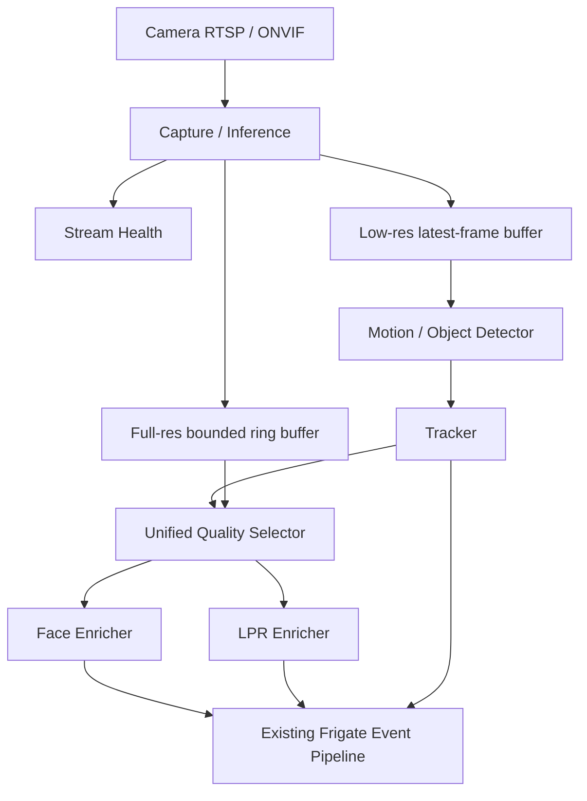
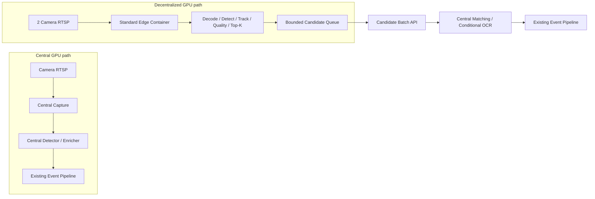

# Kiến trúc Camera AI B2B

Ngày cập nhật: 09/08/2026

## 1. Mục tiêu

Tài liệu này định nghĩa cách tối ưu pipeline Computer Vision từ runtime pilot hai camera
lên central GPU nhiều camera và cụm Jetson edge hai camera/node.

Mục tiêu kinh doanh ưu tiên là **Gate Intelligence cho nhà máy, kho vận, depot và
bãi xe đang có camera RTSP nhiều hãng**. Sản phẩm không cạnh tranh trực diện với
camera ANPR/face chuyên dụng bằng một model đơn lẻ; lợi thế chính là:

- Không bắt buộc thay toàn bộ camera hiện có.
- Dữ liệu và inference chạy on-premise.
- Kết quả nhận diện giữ đúng frame, bbox và evidence.
- Tích hợp được barrier, ERP, WMS, visitor management và hệ thống bảo vệ.
- Không khóa vào firmware hoặc cloud của một hãng camera.

## 2. Baseline hiện tại

Các thành phần đã có và được giữ làm nền tảng:

- Frigate đã sở hữu capture, detection, tracking, LPR, face recognition và Event.
- `deploy/config.yaml` là cấu hình runtime hiện hành.
- Hai pipeline đang chạy là `car_camera` cho LPR và `face_camera` cho face recognition.

Tối ưu được thực hiện trực tiếp trong pipeline Frigate hiện có.

Trạng thái vận hành ngày 07/08/2026:

| Camera | Pipeline | Processing |
| --- | --- | --- |
| `car_camera` | Car detection + native LPR | Bật |
| `face_camera` | Person detection + face recognition | Bật |

### 2.1 Readiness snapshot ngày 08/08/2026

Các bằng chứng hiện có được phân loại như sau; `pass` unit test hoặc stream health không
được nâng thành production acceptance:

| Hạng mục | Bằng chứng hiện có | Trạng thái kiến trúc |
| --- | --- | --- |
| Hai-camera stream health | Replay giữ camera/process FPS ổn định | Diagnostic pass; không phải passage recognition acceptance |
| LPR hai camera | Baseline passage recall 60%; Phase 2 đã tăng lên 100% trên fixture replay | Passage bottleneck Phase 2 đã đạt; recognition tiếp tục được cải thiện |
| Face sáu/bảy camera | Các report gần nhất `accepted=false`, enrichment latency/pending vượt gate | Không có approved capacity sáu/bảy camera |
| Distributed edge | Chưa có edge runtime/candidate ingress | Chưa benchmark hai camera trên Jetson |

## 3. Khoảng trống cần giải quyết

| Khoảng trống | Hệ quả hiện tại | Trạng thái đích |
| --- | --- | --- |
| Camera chỉ được mô tả bằng stream/FPS | Không biết input có đủ chất lượng để cam kết hay không | Mỗi camera có quality threshold đã benchmark |
| Detect và evidence dùng chung luồng thấp | Mất pixel biển số/khuôn mặt | Detect stream thấp, evidence stream full-resolution |
| Face và LPR tự chọn candidate riêng | Tiêu chí chất lượng không nhất quán | Một `QualitySelector` dùng chung |
| Quan sát chủ yếu bằng FPS/inference | Không biết bỏ sót bao nhiêu passage | SLA theo passage và end-to-end funnel |
| Central chỉ ingest camera trực tiếp | Không tận dụng GPU gần camera | Edge gửi top-K candidate về central thay vì central decode lại RTSP |
| Chưa có capacity theo hardware | Có thể nhận quá nhiều camera | Giới hạn camera theo benchmark central/Jetson |
| Detect, face và LPR cùng tranh chấp compute | LPR/OCR tạo burst CPU/GPU và giảm mật độ kênh | Cascade có budget, queue bounded và early-stop theo passage |

## 4. Nguyên tắc kiến trúc

1. Chất lượng camera input là contract có thể đo.
2. Candidate giữ đúng frame và bbox đã dùng để nhận diện.
3. Pipeline dùng latest-frame/top-K; candidate stale được drop khi quá tải.
4. Face/LPR có attempt budget, dedupe và early-stop theo passage.
5. `central_full` và `edge_frontend` dùng cùng quality/recognition contract.
6. Mỗi camera chỉ chạy production ở một `pipeline_mode`.
7. Central không tải lại RTSP của camera đã giao cho edge.
8. Số camera tối đa phải được benchmark trên đúng hardware và workload.

### 4.1 Phạm vi đơn giản hóa cho phiên bản đầu

V1 gồm một central Frigate runtime và một edge image chuẩn. Mỗi Jetson phục vụ hai camera
theo topology `edge_frontend`. Mỗi camera dùng detect stream thấp và một high-resolution
stream dùng chung cho evidence/record khi có thể.

## 5. Kiến trúc đích



V1 dùng một central runtime và một edge image chuẩn; camera profile, model và resource
budget nằm trong config của từng node.

### 5.1 Topology hybrid central GPU và decentralized GPU

Nền tảng hỗ trợ hai đường xử lý cố định:

- **`central_full`:** central kéo RTSP và chạy toàn bộ pipeline.
- **`edge_frontend`:** Jetson gần camera chạy decode, detect, track, quality và top-K;
  central chỉ nhận candidate để matching hoặc OCR có điều kiện.



Hai topology dùng cùng candidate fields, quality gate và recognition threshold để kết
quả không phụ thuộc nơi chạy decode/detect.

Một deployment có thể trộn camera theo assignment rõ ràng:

```yaml
camera_execution:
  gate_lpr_01:
    pipeline_mode: edge_frontend
    edge_node: edge-gate-01
    pipeline_profile: gate_lpr_v1
  lobby_face_01:
    pipeline_mode: central_full
    pipeline_profile: face_chokepoint_v1
  lobby_face_02:
    pipeline_mode: edge_frontend
    edge_node: edge-lobby-01
    pipeline_profile: face_chokepoint_v1
```

Không có scheduler chia stage tùy ý. Mỗi camera chỉ chọn một trong hai topology đã định
nghĩa; ownership của từng bước được cố định bởi `pipeline_mode`.

### 5.2 Phân công compute cho cụm Jetson

Vai trò mặc định của edge GPU:

```text
Hardware decode
→ human/vehicle detection
→ tracking
→ quality scoring
→ top-K evidence
→ tùy profile và headroom: face embedding hoặc plate detection
→ bounded candidate upload queue
```

Vai trò mặc định của central GPU:

```text
Camera `central_full`: decode + toàn bộ cascade
Candidate từ edge: face identity matching hoặc conditional OCR
→ Frigate Event output hiện có
```

Face library, identity mapping và OCR policy ở central. Edge có thể tạo face
embedding bằng model đã pin nhưng không giữ danh sách nhân sự; với LPR, edge gửi top-K
plate crop/evidence để central OCR có điều kiện. Cách chia cố định này giữ edge image
giống nhau giữa các site và giảm dữ liệu nghiệp vụ phải phân phối xuống Jetson.

Central không tải lại RTSP của camera đã assign cho edge vì sẽ nhân đôi bandwidth và
decode cost. Việc đổi camera sang `central_full` là thay đổi config có chủ đích và chỉ
thực hiện khi central còn capacity đã benchmark.

Capacity planning ban đầu cho Orin Nano Super 8 GB dùng **2 camera/node**. Kịch bản
20 face + 2 LPR vì vậy dùng 11 Jetson; chỉ giảm số node khi benchmark nhiều hơn hai
camera trên đúng hardware và workload vẫn đạt passage SLA, nhiệt độ và stability gate
bằng test nhiều chu kỳ cô đọng dưới 120 giây.

### 5.3 Edge Ingress API

V1 chỉ cần một endpoint `POST /api/v1/edge/candidates:batch`. Mỗi batch bounded chứa
metadata và JPEG crop của top-K candidate, không gửi video hoặc mọi frame về central.
Candidate tối thiểu gồm camera, track, timestamp, object/detail bbox, quality score và
model version.

Network client chạy ngoài inference worker. Queue upload có giới hạn; khi đầy thay
candidate cũ bằng candidate mới có quality cao hơn cho cùng track.

## 6. Quality contract theo camera

Mỗi camera khai báo trực tiếp các ngưỡng mà `QualitySelector` sử dụng. Các giá trị dưới
đây chỉ là điểm bắt đầu và phải được chốt bằng ground-truth replay trên camera/hardware
thật.

```yaml
camera_quality:
  gate_lpr_01:
    task: lpr
    min_detail_width_px: 140
    max_yaw_deg: 25
    evidence: {width: 2560, height: 1440, fps: 20}

  lobby_face_01:
    task: face
    min_detail_width_px: 96
    max_yaw_deg: 35
    evidence: {width: 1920, height: 1080, fps: 15}
```

Selector ghi lý do reject để biết cần chỉnh camera, threshold hay model; không tự đổi
stream/model khi quality thấp.

## 7. Tách detect stream và evidence stream

Mỗi camera có tối đa ba vai trò độc lập:

| Stream | Mục đích | Đặc tính |
| --- | --- | --- |
| Detect | Motion/object/tracker | Resolution thấp, latest-frame, cho phép drop stale |
| Evidence | Best shot, LPR, face | Full-resolution, FPS theo profile, ring buffer bounded |
| Record | Playback/forensics | Bitrate và retention tối ưu cho lưu trữ |

“Tối đa ba vai trò” không có nghĩa phải mở ba RTSP session/decoder. V1 ưu tiên hai
input: detect stream thấp và một high-resolution stream dùng chung cho evidence/record
nếu codec, FPS, GOP và retention path đáp ứng cả hai contract. Chỉ tách evidence khỏi
record thành decoder riêng khi benchmark chỉ ra seek latency, GOP hoặc recording load
làm vi phạm evidence SLA.

`EvidenceRingBuffer` giữ frame trong một cửa sổ ngắn, ví dụ 3–10 giây. Buffer phải:

- Bounded theo byte và thời gian.
- Cho phép lấy high-resolution frame gần timestamp của track.
- Copy crop/frame đã được chọn ra khỏi ring buffer trước khi frame hết hạn.
- Ghi đè frame cũ; không tăng bộ nhớ theo thời gian.

Không ghi toàn bộ ring buffer vào database hoặc disk.

## 8. Frame reference tối thiểu

Candidate chỉ cần đủ thông tin để recognition dùng đúng ảnh đã được chấm quality:

```text
camera_id + track_id + frame_timestamp + frame_ref + object/detail bbox
```

Không tạo time model hoặc clock-drift subsystem riêng. Với local pipeline, `frame_ref`
trỏ trực tiếp tới frame/crop trong bounded buffer. Với edge, crop được gửi cùng candidate.

## 9. Unified Quality Selector

Face và LPR sử dụng chung contract candidate:

```python
EvidenceCandidate(
    candidate_id,
    camera_id,
    track_id,
    frame_time,
    frame_ref,
    object_box,
    detail_box,
    quality_score,
    quality_reasons,
)
```

Quality score gồm các thành phần có thể giải thích:

| Metric | LPR | Face |
| --- | --- | --- |
| Pixel density | Plate width/height | Face width/height |
| Blur | Laplacian/motion blur | Laplacian/motion blur |
| Exposure | Plate clipping | Face clipping/shadow |
| Pose | Plate perspective | Yaw/pitch/roll |
| Occlusion | Plate coverage | Eyes/nose/mouth visibility |
| Detector score | Plate/object | Face/person |
| Temporal stability | Track continuity | Track continuity |

Selector giữ top-K candidate bounded cho mỗi track. Recognition chỉ nhận candidate đạt
minimum quality; metric ghi lý do reject như `plate_width_below_minimum`, blur hoặc pose.

## 10. Recognition và multi-frame consensus

Face và LPR nhận `EvidenceCandidate` từ selector rồi cập nhật Event theo flow Frigate
hiện có.

LPR consensus gom nhiều OCR variant theo cùng physical track và evidence lineage. Kết
quả representative phải giữ reference tới candidate đã tạo ra nó; không được dùng
plate của candidate cũ với bbox/frame mới.

Face consensus giữ vote theo continuous person track. Track discontinuity xóa vote cũ.
Chỉ identity đã qua threshold và quality gate mới phát face observation; `unknown` là
kết quả phân loại, không phải identity để gắn vào Event.

### 10.1 Vòng đời recognition và điều kiện dừng

Mỗi task `face` hoặc `lpr` giữ một trạng thái nhỏ theo physical track/passage:

- `SEARCHING`: còn nhận candidate tốt hơn và còn attempt budget.
- `ACCEPTED`: đã đạt quality, confidence/format và consensus contract.
- `EXHAUSTED`: đã hết candidate, attempt hoặc passage budget mà chưa đạt contract.

`ACCEPTED` và `EXHAUSTED` là trạng thái kết thúc của **recognition**, không phải trạng
thái kết thúc của **Event**. Khi recognition vào một trong hai trạng thái này, pipeline
dừng face detection/embedding hoặc plate detection/OCR cho track tương ứng, bỏ các job
chưa chạy của track khỏi enrichment queue và chỉ giữ result/evidence cuối cùng cần cho
Event. State được tạo lại khi có track mới hoặc stream epoch mới.

Event vẫn tiếp tục tracking giá rẻ cho tới passage boundary hiện có của tracker/zone.
Nhận diện thành công không được phát `event_ended`, vì làm vậy có thể tách cùng một đối
tượng thành nhiều Event và làm sai thời gian hiện diện, hướng đi hoặc exit zone.

## 11. Capacity và overload control

### 11.1 Baseline compute hiện tại

Snapshot runtime ngày 2026-08-08 được đo trên HP Victus, Ryzen 5 5600H, RTX 3050
Laptop 4 GB, với hai camera 1280 × 720 và detect 5 FPS/camera. Cấu hình dùng YOLO
320 × 320 trên GPU, face model `large`, native plate detector và OCR.

| Stage | Thời gian trung bình/lần | Tần suất tại snapshot | Kết luận |
| --- | ---: | ---: | --- |
| Object detection người/xe | 9,20–9,75 ms | Chạy nền trên cả hai camera | Rẻ nhất mỗi lần nhưng tăng tuyến tính theo số camera/FPS |
| Plate detection | 23,06–25,72 ms | 4,3–5,5 lần/s | Chỉ là bước định vị trước OCR |
| Face recognition | 48,58–55,40 ms | 0,5 lần/s | Đắt mỗi candidate nhưng tải tổng thấp khi ít người |
| Plate OCR | 54,25–63,76 ms | 1,9–2,6 lần/s | Đắt nhất mỗi lần inference |

Trong các snapshot cùng phiên, `car_camera` dùng khoảng 42% CPU process, `face_camera`
khoảng 8%, embeddings/enrichment process khoảng 60–68%, GPU khoảng 33–34%, VRAM khoảng
44,6% và CPU toàn hệ thống Frigate khoảng 17,8–19,3%. Các tỷ lệ process không được cộng
trực tiếp thành tổng CPU hệ thống.

SQLite runtime có 139 passage xe kết thúc với duration trung vị 3,4 giây và 61 passage
người với duration trung vị 3,6 giây. Với nhịp snapshot cao nhất, một passage xe có thể
kích hoạt xấp xỉ 8–9 lần OCR, còn một passage người xấp xỉ 1,8 lần face recognition.
Đây là cơ sở cho projection, không phải phép đo attempts gắn chính xác theo từng passage.

Kết luận kiến trúc:

1. Native LPR là pipeline enrichment nặng nhất vì một passage phải qua object detect,
   tracking, plate detect, quality processing, OCR và multi-frame consensus.
2. Face recognition đứng sau LPR về tải hiện tại. Face model vẫn đắt trên mỗi candidate,
   nhưng quality gate làm nó chạy ít hơn.
3. Object detection là chi phí nền quyết định số camera tối đa: inference đơn lẻ nhẹ
   nhất nhưng phải chạy liên tục trên mọi luồng.
4. Không được dùng snapshot này để tuyên bố capacity 4/8 camera. Nó chưa phải benchmark
   passage có ground truth, burst đồng thời hoặc repeated-cycle stability test.

### 11.2 Cascade và compute budget đích

Pipeline không chạy face/plate/OCR trên mọi frame. Mỗi camera đi qua cascade bounded:

```text
Hardware decode
→ object detect 3–5 FPS
→ tracker + zone trigger
→ QualitySelector trên ROI
→ top-K face/plate candidate theo passage
→ embedding/OCR
→ consensus đủ tin cậy thì early-stop
→ cập nhật Event theo flow Frigate hiện có
```

Các cải thiện bắt buộc:

- Queue enrichment phải bounded và giới hạn số inference chạy đồng thời theo task.
- Candidate cũ được thay bằng candidate tốt hơn theo `track_id + evidence_id`; không
  OCR/embed lại cùng candidate hash.
- Plate detection và face detection chỉ chạy trên ROI phù hợp, không chạy lại full
  frame nếu object/track contract đã có.
- OCR/embedding dừng sớm khi recognition đạt `ACCEPTED` hoặc `EXHAUSTED`; giới hạn số
  attempt trên mỗi passage và không kết thúc Event chỉ vì đã nhận diện xong.
- Ưu tiên latest-frame và drop candidate stale chưa chạy khi quá tải.
- Đo calls/s, P95 latency và queue age/depth cho detect, LPR và face cùng CPU, GPU, VRAM
  và compute-time trên mỗi passage.

### 11.3 OCR confidence-gated retry

LPR mặc định chỉ OCR candidate tốt nhất một lần. Pipeline chỉ tiêu thêm compute khi kết
quả đầu tiên không đủ tin cậy hoặc vi phạm quality/format contract:

```text
Chọn top-1 candidate chưa OCR
→ OCR lần đầu
  ├─ probability ≥ 70%, format hợp lệ, quality đạt → commit và early-stop
  └─ probability < 70% hoặc validation fail
       → OCR top-2 khác candidate hash
         ├─ đạt contract → commit và early-stop
         └─ chưa đạt → thử top-3 hoặc insufficient_quality
```

Policy tham chiếu:

```yaml
lpr_recognition_policy:
  retry_below_probability: 0.70
  max_attempts_per_passage: 3
  require_quality_contract: true
  require_plate_format_validation: true
  dedupe_by_candidate_hash: true
  early_stop_on_accept: true
```

`0.70` là xác suất đã calibration trên passage có ground truth, không phải raw score mặc
định của OCR engine. Benchmark report phải ghi model, calibration artifact và threshold.
Nếu calibration chưa được phê duyệt, pipeline không được diễn giải raw score thành xác
suất chắc chắn 70%.

Retry phải dùng candidate độc lập có chất lượng kế tiếp; không OCR lại cùng crop hoặc
các frame gần như trùng nhau. Confidence cao cũng không được commit khi crop bị cắt mép,
cháy sáng, không đạt kích thước tối thiểu hoặc kết quả sai format biển số. Sau
`max_attempts_per_passage`, pipeline trả `insufficient_quality`; không fallback sang kết
quả dưới ngưỡng và không tiếp tục OCR vô hạn.

Metric bắt buộc gồm `ocr_attempts_per_passage`, tỷ lệ commit ở attempt 1/2/3,
calibration error theo confidence bucket, early-stop rate, insufficient-quality rate và
recognition precision/recall. Mục tiêu tối ưu là phần lớn passage tốt commit ở attempt 1,
không phải ép mọi passage chỉ được OCR đúng một lần.

### 11.4 Face confidence-gated retry

Face recognition dùng cùng nguyên tắc best-shot first: theo dõi person/face để tìm
candidate tốt, nhưng chỉ chạy embedding và database matching trên top-1 trước. Candidate
tiếp theo chỉ tiêu compute khi kết quả chưa đủ chắc chắn:

```text
Chọn top-1 face candidate chưa embed
→ embedding + match database
  ├─ top1 probability ≥ 90%, margin ≥ 10%, quality đạt
  │    → commit identity và early-stop
  └─ probability/margin/quality chưa đạt
       → thử top-2 khác candidate hash
         ├─ đạt contract hoặc đủ consensus → commit và early-stop
         └─ hết attempt → unknown / ambiguous_identity / insufficient_quality
```

Policy tham chiếu:

```yaml
face_recognition_policy:
  accept_probability: 0.90
  min_top1_top2_margin: 0.10
  max_attempts_per_track: 3
  consensus_when_ambiguous: 2
  require_quality_contract: true
  dedupe_by_candidate_hash: true
  early_stop_on_accept: true
```

Face không được commit chỉ vì top-1 vượt threshold. `top1_top2_margin` ngăn trường hợp
hai identity có score gần nhau, ví dụ 91% và 90%. Probability và margin đều phải được
calibration/validation trên face dataset của đúng camera; các giá trị 90% và 10% là
policy ban đầu, chưa phải SLA cho mọi camera.

Trạng thái kết thúc phải tách rõ:

- `unknown`: có ít nhất một candidate đạt quality contract nhưng không identity nào đạt
  probability contract.
- `ambiguous_identity`: candidate đủ chất lượng nhưng top-1/top-2 quá gần hoặc các lần
  retry không đồng thuận.
- `insufficient_quality`: không candidate nào đạt kích thước, blur, exposure, pose và
  occlusion contract.

Không được biến một khuôn mặt xấu thành `unknown`, không embed lại cùng crop và không
tiếp tục retry sau `max_attempts_per_track`. Metric bắt buộc gồm
`face_attempts_per_track`, commit rate ở attempt 1/2/3, top1/top2 margin distribution,
calibration error, identity consensus rate, unknown/ambiguous/insufficient-quality rate
và compute-time trên mỗi person passage.

### 11.5 Projection lên tám camera

Projection dùng workload mix 4 camera xe + LPR và 4 camera người + face, cùng resolution
1280 × 720, detect 5 FPS và mật độ passage tương tự hai replay hiện tại. Đây là phép
ngoại suy tuyến tính để xác định rủi ro, chưa phải capacity đã được chứng minh.

Nhịp inference ước tính:

| Stage | 2 camera hiện tại | 8 camera chưa tối ưu | 8 camera với policy mới |
| --- | ---: | ---: | ---: |
| Object detect input | 10 FPS | 40 FPS | 40 FPS; không giảm ngầm |
| Plate detection | 5,5 lần/s | khoảng 22 lần/s | mục tiêu 6–11 lần/s với ROI/quality gate |
| Plate OCR | 2,6 lần/s | khoảng 10,4 lần/s | khoảng 1,4–1,8 lần/s với 1–3 attempts/passage |
| Face recognition | 0,5 lần/s | khoảng 2,0 lần/s | khoảng 1,2–1,5 lần/s với best-shot retry |

OCR confidence-gated retry dự kiến giảm riêng số lần OCR khoảng 80–87%. Face hiện đã
được gate một phần nên mức giảm recognition thận trọng hơn, khoảng 25–50%. Nếu chỉ áp
dụng conditional retry, tổng compute giảm dự kiến 15–30%; nếu thêm plate ROI cadence,
candidate dedupe, top-K và early-stop đầy đủ, tổng compute giảm khoảng 25–40% và riêng
enrichment giảm khoảng 45–70%.

Projection tải chuẩn hóa:

| Kịch bản 8 camera | GPU demand ngoại suy | CPU Frigate ngoại suy | Đánh giá |
| --- | ---: | ---: | --- |
| Giữ logic hiện tại | khoảng 132–136% | khoảng 71–77% | Không khả thi; GPU sẽ bão hòa và queue tăng |
| Chỉ conditional retry OCR + face | khoảng 92–116% | khoảng 50–65% | Vẫn thiếu headroom, không được approve |
| Full cascade | khoảng 79–102% | khoảng 43–58% | Có thể chạy workload thưa nhưng vẫn sát giới hạn |

`GPU demand` trên 100% biểu diễn lượng compute được yêu cầu so với một GPU, không phải
metric utilization có thể hiển thị vượt 100%. Khi demand vượt khả năng, hệ quả là queue
age, skipped/stale candidate và P95 latency tăng.

VRAM không giảm tỷ lệ thuận với số inference vì model vẫn resident. Ngược lại, frame,
ROI và queue tăng theo số camera; vì vậy projection không tự suy ra VRAM từ 44,6% × 4.
Acceptance tám camera yêu cầu đo peak VRAM thực và giữ queue bounded.

Kết luận provisional: confidence-gated retry là cần thiết nhưng chưa đủ để cam kết tám
camera trên RTX 3050 4 GB. Ngay cả biên tốt của full cascade còn cần thêm khoảng 15–32%
hiệu quả để đạt mục tiêu steady-state GPU ≤70%. Nguồn cải thiện tiếp theo gồm TensorRT/
FP16 cho stage phù hợp, batching có giới hạn, tránh copy CPU↔GPU và shared model instance.
Nếu 3 FPS vẫn giữ passage recall, cấu hình 3 FPS có thể dùng để tăng headroom; không tự
hạ từ 5 xuống 3 FPS khi chưa benchmark.

Acceptance tám camera tối thiểu:

- Chạy đồng thời 4 LPR + 4 face camera ít nhất 24 giờ.
- Steady GPU ≤70%, burst P95 ≤85%, VRAM peak ≤80%; không OOM hoặc model reload.
- Queue age/depth bounded và trở về baseline sau burst; không tích lũy stale candidate.
- Báo cáo passage recall/recognition không giảm so với baseline hai camera đã duyệt.
- P95 capture-to-recognition và end-to-end latency đạt SLA cho từng product profile.
- Burst đồng thời trên cả tám camera vẫn giữ queue/latency bounded; nếu không đạt thì
  giảm số camera theo capacity profile đã benchmark.

### 11.6 Capacity theo benchmark

Mỗi benchmark ghi hardware, model/config version, resolution/FPS, workload mix, số camera,
GPU/CPU/VRAM, queue P95 và passage result. Số camera tối đa của một hardware/pipeline mode
là mức cao nhất đã đạt acceptance; deployment không cấu hình vượt mức này.

Khi overload đột biến:

1. Drop stale detect/evidence candidate chưa persist.
2. Tạm ngừng enrichment ưu tiên thấp.
3. Ghi metric overload cùng số liệu queue/latency.

## 12. Passage-level SLA và observability

Đơn vị đo chính là vehicle/person passage, không phải frame.

```text
Physical passage
├── Object detected
├── Track continuous
├── Quality candidate accepted
├── Recognition committed
└── Event committed
```

Các KPI bắt buộc:

| KPI | Ý nghĩa |
| --- | --- |
| Passage detection recall | Tỷ lệ passage thật tạo event |
| Track continuity | Tỷ lệ passage không đổi nhầm ID |
| Quality acceptance | Tỷ lệ passage có evidence đạt profile |
| Recognition precision/recall | Đúng/sai theo ground truth |
| Evidence correctness | Result, bbox và frame cùng evidence |
| End-to-end latency | Capture đến recognition/Event committed |
| Degraded duration | Thời gian vi phạm camera/capacity contract |

FPS, detector inference và queue depth vẫn được thu thập nhưng chỉ là diagnostic metric.

## 13. Lộ trình triển khai

Quy ước trạng thái: `[DOING]` là phase đang triển khai; chỉ chuyển `[DONE]` khi toàn bộ
acceptance của phase có bằng chứng. Checkbox chỉ được tick khi đã chạy test/benchmark;
không tick chỉ vì code đã tồn tại.

Đây là lộ trình **triển khai kiến trúc**. Mỗi phase bên dưới phải tạo ra runtime contract,
module hoặc deployment topology được nêu rõ; unit test, replay và benchmark chỉ là bằng chứng
để đóng phase, không phải work package thay thế cho phần triển khai. Phase 1–4 đã hoàn tất;
Phase 5–8 phụ thuộc tuần tự theo sơ đồ dưới đây.

### 13.1 Ma trận truy vết thiết kế → triển khai

| Mục thiết kế | Requirement triển khai | Phase owner | Kết quả phải tồn tại |
| --- | --- | --- | --- |
| 1. Mục tiêu | On-premise central/edge, camera RTSP nhiều hãng và Event output dùng được bởi hệ thống nghiệp vụ | Phase 7–8 | Hai topology chạy được; Event/API/MQTT contract và product profile được certification |
| 2. Baseline | Giữ Frigate capture/detect/track/Face/LPR/Event làm nền tảng | Phase 1–2 | Baseline và passage remediation có artifact `[DONE]` |
| 3. Khoảng trống | Passage, quality input, evidence, compute, capacity và edge ownership có owner riêng | Phase 2–7 | Không còn gap nào chỉ xuất hiện trong tài liệu mà không có work package |
| 4. Nguyên tắc | Latest/bounded queue, lineage, lifecycle, pipeline ownership và hardware limit | Phase 3–7 | Contract được enforce trong runtime/config, không chỉ mô tả |
| 5. Kiến trúc đích | `central_full` và `edge_frontend` dùng cùng candidate/recognition contract | Phase 4, 7 | Central pipeline hoàn chỉnh trước; edge tái sử dụng đúng contract đó |
| 6. Quality contract | Camera profile và reject reasons có schema/runtime owner | Phase 4 | Config validate được và selector xuất quality/reject reason |
| 7. Detect/evidence stream | Detect latest-frame tách khỏi bounded evidence/record source | Phase 4 | Stream role, frame ownership và byte/time bound được triển khai |
| 8. Frame reference | Candidate/result/evidence giữ cùng camera, track, generation, frame và bbox | Phase 3–4, 7 | `FrameRef`/candidate contract dùng xuyên central và edge |
| 9. Unified Quality Selector | Face/LPR nhận candidate qua cùng selector contract | Phase 4 | Bounded per-track selection; không còn hai quality contract độc lập |
| 10. Recognition/consensus | Typed track state, temporal consensus, dedupe và terminal recognition lifecycle | Phase 3, 5 | LPR execution sạch trước; Face/LPR lifecycle được hoàn thiện sau selector |
| 11. Capacity/overload | Bounded work, early-stop, overload policy và hardware capacity profile | Phase 3, 5–6 | Central 2/4/8 camera có giới hạn công bố; overload không tạo backlog vô hạn |

Dependency bắt buộc:

```text
baseline/passage [DONE]
→ LPR execution foundation [DONE]
→ camera quality + evidence + shared candidate contract [DONE]
→ recognition lifecycle + compute control
→ central capacity
→ single-edge topology
→ multi-edge + production certification
```

### Phase 1 — Đo baseline hai camera [DONE]

- [x] Xây passage dataset/replay cho LPR và face.
- [x] Đo calls/s, latency, queue, GPU/CPU/VRAM và recognition theo passage trên pipeline
  hiện tại.
- [x] Xác nhận result/bbox/crop thuộc cùng candidate trước khi dùng baseline để so sánh.

Acceptance:

- [x] Có baseline lặp lại được cho một LPR camera và một face camera.
- [x] Báo cáo được passage recall, recognition precision/recall và end-to-end latency.

Bằng chứng: [summary.json](../../.tmp/platform-phase1/summary.json). Mỗi acceptance
case hoàn tất trong 58,45–60,02 giây. Face known/unknown đạt precision và recall 100%;
LPR passage detection recall baseline là 60%. Exact-match LPR là `null` vì clip 720p
không có passage nào đủ rõ để gán ký tự bằng mắt (`readable_denominator=0`); chỉ số này
được báo cáo nhưng không phải gate của Phase 1. Capture-to-recognition P95 theo physical
passage của face là 8,20 giây, trong khi gate sau khi candidate đủ điều kiện đạt first
attempt 309,1 ms và confirmed 629,5 ms.

Time budget `<120 giây` áp dụng cho unit, integration và replay acceptance dùng trong vòng
lặp phát triển. Capacity soak và production certification là job riêng có thời lượng công
bố rõ; không ép kiểm tra độ bền dài hạn vào fixture 120 giây và không dùng soak dài để chặn
vòng lặp phát triển hằng ngày.

KPI baseline cần theo dõi khi triển khai Phase 2:

| Mức ưu tiên | KPI | Baseline Phase 1 | Hướng cải thiện | Vai trò |
| --- | --- | --- | --- | --- |
| 1 | LPR passage detection recall | 60% | Tăng recall và giữ passage precision ở ngưỡng product profile | KPI chính; đang bỏ sót 40% passage ground truth |
| 1 | Face capture-to-recognition P95 theo physical passage | 8,20 giây | Giảm rõ rệt thời gian chờ candidate đủ điều kiện | KPI end-to-end chính |
| 1 | Face recognition precision/recall | 100% / 100% trên known và unknown fixture | Theo dõi regression theo ngưỡng passage phù hợp với kích thước tập thử | Quality guardrail |
| 1 | Result/candidate correlation | Face correlation đạt; LPR plate box hợp lệ | Không có identity/plate gắn nhầm bbox, crop hoặc frame | Correctness gate |
| 2 | Face first attempt / confirmed | 309,1 ms / 629,5 ms | Giữ dưới gate 750 ms / 1.500 ms và giảm nếu không mất recall | Latency sau khi candidate đủ điều kiện |
| 2 | Pending queue cuối test | 0 | Luôn trở về 0 sau burst, không tích lũy stale candidate | Capacity/stability gate |
| 2 | Enrichment calls/s | Face 1,2; OCR 2,4; plate detection 5,6 | Giảm lần gọi thừa nhưng không giảm passage recall/precision | Compute-efficiency KPI |
| 2 | GPU / VRAM / RAM | 58%; 1.272/4.096 MiB; khoảng 4/7 GiB | Tạo headroom để tăng camera, không OOM hoặc tăng dần theo thời gian | Capacity KPI |
| 3 | Camera/process FPS | Khoảng 5 FPS; process FPS tối thiểu 4,7 | Giữ camera 4,5–5,5 FPS, process ≥4,5 FPS, skipped ≤0,5 FPS | Diagnostic guardrail, không thay cho passage KPI |
| 3 | Detector inference | Tối đa 16,61 ms | Giữ dưới 200 ms | Diagnostic guardrail |
| Chưa đo được | LPR exact-match | `null`, readable denominator = 0 | Bổ sung fixture 720p có biển đọc được trước khi dùng làm quality gate | Chỉ số bắt buộc báo cáo, chưa phải gate Phase 1 |

### Phase 2 — Sửa passage bottleneck [DONE]

Phase 2 đã hoàn tất theo [summary acceptance](../../.tmp/platform-phase2/summary.json) với
`accepted=true` trong 113,406 giây. [Passage manifest](../../tools/fixtures/platform_passage_ground_truth.yaml),
[fixture builder](../../tools/prepare_passage_fixture.py) và
[acceptance entrypoint](../../tools/validate_passage_acceptance.py) dùng schema v2, composite
1280×720/15 FPS, ba replay loop đồng thời và source/config/model hash. Runtime đặt car
`min_initialized: 1`, cho phép LPR ngay khi track hợp lệ, mở rộng crop có clamp, giữ
consensus representative hiện có và đưa cadence face về 200 ms.

Mục tiêu của Phase 2 là cải thiện trực tiếp hai bottleneck đã đo ở Phase 1: LPR passage
recall 60% và face capture-to-recognition P95 8,20 giây. Phase này không xây shared
quality selector, top-K hoặc evidence buffer mới.

- [x] Xác minh trực quan timestamp/replay phase của các passage LPR bị bỏ sót, sau đó bổ
  sung passage funnel có số đếm theo từng tầng:
  `ground truth -> object detected -> track created/continued -> candidate qualified -> recognition -> Event`.
- [x] Sửa tầng làm mất passage bằng detector/ROI/zone, cadence và tham số tracker hiện có;
  giữ nguyên detector/OCR model và resolution 720p trong Phase 2.
- [x] Đo và giảm thời gian `passage -> track -> candidate qualified` bằng cadence và logic
  chọn candidate hiện có; không lấy inference latency riêng lẻ làm kết quả end-to-end.
- [x] Bổ sung fixture 720p có passage đọc được bằng mắt và `expected_plate` đã chuẩn hóa để
  đo LPR exact-match; threshold confidence chỉ được chốt sau khi calibration bằng ground truth.

Acceptance:

- [x] Mọi acceptance/replay test case của Phase 2 kết thúc trong dưới 120 giây; Phase 2
  không dùng soak dài làm điều kiện đóng phase. Capacity/release soak thuộc Phase 6–8.
- [x] LPR báo cáo đầy đủ số lượng và tỷ lệ chuyển đổi ở từng tầng passage funnel; passage
  recall cao hơn baseline 60% và passage precision đạt ngưỡng 80%. Một passage không được detector
  hoặc tracker tạo ra không được ghi nhận là lỗi OCR/consensus.
- [x] Fixture LPR readable có denominator lớn hơn 0 và báo cáo exact-match; unreadable
  passage vẫn tính vào passage recall nhưng không tính vào exact-match denominator.
- [x] Face capture-to-recognition P95 theo physical passage giảm so với baseline 8,20 giây;
  đồng thời detection recall, precision và recall đạt ngưỡng passage 80%.
- [x] Báo cáo riêng thời gian `passage -> track`, `track -> candidate qualified`, first
  attempt và confirmed; không dùng riêng inference latency để đại diện end-to-end latency.

Kết quả chốt Phase 2: LPR passage recall tăng từ 60% lên 100% trên 5 passage, không có
false passage; Face detection recall, precision và recall đều 100%; Face
passage-to-confirmed P95 là 1.676,8 ms, pending cuối test bằng 0, không restart/reconnect/
stall, RAM tối đa 4,29 GiB và SHM 14%. API và SQLite không có giá trị một phía hoặc lệch
nhau; một enrichment update không được cả hai store giữ lại được báo riêng, không bị gọi
nhầm là API–SQLite mismatch.

#### Kết quả Phase 2 theo mục tiêu ban đầu

Các chỉ số dưới đây là kết quả acceptance replay dùng để xác nhận hai bottleneck của
Phase 2 đã được khắc phục so với baseline.

| Gate/KPI | Kết quả hiện tại | Ngưỡng Phase 2 | Bằng chứng |
| --- | ---: | ---: | --- |
| Acceptance tổng | `accepted=true`, 113,406 giây | `<119` giây, mọi hard gate đạt | [summary.json](../../.tmp/platform-phase2/summary.json) |
| LPR passage recall | 100% trên 5 passage; 3/3 vòng có track cho từng passage | Recall cao hơn baseline 60%; passage precision `≥80%` | [lpr.json](../../.tmp/platform-phase2/lpr.json), [runtime trace](../../.tmp/platform-phase2/runtime-trace.json) |
| Face detection/precision/recall | 100% / 100% / 100% | Mỗi chỉ số `≥80%` theo physical passage | [face.json](../../.tmp/platform-phase2/face.json) |
| Face passage-to-confirmed P95 | 1.676,8 ms | `<3.000` ms và thấp hơn baseline 8,20 giây | [face.json](../../.tmp/platform-phase2/face.json) |
| Face eligible-to-confirmed / first-attempt / embedding P95 | 621,6 / 147,3 / 44,9 ms | `≤1.500` / `≤750` / `≤200` ms | [face.json](../../.tmp/platform-phase2/face.json) |
| Runtime | pending 0; restart 0; RAM 4,29 GiB; SHM 14%; không reconnect/stall | pending 0; RAM `≤7 GiB`; SHM `<70%`; runtime ổn định | [summary.json](../../.tmp/platform-phase2/summary.json) |

#### Hạn chế hiện tại

| Hạn chế | Hiện trạng và ảnh hưởng | Hướng xử lý | Bằng chứng |
| --- | --- | --- | --- |
| Chất lượng LPR recognition chưa ổn định | Exact-match đạt 1/3 passage có biển đọc được; `lpr-01` và `lpr-02` chưa tạo kết quả OCR hợp lệ. Hệ thống đã bắt được passage nhưng chưa đọc tin cậy mọi biển trong tập thử. | Phase 3 sửa execution architecture và temporal decision hiện có. Nếu raw OCR không có thông tin hữu ích thì dừng ở ranh giới model, không tiếp tục vá pipeline. | [lpr.json](../../.tmp/platform-phase2/lpr.json), [evidence lpr-01](../../.tmp/platform-phase2/mismatches/lpr-01.jpg), [evidence lpr-02](../../.tmp/platform-phase2/mismatches/lpr-02.jpg) |
| Dữ liệu acceptance còn nhỏ | Kết quả hiện tại đủ xác nhận regression của Phase 2 nhưng chưa đủ để công bố accuracy tổng quát cho nhiều người, biển số và điều kiện hình ảnh. | Đây là đầu vào cho fine-tune/certification sau này, không phải work package triển khai của Phase 3. | [manifest](../../tools/fixtures/platform_passage_ground_truth.yaml) |
| Chưa đo capacity và điều kiện triển khai rộng hơn | Acceptance mới chạy đồng thời một camera Face và một camera LPR trên replay 720p; chưa có kết quả 4/8 camera hoặc nhiều điều kiện lắp đặt. | Đo central capacity ở Phase 6 và thực hiện certification theo product/site profile ở Phase 8. | [summary.json](../../.tmp/platform-phase2/summary.json) |

### Phase 3 — LPR execution foundation [DONE]

**Owner thiết kế:** mục 4, 8, 10 và phần LPR của mục 11. Phase này sửa execution path hiện
có trước khi thêm quality/evidence source mới. Không đổi model, resolution hoặc Face logic.

Luồng triển khai:

```text
object update
→ bounded latest-per-track worker
→ plate detector/OCR
→ PlateObservation
→ PlateTrackState
→ optional PlateCommit
→ worker persist evidence
→ maintainer publish Event
```

- [x] Tạo typed `LprTrackKey(camera, track_id, generation)`, `PlateObservation`,
  `PlateTrackState` và `PlateCommit`; history bounded và dedupe theo frame reference.
- [x] Tách detector/OCR, temporal state reducer và Event side effect khỏi `lpr_process()`.
- [x] Chuyển LPR sang latest-per-track worker; candidate cũ bị replace/drop theo capacity/TTL,
  expire và generation mới vô hiệu toàn bộ stale work.
- [x] Chỉ encode evidence và stage commit khi decision mới hoặc mạnh hơn; maintainer chỉ
  publish một revision idempotent sang Event/API/SQLite.
- [x] Đưa observation hợp lệ vào temporal history trước commit threshold; consensus dùng
  unique-frame support, character confidence và text area. Nếu raw OCR không có thông tin
  hữu ích thì dừng ở model boundary, không thêm heuristic.
- [x] Xuất pending, replaced, capacity/TTL drops, stale-generation drops, candidate age và
  worker latency trong stats runtime.

Hoàn thành khi LPR inference/I/O không block maintainer, queue luôn bounded, stale generation
không publish được, một decision chỉ tạo một commit và regression replay giữ passage/Face KPI
trong ngưỡng Phase 2.

#### Kết quả Phase 3 so với cuối Phase 2

Acceptance cuối chạy trên image `camera-frigate:overlay-0c53e795ecdc`, hoàn tất trong
110,492 giây với `accepted=true`. Manifest passage và model hash giữ nguyên so với Phase 2;
generated config hash khác nên đây là regression comparison cùng fixture/model, không phải A/B
bit-identical tuyệt đối.

| Gate/KPI | Cuối Phase 2 | Cuối Phase 3 | Kết luận |
| --- | ---: | ---: | --- |
| Acceptance tổng | `accepted=true`, 113,406 giây | `accepted=true`, 110,492 giây | Giữ toàn bộ hard gate, nhanh hơn 2,914 giây |
| LPR passage recall | 100% | 100% | Không regression passage |
| LPR passage precision | Chưa có field trong schema cũ | 100% | Không có false passage |
| LPR exact-match | 33,3% trên denominator 3 | 33,3% trên denominator 3 | Execution refactor không cải thiện OCR/model boundary |
| LPR consistency tối thiểu | 33,3% | 33,3% | Aggregate guardrail giữ nguyên |
| Face detection/precision/recall | 100% / 100% / 100% | 100% / 100% / 100% | Không regression Face runtime |
| Face passage-to-confirmed P95 | 1.676,8 ms | 1.595,6 ms | Cải thiện 81,2 ms |
| Pending / restart / bad log | 0 / 0 / 0 | 0 / 0 / 0 | Không backlog, restart hoặc stall |
| API–SQLite / correlation mismatch | 0 / 0 | 0 / 0 | Giữ external Event contract |
| RAM tối đa / SHM | 4.602.057.457 byte / 14% | 4.598.836.232 byte / 14% | Không tăng tài nguyên đáng kể |

Chi tiết LPR cho thấy quality residual vẫn thuộc model/input boundary: `lpr-01` và `lpr-02`
tiếp tục có passage/track nhưng không tạo OCR hữu ích; `lpr-06` vẫn exact-match `BEE3975`
nhưng consistency giảm từ 87,5% xuống 75%; `lpr-07` giữ consistency 100% nhưng representative
đổi từ `FKH9211` thành `FKH921` và recognized rounds giảm từ 2 xuống 1. Vì aggregate passage,
exact-match và stability gate không giảm, Phase 3 dừng đúng ở execution architecture, không vá
threshold hoặc thêm QualitySelector/evidence buffer thuộc Phase 4.

Bằng chứng triển khai: 24/24 test LPR/deferred/maintainer/stats đạt; fake inference chậm xác
nhận `process_frame()` không chờ inference; queue/state/control đều bounded; expire chặn stale
in-flight result. Acceptance cuối có pending 0, restart 0, không reconnect/stall và runtime sau
restore healthy. Hai unit assertion Face riêng còn lỗi ở fixture `transaction_id` và kỳ vọng
frame 100.5; các đường code đó không nằm trong diff Phase 3 và Face runtime acceptance vẫn đạt.
Summary acceptance hiện chưa lưu camera `skipped` thành một field so sánh Phase 2/3; gate này
chỉ có bằng chứng gián tiếp từ pending 0, không stall và passage recall giữ 100%, không được coi
là phép đo trực tiếp `skipped`.

Bằng chứng: [Phase 2 summary](../../.tmp/platform-phase2/summary.json),
[Phase 3 summary](../../.tmp/platform-passage/summary.json),
[Phase 3 LPR result](../../.tmp/platform-passage/lpr.json),
[Phase 3 runtime trace](../../.tmp/platform-passage/runtime-trace.json).

### Phase 4 — Camera quality, evidence và shared candidate contract [DONE]

**Owner thiết kế:** mục 3–9. Đây là phase triển khai các thành phần đang có trong kiến trúc
đích nhưng trước đây không có owner.

- [x] Khai báo quality config theo camera, `FrameRef`, `EvidenceLease` và
  `EvidenceCandidate` dùng chung cho Face/LPR;
  schema gồm camera/track/generation/frame, object/detail bbox, source role, quality và reject
  reasons.
- [x] Map rõ `detect`, `evidence` và `record` role. Phase 4 chỉ cho phép `detect`; config
  `evidence`/`record` fail rõ vì chưa có high-resolution adapter và không mở decoder thứ ba.
- [x] Tạo `EvidenceRingBuffer` bounded theo byte và thời gian; frame hết hạn bị ghi đè, candidate
  được chọn phải sở hữu crop/reference trước expiry.
- [x] Triển khai `QualitySelector` nhận profile theo camera, chấm pixel density, blur, exposure,
  pose/occlusion khi metric có sẵn và giữ bounded top-K theo physical track.
- [x] Thay adapter chọn candidate riêng của Face/LPR bằng `EvidenceCandidate`; recognition không
  đọc lại frame khác với frame đã được selector chọn.
- [x] Reject reason và quality metrics đi vào passage observability; selector không tự đổi
  model/resolution khi input không đạt profile.

Hoàn thành khi cùng một candidate contract chạy được cho Face và LPR ở `central_full`, memory
bounded theo cấu hình, result/evidence giữ đúng lineage và không còn quality path riêng biệt.

#### Kết quả triển khai và acceptance Phase 4

Image Phase 4 `camera-frigate:overlay-7c31cfa85448` đã build thành công. Bộ test tập trung trong
image đạt 40/40 cho evidence, quality, LPR deferred/state/association, Face candidate và snapshot;
19/19 test validator trên host đạt. Compile, Ruff cho module mới và `git diff --check` đều đạt.

Acceptance Phase 4 sau khi sửa gate FPS hoàn tất trong 109,666 giây với `accepted=true`. Gate
`skipped_fps` dùng regression budget theo control thay cho ngưỡng tuyệt đối không có trong
baseline: mỗi camera không được tăng quá 0,1 FPS. Control Phase 3 đã ở mức 3,3/3,9; Phase 4 đạt
3,4/3,2 nên không regression. Giá trị tuyệt đối vẫn được lưu làm diagnostic và backlog capacity,
nhưng không bắt Phase 4 sửa vấn đề detect throughput tồn tại từ baseline.

| Gate/KPI | Control Phase 3 | Phase 4 | Kết luận |
| --- | ---: | ---: | --- |
| Acceptance tổng | Control baseline | `accepted=true`, 109,666 giây | Đạt toàn bộ hard gate Phase 4 |
| LPR recall / precision / exact-match | 100% / 100% / 33,3% | 100% / 100% / 33,3% | Không regression recognition |
| Face detection / precision / recall | 100% / 100% / 100% | 80% / 100% / 80% | Đạt gate Phase 3 tối thiểu 80% |
| Pending / restart / reconnect-stall | 0 / 0 / 0 | 0 / 0 / 0 | Đạt |
| API-SQLite / correlation-lineage mismatch | Phase 3 chưa có candidate lineage | 0 / 0 | Shared candidate lineage đạt |
| `skipped_fps` face / car | 3,3 / 3,9 | 3,4 / 3,2 | Đạt regression budget tối đa +0,1 mỗi camera |
| Evidence tối đa face / car | 0 / 0 | 16.588.800 / 20.736.000 byte | Dưới 32 MiB mỗi camera |
| RAM tối đa | 4.603.131.199 byte | 4.655.744.548 byte | Tăng 52.613.349 byte, dưới budget tăng 128 MiB và tổng dưới 7 GiB |

Phase 4 vì vậy được đóng `[DONE]`. Việc giảm `skipped_fps` tuyệt đối được chuyển thành backlog
capacity riêng; validator vẫn fail nếu Phase 4 làm bất kỳ camera nào tăng quá 0,1 FPS so với
control. Acceptance đã restore runtime config và image trước khi kết thúc.

Bằng chứng: [Phase 3 control summary](../../.tmp/platform-phase4-control/summary.json),
[Phase 4 summary](../../.tmp/platform-phase4/summary.json),
[Phase 4 Face result](../../.tmp/platform-phase4/face.json),
[Phase 4 LPR result](../../.tmp/platform-phase4/lpr.json),
[Phase 4 runtime trace](../../.tmp/platform-phase4/runtime-trace.json).

### Phase 5 — Recognition lifecycle và compute control

**Owner thiết kế:** mục 10, 10.1 và 11.2–11.4. Phase này dùng selector/candidate contract của
Phase 4; không tạo pipeline thứ hai.

- [ ] Chuẩn hóa recognition state `SEARCHING/ACCEPTED/EXHAUSTED` theo track; terminal state chỉ
  dừng enrichment, không kết thúc Frigate Event.
- [ ] Dedupe bằng candidate/frame identity, đặt attempt budget và bỏ pending job của track khi
  recognition terminal.
- [ ] LPR chạy confidence/format-gated retry trên các candidate độc lập đã xếp hạng; không OCR
  lại cùng crop. `PlateTrackState` Phase 3 là implementation LPR của lifecycle này.
- [ ] Face dùng best-shot first và chỉ retry candidate khác khi kết quả chưa đạt policy; tái sử
  dụng bounded face worker/generation hiện có thay vì viết lại pipeline.
- [ ] Config policy chỉ lưu threshold đã calibration cho product profile; raw model score không
  được gọi là probability khi chưa calibration.
- [ ] Xuất attempts/track, early-stop, terminal reason, compute/passage và queue age/depth.

Hoàn thành khi Face/LPR đều dừng work đúng lifecycle, không xử lý lại candidate, Event ownership
không đổi và compute/passage giảm hoặc giữ nguyên mà không gây regression passage-level đáng kể.

### Phase 6 — Central capacity và overload control

**Owner thiết kế:** mục 11.5–11.6 và central path của mục 5.

- [ ] Đóng băng workload contract sau Phase 5 rồi benchmark central 2/4/8 camera trên đúng
  hardware, model, resolution/FPS và passage mix.
- [ ] Triển khai overload policy: drop stale chưa persist, thay candidate cùng track, tạm dừng
  enrichment ưu tiên thấp và không drop committed Event/evidence.
- [ ] Chỉ giữ batching/FP16/TensorRT/shared-model hoặc copy optimization khi benchmark chứng
  minh giảm compute/latency mà không giảm passage/recognition KPI.
- [ ] Xuất capacity profile gồm camera count, GPU/CPU/VRAM/RAM/SHM, queue age/depth, calls/s,
  latency và source/config/model hash; deployment validate không vượt profile đã duyệt.

Hoàn thành khi quick benchmark 2/4/8 có case độc lập dưới 120 giây, mức camera cao nhất đạt gate
được công bố và candidate production profile hoàn tất soak 24 giờ không tích lũy queue/memory.

### Phase 7 — Edge ingress và một Jetson/hai camera

**Owner thiết kế:** mục 4.5–4.7 và 5.1–5.3.

- [ ] Thêm `pipeline_mode`/edge assignment với ownership duy nhất; central không mở RTSP cho
  camera đang chạy `edge_frontend`.
- [ ] Đóng gói standard edge container chạy decode/detect/track/QualitySelector và bounded
  candidate queue theo đúng contract Phase 4.
- [ ] Tạo bounded batch ingress API; network client nằm ngoài inference worker, retry có giới
  hạn và candidate mới/tốt hơn thay candidate cũ cùng track.
- [ ] Central chỉ thực hiện matching/conditional OCR và cập nhật Event; model/config version
  cùng evidence lineage đi xuyên request.

Hoàn thành khi một Jetson chạy hai camera thật, bandwidth thấp hơn central RTSP ingest, network
failure không block inference và `edge_frontend` giữ passage/result contract của `central_full`.

### Phase 8 — Multi-edge, product profile và production integration

**Owner thiết kế:** mục 1, topology mục 5 và acceptance sản phẩm.

- [ ] Mở rộng nhiều Jetson theo giới hạn hai camera/node; mỗi camera chỉ có một runtime owner
  và node disconnect/rejoin không tạo duplicate Event.
- [ ] Đóng gói product profile cho gate LPR/face gồm camera requirements, model/config hash,
  capacity, SLA và degraded behavior; camera RTSP nhiều hãng được certification theo profile.
- [ ] Công bố Event/API/MQTT integration contract cho barrier, ERP/WMS, visitor management và
  bảo vệ; adapter đặc thù chỉ được thêm khi có product scope, không nhúng vào recognition worker.
- [ ] Chạy production certification ngày/đêm và failure/recovery trên topology thực; lưu artifact
  theo site/profile thay vì công bố một accuracy chung.

Hoàn thành khi multi-node không duplicate ownership, passage SLA/capacity/degraded behavior được
chứng minh và ít nhất một integration flow nghiệp vụ hoàn tất end-to-end trên profile đã duyệt.

## 14. Acceptance tổng thể

Acceptance không thay implementation plan và không dùng một con số accuracy chung cho mọi
camera. Mỗi phase chỉ đóng khi runtime behavior do phase sở hữu đã tồn tại và có artifact.

| Loại gate | Quy tắc |
| --- | --- |
| CV quality | Passage recall/precision, recognition precision/recall và latency đạt product profile trên denominator công bố; không mặc định 100% |
| Data correctness | Không gắn plate/identity sang physical passage khác; commit, frame reference, bbox và evidence cùng generation |
| Runtime correctness | Queue/memory bounded, không stale result, duplicate owner hoặc duplicate commit; failure có degraded behavior rõ |
| Development acceptance | Unit/integration/replay case độc lập hoàn thành dưới 120 giây để giữ vòng lặp phát triển ngắn |
| Capacity/release certification | Soak là job riêng theo phase/profile, có duration và artifact riêng; không bị giả lập bằng cách kéo dài replay fixture |

## 15. Bản đồ code và đường dẫn cần can thiệp

Đường dẫn tính từ repository root. Trạng thái mô tả code hiện tại, không thay cho checkbox
acceptance ở mục 13:

- `[TODO]`: file đã tồn tại nhưng hạng mục chưa hoàn thành.
- `[PARTIAL]`: đã có một phần logic và phải mở rộng, không viết lại từ đầu.
- `[NEW]`: đường dẫn chưa tồn tại và sẽ được tạo ở phase tương ứng.

### 15.1 Phase 1 — Baseline và bằng chứng

| Trạng thái | Đường dẫn | Can thiệp |
| --- | --- | --- |
| `[DONE]` | `deploy/config.yaml`, `deploy/run.ps1` | `-ConfigFile` chạy config fixture cô lập; config mặc định không đổi. |
| `[DONE]` | `frigate/frigate/stats/prometheus.py`, `frigate/frigate/stats/util.py` | Camera/detector/enrichment metrics hiện có đủ cho baseline; face pending được lấy từ structured pipeline log. |
| `[DONE]` | `tools/prepare_baseline_fixture.py`, `tools/validate_face_replay.py`, `tools/validate_lpr_acceptance.py`, `tools/summarize_baseline.py` | Fixture, ground truth, runtime gate và summary đều có hard budget dưới 120 giây. |

### 15.2 Phase 2 — Passage bottleneck

| Trạng thái | Đường dẫn | Can thiệp |
| --- | --- | --- |
| `[DONE]` | `frigate/frigate/video/detect.py`, `frigate/frigate/data_processing/common/license_plate/mixin.py`, `frigate/frigate/util/passage_trace.py` | Instrument detector/track/eligibility/plate/OCR/Event funnel và sửa motion calibration, first-frame eligibility cùng crop context ở đúng tầng passage. |
| `[DONE]` | `frigate/frigate/data_processing/real_time/face.py`, `frigate/frigate/util/face_snapshot.py` | Trace theo track generation, reset close-follow và giảm thời gian từ passage đến confirmed bằng cadence/selection hiện có; chưa thêm shared quality/top-K. |
| `[DONE]` | `tools/fixtures/platform_passage_ground_truth.yaml`, `tools/prepare_passage_fixture.py`, `tools/validate_passage_acceptance.py`, `tools/tests/test_passage_acceptance.py` | Fixture readable 720p, replay anchor theo frame time, physical-passage scoring, funnel/latency breakdown và acceptance fail-closed hoàn tất dưới 119 giây. |

### 15.3 Phase 3 — LPR execution foundation

| Trạng thái | Đường dẫn | Can thiệp |
| --- | --- | --- |
| `[NEW]` | `frigate/frigate/data_processing/common/license_plate/state.py` | Khai báo typed track key, observation, bounded track state, commit decision và generation lifecycle. |
| `[PARTIAL]` | `frigate/frigate/data_processing/common/license_plate/mixin.py` | Tách plate inference khỏi state reducer và Event/evidence side effect; đưa observation vào temporal decision trước publish threshold. |
| `[PARTIAL]` | `frigate/frigate/data_processing/real_time/license_plate.py`, `frigate/frigate/data_processing/real_time/api.py` | Chuyển LPR sang bounded latest-per-track worker, stale/TTL drop và staged result; không để inference block maintainer. |
| `[PARTIAL]` | `frigate/frigate/embeddings/maintainer.py` | Drain `PlateCommit`, thực hiện idempotent IPC/Event publish và ưu tiên expire/control; JPEG/disk đã hoàn tất ngoài maintainer. |
| `[NEW]` | `frigate/frigate/test/test_lpr_track_state.py`, `frigate/frigate/test/test_lpr_deferred_processor.py` | Unit test state lifecycle, unique-frame consensus, stale generation, queue replacement và one-decision/one-commit; runtime acceptance hiện có chỉ làm regression cuối. |

### 15.4 Phase 4 — Camera quality, evidence và candidate contract

| Trạng thái | Đường dẫn | Can thiệp |
| --- | --- | --- |
| `[DONE]` | `frigate/frigate/data_processing/common/evidence.py` | `FrameRef`, `EvidenceLease`, `EvidenceCandidate`, ownership/expiry contract và bounded ring buffer dùng chung. |
| `[DONE]` | `frigate/frigate/data_processing/common/quality.py` | `QualitySelector`, explainable score/reject reasons và bounded top-K per track. |
| `[DONE]` | `frigate/frigate/config/camera/quality.py`, `frigate/frigate/config/camera/camera.py`, `frigate/frigate/config/config.py` | Camera quality profile và validation source role, FPS, byte budget cùng detect resolution. |
| `[DONE]` | `frigate/frigate/embeddings/maintainer.py` | Ingest một detect frame dùng chung cho Face/LPR và sở hữu ring/selector lifecycle. |
| `[DONE]` | `frigate/frigate/data_processing/real_time/face.py`, `frigate/frigate/data_processing/real_time/license_plate.py` | Nhận `EvidenceCandidate` qua adapter chung; result giữ nguyên frame/detail bbox đã được selector chọn. |
| `[DONE]` | `frigate/frigate/test/test_evidence_quality.py`, các test Face/LPR deferred/state/snapshot | Kiểm tra ownership, bounds, replacement, stale generation và lineage; threshold accuracy thuộc product-profile calibration. |

### 15.5 Phase 5 — Recognition lifecycle và compute control

| Trạng thái | Đường dẫn | Can thiệp |
| --- | --- | --- |
| `[NEW]` | `frigate/frigate/data_processing/common/recognition.py` | Recognition lifecycle/policy contract, terminal reason, attempt/dedupe accounting; không sở hữu Event lifecycle. |
| `[NEW]` | `frigate/frigate/data_processing/common/license_plate/state.py` | Mở rộng typed state được tạo ở Phase 3 để implement lifecycle/policy chung. |
| `[PARTIAL]` | `frigate/frigate/data_processing/common/license_plate/mixin.py` | Áp dụng candidate ranking, independent retry, terminal state và early-stop trên nền Phase 3. |
| `[PARTIAL]` | `frigate/frigate/data_processing/common/face/pipeline.py`, `frigate/frigate/data_processing/real_time/face.py`, `frigate/frigate/util/face_snapshot.py` | Map bounded face worker/voting hiện có vào lifecycle chung, loại duplicate candidate và pending work sau terminal state. |
| `[PARTIAL]` | `frigate/frigate/config/classification.py` | Khai báo policy theo product profile; threshold chưa calibration không được biểu diễn như probability/SLA. |
| `[NEW]` | `frigate/frigate/test/test_recognition_lifecycle.py` | Kiểm tra state transition, dedupe, budget, early-stop và Event không kết thúc theo recognition state. |

### 15.6 Phase 6 — Central capacity và overload

| Trạng thái | Đường dẫn | Can thiệp |
| --- | --- | --- |
| `[NEW]` | `frigate/frigate/data_processing/overload.py` | Central overload policy theo queue age/capacity; chỉ drop stale/uncommitted work. |
| `[PARTIAL]` | `frigate/frigate/embeddings/maintainer.py`, `frigate/frigate/stats/prometheus.py`, `frigate/frigate/stats/util.py` | Enforce priority/backpressure và xuất per-task queue/calls/compute metrics. |
| `[PARTIAL]` | `frigate/frigate/data_processing/common/face/model.py`, `frigate/frigate/data_processing/common/license_plate/model.py`, `frigate/frigate/detectors/detection_runners.py`, `frigate/frigate/detectors/plugins/tensorrt.py` | Benchmark batching/FP16/TensorRT/shared-model; chỉ giữ optimization qua passage/capacity gate. |
| `[NEW]` | `tools/validate_central_capacity.py`, `deploy/reference/config.central-capacity.yml` | Workload 2/4/8, quick acceptance dưới 120 giây và release soak riêng; xuất hardware capacity profile. |
| `[PARTIAL]` | `deploy/config.yaml`, `deploy/run.ps1` | Chọn/validate capacity profile, không cho production vượt mức camera đã duyệt. |

### 15.7 Phase 7 — Edge ingress và một Jetson/hai camera

| Trạng thái | Đường dẫn | Can thiệp |
| --- | --- | --- |
| `[NEW]` | `frigate/frigate/api/edge.py` | Một endpoint nhận bounded candidate batch; request model nhỏ đặt cùng file. |
| `[TODO]` | `frigate/frigate/api/fastapi_app.py` | Đăng ký edge router. |
| `[NEW]` | `frigate/frigate/edge/service.py` | Edge front-end chạy decode/detect/track và tái sử dụng QualitySelector/EvidenceCandidate Phase 4; matching/OCR và Event ở central. |
| `[NEW]` | `frigate/frigate/edge/client.py` | Bounded upload queue tách inference worker; replacement/retry theo track và không upload ngoài candidate contract. |
| `[NEW]` | `frigate/frigate/test/http_api/test_http_edge.py`, `frigate/frigate/test/test_edge_candidate_queue.py` | Test batch contract, queue bound, replacement và inference không bị block bởi network. |
| `[TODO]` | `deploy/config.yaml` | Khai báo `pipeline_mode`, edge assignment và hai camera/node. |
| `[NEW]` | `deploy/reference/Dockerfile.edge`, `deploy/reference/docker-compose.edge.yml`, `deploy/reference/config.edge.yml` | Image và Compose Jetson tối thiểu cho hai camera. |

### 15.8 Phase 8 — Multi-edge, profiles và integration

| Trạng thái | Đường dẫn | Can thiệp |
| --- | --- | --- |
| `[NEW]` | `deploy/profiles/`, `tools/validate_product_profile.py` | Product/site profile, multi-vendor camera contract, multi-node workload và certification artifact. |
| `[PARTIAL]` | `frigate/frigate/api/event.py`, `frigate/frigate/comms/mqtt.py`, `frigate/frigate/api/defs/response/event_response.py` | Công bố stable Event/API/MQTT payload cho barrier/ERP/WMS/visitor/security consumers; không nhúng adapter vào recognition. |
| `[NEW]` | `docs/integration/CameraEventContract.md` | Integration boundary, idempotency, degraded/recovery semantics và mapping theo product profile. |
| `[TODO]` | `deploy/reference/` | Multi-edge deployment example bảo đảm một camera/một owner và central không duplicate RTSP ingest. |

## 16. Tài liệu liên quan

- [Use case và so sánh chi phí Dahua/Hikvision/LS CV](../CameraUseCase.md)
- [Kiến trúc ADAS Level 0](ADAS.md)
- [Dahua IPC HTTP API](../references/DahuaHTTPAPI.pdf)
