# Kiến trúc Camera AI B2B

> Legacy reference: the active Camera runtime is the standalone DeepStream
> stack documented in `docs/architecture/DeepStream.md`. The Frigate ownership
> model below is not an active startup path or event/evidence owner.

Ngày cập nhật: 15/08/2026

## 1. Mục tiêu

Tài liệu này định nghĩa kiến trúc pipeline Computer Vision nhiều camera với các boundary rõ ràng:
`tracker` xử lý object tracking tại edge, `camera-safety` xử lý fire/smoke/smoking tại edge,
`camera-recognition` xử lý Face/LPR và `frigate` main là system of record. Tracker/recognition dùng
typed contract riêng; safety V1 gọi manual Event API hiện có. Các extension không gọi trực tiếp
lẫn nhau và không ghi SQLite của Frigate.

Mục tiêu kinh doanh ưu tiên là **Gate Intelligence cho nhà máy, kho vận, depot và
bãi xe đang có camera RTSP nhiều hãng**. Sản phẩm không cạnh tranh trực diện với
camera ANPR/face chuyên dụng bằng một model đơn lẻ; lợi thế chính là:

- Không bắt buộc thay toàn bộ camera hiện có.
- Dữ liệu và inference chạy on-premise.
- Kết quả nhận diện giữ đúng frame, bbox và evidence.
- Tích hợp được barrier, ERP, WMS, visitor management và hệ thống bảo vệ.
- Không khóa vào firmware hoặc cloud của một hãng camera.

## 2. Baseline hiện tại

Các thành phần đã có và được giữ làm nền tảng:

- Frigate hiện vẫn chạy toàn bộ pipeline trong một container; kiến trúc đích tách lane
  capture/detection/tracking thành `tracker` edge và giữ Event/publication trong Frigate main.
- `deploy/config.yaml` là cấu hình runtime hiện hành.
- Hai pipeline đang chạy là `car_camera` cho LPR và `face_camera` cho face recognition.

Tối ưu được thực hiện trực tiếp trong pipeline Frigate hiện có; chi tiết vận hành nằm ở tài liệu
riêng.

## 3. Khoảng trống cần giải quyết

| Khoảng trống | Hệ quả hiện tại | Trạng thái đích |
| --- | --- | --- |
| Camera chỉ được mô tả bằng stream/FPS | Không biết input có đủ chất lượng để cam kết hay không | Mỗi camera có quality threshold đã benchmark |
| Detect và evidence dùng chung luồng thấp | Mất pixel biển số/khuôn mặt | Detect stream thấp, evidence stream full-resolution |
| Face và LPR cần evidence đúng lineage | Sai frame/bbox làm report không đáng tin | Evidence/quality chỉ là side-channel, không thay recognition decision của master |
| Quan sát chủ yếu bằng FPS/inference | Không biết bỏ sót bao nhiêu passage | SLA theo passage và end-to-end funnel |
| Detection input gắn với subscriber nội bộ | Khó thay detector/tracker mà không sửa recognition | Một `RecognitionInput` port nhận `TrackedObservation` có lifecycle rõ |
| Fire/smoke phụ thuộc object track | Có thể bỏ sót hazard khi không tạo được `track_id` | Safety scene sampler chạy độc lập với motion/object lifecycle |
| Safety dùng chung model hoặc runtime với tracker | Camera không cần safety vẫn chịu tải; lỗi safety ảnh hưởng tracking | `camera-safety` là service và model lane riêng, gán theo camera |
| Trace ghi file ngay trên thread gọi | Trace I/O có thể chặn detection/recognition khi bật | Bounded trace queue và một trace-writer thread riêng |
| Detect, face và LPR cùng tranh chấp compute | LPR/OCR tạo burst CPU/GPU và giảm mật độ kênh | Queue/transport bounded nhưng giữ nguyên cadence và voting của master |

## 4. Nguyên tắc kiến trúc

1. Chất lượng camera input là contract có thể đo.
2. Candidate giữ đúng frame và bbox đã dùng để nhận diện.
3. Live/network input dùng latest-frame khi quá tải; finite local MP4 dùng FIFO/backpressure để
   không bỏ frame.
4. Face/LPR giữ nguyên admission, history, attempt limit và publish timing của Frigate `master`.
5. Recognition decision phải giữ đúng Frigate `master`; instrumentation/coordinator không được
   thay weighted voting, clustering, threshold hoặc thời điểm publish.
6. Refactor worker/coordinator chỉ được thực hiện sau khi master-parity đã có differential test và
   phải chứng minh không đổi decision output hoặc raw track/Event ownership.
7. `EventAggregator` tiếp tục là canonical Event writer; notification chỉ đi từ committed Event
   qua outbox.
8. Recognition chỉ phụ thuộc typed tracked-observation/evidence contract; detection, Event và
   transport cụ thể nằm trong adapter.
9. Trace là side-channel bounded, không phải source of truth và không được block critical path.
10. `tracker` chỉ gửi tracked-object result stream cho Frigate main. Frigate main là integration
    boundary duy nhất giữa tracker và recognition; tracker không gọi trực tiếp recognition.
11. `tracker` và `camera-safety` là peer extensions nhưng không gọi trực tiếp nhau. Safety V1 không
    giả định tracker cung cấp restream và chưa nhận profile external tracker + safety vào acceptance.
12. Fire/smoke dùng scene-level temporal state theo camera/zone, không phụ thuộc object `track_id`.
    Smoking dùng cùng boundary nhưng mặc định tắt đến khi model/dataset đạt gate; không nhận lineage
    từ tracker.

## 5. Kiến trúc đích

Sơ đồ dưới đây là kiến trúc service chuẩn cho distributed edge topology. Camera có thể
được chuyển owner giữa Frigate-contained và edge tracker, nhưng việc chuyển producer của
tracked-object stream không thay Event SOT.

```mermaid
flowchart LR
    subgraph Edge[edge node]
        Camera[Camera RTSP]
        Video[Upstream RTSP / verified restream]
        subgraph TrackerService[tracker service - optional]
            Detect[Object detection]
            Track[Association / track lifecycle]
        end
        subgraph SafetyService[camera-safety service - optional]
            SafetyScene[Safety inference]
            SafetyCore[Temporal safety state]
            SafetyEventClient[FrigateEventClient]
        end
        EdgeMedia[Evidence ring / recording / live / clip]
    end

    subgraph Frigate[frigate main]
        TrackerClient[TrackedObject input + validation]
        SafetyApi[Manual Event API hiện có]
        SafetyFrame[Current frame cho Safety V1]
        Candidate[Candidate / crop / bbox / evidence]
        Guard[Epoch / sequence / idempotency guard]
        EventAdapter[FrigateEventAdapter]
        Event[EventAggregator]
        Media[Authenticated media proxy / trace writer]
        Database[API / SQLite / notification outbox]
    end

    subgraph Service[Recognition container]
        Grpc[gRPC mTLS server]
        Queue[Bounded executor]
        Models[Face / LPR model adapters]
        Core[RecognitionCore + session state]
        Control[Config + Face library control]
        Health[Health / capabilities / service_epoch]
    end

    Camera --> Video
    Video --> Detect --> Track --> TrackerClient
    Video --> SafetyScene --> SafetyCore --> SafetyEventClient
    Video --> SafetyFrame
    Track --> EdgeMedia
    EdgeMedia -->|Evidence / MediaManifest / byte range| TrackerClient
    SafetyEventClient -->|HTTP create / end| SafetyApi
    SafetyFrame -. manual snapshot .-> SafetyApi
    TrackerClient --> Candidate --> Guard
    TrackerClient -->|RecognitionJob + raw I420 evidence| Grpc
    Grpc -->|JobReceipt / RecognitionOutcome| TrackerClient
    Grpc --> Queue --> Models --> Core
    Core -->|RecognitionOutcome| Grpc
    SafetyApi --> Event
    Guard --> EventAdapter --> Event --> Database
    Guard --> Media
    TrackerClient -. configure / Face operations .-> Control
    Health -. readiness .-> TrackerClient
```



### 5.1 Runtime lanes và ownership

Ranh giới deployment được cố định như sau:

| Container/service | Ownership chính | Không được sở hữu |
| --- | --- | --- |
| `frigate` | Embedded camera chạy pipeline hiện hành; edge camera dùng host adapter. Luôn giữ EventAggregator, API/SQLite, notification/publication và authenticated media proxy | Không chạy lại camera logic hoặc giữ media bytes cho camera edge; không bypass Event SOT |
| `tracker` | Với camera được gán: ingest, node-local restream, FFmpeg, detection, Norfair/`TrackedObject`, zone/speed/path, PTZ, evidence, recording/live/clip và durable spool | Face/LPR hoặc safety decision, Event/API/canonical SQLite, notification/publication hoặc gọi trực tiếp service nghiệp vụ khác |
| `camera-safety` | Fire/smoke scene inference, smoking activity inference, bounded temporal state và manual Event API client | General object tracking, PTZ, canonical Event/API/SQLite, notification/publication hoặc tự nhận ownership media của camera đã thuộc tracker |
| `camera-recognition` | Face/LPR candidate processing, crop/bbox/evidence artifact, model, `RecognitionCore`, history/session và outcome | Tracker, Event/API/SQLite, media, notification hoặc tự publish |
| `camera-mediamtx` | Replay/RTSP gateway | Recognition decision và Event commit |
| `camera-ngrok` | HTTP tunnel vào Frigate | Camera inference, recognition và database |

`camera-recognition` là **tập con recognition của Frigate về chức năng và code** (candidate,
crop/bbox/evidence processing, model, `RecognitionCore`, history/session), được đóng gói thành
deployment service riêng. Nó không phải một hệ thống nghiệp vụ độc lập và không bao gồm toàn bộ
Frigate. `tracker` là boundary edge riêng cho detection/tracking, nhưng chỉ giao tiếp với Frigate
main. `camera-safety` là peer edge boundary độc lập với tracker và recognition; service này chỉ
chạy cho camera được gán safety capability. Safety V1 không nhận video/result từ tracker và không
giả định tracker có restream. Profile external tracker + safety được giữ ở trạng thái deferred cho
đến khi snapshot/evidence contract được giải quyết.
`camera-mediamtx` và `camera-ngrok` mới là infrastructure services bên ngoài Frigate core.

| Lane | Owner | Được phép làm | Không được làm |
| --- | --- | --- | --- |
| Detection | Capture/detect/track runtime | Phát tracked-object update, frame/evidence reference và lifecycle end | OCR/embed, recognition decision, notification hoặc disk trace |
| Safety inference | `camera-safety` | Phân tích scene/activity, giữ bounded temporal state và gọi create/end qua API hiện có | Ghi SQLite, gọi trực tiếp tracker/recognition hoặc làm fire/smoke phụ thuộc object track |
| Frigate safety integration | Manual Event API hiện có | Tạo/kết thúc Event theo label `fire`, `smoke`, `smoking` | Chạy safety model hoặc yêu cầu sửa Frigate main trong V1 |
| Frigate external client | `ExternalRecognitionClient` | Map canonical update sang ordered job; sở hữu evidence TTL; kiểm tra epoch/sequence/idempotency | Chạy model, vote, tự retry sang runtime khác hoặc publish result chưa hợp lệ |
| Recognition service | Executor + model adapters + `RecognitionCore` | Inference, Face/LPR history/voting, explicit end, Face library control; tạo producer-owned evidence artifacts trong outcome khi capture được yêu cầu | Import Event/SQLite/notification, ghi filesystem media hoặc tự tải URL/path evidence |
| Frigate output adapter | `FrigateEventAdapter` | Map outcome đã qua guard sang Event metadata và media contract hiện hành | Chọn lại winner, đổi score hoặc nối history qua service epoch |
| Event | `EventAggregator` | Canonical Event/API/SQLite commit và correlation | Chạy OCR/embed hoặc sở hữu recognition history |
| Notification | Durable outbox/worker | Gửi từ committed Event, retry/idempotency | Nhận lệnh trực tiếp từ recognition worker |
| Trace | Một bounded queue + writer thread | Persist JSONL/metrics best-effort | Block detection/recognition/Event hoặc sở hữu evidence |

Trong deployment hiện tại, detector/tracker trong `frigate` cập nhật base Event path. Trong kiến
trúc đích, `tracker` phát `track_start/update/end` cho Frigate main; Frigate là owner duy nhất của
Event, API/SQLite, media và publication, còn recognition service là owner của model, Face/LPR
history và decision state. `camera-safety` gọi create/end qua manual Event API hiện có. Recognition
và safety không bao giờ nhận lệnh trực tiếp từ tracker.

### 5.2 Recognition input/output boundary

Frigate gửi một ordered job contract ổn định:

```python
RecognitionJob(
    job_id,
    client_id,
    expected_service_epoch,
    track_key,
    sequence,
    operation,          # observe | end_track | cancel
    observation,
    deadline_budget_ms,
    evidence,
)
```

`track_key = camera_id + stream_epoch + track_id` do Frigate cung cấp. `sequence` tăng đơn điệu
trong từng track; `end_track` đứng sau mọi observation đã được accept của track đó và idempotent.
Service không tự tracker, tạo passage identity hoặc suy diễn end từ observation bị thiếu.
Wire contract dùng budget tương đối; client giữ gRPC deadline bằng monotonic clock của chính nó,
service đổi budget còn lại thành monotonic deadline cục bộ khi nhận job. Không truyền giá trị
monotonic tuyệt đối giữa hai máy.

Service trả `JobReceipt` ngay khi admission và `RecognitionOutcome` sau xử lý. Receipt chỉ có
`accepted=true` hoặc typed reject như `queue_full`, `invalid_evidence`, `epoch_mismatch` và
`unavailable`. Outcome giữ job/key/sequence/epoch, frame/evidence lineage, `RecognitionUpdate`
hoặc typed failure. Client chỉ chuyển update sang `FrigateEventAdapter` một lần sau khi guard đạt.

### 5.3 Evidence và message contract

External V1 gửi raw contiguous I420 bytes cùng `shape`, `dtype`, `layout`, byte length, evidence ID
và expiry. Giới hạn hard là 8 MiB/job; length phải khớp shape/dtype trước khi model attach. Không JPEG
evidence trên inference path vì encode có thể đổi model input. Không chia sẻ `/dev/shm` hoặc IPC
namespace giữa hai container, không gửi URL/path và không để service đọc filesystem tùy ý.

Frigate giữ evidence đến khi nhận outcome/ack hoặc TTL hết. Service chỉ giữ input buffer trong phạm
vi job và không tự ghi filesystem media. Khi cần lưu artifact, code producer dùng
chung tạo `recognition_attempt`, `recognition_attempt_bbox` và exact `face_crop`; service trả bytes,
hash và bbox metadata trong outcome để Frigate writer persist. Validator chỉ kiểm tra/copy artifact,
không vẽ lại bbox hay dựng record. Evidence contract không được lọc observation, xếp hạng candidate,
vote hoặc trì hoãn publication.

### 5.4 Deployment, control plane và no-fallback contract

```yaml
recognition:
  runtime: external
  endpoint: recognition:50051
  deadline: 5       # seconds; connect/RPC
  job_deadline: 30  # seconds; accepted observation: queue + inference
  tls:
    ca: /run/recognition-tls/ca.crt
    certificate: /run/recognition-tls/client.crt
    key: /run/recognition-tls/client.key
    server_name: recognition
```

Recognition image chạy thành service riêng trên private Docker network và không publish port ra
host mặc định. Model assets mount read-only; Face library là volume service sở hữu. Frigate gửi
validated recognition config qua control RPC và forward các operation `register`, `clear`,
`recognize` và `reprocess` Face hiện hành. Config change hoặc service restart tạo `service_epoch`
mới, đóng toàn bộ session/pending cũ và không nối history.

Chọn `external` thì Frigate không khởi tạo local Face/LPR inference model. Thiếu endpoint/TLS hoặc
config bị service từ chối làm startup validation fail. Sau startup, mất kết nối hoặc service
unhealthy chỉ làm recognition fail closed bằng typed outcome; capture/detect/base Event vẫn chạy,
không fallback sang local runtime, CPU hoặc model khác và không tự resubmit job.

Local và external không có hai implementation recognition khác nhau. Cả hai gọi chung
`RecognitionCore`, Face/LPR engine, Face detector/crop/bbox/evidence helpers và LPR processing
mixin. External chỉ thêm copy evidence, bounded admission, gRPC/mTLS và epoch/sequence guard.
Khi Frigate gửi `end_track`, track chuyển sang trạng thái `ending`; mọi observation đã accept và
xếp trước end vẫn được apply. Chỉ outcome `ENDED` mới đóng lineage và dọn sequence/media state.

### 5.5 Trace transport

Mọi lane chỉ `put_nowait()` một trace record nhỏ vào bounded trace queue. Trace không chứa image
bytes và không giữ evidence lease. Khi queue đầy, production drop record chưa persist và tăng
`trace_dropped_total`; không block critical path. Report phải ghi nguyên drop count để biết evidence
quan sát có đầy đủ hay không. Writer là thread duy nhất mở/ghi JSONL và shutdown chỉ flush trong
thời gian bounded.

### 5.6 Thiết kế boundary `tracker` edge

`tracker` là boundary edge được suy ra từ pipeline hiện tại của Frigate, không phải một tracker
mới với thuật toán mới. Mục tiêu là chuyển phần xử lý liên tục theo camera sang node edge để
scale số camera bằng compute tại chỗ. Frigate giữ Event/persistence/publication và proxy media;
tracker giữ media bytes/retention cho camera edge. Code tham chiếu hiện tại là `frigate/src/frigate/domain/video/detect.py`,
`frigate/src/frigate/domain/video/ffmpeg.py`, `frigate/src/frigate/domain/track/norfair_tracker.py`,
`frigate/src/frigate/domain/track/tracked_object.py` và `frigate/src/frigate/domain/track/object_processing.py`.

| Lane của tracker | Capability phải cung cấp | Output bắt buộc |
| --- | --- | --- |
| Capture | Camera stream, FFmpeg/decode, source PTS và bounded latest-frame queue | `camera_id`, `stream_epoch`, `frame_seq`, `source_pts`, frame contract |
| Detection | Detector hiện hành theo camera config, label/score/box và detect timestamp | Detection list gắn đúng frame lineage |
| Association | Norfair/centroid-compatible association, track ID, matched detection và track state | Ordered `TrackedObjectUpdate` |
| Lifecycle | Tạo, update, mất, kết thúc track; end-of-stream và epoch change | `track_start`, `track_update`, `track_end` typed events |
| Quality/evidence reference | Frame reference và bbox hợp lệ cho downstream recognition | Evidence ID/reference có TTL, không gửi path tùy ý |
| Transport | Bounded result queue, backpressure, stale-drop và reconnect state | Result stream có sequence/epoch và typed failure |

#### 5.6.1 Input/output contract

Input của tracker là camera source và cấu hình detector/tracking theo camera. Output không được
là raw track ID đơn lẻ. Mỗi update phải chứa tối thiểu:

```text
camera_id
stream_epoch
frame_seq
source_pts
track_id
label
score
object_bbox
frame_time
observed_in_frame
lineage/schema/config hash
```

`track_id` chỉ có ý nghĩa trong một cặp `(camera_id, stream_epoch)`; không được nối history qua
epoch mới. `source_pts` và `frame_seq` là căn cứ chọn evidence và đối chiếu passage. `track_end`
phải được phát khi object timeout, stream disconnect, shutdown hoặc epoch đổi; không chờ recognition
service trả kết quả.

#### 5.6.2 Ownership và giới hạn

Tracker sở hữu capture, detection, association, track lifecycle và result stream. Tracker không
được sở hữu:

- Face/LPR history, voting hoặc `RecognitionCore`;
- canonical Event, API, SQLite, media index/proxy hoặc notification;
- recognition retry, winner selection hoặc publication;
- đọc/ghi evidence bằng filesystem path không có TTL và lineage.

Frigate nhận `TrackedObjectUpdate`, kiểm tra `(camera_id, stream_epoch, frame_seq, track_id)`,
sau đó cập nhật base Event path và chuyển candidate/evidence sang recognition boundary. Khi edge
chưa được triển khai, chính các lane này vẫn chạy trong Frigate main với cùng contract.

### 5.7 Thiết kế boundary Safety-Camera (`camera-safety`) edge

`camera-safety` là extension chạy bằng process/container riêng trên cùng Docker host/network với
Frigate và chỉ chạy cho camera được bật capability. Smoking mock là scope POC đầu tiên bằng model
đã có và `bucket11.mp4`; fire/smoke dùng cùng boundary nhưng chờ model riêng. Không fine-tune
detector general-purpose của tracker.

V1 không sửa Frigate core và không thêm ingest service, schema hoặc wire protocol mới. Safety đọc
Frigate restream, giữ temporal state tối thiểu và gọi Manual Event create/end. Frigate vẫn sở hữu
Event, SQLite, recording, Review và notification.

| Camera profile | `tracker` | `camera-safety` | Trạng thái V1 |
| --- | :---: | :---: | --- |
| Frigate-contained + safety | — | ✅ | Hỗ trợ; Frigate còn current frame cho snapshot/recording |
| Safety-only inference, Frigate record/live | — | ✅ | Hỗ trợ; không phụ thuộc motion/object track |
| Tracker-only | ✅ | — | Không bị ảnh hưởng |
| External tracker + safety | ✅ | ✅ | Deferred; Manual Event snapshot có thể rỗng/stale |
| Remote safety node | — | ✅ | Deferred; authentication/TLS lifecycle chưa thuộc V1 |

Các constraint chính: Safety config tách khỏi Frigate config; port 5000 chỉ dùng trong private
network; readiness yêu cầu current frame có `X-Frame-Time > 0`; Manual Event snapshot dùng current
frame chứ không phải exact inference frame. Safety không gọi tracker/recognition và không tự nhận
diện người hút thuốc.

Thiết kế, risk register và acceptance: [Camera Safety](Camera_Safety.md).

## 6. Quality contract theo camera

Mỗi camera khai báo trực tiếp các ngưỡng mà `QualitySelector` sử dụng. Các giá trị dưới
đây chỉ là điểm bắt đầu và phải được chốt bằng ground-truth replay trên camera/hardware
thật.

```yaml
camera_quality:
  gate_lpr_01:
    task: lpr
    min_detail_width_px: 140
    max_yaw_deg: 25
    evidence: {width: 2560, height: 1440, fps: 20}

  lobby_face_01:
    task: face
    min_detail_width_px: 96
    max_yaw_deg: 35
    evidence: {width: 1920, height: 1080, fps: 15}
```

Selector ghi lý do reject để biết cần chỉnh camera, threshold hay model; không tự đổi
stream/model khi quality thấp.

Safety profile riêng của extension khai báo các capability `fire`, `smoke`, `smoking`, scene
cadence, zone, threshold và temporal window. Fire/smoke profile không kế thừa Face/LPR quality gate
và không bị vô hiệu khi camera không có object track.
Mock threshold chỉ phục vụ kiểm tra pipeline; production threshold chỉ cần chốt khi bật fire/smoke
hoặc claim accuracy theo camera domain.

## 7. Tách detect stream và evidence stream

Mỗi camera có tối đa bốn vai trò logic độc lập:

| Stream | Mục đích | Đặc tính |
| --- | --- | --- |
| Detect | Motion/object/tracker | Resolution thấp, latest-frame, cho phép drop stale |
| Safety scene | Smoking mock; fire/smoke deferred theo model gate | Live dùng latest-frame; finite replay đọc tuần tự đến EOF |
| Evidence | Best shot, LPR, face và safety context | Full-resolution, FPS theo profile, ring buffer bounded |
| Record | Playback/forensics | Bitrate và retention tối ưu cho lưu trữ |

Các vai trò logic không đồng nghĩa phải mở cùng số RTSP session. Node-local restream là nguồn dùng
chung; tracker và safety có decoder/inference cadence riêng nhưng không tranh camera ownership.
Safety scene có thể dùng detect stream hoặc high-resolution stream tùy kích thước hazard và
benchmark. Chỉ tách input vật lý khi resolution, FPS, GOP hoặc recording load làm vi phạm safety/
evidence SLA.

`EvidenceRingBuffer` giữ frame trong một cửa sổ ngắn, ví dụ 3–10 giây. Buffer phải:

- Bounded theo byte và thời gian.
- Cho phép lấy high-resolution frame gần timestamp của track.
- Copy crop/frame đã được chọn ra khỏi ring buffer trước khi frame hết hạn.
- Ghi đè frame cũ; không tăng bộ nhớ theo thời gian.

Không ghi toàn bộ ring buffer vào database hoặc disk.

## 8. Frame reference tối thiểu

Candidate chỉ cần đủ thông tin để recognition dùng đúng ảnh đã được chấm quality:

```text
camera_id + track_id + frame_timestamp + frame_ref + object/detail bbox
```

Không tạo time model hoặc clock-drift subsystem riêng. Với local pipeline, `frame_ref` trỏ tới
frame/crop trong bounded buffer. Với external runtime, client copy đúng I420 frame thành bounded
gRPC evidence kèm shape/layout/byte length, evidence ID và expiry; service không dereference
filesystem path hoặc URL do caller cung cấp.

## 9. Unified Quality Selector

Face và LPR sử dụng chung contract candidate:

```python
EvidenceCandidate(
    candidate_id,
    camera_id,
    track_id,
    frame_time,
    frame_ref,
    object_box,
    detail_box,
    quality_score,
    quality_reasons,
)
```

Quality score gồm các thành phần có thể giải thích:

| Metric | LPR | Face |
| --- | --- | --- |
| Pixel density | Plate width/height | Face width/height |
| Blur | Laplacian/motion blur | Laplacian/motion blur |
| Exposure | Plate clipping | Face clipping/shadow |
| Pose | Plate perspective | Yaw/pitch/roll |
| Occlusion | Plate coverage | Eyes/nose/mouth visibility |
| Detector score | Plate/object | Face/person |
| Temporal stability | Track continuity | Track continuity |

Quality metric có thể ghi lý do như `plate_width_below_minimum`, blur hoặc pose để chẩn đoán và
chọn evidence hiển thị. Nó không được gate observation hay thay admission/voting của recognition
master.

## 10. Recognition decision policy

Face/LPR recognition phải giữ đúng decision policy của Frigate `master`:

- LPR giữ rolling variant window, Jaro-Winkler clustering, cluster support và representative của
  master.
- Face giữ `person_face_history`, weighted-average voting, `min_faces`, count-tie rejection và
  attempt limits của master.
- Camera-specific trace/evidence/report được phép quan sát nhưng không được tham gia admission,
  history, winner, threshold hoặc publish timing.

## 11. Capacity và overload control

### 11.1 Compute control không đổi recognition

Compute control chỉ được giới hạn transport, queue và concurrency ở nơi không làm mất hoặc đổi thứ
tự observation mà Frigate `master` sử dụng. Không còn cascade top-3, custom dedupe, calibrated
early-stop, best-result winner hoặc terminal recognition state trong kiến trúc.

Metric bắt buộc gồm calls/s, P95 latency, queue age/depth, CPU, GPU, VRAM và compute-time theo raw
track. Khi quá tải, runtime phải báo degraded state; không được âm thầm thay cadence/voting để đạt
capacity.

### 11.2 Safety capacity control

V1 dùng một inference worker theo camera, live chỉ giữ frame mới nhất và replay đọc tuần tự. Đo
sample FPS, inference latency, Event API error, CPU/GPU và VRAM; benchmark trước khi bật thêm camera.
Chỉ tách worker/cadence sau khi có bottleneck đo được, không đổi model hoặc threshold để che tải.

## 12. Passage/hazard-level SLA và observability

Đơn vị đo chính là vehicle/person passage hoặc safety hazard episode, không phải frame.

```text
Physical passage
├── Object detected
├── Track continuous
├── Quality candidate accepted
├── Recognition committed
└── Event committed
```

Các KPI bắt buộc:

| KPI | Ý nghĩa |
| --- | --- |
| Passage detection recall | Tỷ lệ passage thật tạo event |
| Track continuity | Tỷ lệ passage không đổi nhầm ID |
| Quality acceptance | Tỷ lệ passage có evidence đạt profile |
| Recognition precision/recall | Đúng/sai theo ground truth |
| Evidence correctness | Result, bbox và frame cùng evidence |
| End-to-end latency | Capture đến recognition/Event committed |
| Degraded duration | Thời gian vi phạm camera/capacity contract |
| Fire/smoke episode recall | Tỷ lệ hazard episode thật được xác nhận |
| Safety false alarm rate | Số cảnh báo sai theo camera-hour |
| Safety detection latency | Thời gian từ hazard onset đến `confirmed` Event |

FPS, detector inference và queue depth vẫn được thu thập nhưng chỉ là diagnostic metric.

### 12.1 Lineage contract

Runtime health và recognition accuracy là hai phép đo độc lập; lỗi vận hành không được biến thành
lỗi OCR và một run khởi động ổn định không tự chứng minh accuracy.

Mỗi trace runtime giữ cùng một lineage từ frame nguồn đến kết quả cuối:

```text
source PTS -> object bbox -> runtime track/generation -> candidate ID
           -> plate/face bbox -> raw outcome -> final publication

source PTS -> scene/person ROI -> safety candidate -> temporal ACTIVE
           -> existing manual Event API create/end -> Frigate Event
```

V1 chưa truyền exact inference frame vào Frigate; snapshot Manual Event lấy current frame của
Frigate và có thể lệch nhẹ. Với external tracker camera, frame này có thể rỗng/stale nên profile
tracker + safety chưa thuộc acceptance V1.
