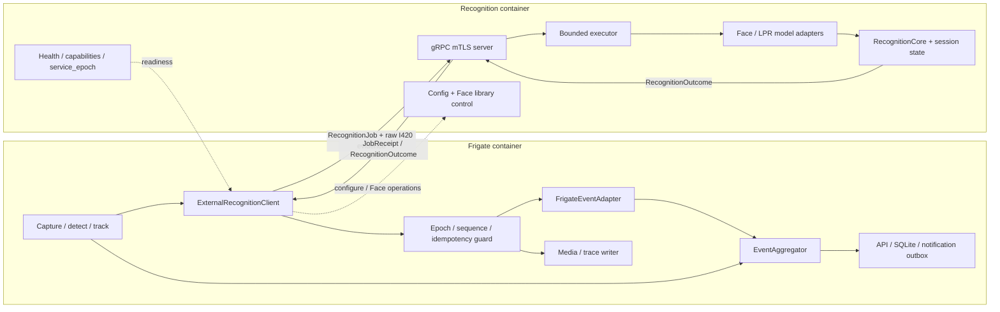

# Kiến trúc Camera AI B2B

Ngày cập nhật: 11/08/2026

## 1. Mục tiêu

Tài liệu này định nghĩa cách tối ưu pipeline Computer Vision của runtime hai camera và boundary
để recognition có thể chạy trong một container độc lập mà không chuyển tracker, Event, media hoặc
notification ra khỏi Frigate.

Mục tiêu kinh doanh ưu tiên là **Gate Intelligence cho nhà máy, kho vận, depot và
bãi xe đang có camera RTSP nhiều hãng**. Sản phẩm không cạnh tranh trực diện với
camera ANPR/face chuyên dụng bằng một model đơn lẻ; lợi thế chính là:

- Không bắt buộc thay toàn bộ camera hiện có.
- Dữ liệu và inference chạy on-premise.
- Kết quả nhận diện giữ đúng frame, bbox và evidence.
- Tích hợp được barrier, ERP, WMS, visitor management và hệ thống bảo vệ.
- Không khóa vào firmware hoặc cloud của một hãng camera.

## 2. Baseline hiện tại

Các thành phần đã có và được giữ làm nền tảng:

- Frigate đã sở hữu capture, detection, tracking, LPR, face recognition và Event.
- `deploy/config.yaml` là cấu hình runtime hiện hành.
- Hai pipeline đang chạy là `car_camera` cho LPR và `face_camera` cho face recognition.

Tối ưu được thực hiện trực tiếp trong pipeline Frigate hiện có.

Trạng thái vận hành ngày 07/08/2026:

| Camera | Pipeline | Processing |
| --- | --- | --- |
| `car_camera` | Car detection + native LPR | Bật |
| `face_camera` | Person detection + face recognition | Bật |

### 2.1 Readiness snapshot ngày 08/08/2026

Các bằng chứng hiện có được phân loại như sau; `pass` unit test hoặc stream health không
được nâng thành production acceptance:

| Hạng mục | Bằng chứng hiện có | Trạng thái kiến trúc |
| --- | --- | --- |
| Hai-camera stream health | Replay giữ camera/process FPS ổn định | Diagnostic pass; không phải passage recognition acceptance |
| LPR hai camera | Baseline passage recall 60%; Phase 2 đã tăng lên 100% trên fixture replay | Passage bottleneck Phase 2 đã đạt; recognition tiếp tục được cải thiện |
| Face sáu/bảy camera | Các report gần nhất `accepted=false`, enrichment latency/pending vượt gate | Không có approved capacity sáu/bảy camera |
| Recognition còn gắn với Frigate detection/Event | Khó nhúng LPR/Face vào runtime khác | Recognition core nhận typed tracked observation và trả typed update qua adapter |

## 3. Khoảng trống cần giải quyết

| Khoảng trống | Hệ quả hiện tại | Trạng thái đích |
| --- | --- | --- |
| Camera chỉ được mô tả bằng stream/FPS | Không biết input có đủ chất lượng để cam kết hay không | Mỗi camera có quality threshold đã benchmark |
| Detect và evidence dùng chung luồng thấp | Mất pixel biển số/khuôn mặt | Detect stream thấp, evidence stream full-resolution |
| Face và LPR cần evidence đúng lineage | Sai frame/bbox làm report không đáng tin | Evidence/quality chỉ là side-channel, không thay recognition decision của master |
| Quan sát chủ yếu bằng FPS/inference | Không biết bỏ sót bao nhiêu passage | SLA theo passage và end-to-end funnel |
| Detection input gắn với subscriber nội bộ | Khó thay detector/tracker mà không sửa recognition | Một `RecognitionInput` port nhận `TrackedObservation` có lifecycle rõ |
| Trace ghi file ngay trên thread gọi | Trace I/O có thể chặn detection/recognition khi bật | Bounded trace queue và một trace-writer thread riêng |
| Detect, face và LPR cùng tranh chấp compute | LPR/OCR tạo burst CPU/GPU và giảm mật độ kênh | Queue/transport bounded nhưng giữ nguyên cadence và voting của master |

## 4. Nguyên tắc kiến trúc

1. Chất lượng camera input là contract có thể đo.
2. Candidate giữ đúng frame và bbox đã dùng để nhận diện.
3. Live/network input dùng latest-frame khi quá tải; finite local MP4 dùng FIFO/backpressure để
   không bỏ frame.
4. Face/LPR giữ nguyên admission, history, attempt limit và publish timing của Frigate `master`.
5. Recognition decision phải giữ đúng Frigate `master`; instrumentation/coordinator không được
   thay weighted voting, clustering, threshold hoặc thời điểm publish.
6. Refactor worker/coordinator chỉ được thực hiện sau khi master-parity đã có differential test và
   phải chứng minh không đổi decision output hoặc raw track/Event ownership.
7. `EventAggregator` tiếp tục là canonical Event writer; notification chỉ đi từ committed Event
   qua outbox.
8. Recognition chỉ phụ thuộc typed tracked-observation/evidence contract; detection, Event và
   transport cụ thể nằm trong adapter.
9. Trace là side-channel bounded, không phải source of truth và không được block critical path.
10. Mỗi deployment chỉ chọn một recognition runtime. External mode lỗi phải fail closed và trả
    typed failure; không được chạy lại job bằng local runtime hoặc một model khác.
11. Nhãn `Phase N` chỉ dùng trong roadmap/tài liệu/acceptance artifact; production code, config,
    public API, metric và test name dùng tên chức năng, không mang phase label.

### 4.1 Phạm vi đơn giản hóa cho external runtime

Phase 6 giữ một core đồng bộ trong `EmbeddingProcess` để khóa parity. Phase 7 chuyển đúng core,
Face/LPR model adapters và session state sang một recognition container riêng. Production chỉ dùng
gRPC/mTLS giữa Frigate và container này; không xây thêm ZeroMQ production path, generic SDK hoặc
content-addressed evidence trước khi runtime thật đạt acceptance. Local synchronous mode chỉ còn là
topology được chọn rõ cho development/parity, không phải fallback của external mode. Packaging thành
wheel thực hiện sau khi runtime boundary đã được chứng minh.

## 5. Kiến trúc đích

Sơ đồ dưới đây là topology đích của Phase 7, chưa phải runtime hiện tại. Runtime hiện tại vẫn chạy
Face/LPR model và `RecognitionCore` đồng bộ bên trong `EmbeddingProcess`; Phase 7 thay phần đó bằng
external client và recognition container, không tạo decision path thứ hai chạy song song.



### 5.1 Runtime lanes và ownership

| Lane | Owner | Được phép làm | Không được làm |
| --- | --- | --- | --- |
| Detection | Capture/detect/track runtime | Phát tracked-object update, frame/evidence reference và lifecycle end | OCR/embed, recognition decision, notification hoặc disk trace |
| Frigate external client | `ExternalRecognitionClient` | Map canonical update sang ordered job; sở hữu evidence TTL; kiểm tra epoch/sequence/idempotency | Chạy model, vote, tự retry sang runtime khác hoặc publish result chưa hợp lệ |
| Recognition service | Executor + model adapters + `RecognitionCore` | Inference, Face/LPR history/voting, explicit end, Face library control và typed outcome | Import Event/SQLite/notification, ghi media hoặc tự tải URL/path evidence |
| Frigate output adapter | `FrigateEventAdapter` | Map outcome đã qua guard sang Event metadata và media contract hiện hành | Chọn lại winner, đổi score hoặc nối history qua service epoch |
| Event | `EventAggregator` | Canonical Event/API/SQLite commit và correlation | Chạy OCR/embed hoặc sở hữu recognition history |
| Notification | Durable outbox/worker | Gửi từ committed Event, retry/idempotency | Nhận lệnh trực tiếp từ recognition worker |
| Trace | Một bounded queue + writer thread | Persist JSONL/metrics best-effort | Block detection/recognition/Event hoặc sở hữu evidence |

Detector/tracker vẫn cập nhật base Event path trực tiếp. Frigate là owner duy nhất của track
lifecycle, Event và media; recognition container là owner duy nhất của model, Face/LPR history và
decision state. Cùng chuỗi observation phải tạo đúng update sequence như synchronous core.

### 5.2 Recognition input/output boundary

Frigate gửi một ordered job contract ổn định:

```python
RecognitionJob(
    job_id,
    client_id,
    expected_service_epoch,
    track_key,
    sequence,
    operation,          # observe | end_track | cancel
    observation,
    deadline_budget_ms,
    evidence,
)
```

`track_key = camera_id + stream_epoch + track_id` do Frigate cung cấp. `sequence` tăng đơn điệu
trong từng track; `end_track` đứng sau mọi observation đã được accept của track đó và idempotent.
Service không tự tracker, tạo passage identity hoặc suy diễn end từ observation bị thiếu.
Wire contract dùng budget tương đối; client giữ gRPC deadline bằng monotonic clock của chính nó,
service đổi budget còn lại thành monotonic deadline cục bộ khi nhận job. Không truyền giá trị
monotonic tuyệt đối giữa hai máy.

Service trả `JobReceipt` ngay khi admission và `RecognitionOutcome` sau xử lý. Receipt chỉ có
`accepted=true` hoặc typed reject như `queue_full`, `invalid_evidence`, `epoch_mismatch` và
`unavailable`. Outcome giữ job/key/sequence/epoch, frame/evidence lineage, `RecognitionUpdate`
hoặc typed failure. Client chỉ chuyển update sang `FrigateEventAdapter` một lần sau khi guard đạt.

### 5.3 Evidence và message contract

External V1 gửi raw contiguous I420 bytes cùng `shape`, `dtype`, `layout`, byte length, evidence ID
và expiry. Giới hạn hard là 8 MiB/job; length phải khớp shape/dtype trước khi model attach. Không JPEG
evidence trên inference path vì encode có thể đổi model input. Không chia sẻ `/dev/shm` hoặc IPC
namespace giữa hai container, không gửi URL/path và không để service đọc filesystem tùy ý.

Frigate giữ evidence đến khi nhận outcome/ack hoặc TTL hết. Service chỉ giữ buffer trong phạm vi
job và không ghi raw/annotated media. Evidence contract không được lọc observation, xếp hạng
candidate, vote hoặc trì hoãn publication.

### 5.4 Deployment, control plane và no-fallback contract

```yaml
recognition:
  runtime: external
  endpoint: recognition:50051
  deadline: 5s
  tls:
    ca: /config/certs/recognition-ca.crt
    certificate: /config/certs/frigate-client.crt
    key: /config/certs/frigate-client.key
```

Recognition image chạy thành service riêng trên private Docker network và không publish port ra
host mặc định. Model assets mount read-only; Face library là volume service sở hữu. Frigate gửi
validated recognition config qua control RPC và forward các operation `register`, `clear`,
`recognize` và `reprocess` Face hiện hành. Config change hoặc service restart tạo `service_epoch`
mới, đóng toàn bộ session/pending cũ và không nối history.

Chọn `external` thì Frigate không khởi tạo local Face/LPR inference model. Thiếu endpoint/TLS hoặc
config bị service từ chối làm startup validation fail. Sau startup, mất kết nối hoặc service
unhealthy chỉ làm recognition fail closed bằng typed outcome; capture/detect/base Event vẫn chạy,
không fallback sang local runtime, CPU hoặc model khác và không tự resubmit job.

### 5.5 Trace transport

Mọi lane chỉ `put_nowait()` một trace record nhỏ vào bounded trace queue. Trace không chứa image
bytes và không giữ evidence lease. Khi queue đầy, production drop record chưa persist và tăng
`trace_dropped_total`; không block critical path. Report phải ghi nguyên drop count để biết evidence
quan sát có đầy đủ hay không. Writer là thread duy nhất mở/ghi JSONL và shutdown chỉ flush trong
thời gian bounded.

## 6. Quality contract theo camera

Mỗi camera khai báo trực tiếp các ngưỡng mà `QualitySelector` sử dụng. Các giá trị dưới
đây chỉ là điểm bắt đầu và phải được chốt bằng ground-truth replay trên camera/hardware
thật.

```yaml
camera_quality:
  gate_lpr_01:
    task: lpr
    min_detail_width_px: 140
    max_yaw_deg: 25
    evidence: {width: 2560, height: 1440, fps: 20}

  lobby_face_01:
    task: face
    min_detail_width_px: 96
    max_yaw_deg: 35
    evidence: {width: 1920, height: 1080, fps: 15}
```

Selector ghi lý do reject để biết cần chỉnh camera, threshold hay model; không tự đổi
stream/model khi quality thấp.

## 7. Tách detect stream và evidence stream

Mỗi camera có tối đa ba vai trò độc lập:

| Stream | Mục đích | Đặc tính |
| --- | --- | --- |
| Detect | Motion/object/tracker | Resolution thấp, latest-frame, cho phép drop stale |
| Evidence | Best shot, LPR, face | Full-resolution, FPS theo profile, ring buffer bounded |
| Record | Playback/forensics | Bitrate và retention tối ưu cho lưu trữ |

“Tối đa ba vai trò” không có nghĩa phải mở ba RTSP session/decoder. V1 ưu tiên hai
input: detect stream thấp và một high-resolution stream dùng chung cho evidence/record
nếu codec, FPS, GOP và retention path đáp ứng cả hai contract. Chỉ tách evidence khỏi
record thành decoder riêng khi benchmark chỉ ra seek latency, GOP hoặc recording load
làm vi phạm evidence SLA.

`EvidenceRingBuffer` giữ frame trong một cửa sổ ngắn, ví dụ 3–10 giây. Buffer phải:

- Bounded theo byte và thời gian.
- Cho phép lấy high-resolution frame gần timestamp của track.
- Copy crop/frame đã được chọn ra khỏi ring buffer trước khi frame hết hạn.
- Ghi đè frame cũ; không tăng bộ nhớ theo thời gian.

Không ghi toàn bộ ring buffer vào database hoặc disk.

## 8. Frame reference tối thiểu

Candidate chỉ cần đủ thông tin để recognition dùng đúng ảnh đã được chấm quality:

```text
camera_id + track_id + frame_timestamp + frame_ref + object/detail bbox
```

Không tạo time model hoặc clock-drift subsystem riêng. Với local pipeline, `frame_ref` trỏ tới
frame/crop trong bounded buffer. Với external runtime, client copy đúng I420 frame thành bounded
gRPC evidence kèm shape/layout/byte length, evidence ID và expiry; service không dereference
filesystem path hoặc URL do caller cung cấp.

## 9. Unified Quality Selector

Face và LPR sử dụng chung contract candidate:

```python
EvidenceCandidate(
    candidate_id,
    camera_id,
    track_id,
    frame_time,
    frame_ref,
    object_box,
    detail_box,
    quality_score,
    quality_reasons,
)
```

Quality score gồm các thành phần có thể giải thích:

| Metric | LPR | Face |
| --- | --- | --- |
| Pixel density | Plate width/height | Face width/height |
| Blur | Laplacian/motion blur | Laplacian/motion blur |
| Exposure | Plate clipping | Face clipping/shadow |
| Pose | Plate perspective | Yaw/pitch/roll |
| Occlusion | Plate coverage | Eyes/nose/mouth visibility |
| Detector score | Plate/object | Face/person |
| Temporal stability | Track continuity | Track continuity |

Quality metric có thể ghi lý do như `plate_width_below_minimum`, blur hoặc pose để chẩn đoán và
chọn evidence hiển thị. Nó không được gate observation hay thay admission/voting của recognition
master.

## 10. Recognition decision policy

Policy active sau Phase 6-0 là trả Face/LPR recognition về đúng Frigate `master` tại Phase 6-1:

- LPR giữ rolling variant window, Jaro-Winkler clustering, cluster support và representative của
  master.
- Face giữ `person_face_history`, weighted-average voting, `min_faces`, count-tie rejection và
  attempt limits của master.
- Camera-specific trace/evidence/report được phép quan sát nhưng không được tham gia admission,
  history, winner, threshold hoặc publish timing.

Toàn bộ rolling top-3, best-result rank, top1-top2 margin, custom `SEARCHING/ACCEPTED/EXHAUSTED`
và passage-level consensus của Phase 5 đã bị xóa khỏi kiến trúc. Chúng không còn là phương án
deferred để tái sử dụng.

## 11. Capacity và overload control

### 11.1 Baseline compute hiện tại

Snapshot runtime ngày 2026-08-08 được đo trên HP Victus, Ryzen 5 5600H, RTX 3050
Laptop 4 GB, với hai camera 1280 × 720 và detect 5 FPS/camera. Cấu hình dùng YOLO
320 × 320 trên GPU, face model `large`, native plate detector và OCR.

| Stage | Thời gian trung bình/lần | Tần suất tại snapshot | Kết luận |
| --- | ---: | ---: | --- |
| Object detection người/xe | 9,20–9,75 ms | Chạy nền trên cả hai camera | Rẻ nhất mỗi lần nhưng tăng tuyến tính theo số camera/FPS |
| Plate detection | 23,06–25,72 ms | 4,3–5,5 lần/s | Chỉ là bước định vị trước OCR |
| Face recognition | 48,58–55,40 ms | 0,5 lần/s | Đắt mỗi candidate nhưng tải tổng thấp khi ít người |
| Plate OCR | 54,25–63,76 ms | 1,9–2,6 lần/s | Đắt nhất mỗi lần inference |

Trong các snapshot cùng phiên, `car_camera` dùng khoảng 42% CPU process, `face_camera`
khoảng 8%, embeddings/enrichment process khoảng 60–68%, GPU khoảng 33–34%, VRAM khoảng
44,6% và CPU toàn hệ thống Frigate khoảng 17,8–19,3%. Các tỷ lệ process không được cộng
trực tiếp thành tổng CPU hệ thống.

SQLite runtime có 139 passage xe kết thúc với duration trung vị 3,4 giây và 61 passage
người với duration trung vị 3,6 giây. Với nhịp snapshot cao nhất, một passage xe có thể
kích hoạt xấp xỉ 8–9 lần OCR, còn một passage người xấp xỉ 1,8 lần face recognition.
Đây là cơ sở cho projection, không phải phép đo attempts gắn chính xác theo từng passage.

Kết luận kiến trúc:

1. Native LPR là pipeline enrichment nặng nhất vì một passage phải qua object detect,
   tracking, plate detect, quality processing và tối đa ba OCR độc lập.
2. Face recognition đứng sau LPR về tải hiện tại. Face model vẫn đắt trên mỗi candidate,
   nhưng quality gate làm nó chạy ít hơn.
3. Object detection là chi phí nền quyết định số camera tối đa: inference đơn lẻ nhẹ
   nhất nhưng phải chạy liên tục trên mọi luồng.
4. Không được dùng snapshot này để tuyên bố capacity 4/8 camera. Nó chưa phải benchmark
   passage có ground truth, burst đồng thời hoặc repeated-cycle stability test.

### 11.2 Compute control không đổi recognition

Compute control chỉ được giới hạn transport, queue và concurrency ở nơi không làm mất hoặc đổi thứ
tự observation mà Frigate `master` sử dụng. Không còn cascade top-3, custom dedupe, calibrated
early-stop, best-result winner hoặc terminal recognition state trong kiến trúc.

Metric bắt buộc gồm calls/s, P95 latency, queue age/depth, CPU, GPU, VRAM và compute-time theo raw
track. Khi quá tải, runtime phải báo degraded state; không được âm thầm thay cadence/voting để đạt
capacity.

### 11.3 Projection lên tám camera [STALE UNTIL MASTER PARITY]

Projection dùng workload mix 4 camera xe + LPR và 4 camera người + face, cùng resolution
1280 × 720, detect 5 FPS và mật độ passage tương tự hai replay hiện tại. Đây là phép
ngoại suy tuyến tính để xác định rủi ro, chưa phải capacity đã được chứng minh.

Nhịp inference ước tính:

| Stage | 2 camera hiện tại | 8 camera chưa tối ưu | Sau master parity |
| --- | ---: | ---: | ---: |
| Object detect input | 10 FPS | 40 FPS | 40 FPS; không giảm ngầm |
| Plate detection | 5,5 lần/s | khoảng 22 lần/s | mục tiêu 6–11 lần/s với ROI/quality gate |
| Plate OCR | 2,6 lần/s | khoảng 10,4 lần/s | Chưa có claim; đo lại theo master variant cadence |
| Face recognition | 0,5 lần/s | khoảng 2,0 lần/s | Chưa có claim; đo lại theo master attempt limits 12/6 |

Các tỷ lệ tiết kiệm dựa trên top-3/early-stop đã bị rút khỏi active roadmap. Phải đo lại
calls/trace, master Face attempt cadence, LPR variant cadence và worst-run queue sau Phase 6-1 trước
khi cập nhật projection tám camera.

Projection tải chuẩn hóa:

| Kịch bản 8 camera | GPU demand ngoại suy | CPU Frigate ngoại suy | Đánh giá |
| --- | ---: | ---: | --- |
| Giữ logic hiện tại | khoảng 132–136% | khoảng 71–77% | Không khả thi; GPU sẽ bão hòa và queue tăng |
| Chỉ conditional retry OCR + face | khoảng 92–116% | khoảng 50–65% | Vẫn thiếu headroom, không được approve |
| Full cascade | khoảng 79–102% | khoảng 43–58% | Có thể chạy workload thưa nhưng vẫn sát giới hạn |

`GPU demand` trên 100% biểu diễn lượng compute được yêu cầu so với một GPU, không phải
metric utilization có thể hiển thị vượt 100%. Khi demand vượt khả năng, hệ quả là queue
age, skipped/stale candidate và P95 latency tăng.

VRAM không giảm tỷ lệ thuận với số inference vì model vẫn resident. Ngược lại, frame,
ROI và queue tăng theo số camera; vì vậy projection không tự suy ra VRAM từ 44,6% × 4.
Acceptance tám camera yêu cầu đo peak VRAM thực và giữ queue bounded.

Kết luận provisional: confidence-gated retry là cần thiết nhưng chưa đủ để cam kết tám
camera trên RTX 3050 4 GB. Ngay cả biên tốt của full cascade còn cần thêm khoảng 15–32%
hiệu quả để đạt mục tiêu steady-state GPU ≤70%. Nguồn cải thiện tiếp theo gồm TensorRT/
FP16 cho stage phù hợp, batching có giới hạn, tránh copy CPU↔GPU và shared model instance.
Nếu 3 FPS vẫn giữ passage recall, cấu hình 3 FPS có thể dùng để tăng headroom; không tự
hạ từ 5 xuống 3 FPS khi chưa benchmark.

Acceptance tám camera tối thiểu:

- Chạy đồng thời 4 LPR + 4 face camera ít nhất 24 giờ.
- Steady GPU ≤70%, burst P95 ≤85%, VRAM peak ≤80%; không OOM hoặc model reload.
- Queue age/depth bounded và trở về baseline sau burst; không tích lũy stale candidate.
- Báo cáo passage recall/recognition không giảm so với baseline hai camera đã duyệt.
- P95 capture-to-recognition và end-to-end latency đạt SLA cho từng product profile.
- Burst đồng thời trên cả tám camera vẫn giữ queue/latency bounded; nếu không đạt thì
  giảm số camera theo capacity profile đã benchmark.

### 11.4 Capacity theo benchmark

Mỗi benchmark ghi hardware, model/config version, resolution/FPS, workload mix, số camera,
GPU/CPU/VRAM, queue P95 và passage result. Số camera tối đa của một hardware/pipeline mode
là mức cao nhất đã đạt acceptance; deployment không cấu hình vượt mức này.

Khi overload đột biến:

1. Drop stale detect/evidence candidate chưa persist.
2. Tạm ngừng enrichment ưu tiên thấp.
3. Ghi metric overload cùng số liệu queue/latency.

## 12. Passage-level SLA và observability

Đơn vị đo chính là vehicle/person passage, không phải frame.

```text
Physical passage
├── Object detected
├── Track continuous
├── Quality candidate accepted
├── Recognition committed
└── Event committed
```

Các KPI bắt buộc:

| KPI | Ý nghĩa |
| --- | --- |
| Passage detection recall | Tỷ lệ passage thật tạo event |
| Track continuity | Tỷ lệ passage không đổi nhầm ID |
| Quality acceptance | Tỷ lệ passage có evidence đạt profile |
| Recognition precision/recall | Đúng/sai theo ground truth |
| Evidence correctness | Result, bbox và frame cùng evidence |
| End-to-end latency | Capture đến recognition/Event committed |
| Degraded duration | Thời gian vi phạm camera/capacity contract |

FPS, detector inference và queue depth vẫn được thu thập nhưng chỉ là diagnostic metric.

### 12.1 Contract đo KPI recognition

Acceptance gate và báo cáo độ chính xác là hai output độc lập. Gate có thể fail vì thời gian,
RAM, cleanup hoặc evidence, nhưng các lỗi vận hành đó không được tự động biến thành lỗi OCR.
Ngược lại, một run khởi động ổn định không làm KPI recognition hợp lệ nếu scorer không chứng minh
được quan hệ giữa ground truth và candidate thực tế.

Mỗi trace runtime giữ cùng một lineage từ frame nguồn đến kết quả cuối:

```text
source PTS -> object bbox -> runtime track/generation -> candidate ID
           -> plate/face bbox -> raw outcome -> final publication
```

PTS và bbox là bằng chứng nội bộ để kiểm tra candidate/result/evidence có cùng frame, không phải
khóa gán ground truth LPR. Pipeline tự sinh trace và final publication trước; scorer LPR chỉ đối
chiếu plate đã publish của trace hoàn tất với danh sách `expected_plate` duy nhất. Fixture không
được dùng time/bbox để đổi ownership, tách hoặc hợp nhất trace. Face vẫn dùng passage nguồn vì
identity `unknown` không thể đối chiếu chỉ bằng chuỗi kết quả.

Ba replay round được chấm riêng trước khi aggregate. Mỗi passage/round chỉ có một final decision;
không dùng mode của mọi `event_published` làm representative. Báo cáo tối thiểu phải tách:

| Nhóm | KPI |
| --- | --- |
| Detection | car detection recall, track coverage, track-switch rate |
| Plate/face localization | detail detection recall trên đúng object |
| Recognition | attempted rate, conditional exact accuracy, unknown/ambiguous rate |
| End-to-end | exact precision, exact recall, wrong/missing publication rate |
| Stability | đúng bao nhiêu trên ba round cho từng physical passage |
| Debug ceiling | có ít nhất một raw outcome đúng; không gọi là production accuracy |

Nếu round/PTS alignment hoặc result lineage không hợp lệ, artifact phải ghi
`measurement_valid=false` và KPI bị ảnh hưởng là `null`. Runtime health/gate vẫn được báo ở phần
riêng, nhưng không được trộn vào tử số hoặc mẫu số accuracy.

### 12.2 Contract Platform runtime report hiện hành

Platform runtime test dùng report **evidence-only** xuyên suốt roadmap; các giá trị KPI/runtime
chỉ là diagnostic, không phải acceptance decision. Mỗi invocation chạy một vòng, lưu vào thư mục
timestamp riêng và chốt measurement sau EOF của mọi finite source. Contract chi tiết về raw trace,
source PTS, hardware metrics và artifact được tách tại
[Platform-Test-Report.md](./Platform-Test-Report.md).

## 13. Lộ trình triển khai

Quy ước trạng thái: `[DOING]` là phase đang triển khai; `[DONE]` nghĩa là toàn bộ phạm vi
implementation đã chốt của phase đã hoàn thành và có bằng chứng kiểm chứng tương ứng. Kết quả đo
của một phase được ghi nguyên trạng, kể cả khi chưa đạt mục tiêu cuối. `DONE` là `DONE`; kết quả
định lượng không đổi một phase đã hoàn thành về trạng thái khác.

`Acceptance tổng thể` là kết luận xuyên suốt toàn bộ roadmap, không phải trạng thái riêng của từng
phase. Checkbox chỉ được tick khi implementation/test/benchmark tương ứng thực sự đã chạy; không
tick chỉ vì code đã tồn tại.

Đây là lộ trình **triển khai kiến trúc**. Mỗi phase bên dưới phải tạo ra runtime contract,
module hoặc deployment topology được nêu rõ; unit test, replay và benchmark chỉ là bằng chứng
để đóng phase, không phải work package thay thế cho phần triển khai. Phase 1–4 đã hoàn tất;
Phase 5 là thử nghiệm `[SUPERSEDED]`; Phase 6 đã `[DONE]` với recognition core đồng bộ và Frigate
adapters; Phase 7 là bước `[NEXT]` để chuyển model/core/session sang recognition container riêng.
Acceptance
tổng thể được đánh giá riêng sau khi hoàn thành toàn bộ roadmap, không dùng để đổi trạng thái từng
phase đã hoàn tất.

### 13.1 Ma trận truy vết thiết kế → triển khai

| Mục thiết kế | Requirement triển khai | Phase owner | Kết quả phải tồn tại |
| --- | --- | --- | --- |
| 1. Mục tiêu | On-premise Camera AI với recognition runtime độc lập và Event output ổn định | Phase 4–7 | Recognition container không sở hữu tracker/Event/media; adapter không đổi decision contract |
| 2. Baseline | Giữ Frigate capture/detect/track/Face/LPR/Event làm nền tảng | Phase 1–2 | Baseline và passage remediation có artifact `[DONE]` |
| 3. Khoảng trống | Passage, quality, evidence, recognition core, transport và trace có owner riêng | Phase 2–7 | Frigate host và recognition service có boundary rõ; không thêm parallel decision path |
| 4. Nguyên tắc | Lineage, explicit lifecycle, bounded admission, no fallback và single-writer ownership | Phase 3–7 | Overload/restart trả typed failure; không silent drop, retry chéo runtime hoặc duplicate publish |
| 5. Kiến trúc đích | `RecognitionJob → gRPC service → RecognitionOutcome`; Frigate giữ publication | Phase 6–7 | Docker service độc lập; core semantics không đổi và Event/media không rời Frigate |
| 6. Quality contract | Camera profile và reject reasons có schema/runtime owner | Phase 4 | Config validate được và selector xuất quality/reject reason |
| 7. Detect/evidence stream | Live detect dùng latest-frame; finite MP4 dùng FIFO/backpressure; evidence/record bounded riêng | Phase 4, 6-0 | Source role, frame ownership, source timeline và byte/time bound được triển khai |
| 8. Frame reference | Observation/result/evidence giữ cùng camera, track, epoch, frame và bbox | Phase 3–7 | External V1 dùng bounded raw I420 evidence, length/shape/layout validation và TTL |
| 9. Quality/evidence observability | Face/LPR có cùng lineage và diagnostic metric | Phase 4, 6-1 | Selector không gate observation hoặc tham gia recognition decision |
| 10. Recognition/result selection | Khôi phục nguyên vẹn LPR clustering và Face weighted voting từ Frigate master | Phase 6-1 | Khóa master commit, restore decision semantics và chứng minh parity |
| 11. Compute control | Core đồng bộ khóa parity trước; service dùng bounded ordered executor | Phase 6–7 | Queue full reject ngay; service không thay cadence, order hoặc recognition output của core |

Dependency bắt buộc:

```text
baseline/passage [DONE]
→ LPR execution foundation [DONE]
→ camera quality + evidence observability [DONE]
→ finite-source timeline + raw trace + native media [DONE: Phase 6-0]
→ Frigate master voting/consensus parity [DONE: Phase 6-1]
→ standalone synchronous recognition core + Frigate adapters [DONE: Phase 6]
→ external gRPC recognition container + Frigate host adapter [NEXT: Phase 7]
```

### Phase 1 — Đo baseline hai camera [DONE]

- [x] Xây passage dataset/replay cho LPR và face.
- [x] Đo calls/s, latency, queue, GPU/CPU/VRAM và recognition theo passage trên pipeline
  hiện tại.
- [x] Xác nhận result/bbox/crop thuộc cùng candidate trước khi dùng baseline để so sánh.

Tiêu chí kiểm chứng Phase 1:

- [x] Có baseline lặp lại được cho một LPR camera và một face camera.
- [x] Báo cáo được passage recall, recognition precision/recall và end-to-end latency.

Bằng chứng: [summary.json](../../.tmp/platform-phase1/summary.json). Mỗi replay case
hoàn tất trong 58,45–60,02 giây. Face known/unknown đạt precision và recall 100%;
LPR passage detection recall baseline là 60%. Exact-match LPR là `null` vì clip 720p
không có passage nào đủ rõ để gán ký tự bằng mắt (`readable_denominator=0`); chỉ số này
được báo cáo nhưng không phải gate của Phase 1. Capture-to-recognition P95 theo physical
passage của face là 8,20 giây, trong khi gate sau khi candidate đủ điều kiện đạt first
attempt 309,1 ms và confirmed 629,5 ms.

Time budget `<120 giây` áp dụng cho unit, integration và replay kiểm chứng dùng trong vòng
lặp phát triển.

KPI baseline cần theo dõi khi triển khai Phase 2:

| Mức ưu tiên | KPI | Baseline Phase 1 | Hướng cải thiện | Vai trò |
| --- | --- | --- | --- | --- |
| 1 | LPR passage detection recall | 60% | Tăng recall và giữ passage precision ở ngưỡng product profile | KPI chính; đang bỏ sót 40% passage ground truth |
| 1 | Face capture-to-recognition P95 theo physical passage | 8,20 giây | Giảm rõ rệt thời gian chờ candidate đủ điều kiện | KPI end-to-end chính |
| 1 | Face recognition precision/recall | 100% / 100% trên known và unknown fixture | Theo dõi regression theo ngưỡng passage phù hợp với kích thước tập thử | Quality guardrail |
| 1 | Result/candidate correlation | Face correlation đạt; LPR plate box hợp lệ | Không có identity/plate gắn nhầm bbox, crop hoặc frame | Correctness gate |
| 2 | Face first attempt / confirmed | 309,1 ms / 629,5 ms | Giữ dưới gate 750 ms / 1.500 ms và giảm nếu không mất recall | Latency sau khi candidate đủ điều kiện |
| 2 | Pending queue cuối test | 0 | Luôn trở về 0 sau burst, không tích lũy stale candidate | Capacity/stability gate |
| 2 | Enrichment calls/s | Face 1,2; OCR 2,4; plate detection 5,6 | Giảm lần gọi thừa nhưng không giảm passage recall/precision | Compute-efficiency KPI |
| 2 | GPU / VRAM / RAM | 58%; 1.272/4.096 MiB; khoảng 4/7 GiB | Tạo headroom để tăng camera, không OOM hoặc tăng dần theo thời gian | Capacity KPI |
| 3 | Camera/process FPS | Khoảng 5 FPS; process FPS tối thiểu 4,7 | Giữ camera 4,5–5,5 FPS, process ≥4,5 FPS, skipped ≤0,5 FPS | Diagnostic guardrail, không thay cho passage KPI |
| 3 | Detector inference | Tối đa 16,61 ms | Giữ dưới 200 ms | Diagnostic guardrail |
| Chưa đo được | LPR exact-match | `null`, readable denominator = 0 | Bổ sung fixture 720p có biển đọc được trước khi dùng làm quality gate | Chỉ số bắt buộc báo cáo, chưa phải gate Phase 1 |

### Phase 2 — Sửa passage bottleneck [DONE]

Phase 2 đã hoàn tất theo [summary kiểm chứng](../../.tmp/platform-phase2/summary.json) với
`accepted=true` trong 113,406 giây. Đây là artifact lịch sử của Phase 2; cơ chế composite/loop cũ
không còn là runtime test hiện hành. Từ Phase 6-0, [validator entrypoint](../../tools/tests/e2e/run_platform_runtime_test.py)
chạy một vòng finite MP4 trực tiếp theo contract source-index/EOF tại mục 13. Runtime Phase 2 từng
đặt car `min_initialized: 1`, cho phép LPR ngay khi track hợp lệ, mở rộng crop có clamp, giữ
consensus representative hiện có và đưa cadence face về 200 ms.

Mục tiêu của Phase 2 là cải thiện trực tiếp hai bottleneck đã đo ở Phase 1: LPR passage
recall 60% và face capture-to-recognition P95 8,20 giây. Phase này không xây shared
quality selector, top-K hoặc evidence buffer mới.

- [x] Xác minh trực quan timestamp/replay phase của các passage LPR bị bỏ sót, sau đó bổ
  sung passage funnel có số đếm theo từng tầng:
  `ground truth -> object detected -> track created/continued -> candidate qualified -> recognition -> Event`.
- [x] Sửa tầng làm mất passage bằng detector/ROI/zone, cadence và tham số tracker hiện có;
  giữ nguyên detector/OCR model và resolution 720p trong Phase 2.
- [x] Đo và giảm thời gian `passage -> track -> candidate qualified` bằng cadence và logic
  chọn candidate hiện có; không lấy inference latency riêng lẻ làm kết quả end-to-end.
- [x] Bổ sung fixture 720p có passage đọc được bằng mắt và `expected_plate` đã chuẩn hóa để
  đo LPR exact-match; threshold confidence chỉ được chốt sau khi calibration bằng ground truth.

Tiêu chí kiểm chứng Phase 2:

- [x] Mọi replay test case của Phase 2 kết thúc trong dưới 120 giây.
- [x] LPR báo cáo đầy đủ số lượng và tỷ lệ chuyển đổi ở từng tầng passage funnel; passage
  recall cao hơn baseline 60% và passage precision đạt ngưỡng 80%. Một passage không được detector
  hoặc tracker tạo ra không được ghi nhận là lỗi OCR/consensus.
- [x] Fixture LPR readable có denominator lớn hơn 0 và báo cáo exact-match; unreadable
  passage vẫn tính vào passage recall nhưng không tính vào exact-match denominator.
- [x] Face capture-to-recognition P95 theo physical passage giảm so với baseline 8,20 giây;
  đồng thời detection recall, precision và recall đạt ngưỡng passage 80%.
- [x] Báo cáo riêng thời gian `passage -> track`, `track -> candidate qualified`, first
  attempt và confirmed; không dùng riêng inference latency để đại diện end-to-end latency.

Kết quả chốt Phase 2: LPR passage recall tăng từ 60% lên 100% trên 5 passage, không có
false passage; Face detection recall, precision và recall đều 100%; Face
passage-to-confirmed P95 là 1.676,8 ms, pending cuối test bằng 0, không restart/reconnect/
stall, RAM tối đa 4,29 GiB và SHM 14%. API và SQLite không có giá trị một phía hoặc lệch
nhau; một enrichment update không được cả hai store giữ lại được báo riêng, không bị gọi
nhầm là API–SQLite mismatch.

#### Kết quả Phase 2 theo mục tiêu ban đầu

Các chỉ số dưới đây là kết quả replay dùng để xác nhận hai bottleneck của
Phase 2 đã được khắc phục so với baseline.

| Gate/KPI | Kết quả hiện tại | Ngưỡng Phase 2 | Bằng chứng |
| --- | ---: | ---: | --- |
| Kết quả validator | `accepted=true`, 113,406 giây | `<119` giây, mọi hard gate đạt | [summary.json](../../.tmp/platform-phase2/summary.json) |
| LPR passage recall | 100% trên 5 passage; 3/3 vòng có track cho từng passage | Recall cao hơn baseline 60%; passage precision `≥80%` | [lpr.json](../../.tmp/platform-phase2/lpr.json), [runtime trace](../../.tmp/platform-phase2/runtime-trace.json) |
| Face detection/precision/recall | 100% / 100% / 100% | Mỗi chỉ số `≥80%` theo physical passage | [face.json](../../.tmp/platform-phase2/face.json) |
| Face passage-to-confirmed P95 | 1.676,8 ms | `<3.000` ms và thấp hơn baseline 8,20 giây | [face.json](../../.tmp/platform-phase2/face.json) |
| Face eligible-to-confirmed / first-attempt / embedding P95 | 621,6 / 147,3 / 44,9 ms | `≤1.500` / `≤750` / `≤200` ms | [face.json](../../.tmp/platform-phase2/face.json) |
| Runtime | pending 0; restart 0; RAM 4,29 GiB; SHM 14%; không reconnect/stall | pending 0; RAM `≤7 GiB`; SHM `<70%`; runtime ổn định | [summary.json](../../.tmp/platform-phase2/summary.json) |

#### Hạn chế hiện tại

| Hạn chế | Hiện trạng và ảnh hưởng | Hướng xử lý | Bằng chứng |
| --- | --- | --- | --- |
| Chất lượng LPR recognition chưa ổn định | Exact-match đạt 1/3 passage có biển đọc được; `lpr-01` và `lpr-02` chưa tạo kết quả OCR hợp lệ. Hệ thống đã bắt được passage nhưng chưa đọc tin cậy mọi biển trong tập thử. | Phase 3 sửa execution architecture và temporal decision hiện có. Nếu raw OCR không có thông tin hữu ích thì dừng ở ranh giới model, không tiếp tục vá pipeline. | [lpr.json](../../.tmp/platform-phase2/lpr.json), [evidence lpr-01](../../.tmp/platform-phase2/mismatches/lpr-01.jpg), [evidence lpr-02](../../.tmp/platform-phase2/mismatches/lpr-02.jpg) |
| Dữ liệu replay còn nhỏ | Kết quả hiện tại đủ xác nhận regression của Phase 2 nhưng chưa đủ để công bố accuracy tổng quát cho nhiều người, biển số và điều kiện hình ảnh. | Đây là đầu vào cho fine-tune/certification sau này, không phải work package triển khai của Phase 3. | [manifest](../../tools/fixtures/platform_passage_ground_truth.yaml) |
| Chưa đo capacity và điều kiện triển khai rộng hơn | Replay mới chạy đồng thời một camera Face và một camera LPR ở 720p; chưa có kết quả 4/8 camera hoặc nhiều điều kiện lắp đặt. | Không thuộc phạm vi đã chốt của Phase 2; hạn chế này phải có phase owner riêng nếu được đưa vào roadmap. | [summary.json](../../.tmp/platform-phase2/summary.json) |

### Phase 3 — LPR execution foundation [DONE]

**Owner thiết kế:** mục 4, 8, 10 và phần LPR của mục 11. Phase này sửa execution path hiện
có trước khi thêm quality/evidence source mới. Không đổi model, resolution hoặc Face logic.

Luồng triển khai:

```text
object update
→ bounded latest-per-track worker
→ plate detector/OCR
→ PlateObservation
→ PlateTrackState
→ optional PlateCommit
→ worker persist evidence
→ maintainer publish Event
```

- [x] Tạo typed `LprTrackKey(camera, track_id, generation)`, `PlateObservation`,
  `PlateTrackState` và `PlateCommit`; history bounded và dedupe theo frame reference.
- [x] Tách detector/OCR, temporal state reducer và Event side effect khỏi `lpr_process()`.
- [x] Chuyển LPR sang latest-per-track worker; candidate cũ bị replace/drop theo capacity/TTL,
  expire và generation mới vô hiệu toàn bộ stale work.
- [x] Chỉ encode evidence và stage commit khi decision mới hoặc mạnh hơn; maintainer chỉ
  publish một revision idempotent sang Event/API/SQLite.
- [x] Đưa observation hợp lệ vào temporal history trước commit threshold; consensus dùng
  unique-frame support, character confidence và text area. Nếu raw OCR không có thông tin
  hữu ích thì dừng ở model boundary, không thêm heuristic.
- [x] Xuất pending, replaced, capacity/TTL drops, stale-generation drops, candidate age và
  worker latency trong stats runtime.

Hoàn thành khi LPR inference/I/O không block maintainer, queue luôn bounded, stale generation
không publish được, một decision chỉ tạo một commit và regression replay giữ passage/Face KPI
trong ngưỡng Phase 2.

#### Kết quả Phase 3 so với cuối Phase 2

Run kiểm chứng cuối chạy trên image `camera-frigate:overlay-0c53e795ecdc`, hoàn tất trong
110,492 giây với `accepted=true`. Manifest passage và model hash giữ nguyên so với Phase 2;
generated config hash khác nên đây là regression comparison cùng fixture/model, không phải A/B
bit-identical tuyệt đối.

| Gate/KPI | Cuối Phase 2 | Cuối Phase 3 | Kết luận |
| --- | ---: | ---: | --- |
| Kết quả validator | `accepted=true`, 113,406 giây | `accepted=true`, 110,492 giây | Giữ toàn bộ hard gate, nhanh hơn 2,914 giây |
| LPR passage recall | 100% | 100% | Không regression passage |
| LPR passage precision | Chưa có field trong schema cũ | 100% | Không có false passage |
| LPR exact-match | 33,3% trên denominator 3 | 33,3% trên denominator 3 | Execution refactor không cải thiện OCR/model boundary |
| LPR consistency tối thiểu | 33,3% | 33,3% | Aggregate guardrail giữ nguyên |
| Face detection/precision/recall | 100% / 100% / 100% | 100% / 100% / 100% | Không regression Face runtime |
| Face passage-to-confirmed P95 | 1.676,8 ms | 1.595,6 ms | Cải thiện 81,2 ms |
| Pending / restart / bad log | 0 / 0 / 0 | 0 / 0 / 0 | Không backlog, restart hoặc stall |
| API–SQLite / correlation mismatch | 0 / 0 | 0 / 0 | Giữ external Event contract |
| RAM tối đa / SHM | 4.602.057.457 byte / 14% | 4.598.836.232 byte / 14% | Không tăng tài nguyên đáng kể |

Chi tiết LPR cho thấy quality residual vẫn thuộc model/input boundary: `lpr-01` và `lpr-02`
tiếp tục có passage/track nhưng không tạo OCR hữu ích; `lpr-06` vẫn exact-match `BEE3975`
nhưng consistency giảm từ 87,5% xuống 75%; `lpr-07` giữ consistency 100% nhưng representative
đổi từ `FKH9211` thành `FKH921` và recognized rounds giảm từ 2 xuống 1. Vì aggregate passage,
exact-match và stability gate không giảm, Phase 3 dừng đúng ở execution architecture, không vá
threshold hoặc thêm QualitySelector/evidence buffer thuộc Phase 4.

Bằng chứng triển khai: 24/24 test LPR/deferred/maintainer/stats đạt; fake inference chậm xác
nhận `process_frame()` không chờ inference; queue/state/control đều bounded; expire chặn stale
in-flight result. Run kiểm chứng cuối có pending 0, restart 0, không reconnect/stall và runtime sau
restore healthy. Hai unit assertion Face riêng còn lỗi ở fixture `transaction_id` và kỳ vọng
frame 100.5; các đường code đó không nằm trong diff Phase 3 và Face runtime vẫn đạt gate.
Summary kiểm chứng hiện chưa lưu camera `skipped` thành một field so sánh Phase 2/3; gate này
chỉ có bằng chứng gián tiếp từ pending 0, không stall và passage recall giữ 100%, không được coi
là phép đo trực tiếp `skipped`.

Bằng chứng: [Phase 2 summary](../../.tmp/platform-phase2/summary.json),
[Phase 3 summary](../../.tmp/platform-passage/summary.json),
[Phase 3 LPR result](../../.tmp/platform-passage/lpr.json),
[Phase 3 runtime trace](../../.tmp/platform-passage/runtime-trace.json).

### Phase 4 — Camera quality, evidence và shared candidate contract [DONE]

**Owner thiết kế:** mục 3–9. Đây là phase triển khai các thành phần đang có trong kiến trúc
đích nhưng trước đây không có owner.

- [x] Khai báo quality config theo camera, `FrameRef`, `EvidenceLease` và
  `EvidenceCandidate` dùng chung cho Face/LPR;
  schema gồm camera/track/generation/frame, object/detail bbox, source role, quality và reject
  reasons.
- [x] Map rõ `detect`, `evidence` và `record` role. Phase 4 chỉ cho phép `detect`; config
  `evidence`/`record` fail rõ vì chưa có high-resolution adapter và không mở decoder thứ ba.
- [x] Tạo `EvidenceRingBuffer` bounded theo byte và thời gian; frame hết hạn bị ghi đè, candidate
  được chọn phải sở hữu crop/reference trước expiry.
- [x] Triển khai `QualitySelector` nhận profile theo camera và chấm pixel density, blur, exposure,
  pose/occlusion khi metric có sẵn. Đây là artifact Phase 4; sau Phase 6-1 nó chỉ được dùng cho
  evidence/diagnostic, không được lọc observation của recognition.
- [x] Bổ sung `EvidenceCandidate` để kiểm chứng lineage frame/bbox. Contract này không được thay
  admission, cadence, voting hoặc publication của master.
- [x] Reject reason và quality metrics đi vào passage observability; selector không tự đổi
  model/resolution khi input không đạt profile.

Hoàn thành khi cùng một candidate contract chạy được cho Face và LPR trong runtime hiện tại,
memory bounded theo cấu hình, result/evidence giữ đúng lineage và không còn quality path riêng biệt.

#### Kết quả triển khai và kiểm chứng Phase 4

Image Phase 4 `camera-frigate:overlay-7c31cfa85448` đã build thành công. Bộ test tập trung trong
image đạt 40/40 cho evidence, quality, LPR deferred/state/association, Face candidate và snapshot;
19/19 test validator trên host đạt. Compile, Ruff cho module mới và `git diff --check` đều đạt.

Run kiểm chứng Phase 4 sau khi sửa gate FPS hoàn tất trong 109,666 giây với `accepted=true`. Gate
`skipped_fps` dùng regression budget theo control thay cho ngưỡng tuyệt đối không có trong
baseline: mỗi camera không được tăng quá 0,1 FPS. Control Phase 3 đã ở mức 3,3/3,9; Phase 4 đạt
3,4/3,2 nên không regression. Giá trị tuyệt đối vẫn được lưu làm diagnostic và backlog capacity,
nhưng không bắt Phase 4 sửa vấn đề detect throughput tồn tại từ baseline.

| Gate/KPI | Control Phase 3 | Phase 4 | Kết luận |
| --- | ---: | ---: | --- |
| Kết quả validator | Control baseline | `accepted=true`, 109,666 giây | Đạt toàn bộ hard gate Phase 4 |
| LPR recall / precision / exact-match | 100% / 100% / 33,3% | 100% / 100% / 33,3% | Không regression recognition |
| Face detection / precision / recall | 100% / 100% / 100% | 80% / 100% / 80% | Đạt gate Phase 3 tối thiểu 80% |
| Pending / restart / reconnect-stall | 0 / 0 / 0 | 0 / 0 / 0 | Đạt |
| API-SQLite / correlation-lineage mismatch | Phase 3 chưa có candidate lineage | 0 / 0 | Shared candidate lineage đạt |
| `skipped_fps` face / car | 3,3 / 3,9 | 3,4 / 3,2 | Đạt regression budget tối đa +0,1 mỗi camera |
| Evidence tối đa face / car | 0 / 0 | 16.588.800 / 20.736.000 byte | Dưới 32 MiB mỗi camera |
| RAM tối đa | 4.603.131.199 byte | 4.655.744.548 byte | Tăng 52.613.349 byte, dưới budget tăng 128 MiB và tổng dưới 7 GiB |

Phase 4 vì vậy được đóng `[DONE]`. Việc giảm `skipped_fps` tuyệt đối được chuyển thành backlog
capacity riêng; validator vẫn fail nếu Phase 4 làm bất kỳ camera nào tăng quá 0,1 FPS so với
control. Quy trình kiểm chứng đã restore runtime config và image trước khi kết thúc.

Bằng chứng: [Phase 3 control summary](../../.tmp/platform-phase4-control/summary.json),
[Phase 4 summary](../../.tmp/platform-phase4/summary.json),
[Phase 4 Face result](../../.tmp/platform-phase4/face.json),
[Phase 4 LPR result](../../.tmp/platform-phase4/lpr.json),
[Phase 4 runtime trace](../../.tmp/platform-phase4/runtime-trace.json).

### Phase 5 — Custom recognition lifecycle và compute control [SUPERSEDED]

Phase 5 đã đóng như một vòng thử nghiệm ngày 09/08/2026, nhưng kiến trúc custom không còn là
production target. Phase 6-1 sẽ trả recognition voting/consensus về Frigate `master`. Các mô tả
cũ về passage registry, `PreparedPlateCandidate`, cửa sổ 0,4 giây, rolling top-K/max-three,
strict consensus, `BestResultReducer`, Face top1-top2 margin và custom terminal lifecycle đã bị
loại khỏi kiến trúc hiện hành.

Artifact Phase 5 chỉ còn là bằng chứng lịch sử, không phải source triển khai:
[aggregate Phase 5.1](../../.tmp/platform-phase5-1/aggregate-summary.json) và
[aggregate Phase 5.2](../../.tmp/platform-phase5-2/aggregate-summary.json).

#### Audit source Phase 5 → master ngày 11/08/2026

So với `upstream/master@50a2b6729eb152d9512b100c78c55fa84dffa430`:

| Khu vực | Custom code còn tồn tại | Production target |
| --- | --- | --- |
| LPR | Realtime variants/clustering đã gần master, nhưng cluster tie-break và custom lifecycle còn lệch | Restore exact `(cluster_size, max_confidence)`, highest-confidence representative và publish timing |
| Face | Detection-frame pipeline, `BestResultReducer`, margin và max-three đang thay weighted voting | Restore `person_face_history`, weighted average, active `min_faces`, count-tie rejection và limits 12/6 |
| Config | `min_faces` bị deprecated; custom quality/lifecycle keys còn tồn tại | Khôi phục master decision fields; custom key không điều khiển recognition |
| Shared modules | Recognition/Face/LPR pipeline, association, evidence và quality custom vẫn còn | Chỉ giữ side-channel trace/report; bypass hoặc xóa decision owner cạnh tranh |
| Event/media | Event/API/SQLite, raw tracker ID, native clips và report | Giữ nguyên contract Phase 6-0 |

Không checkout đè toàn file vì phải giữ Camera-specific trace/media và dirty change ngoài
recognition. Code custom còn tồn tại không được hiểu là kiến trúc đã phê duyệt.

#### Boundary hiện hành trước Phase 6-1

| Khối | Trạng thái | Kết luận |
| --- | --- | --- |
| Phase 1–4 foundation | `[DONE]` | Giữ contract không can thiệp recognition decision |
| Phase 5 custom recognition | `[SUPERSEDED]` | Không tiếp tục top-K/best-result/strict-consensus |
| Phase 6-0 runtime/trace/media | `[DONE]` | 11 raw LPR traces, 11/11 clips và report đã xác minh |
| Phase 6-1 master parity | `[DONE]` | Exact LPR clustering và Face weighted voting đã có differential test |
| Phase 6 recognition core/adapters | `[DONE]` | Production adapter/core duy nhất đã test; finite-source caller phát explicit end sau EOF và runtime cleanup đạt zero |
| Phase 7 external recognition runtime | `[NEXT]` | Core và Frigate adapter đã parity; Docker/gRPC service và host integration chưa triển khai |

### Phase 6 — Master-compatible standalone recognition core [DONE]

**Owner thiết kế:** mục 5, 10 và 12. Phase 6 không kế thừa custom decision contract Phase 5.
Phase này restore master parity, sau đó tách LPR/Face thành core đồng bộ có thể import/nhúng độc lập
với detection subscriber, Event, database và notification. External Docker/gRPC runtime thuộc Phase 7.

#### Phase 6-0 — Finite-source runtime, raw trace lineage và native media [DONE]

Phase 6-0 hiện dùng đường LPR/Face thật của Frigate và chỉ bổ sung khả năng đưa finite local MP4
vào đúng capture/detect/track pipeline. Test không dựng tracker thứ hai, không tạo passage registry,
không sinh `p2/p3`, không gán trace bằng fixture time/bbox và không truy ngược từ OCR cuối cùng để
gom frame hoặc cắt video. Phase kế tiếp trả recognition voting/consensus về Frigate master.

Contract đã triển khai:

1. **Nguồn và thứ tự frame.** Finite local MP4 được decode trực tiếp ở resolution/FPS của nguồn,
   đưa vào capture queue theo FIFO/backpressure và không thay frame cũ bằng frame mới khi consumer
   chậm. Live/network input vẫn dùng latest-only để giới hạn latency. Hai loại nguồn không được dùng
   chung một drop policy.
2. **Timeline.** `frame_time = source_epoch + frame_number / detect_fps`; timestamp không phụ thuộc
   tốc độ wall-clock của decoder. Vì vậy detect, tracker, Event, recording và report cùng nằm trên
   một source-index timeline, kể cả khi inference tạo backpressure.
3. **Ranh giới phép đo.** Producer ghi `{camera}.start` ở frame đầu và `{camera}.end` sau khi enqueue
   frame cuối. Validator chỉ đặt `capture_cutoff` sau khi nhận đủ EOF marker và `latest.jpg` của mỗi
   camera đã đi qua timestamp cuối; không dùng duration ước lượng để chốt sớm.
4. **Trace identity.** `trace_id` LPR là raw Frigate tracked-object ID do tracker tạo và giữ nguyên
   qua detector, LPR, Event, recording và report. Fixture `lpr-01…lpr-11` chỉ chứa expected plate để
   so sánh terminal output sau cùng; fixture không tạo, nối, tách hoặc đổi tên runtime trace.
5. **Media ownership.** Clip được Frigate recording/export tạo từ lifecycle của chính trace và được
   lưu tại `media/lpr/<sanitized-trace-id>/clip.mp4` hoặc `media/face/<trace-id>/clip.mp4`, cạnh
   `trace.json` và evidence của trace đó. Thư mục con bên trong trace là `evidence_id` của một lần
   xử lý/candidate, không phải track mới. Validator không tạo asset ở staging rồi di chuyển/xóa sau.
6. **Báo cáo.** Mỗi invocation chạy một vòng và tạo thư mục timestamp riêng, gồm `report.md`,
   `summary.json`, log, hardware/queue metrics và media theo trace. Report là evidence-only, không có
   acceptance threshold; stage thiếu ghi `MISSING`/`-` và không tạo ảnh giả thay thế.

Các file sở hữu contract hiện hành:

| Thành phần | Owner |
| --- | --- |
| Finite MP4 capture, FIFO và source-index timestamp | `frigate/frigate/video/ffmpeg.py`, `frigate/frigate/test/test_video.py` |
| EOF/process synchronization, report và trace media | `tools/runtime/validate_platform_runtime.py` |
| Raw tracker/Event/recording lifecycle | Frigate detect/track/Event pipeline hiện có; validator chỉ đọc kết quả |
| Plate-only audit fixture | `tools/fixtures/platform_passage_ground_truth.yaml`, `tools/tests/unit/test_passage_acceptance.py` |

**Bằng chứng hiện tại ngày 11/08/2026:** run
[`20260811-044205-810`](../../.tmp/platform-runtime/20260811-044205-810/report.md) hoàn tất trong
`129,302 s`, `runtime_restored=true`, không restart, `car_camera skipped_fps=0,0`, có đúng 11 raw
LPR trace folder và 11/11 native LPR clip. Tổng native media là 12/12 khi tính thêm một Face trace.
Ba regression cho capture queue/timeline và 44 unit test passage acceptance đã đạt.

**Tồn đọng không được che:** report plate-only ghi exact match `7/11`, Face chưa nhận diện đúng và
`evidence_pinned_zero=false`. Visual lineage audit còn thấy một LPR invocation tiếp tục dùng bbox dự
đoán đã stale sau khi xe gốc rời khung, khiến OCR của xe sau có thể xuất hiện trên trace trước. Đây
là lỗi downstream LPR admission/representative timing; không phải lý do đổi raw tracker ID, ghép
trace hậu kỳ hay sửa fixture. Phase 6-0 hoàn tất source/trace/native-media runtime; trạng thái
`[DONE]` không tuyên bố recognition đã hoàn tất.

#### Phase 6-1 — Trả recognition voting/consensus về Frigate master [DONE]

**Nguồn chuẩn:** `blakeblackshear/frigate` nhánh `master`, commit
`50a2b6729eb152d9512b100c78c55fa84dffa430`. Local `upstream/master` và remote master đã được
đối chiếu cùng commit ngày 11/08/2026. File chuẩn gồm
[LPR realtime](https://github.com/blakeblackshear/frigate/blob/master/frigate/data_processing/real_time/license_plate.py),
[LPR mixin](https://github.com/blakeblackshear/frigate/blob/master/frigate/data_processing/common/license_plate/mixin.py),
[Face realtime](https://github.com/blakeblackshear/frigate/blob/master/frigate/data_processing/real_time/face.py)
và [classification config](https://github.com/blakeblackshear/frigate/blob/master/frigate/config/classification.py).

Phase này hủy hướng đưa rolling top-3/`BestResultReducer` thành production decision. Mục tiêu là
khôi phục đúng semantics master, không viết một thuật toán voting “tương đương”. Trace, evidence và
report có thể được giữ như side-channel nhưng không được thay admission, attempt cadence, history,
winner, score hoặc thời điểm publish của master.

**LPR master contract:**

- `LicensePlateRealTimeProcessor.process_frame()` gọi trực tiếp `lpr_process()` trên canonical
  tracked-object update.
- Mỗi OCR vượt `recognition_threshold` được thêm vào variant history của Event; cửa sổ bounded là
  `detect.fps * 5` variant.
- Variant được cluster theo mean Jaro-Winkler similarity `>=0,85`.
- Cluster thắng dùng tuple chính xác `(cluster_size, max_confidence)`; representative là variant có
  `conf` lớn nhất trong cluster thắng.
- Length/format/known-plate mapping và Event/attribute publication giữ đúng thứ tự master. Không
  chèn best-result reducer, top-K winner hoặc custom consensus minimum vào decision.

**Face master contract:**

- Giữ `person_face_history[event_id]` gồm `(identity, score, face_area)`; tối đa 12 attempt khi chưa
  nhận diện và tối đa 6 attempt sau khi đã có recognition.
- `unknown` không tham gia weighted vote. Area weight bị cap ở `4000` rồi nhân
  `(score - unknown_score) * 10`.
- Identity thắng là tổng weighted score lớn nhất, nhưng chỉ hợp lệ khi count đạt `min_faces`; nếu
  identity khác có cùng count thì trả `(None, 0.0)`.
- Publish sub-label chỉ khi weighted score đạt `recognition_threshold`. `min_faces` phải hoạt động
  như master, không deprecated; top1-top2 margin và `BestResultReducer` không tham gia quyết định.

**Cách triển khai:**

1. Khóa master commit trong note/test evidence; lấy function-level diff cho bốn file chuẩn trước khi
   sửa.
2. Trả decision code/config về master theo từng hàm. Không checkout đè toàn file vì phải giữ
   Camera-specific trace/media instrumentation và dirty change ngoài recognition.
3. Bypass hoặc xóa khỏi production path `BestResultReducer`, custom Face pipeline decision,
   deprecated `min_faces`, custom LPR cluster tie-break và lifecycle gate làm thay master output.
4. Instrumentation còn lại chỉ ghi lại input/output của master function; không giữ evidence lease,
   trì hoãn publish hoặc thay đổi candidate order.
5. Thêm differential regression dùng cùng chuỗi observation cho local và frozen master behavior:
   LPR single variant, cluster tie, conflicting text và rolling-window prune; Face unknown,
   `min_faces`, count tie, weighted area/score và attempt limits.
6. Chạy runtime test một vòng, giữ toàn bộ trace/media/report. Report phải ghi master commit,
   function diff, voting history, representative/winner và mọi sai lệch quan sát được; recognition
   accuracy vẫn là evidence, không phải lý do sửa fixture hoặc master semantics.

**Giữ nguyên từ Phase 6-0:** finite-MP4 FIFO/backpressure, source-index timestamp, EOF synchronization,
raw tracker/Event ID, native clips, fixture plate-only và cấu trúc artifact theo trace. Restore
master không được sửa fixture, ghép trace hoặc thay model/threshold để làm đẹp kết quả.

#### Phase 6-2 — Typed recognition contract và core đồng bộ [DONE]

Mục tiêu là một package LPR/Face có thể import và test mà không khởi tạo detection subscriber,
Event, SQLite, API, notification hoặc recording. Tách theo boundary sau tracker, vì voting cần
track lifecycle ổn định; core không nhận raw detector batch và không tự tạo tracker.

- Tạo package `frigate/frigate/recognition/` với các module `contracts.py`, `core.py`, `lpr.py`,
  `face.py` và `ports.py`.
- `TrackedObservation` chứa `camera_id`, `stream_epoch`, caller-owned `track_id`, task, `frame_time`,
  object/detail bbox, `observed_in_frame`, attributes và opaque `EvidenceRef`.
- Lifecycle API tối thiểu là `observe()`, `end_track()` và `shutdown()`. Thiếu một observation không
  được tự suy ra track end; core không sinh passage ID, alias hoặc suffix.
- `RecognitionUpdate` giữ task/key, frame/evidence lineage, raw result, aggregate result, score và
  decision reason; không chứa Event mutation, database command hoặc notification command.
- Model runner, config reader, evidence resolver và observer/metrics đi qua protocol được inject.
  Core không import `DetectionSubscriber`, `EmbeddingMaintainer`, Event publisher hay filesystem
  trace writer.
- Chuyển LPR variant history/clustering và Face `person_face_history`/weighted voting đã khóa ở
  Phase 6-1 vào core theo từng hàm, chạy lại cùng differential vectors sau mỗi bước di chuyển.
- Phase 6 chỉ dùng lời gọi đồng bộ. Không thêm job queue, result queue, timeout hoặc retry transport
  vì các cơ chế đó có thể đổi observation order và master publication cadence.

#### Phase 6-3 — Frigate adapters và một production decision path [DONE: SOURCE/DEV]

- `FrigateRecognitionAdapter` map canonical tracked-object update/frame hiện có sang
  `TrackedObservation`; giữ nguyên raw Frigate track/Event ID và thứ tự callback.
- `FrigateEvidenceResolver` resolve shared-memory frame/crop cho core nhưng ownership/release phải
  rõ và idempotent. Video recording/clip vẫn thuộc Frigate Event/media lifecycle, không chuyển vào
  recognition core.
- `FrigateEventAdapter` là nơi duy nhất map `RecognitionUpdate` sang tracked-object update,
  sub-label, recognized-license-plate attribute và snapshot metadata. Adapter không vote hoặc chọn
  lại winner.
- Xóa production dependency vào `BestResultReducer`, `FaceRecognitionPipeline`,
  `PreparedPlateCandidate`, `PendingLprEligibility`, custom passage association và lifecycle/config
  key làm đổi master decision. Historical modules chỉ được giữ khi không còn production import.
- `EmbeddingMaintainer` chỉ orchestration adapter; không sở hữu recognition history, attempt budget,
  candidate rank hoặc terminal decision.
- Field `observed_in_frame` được truyền khi producer có bằng chứng. Không thêm heuristic suy đoán vào
  adapter; nếu stale bbox vẫn tái hiện sau master restore, ghi thành lỗi input contract riêng trước
  khi thay đổi admission.

#### Phase 6-4 — Cleanup và observability không phụ thuộc detection [DONE: SOURCE/DEV]

- Mỗi track session, model job và evidence handle có đúng một owner; `end_track()`/shutdown release
  idempotent. Sau drain phải có session/in-flight/pinned-evidence bằng 0 và không late publish.
- Core phát structured observer records qua port không blocking; không mở file, encode JPEG hoặc
  giữ image chỉ để trace.
- Frigate integration dùng bounded writer riêng cho JSONL và acceptance evidence. Queue đầy phải
  drop/count có kiểm soát; shutdown flush có deadline. Detection/recognition thread không trực tiếp
  `open()`, `write()`, `cv2.imencode()` hoặc chờ disk I/O.
- Metrics giữ master-relevant history/attempt/representative, processing latency, session depth,
  evidence ownership và trace writer depth/drop/error. Xóa metric chỉ mô tả custom Phase 5 như
  best-result rank, diversity budget hoặc custom terminal status.

#### Phase 6-5 — Differential, embedding và runtime evidence [DONE]

- Unit core chạy bằng fake model/evidence ports, không import hay khởi động Frigate detection/Event.
  Đây là bằng chứng recognition đã có thể nhúng như Python component.
- Differential suite đưa cùng ordered observations vào frozen master behavior và core: LPR single
  variant, cluster tie/conflict/window prune; Face unknown, `min_faces`, count tie, weighted area/
  score và attempt limits. Decision/update sequence phải giống nhau.
- Adapter integration test chứng minh canonical Frigate update → core → Event metadata giữ cùng raw
  track ID, frame/bbox/evidence và không duplicate publication.
- Chạy static/unit/integration, Ruff, `compileall`, `git diff --check`; sau đó build đúng một immutable
  image, lưu image digest cùng source/worktree hash.
- Runtime entrypoint chạy một vòng, giữ full report/summary/log/media/hardware metrics và master/core
  voting history. Báo cáo evidence-only, không dùng accuracy threshold để đổi kết quả; mọi giá trị
  PASS/MISSING/raw value được giữ nguyên.
- Phase 6 hoàn tất khi chỉ còn một production decision owner, core import/test độc lập detection và
  Event, Frigate adapter đạt differential/integration parity, terminal ownership về 0 và runtime
  artifact đầy đủ. LPR `11/11` không phải điều kiện đóng phase.

**Kết quả source/dev mới ngày 11/08/2026.** Package `frigate.recognition` cung cấp typed contract,
core đồng bộ, per-camera Frigate adapters, borrowed evidence và bounded trace writer. Canonical
tracked-object callback là production input duy nhất cho Face/LPR; core sở hữu history/attempt/vote,
Event adapter sở hữu publication, và maintainer chỉ gọi processor adapter/end/shutdown. Các module
Phase 5, deferred Face/LPR pipeline, untracked dedicated-LPR và disabled LPR post-processor đã bị
xóa; config dedicated LPR thiếu caller-owned `license_plate` track fail rõ.

Frozen-master/differential, standalone import, immutable lineage, duplicate/late suppression,
snapshot failure isolation và production source guard đã đạt. `ty check`, targeted Ruff,
`compileall` và `git diff --check` đạt. Dev restart bind-mounted đạt hai lần; finite-source prebuild
replay không còn watchdog `AttributeError`, container healthy/restart `0`, và final recognition là
`sessions=0`, `in_flight=0`, `evidence_pinned=0`, writer depth/drop/error `0`. Full config suite vẫn
bị chặn bởi outer test environment không đăng ký detector `cpu`; video/canonical integration suite
thiếu runtime dependencies `norfair`/SQLite extension, trong khi source-bound Docker runtime import
và health đã đạt.

Evidence cycle kế tiếp đã build đúng một lần image
`camera-frigate:overlay-41b5c90582b1`, digest
`sha256:41b5c90582b148df70220d3064311e89c2df5f0bd524c215e11cdf70c307d125`.
Runtime invocation duy nhất là
[`20260811-124202-033`](../../.tmp/platform-runtime/20260811-124202-033/report.md), dừng `exit 1`
sau `92,598 s`. Fixture contract và source PTS đạt, restore runtime đạt, nhưng
`measurement_valid=false`; report không có recognition/native-media/hardware result vì runtime LPR
evidence writer không quiescent. Container log chứng minh process `embeddings` exit code `1` và bị
watchdog restart; trace vì vậy chỉ có detector observations, không có canonical tracked-object
recognition stages.

Root cause là helper startup-only `__face_library_stats()` bị xóa nhầm trong migration trong khi
constructor vẫn gọi nó. `AttributeError` xảy ra khi ArcFace daemon model-builder còn sống nên process
chỉ lộ native abort `terminate called without an active exception`. Helper observability đã được khôi
phục và có regression test. Core source SHA-256 sau fix là
`5b65a574fb706a25bc91e8b032cfd27ee078520e06e9370f275fb1087151bb43`. Source-mounted dev restart
sau fix giữ nguyên embeddings PID `851` qua
`35 s`, không có restart/native abort, Docker healthy/restart `0`; stats cuối là `sessions=0`,
`in_flight=0`, `evidence_pinned=0`, writer depth/drop/error `0` và skipped FPS hai camera bằng `0`.
Fix này nằm sau immutable build nên digest trên không đại diện source cuối. Phase 6 giữ `[PARTIAL]`;
cycle sau phải build image mới và chạy đúng một runtime invocation mới để chứng minh Face/LPR trace,
native media, cleanup và hardware/report contract đầy đủ.

Evidence cycle được user cho phép tiếp theo khóa cùng core SHA-256, đạt `69` preflight tests,
`compileall` và `git diff --check`, rồi build đúng một lần image
`camera-frigate:overlay-e34dfad50ac1`, digest
`sha256:e34dfad50ac11ae03fbd26c021cf6eaa87e564ec5825d0b01bcc15ade72417ef`.
Runtime invocation duy nhất
[`20260811-145505-180`](../../.tmp/platform-runtime/20260811-145505-180/report.md) dừng `exit 1`
sau `114,454 s`: source PTS và restore đạt nhưng `measurement_valid=false`, không có accuracy,
native media hoặc hardware/cleanup result hợp lệ. Lỗi trực tiếp là adapter gọi
`lpr_process(..., raw_only=True)` trong khi mixin contract chỉ nhận ba positional arguments; process
embeddings vì vậy bị watchdog restart và LPR evidence writer không quiescent.

Call site đã được sửa theo exact mixin signature và có regression test model-port. Source-mounted
dev restart sau fix giữ nguyên embeddings PID `865` qua `35 s`, không có `raw_only`, traceback hoặc
restart; Docker healthy/restart `0` và session/in-flight/pinned/writer depth/drop/error đều `0`. Vì
fix nằm sau immutable build, Phase 6 tiếp tục `[PARTIAL]` và cần một evidence cycle mới.

Evidence cycle kế tiếp build image `camera-frigate:overlay-1a82f08dc07b`, digest
`sha256:1a82f08dc07b187c45c6b4fb70437d1383ba5a6c0662fbb2626f6a576c907863`, rồi chạy đúng một
runtime invocation
[`20260811-151758-676`](../../.tmp/platform-runtime/20260811-151758-676/report.md). Run `exit 0`,
report `complete`, source/restart/native-media contract đạt và giữ nguyên kết quả thực tế LPR
`7/11`; tuy nhiên terminal cleanup fail với `sessions=2`, `writer_depth=1`, còn `in_flight=0`,
`evidence_pinned=0`, drops/errors `0`. Root cause source-level là recognition chỉ được cleanup từ
finalized-event subscriber, quá muộn so với finite-source cutoff. Maintainer đã được sửa để canonical
tracked-object `end` gọi Face/LPR `expire_object()` trước frame lookup; finalized-event callback chỉ
còn là idempotent safety net. Regression test chứng minh end callback cleanup cả khi end-frame không
còn trong shared memory; source-mounted dev restart sau fix đạt cleanup zero.

Cleanup-fix cycle cuối build đúng một lần image `camera-frigate:overlay-314293cc30c6`, Docker digest
và image ID cùng là
`sha256:314293cc30c623aee28ae6d9d342aa572e9c02a92c4d0a714a8a9ec054146ead`. Runtime invocation
duy nhất là
[`20260811-153007-241`](../../.tmp/platform-runtime/20260811-153007-241/report.md), `exit 0` sau
`189,2 s`; report `complete`, source PTS/rounds đạt, restart delta `0`, 12/12 native clips, Face/LPR
runtime stages và hardware metrics đầy đủ. Raw result giữ nguyên: LPR exact `7/11`, Face fixture
score `0`; accuracy không phải phase gate. Writer không drop/error và không còn evidence lease hay
in-flight call, nhưng bounded drain vẫn kết thúc tại `sessions=2`, `writer_depth=1`, do hai raw
tracker cuối không phát explicit tracked-object `end` trước cutoff. Theo input contract của Phase 6,
core không được suy diễn `observed_in_frame`, tự timeout track, ghép passage hoặc tạo synthetic end.
Vì vậy artifact này được giữ nguyên làm failure evidence và Phase 6 vẫn `[PARTIAL]`; blocker còn lại
là caller/tracker phải phát explicit end cho mọi track trước terminal drain, sau đó mới được mở một
immutable build/runtime cycle mới để chứng minh cleanup zero.

Audit artifact của run này còn phát hiện trace
`lpr:car_camera:1786437065.963994-ydtdxn` có đầy đủ `track_seen`, plate detection, ba OCR
`FKH9211`, publication và native clip nhưng không có JPEG evidence trong trace folder. Nguyên nhân
không phải tracker: quota `PASSAGE_EVIDENCE_MAX_BYTES=128 MiB` đã bị tính theo `image.nbytes` của
raw ndarray trước JPEG, làm các trace xuất hiện muộn bị `artifact_rejected=byte_limit` dù tổng JPEG
đã ghi chỉ khoảng `8,94 MiB`. Writer đã được sửa để mọi JSONL stage record vẫn được ghi và byte
quota chỉ tính trên JPEG thực tế trong writer thread; bounded queue/`put_nowait` tiếp tục giới hạn
RAM và không block recognition. Regression khóa cả encoded-byte enforcement lẫn trường hợp raw
frame lớn/JPEG nhỏ; `29` recognition/parity/trace tests, `44` outer acceptance tests, Ruff, ty,
compileall và diff check đạt. Source-mounted dev restart giữ nguyên embeddings PID, Docker healthy,
restart `0`, skipped FPS hai camera và toàn bộ recognition depth/drop/error bằng `0`. Fix evidence
này nằm sau image/run trên, nên vẫn cần immutable runtime cycle mới để chứng minh mọi raw trace có
đủ record/media và không còn `byte_limit` starvation.

Immutable evidence cycle cho fix này build đúng một lần image
`camera-frigate:overlay-1b78b78bf33b`, digest
`sha256:1b78b78bf33bb52904c5823a810928f806fa36c0dab606738ace08d58120c326`, rồi chạy đúng một
invocation
[`20260811-155236-940`](../../.tmp/platform-runtime/20260811-155236-940/report.md). Run `exit 0`,
report `complete`, source PTS/rounds đạt, restart delta `0`, skipped FPS hai camera `0`, native clips
12/12 và runtime evidence `valid=true`. Manifest có `162` JPEG/`19.530.214` bytes, không có
`artifact_rejected`, missing path, writer drop hoặc writer error; cả 11 raw LPR trace đều có ảnh.
Trace tương ứng fixture `FKH9211` có 8 ảnh gồm object bbox, car crop, plate detector input, plate
crop, OCR plate input, OCR text crop và recognition tensor, cùng native clip/trace JSON. Như vậy lỗi
late-trace evidence starvation đã đóng. Phase vẫn chưa `[DONE]` vì terminal cleanup độc lập còn
`sessions=2` dù `in_flight=0`, pinned evidence `0` và writer depth `0`.

Evidence cuối sau khi khóa fixture Face theo yêu cầu vận hành nằm tại
[`20260811-201337-397`](../../.tmp/platform-runtime/20260811-201337-397/report.md). Builder giữ nguyên
file gốc `01_P1E_S1_C1.mp4`; runtime dùng trực tiếp clip cố định `01_P1E_S1_C1_5s-20s.mp4` đã cắt
từ giây 5 đến giây 20 và lưu cạnh file gốc. Fixture không còn logic cắt/chuyển mã lúc chạy. Clip mới
dài `15,000000 s`, 225 frame ở 15 FPS. Face library được snapshot
read-only gồm `15` identity/`56` ảnh, không copy `train` và không tạo synthetic enrollment. Runtime
đọc đúng `4` raw Face trace tương ứng bốn lượt người trong đoạn 15 giây, cả `4/4` có recognition
(`1 Joe`, `1 Daniel`, `2 unknown`, không có trace `not_recognized`), đồng thời sinh `22/22` ảnh
annotated có person/face bbox mà không đổi hash JPEG raw. Canonical callback gắn explicit
`observed_in_frame`; observation hợp lệ mượn one-shot shared-memory evidence handle để tên frame
ring không bị tái sử dụng trước inference, rồi embeddings consumer xóa handle ngay sau lời gọi đồng
bộ. Evidence của người áo sọc tại source time khoảng `9,2 s` vì vậy giữ đúng người/bbox và trả
`unknown`, không còn crop nhầm frame Joe ở khoảng `12 s`. LPR vẫn đọc đúng `11/11` raw trace; kết
quả exact thực tế là `6/11`, không dùng threshold accuracy để đóng Phase 6. Native clip đạt `15/15`,
writer drop/error bằng `0`, restart bằng `0`, và
cleanup cuối đạt `sessions=0`, `in_flight=0`, `evidence_pinned=0`, `writer_depth=0`. Report cuối
`complete`, `measurement_valid=true`, `runtime_restored=true`; Docker sau restore được kiểm tra
`running healthy`, restart `0`.

### Phase 7 — External recognition runtime [IN PROGRESS]

Phase 7 chuyển model inference, `RecognitionCore` và toàn bộ Face/LPR session state khỏi
`EmbeddingProcess` sang một recognition container. Frigate giữ tracker, evidence ownership,
Event/media publication và không có local fallback khi deployment chọn external runtime.

#### Phase 7-1 — Ordered executor và transport-neutral contract [DONE: SOURCE/UNIT]

- Thêm `RecognitionJob`, `JobReceipt`, `RecognitionOutcome` và bounded executor một partition quanh
  synchronous core. Observation admission dùng `put_nowait`; queue đầy trả `queue_full`, không block,
  không loại job cũ và không gọi synchronous path.
- Giữ sequence theo `TrackKey`; dành control capacity cho `end_track`; deadline/cancel chỉ discard
  late update, không tuyên bố dừng model call đang chạy. Differential test phải khớp synchronous
  update sequence khi không overload.
- Default: một partition, 128 observation slots, 64 active-session/control slots, 128 outcomes,
  deadline 5 giây và shutdown drain 10 giây. Capacity được cấu hình nhưng reject semantics không đổi.

#### Phase 7-2 — gRPC/mTLS recognition service [DONE: SOURCE/UNIT]

- Dựng container riêng chứa Face/LPR model adapters, executor, core, standard health,
  `GetCapabilities`, config/Face control RPC và bidirectional recognition stream. Mỗi start tạo
  `service_epoch`; dedupe tối đa 4.096 outcome trong 60 giây theo `client_id + job_id`.
- Chỉ dùng gRPC cho production external path. Raw I420 evidence có metadata/TTL và hard limit
  8 MiB; không ZeroMQ production transport, shared IPC namespace, URL/path resolver hoặc plaintext
  non-loopback binding.

#### Phase 7-3 — Frigate runtime integration [DONE: SOURCE/UNIT]

- Sửa trực tiếp `EmbeddingProcess`/Face/LPR runtime để external mode không khởi tạo local inference
  model. Host client tạo ordered jobs, forward Face control operation, kiểm tra epoch/sequence/
  idempotency và chuyển update hợp lệ duy nhất sang `FrigateEventAdapter` hiện hành.
- Config chỉ chọn `local` hoặc `external`. Đây là hai topology độc lập: external startup validation
  fail khi endpoint/TLS/config sai; runtime disconnect trả unhealthy/typed failure và không fallback,
  tự retry job hoặc nối session qua epoch.

#### Phase 7-4 — Docker acceptance và packaging [PARTIAL]

- Build Frigate image và recognition image riêng; recognition service có GPU/resource/health policy,
  private network, model mount read-only, Face library read-write volume và certificate mount. Chưa
  tách wheel trước khi integration runtime đạt.
- Chứng minh synchronous baseline và external service tạo cùng ordered decision/update sequence trên
  fixture khi healthy; overload, deadline, disconnect và restart không duplicate/stale publication.
  Terminal gate bắt buộc: sessions, in-flight, queue depth và evidence leases đều bằng `0`.
- Sau runtime acceptance mới đóng gói core/executor và client/schema thành hai wheel; packaging không
  được tạo namespace hay semantics song song với code đã chạy trong hai image.

Phase 6-0 hoàn tất riêng không đồng nghĩa recognition core đã hoàn tất. Hiện Phase 6-1…6-5 đều đã
hoàn thành và Phase 6 đã đóng `[DONE]`. Phase 7 được đánh giá độc lập sau đó; `Acceptance tổng thể`
vẫn kết luận riêng theo mục 14 trên artifact của toàn bộ roadmap đã chọn triển khai.

## 14. Acceptance tổng thể

Acceptance là kết luận xuyên phase cho toàn bộ kiến trúc sau khi roadmap hoàn thành. Nó không thay
implementation plan, không phải tên khác của trạng thái Phase 5 và không dùng một con số accuracy
chung cho mọi camera. Trạng thái `[DONE]` xác nhận phạm vi implementation của phase đã hoàn thành;
kết quả đo của phase vẫn được giữ nguyên làm dữ liệu đầu vào cho kết luận Acceptance tổng thể.

Hệ thống chỉ được ghi `Accepted` khi tất cả phase trong roadmap đã `[DONE]` và các gate toàn cục
dưới đây đạt trên artifact công bố. Trước thời điểm đó, tài liệu chỉ báo trạng thái từng phase và
kết quả đo hiện tại, không suy diễn Acceptance từ riêng Phase 5 hoặc một quick run.

| Loại gate | Quy tắc |
| --- | --- |
| CV quality | Passage recall/precision, recognition precision/recall và latency đạt product profile trên denominator công bố; không mặc định 100% |
| Data correctness | Không gắn plate/identity sang physical passage khác; commit, frame reference, bbox và evidence cùng generation |
| Runtime correctness | Queue/memory bounded, không stale result, duplicate owner hoặc duplicate commit; external failure trả typed outcome và không fallback |
| Development acceptance | Unit/integration/replay case độc lập hoàn thành dưới 120 giây để giữ vòng lặp phát triển ngắn |

## 15. Bản đồ code và đường dẫn cần can thiệp

Đường dẫn tính từ repository root. Trạng thái mô tả code hiện tại, không thay cho checkbox
acceptance ở mục 13:

- `[DONE]`: phạm vi implementation của phase/component đã hoàn thành và có bằng chứng tương ứng.
- `[NEXT]`: phase/component kế tiếp đã khóa nguồn chuẩn và scope nhưng chưa triển khai.
- `[PLANNED]`: phase sau đã có boundary nhưng chỉ triển khai khi dependency trước hoàn tất.
- `[TODO]`: file đã tồn tại nhưng hạng mục chưa hoàn thành.
- `[PARTIAL]`: đã có một phần logic và phải mở rộng, không viết lại từ đầu.
- `[NEW]`: đường dẫn chưa tồn tại và sẽ được tạo ở phase tương ứng.
- `[CURRENT]`: entrypoint/artifact đang được dùng xuyên roadmap.
- `[SUPERSEDED]`: implementation cũ đã bị thay thế và không còn là production contract.
- `[KEEP]`: phần hạ tầng trung lập được giữ lại nhưng không được tác động recognition decision.
- `[HISTORICAL]`: chỉ còn giá trị truy nguyên artifact/test cũ.
- `[OPEN]`: lỗi hoặc invariant còn tồn tại và đã xác định đúng owner cần sửa.

### 15.1 Phase 1 — Baseline và bằng chứng

| Trạng thái | Đường dẫn | Can thiệp |
| --- | --- | --- |
| `[DONE]` | `deploy/config.yaml`, `deploy/run.ps1` | `-ConfigFile` chạy config fixture cô lập; config mặc định không đổi. |
| `[DONE]` | `frigate/frigate/stats/prometheus.py`, `frigate/frigate/stats/util.py` | Camera/detector/enrichment metrics hiện có đủ cho baseline; face pending được lấy từ structured pipeline log. |
| `[DONE]` | `tools/fixtures/prepare_baseline_fixture.py`, `tools/runtime/validate_face_replay.py`, `tools/runtime/validate_lpr_acceptance.py`, `tools/reporting/summarize_baseline.py` | Fixture, ground truth, runtime gate và summary đều có hard budget dưới 120 giây. |

### 15.2 Phase 2 — Passage bottleneck

| Trạng thái | Đường dẫn | Can thiệp |
| --- | --- | --- |
| `[DONE]` | `frigate/frigate/video/detect.py`, `frigate/frigate/data_processing/common/license_plate/mixin.py`, `frigate/frigate/util/passage_trace.py` | Instrument detector/track/eligibility/plate/OCR/Event funnel và sửa motion calibration, first-frame eligibility cùng crop context ở đúng tầng passage. |
| `[DONE]` | `frigate/frigate/data_processing/real_time/face.py`, `frigate/frigate/util/face_snapshot.py` | Trace theo track generation, reset close-follow và giảm thời gian từ passage đến confirmed bằng cadence/selection hiện có; chưa thêm shared quality/top-K. |
| `[DONE]` | `tools/fixtures/platform_passage_ground_truth.yaml`, `tools/fixtures/prepare_passage_fixture.py`, `tools/runtime/validate_platform_runtime.py`, `tools/tests/unit/test_passage_acceptance.py` | MP4 gốc được đưa qua capture/detect/track Frigate; raw tracker tạo trace. Fixture chỉ đối chiếu terminal plate, không giữ time/bbox và không có tracker/passage registry riêng trong test. |

### 15.3 Phase 3 — LPR execution foundation

| Trạng thái | Đường dẫn | Can thiệp |
| --- | --- | --- |
| `[DONE]` | `frigate/frigate/data_processing/common/license_plate/pipeline.py` | Typed track key, observation, prepared candidate và bounded track state được đặt trong module pipeline thực tế; không còn tham chiếu file `state.py` không tồn tại. |
| `[DONE]` | `frigate/frigate/data_processing/common/license_plate/mixin.py` | Plate inference được tách khỏi Event publish; observation đi qua temporal decision trước commit. |
| `[DONE]` | `frigate/frigate/data_processing/real_time/license_plate.py`, `frigate/frigate/data_processing/real_time/api.py` | Foundation worker/stale guard là artifact lịch sử Phase 3; production recognition decision phải theo master sau Phase 6-1. |
| `[DONE]` | `frigate/frigate/embeddings/maintainer.py` | Foundation dispatch/drain là artifact lịch sử; không trao quyền decision owner trái master. |
| `[DONE]` | `frigate/frigate/test/test_lpr_track_state.py`, `frigate/frigate/test/test_lpr_deferred_processor.py` | State lifecycle, unique-frame consensus, stale generation, queue replacement và one-decision/one-commit có regression test. |

### 15.4 Phase 4 — Camera quality, evidence và candidate contract

| Trạng thái | Đường dẫn | Can thiệp |
| --- | --- | --- |
| `[DONE]` | `frigate/frigate/data_processing/common/evidence.py` | `FrameRef`, `EvidenceLease`, `EvidenceCandidate`, ownership/expiry contract và bounded ring buffer dùng chung. |
| `[HISTORICAL]` | `frigate/frigate/data_processing/common/quality.py` | `QualitySelector`/top-K là artifact Phase 4; Phase 6-1 chỉ giữ diagnostic/evidence use, không giữ recognition decision behavior. |
| `[DONE]` | `frigate/frigate/config/camera/quality.py`, `frigate/frigate/config/camera/camera.py`, `frigate/frigate/config/config.py` | Camera quality profile và validation source role, FPS, byte budget cùng detect resolution. |
| `[HISTORICAL]` | `frigate/frigate/embeddings/maintainer.py` | Ring/selector lifecycle là artifact Phase 4; không được giữ quyền admission/decision cạnh tranh với master. |
| `[HISTORICAL]` | `frigate/frigate/data_processing/real_time/face.py`, `frigate/frigate/data_processing/real_time/license_plate.py` | Adapter `EvidenceCandidate` chỉ được giữ nếu hoàn toàn side-channel và parity-neutral. |
| `[DONE]` | `frigate/frigate/test/test_evidence_quality.py`, các test Face/LPR deferred/state/snapshot | Kiểm tra ownership, bounds, replacement, stale generation và lineage; threshold accuracy thuộc product-profile calibration. |

### 15.5 Phase 5 — Custom recognition lifecycle [SUPERSEDED]

| Trạng thái | Đường dẫn | Can thiệp |
| --- | --- | --- |
| `[SUPERSEDED]` | Recognition/Face/LPR custom lifecycle, association, scheduler và config | Không còn là kiến trúc chuẩn; Phase 6-1 bypass hoặc xóa decision behavior lệch master. |
| `[KEEP]` | `frigate/frigate/util/passage_trace.py`, runtime report và native media instrumentation | Chỉ giữ side-channel quan sát; không được tham gia admission, voting, winner hoặc publish timing. |
| `[HISTORICAL]` | Phase 5 tests và artifacts | Chỉ dùng truy nguyên thử nghiệm cũ; không dùng làm parity source hoặc production contract. |

### 15.6 Phase 6 — Master-compatible standalone recognition core [DONE]

| Trạng thái | Đường dẫn | Can thiệp |
| --- | --- | --- |
| `[DONE]` | `frigate/frigate/video/ffmpeg.py`, `frigate/frigate/test/test_video.py` | Phase 6-0: finite MP4 dùng FIFO/backpressure và source-index timestamp; live/network source vẫn latest-only. Producer ghi start/EOF marker theo camera. |
| `[DONE]` | `tools/runtime/validate_platform_runtime.py`, `tools/tests/unit/test_passage_acceptance.py` | Phase 6-0: một invocation/một vòng; chờ cả producer EOF và processed final timestamp trước cutoff. LPR dùng raw tracker trace, fixture chỉ plate-only compare. |
| `[DONE]` | `.tmp/platform-runtime/20260811-044205-810/` | Phase 6-0: report evidence-only hoàn tất trong 129,302 s; 11 raw LPR trace, 11/11 LPR clip, skipped FPS LPR bằng 0 và runtime được restore. |
| `[DONE]` | `frigate/frigate/data_processing/common/license_plate/mixin.py`, `frigate/frigate/data_processing/real_time/license_plate.py` | Phase 6-1: exact master LPR variant window, Jaro cluster, `(size, max_conf)` winner và highest-conf representative. |
| `[DONE]` | `frigate/frigate/data_processing/real_time/face.py`, `frigate/frigate/config/classification.py` | Phase 6-1: master `person_face_history`, weighted voting, active `min_faces`, count-tie rejection và attempt limits. |
| `[DONE]` | Frozen master Face/LPR differential fixtures | Phase 6-1: function-level parity được khóa trước khi extract core. |
| `[DONE]` | `frigate/frigate/recognition/contracts.py`, `core.py`, `ports.py` | Phase 6-2: typed tracked observation, explicit track lifecycle, evidence/model/observer ports và typed update; import độc lập detection/Event. |
| `[DONE]` | `frigate/frigate/recognition/lpr.py`, `face.py` | Phase 6-2: synchronous master-compatible task engines và session state. |
| `[DONE]` | `frigate/frigate/recognition/adapters/frigate.py` | Phase 6-3: map tracked-object/frame vào core và map update về Event metadata, không decision logic. |
| `[DONE: SOURCE/DEV]` | `frigate/frigate/embeddings/maintainer.py`, Face/LPR realtime modules | Phase 6-3: orchestration/adapters duy nhất; custom reducer/pipeline/retry đã xóa khỏi production. |
| `[DONE]` | Face/LPR evidence ownership và raw bbox lineage | Runtime giữ raw trace ID, raw JPEG và native clip; report tạo derivative annotated sau decision, không đưa overlay vào inference. |
| `[DONE]` | Recognition ownership, `passage_trace.py`, acceptance evidence và stats | Phase 6-4: idempotent cleanup, bounded JSONL/JPEG writer và master-relevant metrics; run cuối đạt sessions/in-flight/pinned/writer depth bằng `0`. |
| `[DONE]` | Core/differential/adapter tests, whole project và deployment | Phase 6-5: parity/import-isolation/single-owner tests đạt; run `20260811-201337-397` report complete, measurement valid, 4/4 Face raw traces recognized, 15/15 native clips, 22/22 bbox images và runtime healthy sau restore. |
| `[CURRENT]` | `tools/runtime/validate_platform_runtime.py`, `tools/reporting/summarize_platform_runtime.py`, Phase artifacts | Runtime test xuyên roadmap, full evidence report và diagnostic summary; không kết luận pass/fail bằng threshold. |

### 15.7 Phase 7 — External recognition runtime [NEXT]

| Trạng thái | Đường dẫn | Can thiệp |
| --- | --- | --- |
| `[DONE: SOURCE/UNIT]` | `frigate/frigate/recognition/executor.py`, transport-neutral contracts | Bounded one-partition executor, ordered track lifecycle, typed receipt/outcome, deadline/cancel và terminal drain; không voting/winner/Event logic. |
| `[DONE: SOURCE/UNIT]` | `frigate/frigate/recognition/service/`, protobuf schema | gRPC/mTLS stream, health/capabilities, config và Face control operations, service epoch, bounded dedupe và raw I420 validation đã có targeted test. |
| `[DONE: SOURCE/UNIT]` | `frigate/frigate/embeddings/maintainer.py`, `external_recognition.py` | External client được chọn trực tiếp trong runtime; nhánh này không khởi tạo local Face/LPR model, guard epoch/sequence trước publication và không có fallback. |
| `[PARTIAL]` | Recognition Docker target, Compose/deployment và integration tests | Image target/container riêng cùng Compose mTLS đã được khai báo và `docker compose config` đạt; actual image build, GPU runtime, restart fault và terminal cleanup acceptance chưa chạy nên chưa đóng phase. |
| `[PLANNED]` | Core/client wheel packaging | Chỉ tách hai wheel sau runtime acceptance; wheel phải đóng gói code đã chạy, không tạo implementation song song. |

### 15.8 Profile nguồn LPR 1024p hiện tại

`car_camera` dùng file nguồn đã chuẩn hóa `1820×1024`, detect `1820×1024/5 FPS`;
`face_camera` là `1280×720/15 FPS` với `max_disappeared=15` để giữ lifetime tracker đúng một giây. Fixture builder không còn dùng một hằng số
1280×720 chung mà đọc frame theo từng pipeline. Ground-truth LPR không còn bbox/ROI/time;
validator chỉ so final published plate sau khi pipeline đã tạo trace độc lập.
Replay acceptance LPR cũng được chuẩn hóa về 5 FPS thay vì phát 15 FPS vào detect 5 FPS,
tránh tạo RTSP buffer không thuộc contract và làm sai round anchor khi chạy 1024p.

Model object detection vẫn nhận tensor 320×320 và recognition model, threshold,
Event/API/SQLite contract không đổi. Các quality gate `min_area`, kích thước detail và
edge clearance vẫn là pixel gate trên detect frame, vì vậy ảnh 1024p chủ động cung cấp
nhiều chi tiết hơn thay vì scale threshold để triệt tiêu lợi ích đó. Evidence vẫn bị chặn cứng ở
32 MiB/camera: một I420 frame 1820×1024 chiếm 2.795.520 byte và vòng đệm sẽ loại frame cũ chưa pin
trước khi vượt ngân sách. Số frame giữ lại không mang semantics top-K hoặc recognition attempt.

## 16. Tài liệu liên quan

- [Use case và so sánh chi phí Dahua/Hikvision/LS CV](../CameraUseCase.md)
- [Kiến trúc ADAS Level 0](ADAS.md)
- [Dahua IPC HTTP API](../references/DahuaHTTPAPI.pdf)
